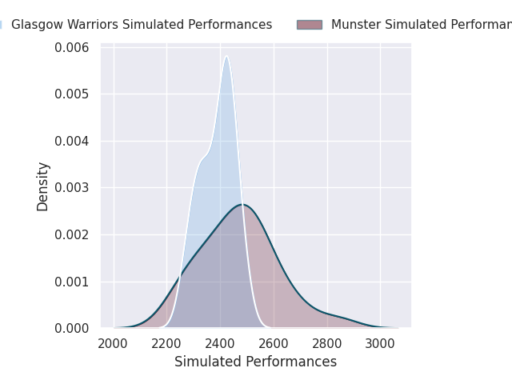
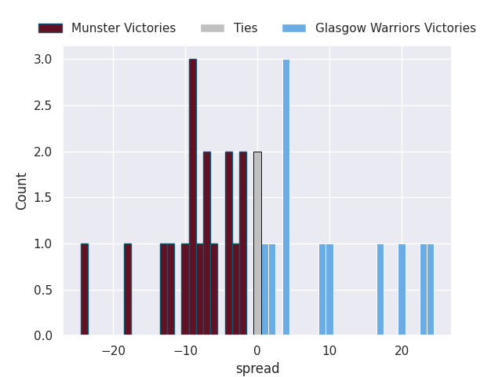
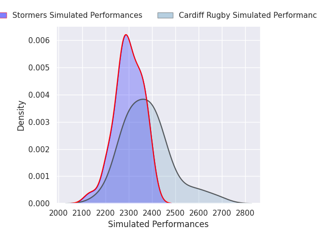
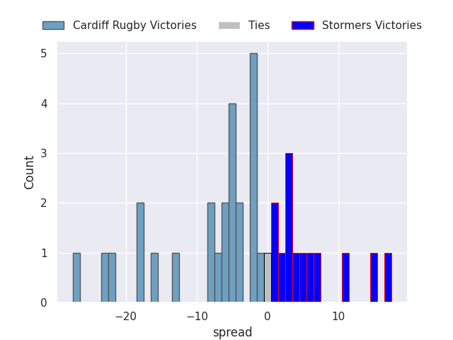
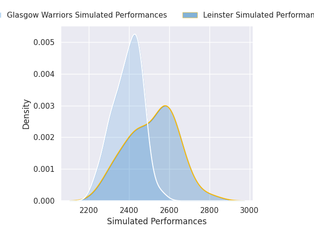
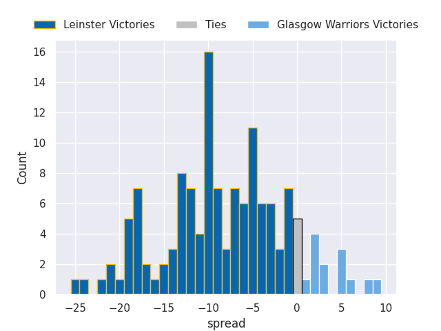
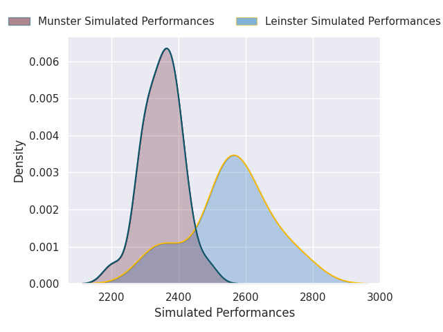
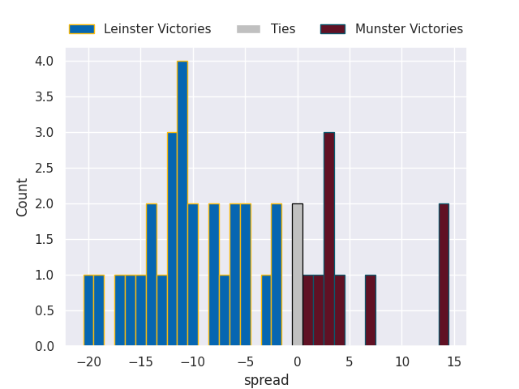

# Team Rankings

# Standings

## Current Standings

| Club             |   Played |   Wins |   Point Differential |   Losing Bonus Points |   Try Bonus Points |   Competition Points |
|:-----------------|---------:|-------:|---------------------:|----------------------:|-------------------:|---------------------:|
| Glasgow Warriors |       12 |      9 |                  150 |                     2 |                  7 |                   45 |
| Ulster           |       13 |      8 |                  104 |                     2 |                  7 |                   43 |
| Leinster         |       12 |      8 |                   66 |                     1 |                  8 |                   41 |
| Stormers         |       12 |      9 |                  112 |                     0 |                  4 |                   40 |
| Cardiff Rugby    |       12 |      8 |                   30 |                     3 |                  3 |                   38 |
| Munster          |       12 |      8 |                   23 |                     2 |                  4 |                   38 |
| Bulls            |       12 |      6 |                   21 |                     1 |                  5 |                   30 |
| Connacht         |       12 |      5 |                   -4 |                     4 |                  6 |                   30 |
| Ospreys          |       12 |      5 |                  -13 |                     1 |                  4 |                   29 |
| Lions            |       11 |      5 |                  -29 |                     2 |                  4 |                   28 |
| Edinburgh        |       13 |      4 |                  -15 |                     4 |                  3 |                   25 |
| Sharks           |       11 |      4 |                  -65 |                     1 |                  5 |                   24 |
| Benetton Treviso |       12 |      4 |                  -65 |                     1 |                  2 |                   23 |
| Dragons          |       12 |      2 |                  -59 |                     4 |                  2 |                   20 |
| Scarlets         |       12 |      3 |                  -88 |                     2 |                    |                   16 |
| Zebre            |       12 |      2 |                 -168 |                     2 |                  2 |                   12 |

## Projected Remaining Table

| Club             |   To Play |   Projected Wins |   Projected Differential |   Projected Losing Bonus Points | Projected Try Bonus Points   |   Projected Competition Points |
|:-----------------|----------:|-----------------:|-------------------------:|--------------------------------:|:-----------------------------|-------------------------------:|
| Sharks           |         8 |            4.112 |                    7.813 |                           1.868 |                              |                         19.12  |
| Bulls            |         7 |            4.063 |                   16.108 |                           1.442 |                              |                         18.374 |
| Lions            |         8 |            3.911 |                    1.619 |                           1.837 |                              |                         18.243 |
| Stormers         |         7 |            3.876 |                   15.576 |                           1.496 |                              |                         17.64  |
| Ulster           |         6 |            3.561 |                   16.329 |                           1.249 |                              |                         16.085 |
| Glasgow Warriors |         6 |            3.469 |                   16.334 |                           1.273 |                              |                         15.675 |
| Leinster         |         6 |            3.427 |                   18.253 |                           1.205 |                              |                         15.421 |
| Connacht         |         7 |            3.172 |                   -3.78  |                           1.694 |                              |                         15.028 |
| Scarlets         |         7 |            3.076 |                   -8.968 |                           1.662 |                              |                         14.606 |
| Munster          |         6 |            2.714 |                   -2.253 |                           1.55  |                              |                         13.064 |
| Edinburgh        |         6 |            2.712 |                   -4.416 |                           1.432 |                              |                         12.856 |
| Benetton Treviso |         6 |            2.529 |                   -9.565 |                           1.471 |                              |                         12.085 |
| Cardiff Rugby    |         6 |            2.426 |                  -10.243 |                           1.582 |                              |                         11.85  |
| Dragons          |         6 |            2.434 |                  -11.366 |                           1.489 |                              |                         11.785 |
| Ospreys          |         6 |            2.332 |                  -13.101 |                           1.528 |                              |                         11.354 |
| Zebre            |         6 |            1.765 |                  -28.34  |                           1.471 |                              |                          9.063 |

## Projected Total Table

| Club             |   Played |   Wins |   Point Differential |   Losing Bonus Points |   Try Bonus Points |   Competition Points |
|:-----------------|---------:|-------:|---------------------:|----------------------:|-------------------:|---------------------:|
| Glasgow Warriors |       18 | 12.469 |              166.334 |                 3.273 |                  7 |               60.675 |
| Ulster           |       19 | 11.561 |              120.329 |                 3.249 |                  7 |               59.085 |
| Stormers         |       19 | 12.876 |              127.576 |                 1.496 |                  4 |               57.64  |
| Leinster         |       18 | 11.427 |               84.253 |                 2.205 |                  8 |               56.421 |
| Munster          |       18 | 10.714 |               20.747 |                 3.55  |                  4 |               51.064 |
| Cardiff Rugby    |       18 | 10.426 |               19.757 |                 4.582 |                  3 |               49.85  |
| Bulls            |       19 | 10.063 |               37.108 |                 2.442 |                  5 |               48.374 |
| Lions            |       19 |  8.911 |              -27.381 |                 3.837 |                  4 |               46.243 |
| Connacht         |       19 |  8.172 |               -7.78  |                 5.694 |                  6 |               45.028 |
| Sharks           |       19 |  8.112 |              -57.187 |                 2.868 |                  5 |               43.12  |
| Ospreys          |       18 |  7.332 |              -26.101 |                 2.528 |                  4 |               40.354 |
| Edinburgh        |       19 |  6.712 |              -19.416 |                 5.432 |                  3 |               37.856 |
| Benetton Treviso |       18 |  6.529 |              -74.565 |                 2.471 |                  2 |               35.085 |
| Dragons          |       18 |  4.434 |              -70.366 |                 5.489 |                  2 |               31.785 |
| Scarlets         |       19 |  6.076 |              -96.968 |                 3.662 |                    |               30.606 |
| Zebre            |       18 |  3.765 |             -196.34  |                 3.471 |                  2 |               21.063 |

## Projected Playoff Results

|                  | Reach Quarterfinal   | Win Quarterfinal   | Reach Semifinal   | Win Semifinal   | Reach Final   | Win Final   |
|:-----------------|:---------------------|:-------------------|:------------------|:----------------|:--------------|:------------|
| Glasgow Warriors | 100.0 %              | 68.8 %             | 68.8 %            | 43.6 %          | 43.6 %        | 20.8 %      |
| Leinster         | 99.7 %               | 63.2 %             | 63.2 %            | 33.2 %          | 33.2 %        | 19.1 %      |
| Ulster           | 99.9 %               | 64.5 %             | 64.5 %            | 34.0 %          | 34.0 %        | 17.4 %      |
| Stormers         | 99.9 %               | 63.2 %             | 63.2 %            | 29.8 %          | 29.8 %        | 13.8 %      |
| Munster          | 87.1 %               | 36.3 %             | 36.3 %            | 17.4 %          | 17.4 %        | 9.4 %       |
| Cardiff Rugby    | 82.6 %               | 29.9 %             | 29.9 %            | 12.7 %          | 12.7 %        | 5.1 %       |
| Connacht         | 53.4 %               | 18.6 %             | 18.6 %            | 8.0 %           | 8.0 %         | 4.6 %       |
| Lions            | 74.4 %               | 23.5 %             | 23.5 %            | 8.9 %           | 8.9 %         | 4.1 %       |
| Bulls            | 69.2 %               | 21.2 %             | 21.2 %            | 7.4 %           | 7.4 %         | 3.0 %       |
| Sharks           | 14.5 %               | 4.3 %              | 4.3 %             | 2.4 %           | 2.4 %         | 1.2 %       |
| Ospreys          | 12.6 %               | 3.9 %              | 3.9 %             | 1.7 %           | 1.7 %         | 1.1 %       |
| Edinburgh        | 5.6 %                | 2.0 %              | 2.0 %             | 0.7 %           | 0.7 %         | 0.4 %       |
| Benetton Treviso | 1.0 %                | 0.6 %              | 0.6 %             | 0.2 %           | 0.2 %         | 0.0 %       |
| Dragons          | 0.1 %                | 0.0 %              | 0.0 %             | 0.0 %           | 0.0 %         | 0.0 %       |

# Completed Match Review

| Model | Percent Correct Predictions | Spread Error |
| ------ | ------ | ------ |
| Club Level | 65.8% | 8.9 |
| Player Level: Lineup | nan% | nan |
| Player Level: Minutes | nan% | nan |

# Future Predictions

## Week 14

### Connacht V Scarlets on 2025/10/04

Average Margin: Connacht by 4.5

## Week 15

### Lions V Sharks on 2025/12/25

Average Margin: Lions by 4.4

### Bulls V Stormers on 2025/12/25

Average Margin: Stormers by 0.9

## Week 16

### Lions V Sharks on 2026/02/21

Average Margin: Lions by 0.9

## Week 17

### Scarlets V Zebre on 2026/03/20

Average Margin: Scarlets by 4.8

### Ulster V Connacht on 2026/03/20

Average Margin: Ulster by 6.1

### Bulls V Cardiff Rugby on 2026/03/20

Average Margin: Bulls by 3.8

### Glasgow Warriors V Leinster on 2026/03/21

Average Margin: Glasgow Warriors by 3.2

### Sharks V Munster on 2026/03/21

Average Margin: Sharks by 1.9

### Benetton Treviso V Ospreys on 2026/03/21

Average Margin: Benetton Treviso by 3.8

### Stormers V Dragons on 2026/03/21

Average Margin: Stormers by 7.5

### Lions V Edinburgh on 2026/03/21

Average Margin: Lions by 3.2

## Week 18

### Glasgow Warriors V Benetton Treviso on 2026/03/27

Average Margin: Glasgow Warriors by 7.2

### Sharks V Cardiff Rugby on 2026/03/27

Average Margin: Sharks by 4.1

### Lions V Dragons on 2026/03/28

Average Margin: Lions by 4.3

### Zebre V Ulster on 2026/03/28

Average Margin: Ulster by 4.5

### Leinster V Scarlets on 2026/03/28

Average Margin: Leinster by 8.6

### Bulls V Munster on 2026/03/28

Average Margin: Bulls by 2.6

### Connacht V Ospreys on 2026/03/28

Average Margin: Connacht by 3.8

### Stormers V Edinburgh on 2026/03/28

Average Margin: Stormers by 6.5

## Week 19

### Edinburgh V Zebre on 2026/04/17

Average Margin: Edinburgh by 5.3

### Dragons V Bulls on 2026/04/17

Average Margin: Dragons by 1.1

### Ulster V Leinster on 2026/04/17

Average Margin: Ulster by 2.4

### Lions V Glasgow Warriors on 2026/04/18

Average Margin: Glasgow Warriors by 2.0

### Stormers V Connacht on 2026/04/18

Average Margin: Stormers by 4.6

### Scarlets V Cardiff Rugby on 2026/04/18

Average Margin: Scarlets by 0.2

### Benetton Treviso V Munster on 2026/04/18

Average Margin: Benetton Treviso by 2.4

### Ospreys V Sharks on 2026/04/18

Average Margin: Ospreys by 1.6

## Week 20

### Cardiff Rugby V Ospreys on 2026/04/24

Average Margin: Cardiff Rugby by 3.5

### Zebre V Dragons on 2026/04/24

Average Margin: Zebre by 0.4

### Edinburgh V Sharks on 2026/04/24

Average Margin: Edinburgh by 0.7

### Stormers V Glasgow Warriors on 2026/04/25

Average Margin: Stormers by 0.5

### Benetton Treviso V Leinster on 2026/04/25

Average Margin: Leinster by 1.4

### Lions V Connacht on 2026/04/25

Average Margin: Lions by 2.1

### Munster V Ulster on 2026/04/25

Average Margin: Munster by 2.3

### Scarlets V Bulls on 2026/04/25

Average Margin: Scarlets by 0.2

## Week 21

### Ulster V Stormers on 2026/05/08

Average Margin: Ulster by 3.6

### Glasgow Warriors V Cardiff Rugby on 2026/05/08

Average Margin: Glasgow Warriors by 6.6

### Connacht V Munster on 2026/05/09

Average Margin: Connacht by 2.1

### Bulls V Zebre on 2026/05/09

Average Margin: Bulls by 7.7

### Ospreys V Scarlets on 2026/05/09

Average Margin: Ospreys by 3.4

### Leinster V Lions on 2026/05/09

Average Margin: Leinster by 6.9

### Dragons V Edinburgh on 2026/05/09

Average Margin: Dragons by 2.1

### Sharks V Benetton Treviso on 2026/05/09

Average Margin: Sharks by 3.0

## Week 22

### Cardiff Rugby V Stormers on 2026/05/15

Average Margin: Cardiff Rugby by 0.9

### Ulster V Glasgow Warriors on 2026/05/15

Average Margin: Ulster by 2.0

### Edinburgh V Connacht on 2026/05/15

Average Margin: Edinburgh by 1.4

### Sharks V Zebre on 2026/05/16

Average Margin: Sharks by 6.4

### Munster V Lions on 2026/05/16

Average Margin: Munster by 4.5

### Bulls V Benetton Treviso on 2026/05/16

Average Margin: Bulls by 4.2

### Scarlets V Dragons on 2026/05/16

Average Margin: Scarlets by 2.3

### Leinster V Ospreys on 2026/05/16

Average Margin: Leinster by 7.0

## Week 23

### Glasgow Warriors V Connacht on 2026-05-29

Average Margin: Glasgow Warriors by 3.5

### Glasgow Warriors V Ulster on 2026-05-29

Average Margin: Glasgow Warriors by 2.4

### Lions V Leinster on 2026-05-29

Average Margin: Leinster by 1.1

### Leinster V Stormers on 2026-05-29

Average Margin: Leinster by 8.8

### Munster V Cardiff Rugby on 2026-05-29

Average Margin: Munster by 4.6

### Leinster V Ospreys on 2026-05-29

Average Margin: Leinster by 16.0

### Cardiff Rugby V Lions on 2026-05-29

Average Margin: Lions by 3.7

### Munster V Ospreys on 2026-05-29

Average Margin: Ospreys by 28.0

### Lions V Connacht on 2026-05-29

Average Margin: Connacht by 10.5

### Glasgow Warriors V Benetton Treviso on 2026-05-29

Average Margin: Glasgow Warriors by 10.0

### Cardiff Rugby V Bulls on 2026-05-29

Average Margin: Cardiff Rugby by 22.0

### Cardiff Rugby V Edinburgh on 2026-05-29

Average Margin: Cardiff Rugby by 6.0

### Leinster V Benetton Treviso on 2026-05-29

Average Margin: Benetton Treviso by 8.0

### Lions V Bulls on 2026-05-29

Average Margin: Bulls by 3.3

### Stormers V Edinburgh on 2026-05-29

Average Margin: Stormers by 11.5

### Stormers V Sharks on 2026-05-29

Average Margin: Sharks by 2.3

### Bulls V Munster on 2026-05-29

Average Margin: Bulls by 3.2

### Lions V Glasgow Warriors on 2026-05-29

Average Margin: Glasgow Warriors by 2.6

### Connacht V Leinster on 2026-05-29

Average Margin: Leinster by 1.9

### Munster V Glasgow Warriors on 2026-05-29

Average Margin: Munster by 1.0

### Cardiff Rugby V Ospreys on 2026-05-29

Average Margin: Cardiff Rugby by 7.0

### Cardiff Rugby V Sharks on 2026-05-29

Average Margin: Cardiff Rugby by 3.0

### Ulster V Benetton Treviso on 2026-05-29

Average Margin: Benetton Treviso by 3.3

### Bulls V Connacht on 2026-05-29

Average Margin: Bulls by 8.0

### Lions V Edinburgh on 2026-05-29

Average Margin: Edinburgh by 5.0

### Leinster V Glasgow Warriors on 2026-05-29

Average Margin: Leinster by 7.5

### Cardiff Rugby V Glasgow Warriors on 2026-05-29

Average Margin: Glasgow Warriors by 0.6

### Ulster V Sharks on 2026-05-29

Average Margin: Ulster by 6.5

### Stormers V Ulster on 2026-05-29

Average Margin: Stormers by 3.0

### Connacht V Lions on 2026-05-29

Average Margin: Connacht by 6.0

### Lions V Cardiff Rugby on 2026-05-29

Average Margin: Lions by 3.1

### Connacht V Bulls on 2026-05-29

Average Margin: Bulls by 2.0

### Stormers V Glasgow Warriors on 2026-05-29

Average Margin: Stormers by 2.2

### Ospreys V Leinster on 2026-05-29

Average Margin: Ospreys by 14.0

### Cardiff Rugby V Ulster on 2026-05-29

Average Margin: Cardiff Rugby by 2.8

### Cardiff Rugby V Stormers on 2026-05-29

Average Margin: Cardiff Rugby by 0.7

### Leinster V Ulster on 2026-05-29

Average Margin: Leinster by 1.6

### Ulster V Stormers on 2026-05-29

Average Margin: Ulster by 7.0

### Glasgow Warriors V Edinburgh on 2026-05-29

Average Margin: Glasgow Warriors by 4.2

### Leinster V Edinburgh on 2026-05-29

Average Margin: Leinster by 6.2

### Leinster V Munster on 2026-05-29

Average Margin: Leinster by 4.8

### Glasgow Warriors V Bulls on 2026-05-29

Average Margin: Glasgow Warriors by 8.1

### Ulster V Connacht on 2026-05-29

Average Margin: Ulster by 5.1

### Glasgow Warriors V Sharks on 2026-05-29

Average Margin: Glasgow Warriors by 7.7

### Leinster V Sharks on 2026-05-29

Average Margin: Leinster by 4.4

### Stormers V Connacht on 2026-05-29

Average Margin: Stormers by 3.9

### Stormers V Cardiff Rugby on 2026-05-29

Average Margin: Stormers by 3.8

### Leinster V Cardiff Rugby on 2026-05-29

Average Margin: Leinster by 2.8

### Leinster V Bulls on 2026-05-29

Average Margin: Leinster by 4.8

### Glasgow Warriors V Lions on 2026-05-29

Average Margin: Glasgow Warriors by 7.4

### Leinster V Lions on 2026-05-29

Average Margin: Leinster by 8.2

### Glasgow Warriors V Munster on 2026-05-29

Average Margin: Glasgow Warriors by 5.6

### Stormers V Bulls on 2026-05-29

Average Margin: Stormers by 6.2

### Glasgow Warriors V Cardiff Rugby on 2026-05-29

Average Margin: Glasgow Warriors by 7.4

### Ulster V Bulls on 2026-05-29

Average Margin: Ulster by 3.6

### Ulster V Ospreys on 2026-05-29

Average Margin: Ulster by 3.0

### Leinster V Connacht on 2026-05-29

Average Margin: Leinster by 5.0

### Glasgow Warriors V Stormers on 2026-05-29

Average Margin: Glasgow Warriors by 12.5

### Glasgow Warriors V Ospreys on 2026-05-29

Average Margin: Glasgow Warriors by 0.3

### Stormers V Munster on 2026-05-29

Average Margin: Stormers by 0.6

### Munster V Bulls on 2026-05-29

Average Margin: Munster by 6.2

### Lions V Sharks on 2026-05-29

Average Margin: Sharks by 8.0

### Munster V Connacht on 2026-05-29

Average Margin: Munster by 4.2

### Cardiff Rugby V Munster on 2026-05-29

Average Margin: Cardiff Rugby by 1.7

### Stormers V Leinster on 2026-05-29

Average Margin: Leinster by 0.4

### Ulster V Leinster on 2026-05-29

Average Margin: Ulster by 2.6

### Stormers V Ospreys on 2026-05-29

Average Margin: Stormers by 3.1

### Ulster V Munster on 2026-05-29

Average Margin: Ulster by 2.6

### Cardiff Rugby V Connacht on 2026-05-29

Average Margin: Cardiff Rugby by 2.5

### Ulster V Glasgow Warriors on 2026-05-29

Average Margin: Ulster by 7.1

### Ulster V Cardiff Rugby on 2026-05-29

Average Margin: Ulster by 3.5

### Munster V Lions on 2026-05-29

Average Margin: Munster by 8.6

### Glasgow Warriors V Leinster on 2026-05-29

Average Margin: Glasgow Warriors by 11.9

### Ulster V Edinburgh on 2026-05-29

Average Margin: Edinburgh by 5.0

### Stormers V Benetton Treviso on 2026-05-29

Average Margin: Benetton Treviso by 9.0

### Stormers V Lions on 2026-05-29

Average Margin: Stormers by 4.8

### Ulster V Lions on 2026-05-29

Average Margin: Ulster by 6.4

### Stormers V Dragons on 2026-05-29

Average Margin: Stormers by 17.0

## Week 24

### Edinburgh V Munster on 2026-06-05

Average Margin: Munster by 13.0

### Lions V Stormers on 2026-06-05

Average Margin: Lions by 2.8

### Connacht V Stormers on 2026-06-05

Average Margin: Connacht by 0.3

### Edinburgh V Leinster on 2026-06-05

Average Margin: Edinburgh by 12.0

### Benetton Treviso V Leinster on 2026-06-05

Average Margin: Benetton Treviso by 12.0

### Benetton Treviso V Cardiff Rugby on 2026-06-05

Average Margin: Cardiff Rugby by 22.0

### Edinburgh V Glasgow Warriors on 2026-06-05

Average Margin: Edinburgh by 7.0

### Edinburgh V Stormers on 2026-06-05

Average Margin: Edinburgh by 12.0

### Edinburgh V Connacht on 2026-06-05

Average Margin: Connacht by 2.0

### Benetton Treviso V Glasgow Warriors on 2026-06-05

Average Margin: Glasgow Warriors by 7.0

### Sharks V Cardiff Rugby on 2026-06-05

Average Margin: Sharks by 7.0

### Ospreys V Munster on 2026-06-05

Average Margin: Munster by 2.0

### Edinburgh V Ulster on 2026-06-05

Average Margin: Ulster by 7.5

### Ospreys V Cardiff Rugby on 2026-06-05

Average Margin: Cardiff Rugby by 2.0

### Sharks V Ulster on 2026-06-05

Average Margin: Ulster by 3.2

### Sharks V Leinster on 2026-06-05

Average Margin: Sharks by 3.5

### Ospreys V Bulls on 2026-06-05

Average Margin: Bulls by 10.0

### Bulls V Leinster on 2026-06-05

Average Margin: Leinster by 1.3

### Glasgow Warriors V Ulster on 2026-06-05

Average Margin: Glasgow Warriors by 3.7

### Leinster V Bulls on 2026-06-05

Average Margin: Leinster by 8.8

### Leinster V Lions on 2026-06-05

Average Margin: Leinster by 2.7

### Connacht V Ulster on 2026-06-05

Average Margin: Connacht by 3.3

### Benetton Treviso V Stormers on 2026-06-05

Average Margin: Benetton Treviso by 21.0

### Edinburgh V Cardiff Rugby on 2026-06-05

Average Margin: Cardiff Rugby by 17.0

### Bulls V Sharks on 2026-06-05

Average Margin: Sharks by 7.0

### Munster V Sharks on 2026-06-05

Average Margin: Sharks by 1.7

### Stormers V Ospreys on 2026-06-05

Average Margin: Stormers by 1.8

### Lions V Connacht on 2026-06-05

Average Margin: Lions by 1.4

### Lions V Cardiff Rugby on 2026-06-05

Average Margin: Lions by 1.2

### Munster V Connacht on 2026-06-05

Average Margin: Munster by 6.3

### Stormers V Lions on 2026-06-05

Average Margin: Stormers by 3.0

### Cardiff Rugby V Glasgow Warriors on 2026-06-05

Average Margin: Glasgow Warriors by 0.3

### Munster V Lions on 2026-06-05

Average Margin: Munster by 7.3

### Cardiff Rugby V Stormers on 2026-06-05

Average Margin: Stormers by 1.8

### Ulster V Leinster on 2026-06-05

Average Margin: Ulster by 2.5

### Munster V Ulster on 2026-06-05

Average Margin: Munster by 5.1

### Leinster V Glasgow Warriors on 2026-06-05

Average Margin: Leinster by 4.3

### Ulster V Stormers on 2026-06-05

Average Margin: Ulster by 3.4

### Munster V Leinster on 2026-06-05

Average Margin: Munster by 1.3

### Leinster V Cardiff Rugby on 2026-06-05

Average Margin: Leinster by 6.0

### Bulls V Lions on 2026-06-05

Average Margin: Lions by 1.4

### Connacht V Ospreys on 2026-06-05

Average Margin: Connacht by 2.0

### Sharks V Lions on 2026-06-05

Average Margin: Sharks by 3.5

### Ulster V Munster on 2026-06-05

Average Margin: Ulster by 7.1

### Connacht V Lions on 2026-06-05

Average Margin: Connacht by 0.3

### Cardiff Rugby V Leinster on 2026-06-05

Average Margin: Leinster by 4.6

### Sharks V Glasgow Warriors on 2026-06-05

Average Margin: Sharks by 1.0

### Ulster V Bulls on 2026-06-05

Average Margin: Ulster by 5.8

### Lions V Bulls on 2026-06-05

Average Margin: Lions by 0.3

### Stormers V Connacht on 2026-06-05

Average Margin: Stormers by 1.4

### Glasgow Warriors V Lions on 2026-06-05

Average Margin: Glasgow Warriors by 4.7

### Glasgow Warriors V Munster on 2026-06-05

Average Margin: Glasgow Warriors by 4.4

### Bulls V Munster on 2026-06-05

Average Margin: Munster by 3.5

### Ospreys V Ulster on 2026-06-05

Average Margin: Ospreys by 4.5

### Glasgow Warriors V Stormers on 2026-06-05

Average Margin: Glasgow Warriors by 6.0

### Stormers V Ulster on 2026-06-05

Average Margin: Stormers by 2.0

### Ulster V Lions on 2026-06-05

Average Margin: Ulster by 4.8

### Ulster V Glasgow Warriors on 2026-06-05

Average Margin: Ulster by 1.4

### Leinster V Ulster on 2026-06-05

Average Margin: Leinster by 3.7

### Glasgow Warriors V Leinster on 2026-06-05

Average Margin: Glasgow Warriors by 4.9

### Stormers V Munster on 2026-06-05

Average Margin: Stormers by 0.9

### Glasgow Warriors V Connacht on 2026-06-05

Average Margin: Glasgow Warriors by 7.5

### Cardiff Rugby V Ulster on 2026-06-05

Average Margin: Cardiff Rugby by 1.3

### Stormers V Leinster on 2026-06-05

Average Margin: Stormers by 2.0

### Sharks V Munster on 2026-06-05

Average Margin: Munster by 3.4

### Leinster V Munster on 2026-06-05

Average Margin: Leinster by 1.8

### Ospreys V Leinster on 2026-06-05

Average Margin: Leinster by 0.0

### Connacht V Munster on 2026-06-05

Average Margin: Munster by 1.3

### Ospreys V Lions on 2026-06-05

Average Margin: Lions by 6.5

### Munster V Cardiff Rugby on 2026-06-05

Average Margin: Munster by 5.5

### Lions V Leinster on 2026-06-05

Average Margin: Lions by 3.5

### Sharks V Stormers on 2026-06-05

Average Margin: Stormers by 0.5

### Connacht V Bulls on 2026-06-05

Average Margin: Bulls by 2.6

### Cardiff Rugby V Lions on 2026-06-05

Average Margin: Cardiff Rugby by 6.7

### Bulls V Stormers on 2026-06-05

Average Margin: Bulls by 2.8

### Ulster V Connacht on 2026-06-05

Average Margin: Ulster by 7.9

### Stormers V Cardiff Rugby on 2026-06-05

Average Margin: Stormers by 6.6

### Bulls V Cardiff Rugby on 2026-06-05

Average Margin: Bulls by 0.4

### Glasgow Warriors V Bulls on 2026-06-05

Average Margin: Glasgow Warriors by 4.1

### Connacht V Cardiff Rugby on 2026-06-05

Average Margin: Connacht by 9.8

### Glasgow Warriors V Cardiff Rugby on 2026-06-05

Average Margin: Glasgow Warriors by 5.6

### Connacht V Leinster on 2026-06-05

Average Margin: Leinster by 2.4

### Lions V Munster on 2026-06-05

Average Margin: Lions by 5.7

### Ospreys V Stormers on 2026-06-05

Average Margin: Ospreys by 1.0

### Edinburgh V Lions on 2026-06-05

Average Margin: Lions by 6.0

## Final

### Munster V Connacht on 2026-06-19

Average Margin: Munster by 7.3

### Cardiff Rugby V Ulster on 2026-06-19

Average Margin: Cardiff Rugby by 1.4

### Cardiff Rugby V Glasgow Warriors on 2026-06-19

Average Margin: Glasgow Warriors by 0.0

### Ospreys V Leinster on 2026-06-19

Average Margin: Ospreys by 3.7

### Connacht V Leinster on 2026-06-19

Average Margin: Connacht by 5.2

### Munster V Cardiff Rugby on 2026-06-19

Average Margin: Munster by 4.3

### Lions V Munster on 2026-06-19

Average Margin: Lions by 5.6

### Sharks V Bulls on 2026-06-19

Average Margin: Sharks by 5.0

### Glasgow Warriors V Bulls on 2026-06-19

Average Margin: Glasgow Warriors by 5.4

### Connacht V Ulster on 2026-06-19

Average Margin: Connacht by 5.3

### Stormers V Cardiff Rugby on 2026-06-19

Average Margin: Stormers by 4.9

### Bulls V Munster on 2026-06-19

Average Margin: Bulls by 1.7

### Ulster V Bulls on 2026-06-19

Average Margin: Ulster by 7.4

### Sharks V Glasgow Warriors on 2026-06-19

Average Margin: Glasgow Warriors by 5.6

### Connacht V Cardiff Rugby on 2026-06-19

Average Margin: Connacht by 7.8

### Bulls V Lions on 2026-06-19

Average Margin: Bulls by 2.5

### Stormers V Sharks on 2026-06-19

Average Margin: Sharks by 10.0

### Connacht V Sharks on 2026-06-19

Average Margin: Connacht by 4.0

### Ospreys V Cardiff Rugby on 2026-06-19

Average Margin: Ospreys by 3.7

### Leinster V Edinburgh on 2026-06-19

Average Margin: Leinster by 4.0

### Lions V Connacht on 2026-06-19

Average Margin: Connacht by 9.0

### Glasgow Warriors V Benetton Treviso on 2026-06-19

Average Margin: Glasgow Warriors by 12.5

### Bulls V Ospreys on 2026-06-19

Average Margin: Ospreys by 4.5

### Cardiff Rugby V Edinburgh on 2026-06-19

Average Margin: Cardiff Rugby by 16.0

### Stormers V Edinburgh on 2026-06-19

Average Margin: Edinburgh by 7.5

### Sharks V Ulster on 2026-06-19

Average Margin: Sharks by 2.5

### Edinburgh V Munster on 2026-06-19

Average Margin: Edinburgh by 3.0

### Stormers V Ospreys on 2026-06-19

Average Margin: Stormers by 3.3

### Ospreys V Glasgow Warriors on 2026-06-19

Average Margin: Glasgow Warriors by 0.0

### Stormers V Ulster on 2026-06-19

Average Margin: Stormers by 1.6

### Leinster V Lions on 2026-06-19

Average Margin: Leinster by 8.3

### Leinster V Glasgow Warriors on 2026-06-19

Average Margin: Leinster by 3.7

### Ulster V Leinster on 2026-06-19

Average Margin: Ulster by 1.3

### Lions V Glasgow Warriors on 2026-06-19

Average Margin: Lions by 3.8

### Ulster V Lions on 2026-06-19

Average Margin: Ulster by 2.6

### Stormers V Glasgow Warriors on 2026-06-19

Average Margin: Stormers by 1.9

### Stormers V Munster on 2026-06-19

Average Margin: Stormers by 0.4

### Ospreys V Lions on 2026-06-19

Average Margin: Ospreys by 2.0

### Bulls V Cardiff Rugby on 2026-06-19

Average Margin: Bulls by 2.4

### Munster V Glasgow Warriors on 2026-06-19

Average Margin: Glasgow Warriors by 0.2

### Sharks V Leinster on 2026-06-19

Average Margin: Sharks by 4.0

### Glasgow Warriors V Connacht on 2026-06-19

Average Margin: Glasgow Warriors by 0.9

### Ulster V Glasgow Warriors on 2026-06-19

Average Margin: Ulster by 0.3

### Sharks V Munster on 2026-06-19

Average Margin: Sharks by 5.7

### Munster V Ulster on 2026-06-19

Average Margin: Munster by 2.4

### Leinster V Stormers on 2026-06-19

Average Margin: Leinster by 5.3

### Leinster V Cardiff Rugby on 2026-06-19

Average Margin: Leinster by 4.0

### Munster V Leinster on 2026-06-19

Average Margin: Munster by 3.2

### Stormers V Lions on 2026-06-19

Average Margin: Stormers by 4.2

### Stormers V Connacht on 2026-06-19

Average Margin: Connacht by 1.2

### Connacht V Bulls on 2026-06-19

Average Margin: Connacht by 4.7

### Bulls V Stormers on 2026-06-19

Average Margin: Stormers by 1.2

### Bulls V Leinster on 2026-06-19

Average Margin: Bulls by 4.4

### Lions V Cardiff Rugby on 2026-06-19

Average Margin: Cardiff Rugby by 1.4

### Edinburgh V Glasgow Warriors on 2026-06-19

Average Margin: Edinburgh by 3.0

