# Team Rankings

# Standings

## Current Standings

| Club             |   Played |   Wins |   Point Differential |   Losing Bonus Points |   Try Bonus Points |   Competition Points |
|:-----------------|---------:|-------:|---------------------:|----------------------:|-------------------:|---------------------:|
| Glasgow Warriors |       11 |      9 |                  155 |                     1 |                  7 |                   44 |
| Leinster         |       11 |      8 |                   67 |                     0 |                  8 |                   40 |
| Ulster           |       11 |      7 |                   94 |                     2 |                  6 |                   38 |
| Stormers         |       10 |      8 |                  113 |                     0 |                  4 |                   36 |
| Cardiff Rugby    |       11 |      7 |                   29 |                     3 |                  3 |                   34 |
| Munster          |       11 |      7 |                    9 |                     2 |                  4 |                   34 |
| Bulls            |       10 |      5 |                    5 |                     1 |                  4 |                   25 |
| Ospreys          |       11 |      4 |                  -24 |                     1 |                  4 |                   25 |
| Lions            |       10 |      4 |                  -43 |                     2 |                  4 |                   24 |
| Sharks           |       10 |      4 |                  -36 |                     1 |                  4 |                   23 |
| Connacht         |       10 |      3 |                  -26 |                     4 |                  5 |                   21 |
| Benetton Treviso |       11 |      4 |                  -65 |                     1 |                  2 |                   21 |
| Edinburgh        |       11 |      3 |                    1 |                     4 |                  2 |                   20 |
| Dragons          |       11 |      2 |                  -59 |                     4 |                  2 |                   18 |
| Scarlets         |       10 |      3 |                  -66 |                     1 |                    |                   15 |
| Zebre            |       11 |      2 |                 -154 |                     2 |                  2 |                   12 |

## Projected Remaining Table

| Club             |   To Play |   Projected Wins |   Projected Differential |   Projected Losing Bonus Points | Projected Try Bonus Points   |   Projected Competition Points |
|:-----------------|----------:|-----------------:|-------------------------:|--------------------------------:|:-----------------------------|-------------------------------:|
| Bulls            |         9 |            5.152 |                   21.569 |                           2.013 |                              |                         23.495 |
| Stormers         |         9 |            4.693 |                   11.261 |                           2.082 |                              |                         21.788 |
| Sharks           |         9 |            4.659 |                    9.375 |                           2.092 |                              |                         21.586 |
| Lions            |         9 |            4.239 |                   -1.993 |                           2.146 |                              |                         20.044 |
| Ulster           |         7 |            4.191 |                   19.845 |                           1.463 |                              |                         18.879 |
| Glasgow Warriors |         7 |            4.125 |                   20.267 |                           1.436 |                              |                         18.57  |
| Leinster         |         7 |            4.026 |                   20.804 |                           1.392 |                              |                         18.126 |
| Connacht         |         8 |            3.56  |                   -6.007 |                           1.947 |                              |                         16.951 |
| Scarlets         |         8 |            3.484 |                  -11.442 |                           1.857 |                              |                         16.535 |
| Edinburgh        |         7 |            3.535 |                    3.2   |                           1.564 |                              |                         16.362 |
| Munster          |         7 |            3.312 |                    2.38  |                           1.758 |                              |                         15.632 |
| Dragons          |         7 |            2.869 |                  -11.794 |                           1.846 |                              |                         13.992 |
| Benetton Treviso |         7 |            2.851 |                  -12.071 |                           1.752 |                              |                         13.832 |
| Cardiff Rugby    |         7 |            2.762 |                  -13.197 |                           1.851 |                              |                         13.573 |
| Ospreys          |         7 |            2.628 |                  -17.193 |                           1.834 |                              |                         12.96  |
| Zebre            |         7 |            2.017 |                  -35.004 |                           1.695 |                              |                         10.403 |

## Projected Total Table

| Club             |   Played |   Wins |   Point Differential |   Losing Bonus Points |   Try Bonus Points |   Competition Points |
|:-----------------|---------:|-------:|---------------------:|----------------------:|-------------------:|---------------------:|
| Glasgow Warriors |       18 | 13.125 |              175.267 |                 2.436 |                  7 |               62.57  |
| Leinster         |       18 | 12.026 |               87.804 |                 1.392 |                  8 |               58.126 |
| Stormers         |       19 | 12.693 |              124.261 |                 2.082 |                  4 |               57.788 |
| Ulster           |       18 | 11.191 |              113.845 |                 3.463 |                  6 |               56.879 |
| Munster          |       18 | 10.312 |               11.38  |                 3.758 |                  4 |               49.632 |
| Bulls            |       19 | 10.152 |               26.569 |                 3.013 |                  4 |               48.495 |
| Cardiff Rugby    |       18 |  9.762 |               15.803 |                 4.851 |                  3 |               47.573 |
| Sharks           |       19 |  8.659 |              -26.625 |                 3.092 |                  4 |               44.586 |
| Lions            |       19 |  8.239 |              -44.993 |                 4.146 |                  4 |               44.044 |
| Ospreys          |       18 |  6.628 |              -41.193 |                 2.834 |                  4 |               37.96  |
| Connacht         |       18 |  6.56  |              -32.007 |                 5.947 |                  5 |               37.951 |
| Edinburgh        |       18 |  6.535 |                4.2   |                 5.564 |                  2 |               36.362 |
| Benetton Treviso |       18 |  6.851 |              -77.071 |                 2.752 |                  2 |               34.832 |
| Dragons          |       18 |  4.869 |              -70.794 |                 5.846 |                  2 |               31.992 |
| Scarlets         |       18 |  6.484 |              -77.442 |                 2.857 |                    |               31.535 |
| Zebre            |       18 |  4.017 |             -189.004 |                 3.695 |                  2 |               22.403 |

## Projected Playoff Results

|                  | Reach Quarterfinal   | Win Quarterfinal   | Reach Semifinal   | Win Semifinal   | Reach Final   | Win Final   |
|:-----------------|:---------------------|:-------------------|:------------------|:----------------|:--------------|:------------|
| Glasgow Warriors | 100.0 %              | 69.6 %             | 69.6 %            | 42.3 %          | 42.3 %        | 28.0 %      |
| Leinster         | 99.9 %               | 67.5 %             | 67.5 %            | 36.6 %          | 36.6 %        | 18.7 %      |
| Stormers         | 99.9 %               | 61.1 %             | 61.1 %            | 33.2 %          | 33.2 %        | 13.3 %      |
| Ulster           | 99.6 %               | 60.3 %             | 60.3 %            | 25.5 %          | 25.5 %        | 13.3 %      |
| Munster          | 88.5 %               | 39.6 %             | 39.6 %            | 17.6 %          | 17.6 %        | 6.1 %       |
| Sharks           | 51.6 %               | 18.5 %             | 18.5 %            | 8.5 %           | 8.5 %         | 4.9 %       |
| Cardiff Rugby    | 81.3 %               | 26.1 %             | 26.1 %            | 10.7 %          | 10.7 %        | 4.7 %       |
| Bulls            | 79.0 %               | 27.5 %             | 27.5 %            | 11.1 %          | 11.1 %        | 4.3 %       |
| Lions            | 59.0 %               | 16.0 %             | 16.0 %            | 7.2 %           | 7.2 %         | 2.5 %       |
| Connacht         | 17.3 %               | 5.8 %              | 5.8 %             | 3.2 %           | 3.2 %         | 1.7 %       |
| Ospreys          | 11.1 %               | 3.8 %              | 3.8 %             | 1.6 %           | 1.6 %         | 0.9 %       |
| Benetton Treviso | 4.2 %                | 2.1 %              | 2.1 %             | 1.1 %           | 1.1 %         | 0.8 %       |
| Edinburgh        | 6.9 %                | 1.6 %              | 1.6 %             | 1.1 %           | 1.1 %         | 0.6 %       |
| Dragons          | 0.8 %                | 0.2 %              | 0.2 %             | 0.2 %           | 0.2 %         | 0.1 %       |
| Scarlets         | 0.9 %                | 0.3 %              | 0.3 %             | 0.1 %           | 0.1 %         | 0.1 %       |

# Completed Match Review

| Model | Percent Correct Predictions | Spread Error |
| ------ | ------ | ------ |
| Club Level | 68.0% | 8.8 |
| Player Level: Lineup | nan% | nan |
| Player Level: Minutes | nan% | nan |

# Future Predictions

## Week 12

### Connacht V Scarlets on 2025/10/04

Average Margin: Connacht by 4.1

## Week 13

### Bulls V Stormers on 2025/12/25

Average Margin: Stormers by 0.6

### Lions V Sharks on 2025/12/25

Average Margin: Lions by 4.3

## Week 14

### Lions V Sharks on 2026/02/21

Average Margin: Lions by 0.2

## Week 15

### Cardiff Rugby V Leinster on 2026/02/27

Average Margin: Leinster by 2.7

### Edinburgh V Scarlets on 2026/02/27

Average Margin: Edinburgh by 4.4

### Lions V Stormers on 2026/02/28

Average Margin: Stormers by 0.7

### Ospreys V Ulster on 2026/02/28

Average Margin: Ulster by 1.8

### Munster V Zebre on 2026/02/28

Average Margin: Munster by 7.9

### Dragons V Benetton Treviso on 2026/02/28

Average Margin: Dragons by 1.1

### Connacht V Glasgow Warriors on 2026/02/28

Average Margin: Glasgow Warriors by 1.6

### Bulls V Sharks on 2026/02/28

Average Margin: Bulls by 2.7

## Week 16

### Bulls V Stormers on 2026/03/14

Average Margin: Bulls by 2.0

## Week 17

### Ulster V Connacht on 2026/03/20

Average Margin: Ulster by 6.8

### Bulls V Cardiff Rugby on 2026/03/20

Average Margin: Bulls by 4.0

### Scarlets V Zebre on 2026/03/20

Average Margin: Scarlets by 4.4

### Glasgow Warriors V Leinster on 2026/03/21

Average Margin: Glasgow Warriors by 3.3

### Sharks V Munster on 2026/03/21

Average Margin: Sharks by 2.7

### Lions V Edinburgh on 2026/03/21

Average Margin: Lions by 3.0

### Stormers V Dragons on 2026/03/21

Average Margin: Stormers by 7.5

### Benetton Treviso V Ospreys on 2026/03/21

Average Margin: Benetton Treviso by 4.1

## Week 18

### Sharks V Cardiff Rugby on 2026/03/27

Average Margin: Sharks by 3.8

### Glasgow Warriors V Benetton Treviso on 2026/03/27

Average Margin: Glasgow Warriors by 7.8

### Lions V Dragons on 2026/03/28

Average Margin: Lions by 3.9

### Connacht V Ospreys on 2026/03/28

Average Margin: Connacht by 4.3

### Stormers V Edinburgh on 2026/03/28

Average Margin: Stormers by 5.5

### Bulls V Munster on 2026/03/28

Average Margin: Bulls by 2.9

### Leinster V Scarlets on 2026/03/28

Average Margin: Leinster by 8.7

### Zebre V Ulster on 2026/03/28

Average Margin: Ulster by 4.0

## Week 19

### Edinburgh V Zebre on 2026/04/17

Average Margin: Edinburgh by 5.6

### Dragons V Bulls on 2026/04/17

Average Margin: Dragons by 0.4

### Ulster V Leinster on 2026/04/17

Average Margin: Ulster by 2.3

### Benetton Treviso V Munster on 2026/04/18

Average Margin: Benetton Treviso by 2.3

### Ospreys V Sharks on 2026/04/18

Average Margin: Ospreys by 0.4

### Scarlets V Cardiff Rugby on 2026/04/18

Average Margin: Scarlets by 1.2

### Stormers V Connacht on 2026/04/18

Average Margin: Stormers by 4.2

### Lions V Glasgow Warriors on 2026/04/18

Average Margin: Glasgow Warriors by 3.1

## Week 20

### Cardiff Rugby V Ospreys on 2026/04/24

Average Margin: Cardiff Rugby by 3.8

### Edinburgh V Sharks on 2026/04/24

Average Margin: Edinburgh by 0.7

### Zebre V Dragons on 2026/04/24

Average Margin: Zebre by 1.2

### Benetton Treviso V Leinster on 2026/04/25

Average Margin: Leinster by 1.0

### Scarlets V Bulls on 2026/04/25

Average Margin: Scarlets by 0.8

### Lions V Connacht on 2026/04/25

Average Margin: Lions by 1.6

### Stormers V Glasgow Warriors on 2026/04/25

Average Margin: Glasgow Warriors by 0.2

### Munster V Ulster on 2026/04/25

Average Margin: Munster by 0.9

## Week 21

### Ulster V Stormers on 2026/05/08

Average Margin: Ulster by 3.8

### Glasgow Warriors V Cardiff Rugby on 2026/05/08

Average Margin: Glasgow Warriors by 6.2

### Sharks V Benetton Treviso on 2026/05/09

Average Margin: Sharks by 4.2

### Leinster V Lions on 2026/05/09

Average Margin: Leinster by 6.9

### Ospreys V Scarlets on 2026/05/09

Average Margin: Ospreys by 3.7

### Connacht V Munster on 2026/05/09

Average Margin: Connacht by 2.9

### Dragons V Edinburgh on 2026/05/09

Average Margin: Dragons by 2.1

### Bulls V Zebre on 2026/05/09

Average Margin: Bulls by 7.4

## Week 22

### Ulster V Glasgow Warriors on 2026/05/15

Average Margin: Ulster by 2.0

### Cardiff Rugby V Stormers on 2026/05/15

Average Margin: Cardiff Rugby by 1.0

### Edinburgh V Connacht on 2026/05/15

Average Margin: Edinburgh by 3.0

### Sharks V Zebre on 2026/05/16

Average Margin: Sharks by 7.0

### Leinster V Ospreys on 2026/05/16

Average Margin: Leinster by 7.2

### Scarlets V Dragons on 2026/05/16

Average Margin: Scarlets by 3.0

### Munster V Lions on 2026/05/16

Average Margin: Munster by 4.3

### Bulls V Benetton Treviso on 2026/05/16

Average Margin: Bulls by 4.4

## Week 23

### Leinster V Lions on 2026-05-29

Average Margin: Leinster by 11.1

### Ulster V Glasgow Warriors on 2026-05-29

Average Margin: Ulster by 4.7

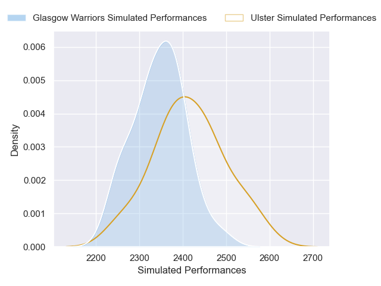

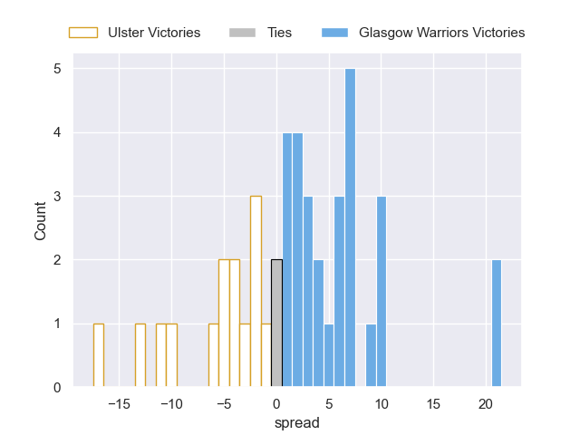

### Bulls V Lions on 2026-05-29

Average Margin: Bulls by 3.1

### Munster V Cardiff Rugby on 2026-05-29

Average Margin: Munster by 3.2

### Munster V Ulster on 2026-05-29

Average Margin: Munster by 3.3

### Stormers V Ulster on 2026-05-29

Average Margin: Stormers by 2.5

### Munster V Stormers on 2026-05-29

Average Margin: Munster by 4.2

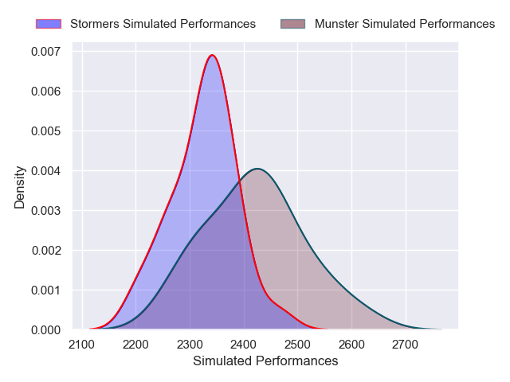

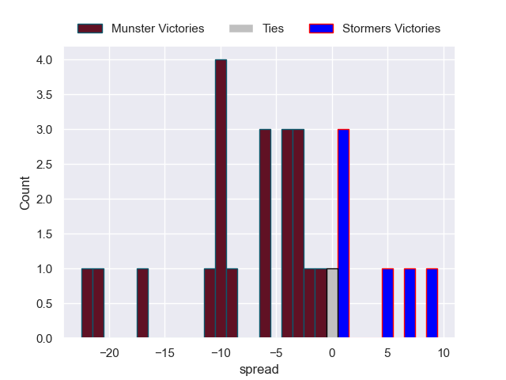

### Leinster V Scarlets on 2026-05-29

Average Margin: Scarlets by 9.0

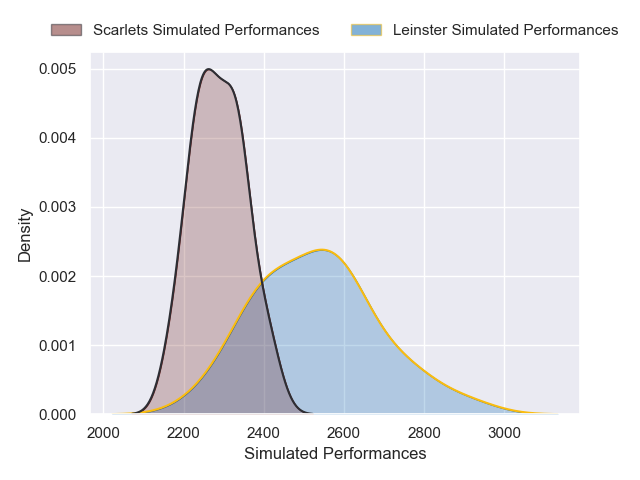

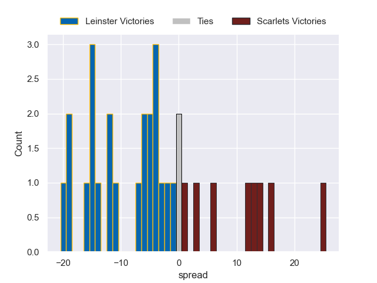

### Bulls V Munster on 2026-05-29

Average Margin: Bulls by 2.0

### Stormers V Scarlets on 2026-05-29

Average Margin: Stormers by 13.5

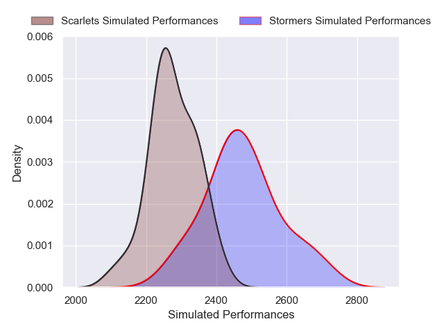
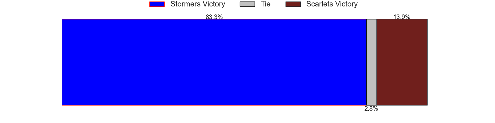
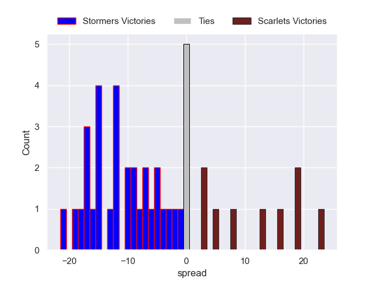

### Leinster V Stormers on 2026-05-29

Average Margin: Leinster by 19.5

### Ulster V Stormers on 2026-05-29

Average Margin: Ulster by 6.5

### Ulster V Edinburgh on 2026-05-29

Average Margin: Ulster by 16.5

### Ulster V Dragons on 2026-05-29

Average Margin: Dragons by 4.0

### Ulster V Scarlets on 2026-05-29

Average Margin: Ulster by 3.0

### Stormers V Edinburgh on 2026-05-29

Average Margin: Stormers by 3.5

### Leinster V Munster on 2026-05-29

Average Margin: Leinster by 4.2

### Leinster V Benetton Treviso on 2026-05-29

Average Margin: Benetton Treviso by 15.0

### Glasgow Warriors V Dragons on 2026-05-29

Average Margin: Glasgow Warriors by 14.0

### Bulls V Leinster on 2026-05-29

Average Margin: Bulls by 0.7

### Leinster V Glasgow Warriors on 2026-05-29

Average Margin: Leinster by 7.5

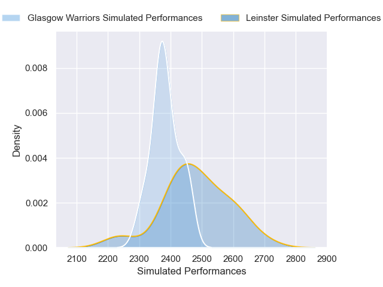

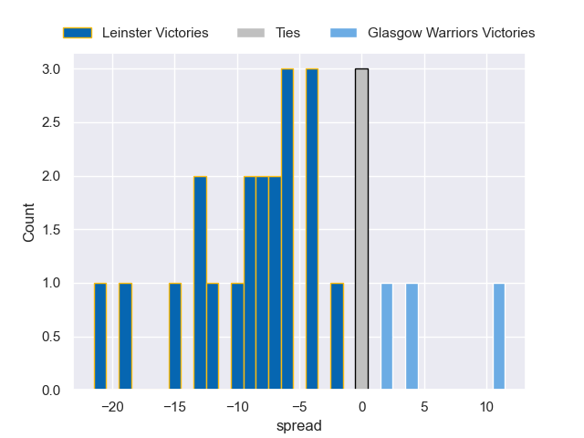

### Munster V Ospreys on 2026-05-29

Average Margin: Munster by 12.0

### Lions V Leinster on 2026-05-29

Average Margin: Leinster by 1.4

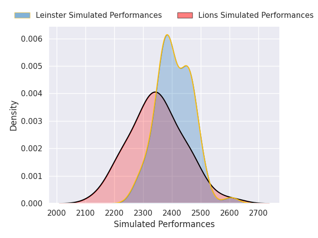

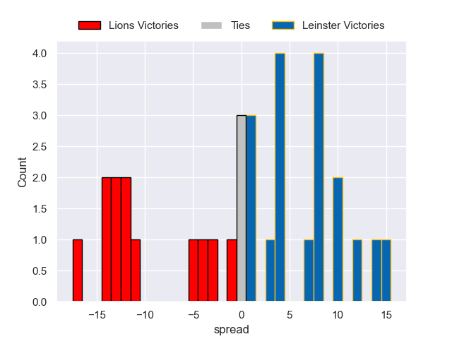

### Lions V Connacht on 2026-05-29

Average Margin: Connacht by 3.0

### Stormers V Dragons on 2026-05-29

Average Margin: Stormers by 7.0

### Munster V Dragons on 2026-05-29

Average Margin: Munster by 15.0

### Cardiff Rugby V Bulls on 2026-05-29

Average Margin: Bulls by 2.0

### Stormers V Leinster on 2026-05-29

Average Margin: Stormers by 0.3

### Bulls V Cardiff Rugby on 2026-05-29

Average Margin: Bulls by 0.1

### Bulls V Connacht on 2026-05-29

Average Margin: Connacht by 10.0

### Bulls V Ospreys on 2026-05-29

Average Margin: Bulls by 4.0

### Cardiff Rugby V Edinburgh on 2026-05-29

Average Margin: Cardiff Rugby by 4.0

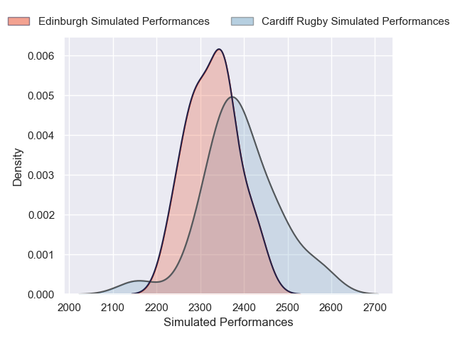

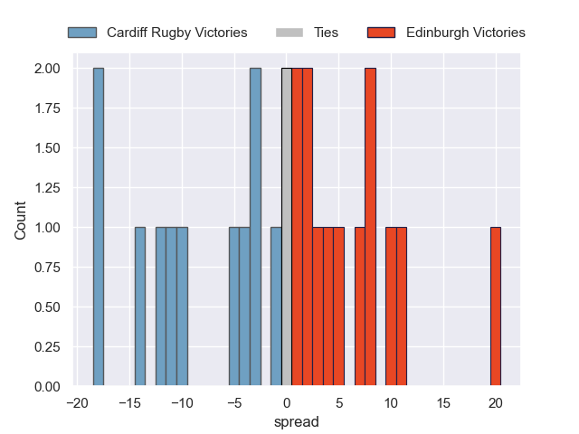

### Sharks V Lions on 2026-05-29

Average Margin: Sharks by 10.5

### Munster V Lions on 2026-05-29

Average Margin: Munster by 9.0

### Cardiff Rugby V Sharks on 2026-05-29

Average Margin: Sharks by 3.3

### Bulls V Sharks on 2026-05-29

Average Margin: Bulls by 8.6

### Sharks V Stormers on 2026-05-29

Average Margin: Stormers by 2.5

### Lions V Ospreys on 2026-05-29

Average Margin: Lions by 2.0

### Munster V Connacht on 2026-05-29

Average Margin: Munster by 7.0

### Ulster V Ospreys on 2026-05-29

Average Margin: Ulster by 1.2

### Leinster V Ulster on 2026-05-29

Average Margin: Leinster by 6.0

### Glasgow Warriors V Leinster on 2026-05-29

Average Margin: Glasgow Warriors by 14.3

### Leinster V Bulls on 2026-05-29

Average Margin: Leinster by 7.7

### Glasgow Warriors V Benetton Treviso on 2026-05-29

Average Margin: Glasgow Warriors by 5.9

### Leinster V Cardiff Rugby on 2026-05-29

Average Margin: Leinster by 11.2

### Glasgow Warriors V Connacht on 2026-05-29

Average Margin: Glasgow Warriors by 5.9

### Stormers V Cardiff Rugby on 2026-05-29

Average Margin: Stormers by 6.8

### Glasgow Warriors V Ospreys on 2026-05-29

Average Margin: Glasgow Warriors by 4.6

### Ulster V Sharks on 2026-05-29

Average Margin: Ulster by 2.1

### Glasgow Warriors V Bulls on 2026-05-29

Average Margin: Glasgow Warriors by 6.9

### Stormers V Lions on 2026-05-29

Average Margin: Stormers by 8.6

### Glasgow Warriors V Edinburgh on 2026-05-29

Average Margin: Glasgow Warriors by 7.5

### Stormers V Bulls on 2026-05-29

Average Margin: Stormers by 4.4

### Glasgow Warriors V Cardiff Rugby on 2026-05-29

Average Margin: Glasgow Warriors by 9.5

### Glasgow Warriors V Lions on 2026-05-29

Average Margin: Glasgow Warriors by 7.3

### Glasgow Warriors V Munster on 2026-05-29

Average Margin: Glasgow Warriors by 5.7

### Glasgow Warriors V Sharks on 2026-05-29

Average Margin: Glasgow Warriors by 4.9

### Stormers V Sharks on 2026-05-29

Average Margin: Stormers by 4.5

### Glasgow Warriors V Ulster on 2026-05-29

Average Margin: Glasgow Warriors by 4.7

### Stormers V Munster on 2026-05-29

Average Margin: Stormers by 6.4

### Ulster V Lions on 2026-05-29

Average Margin: Ulster by 9.0

### Munster V Sharks on 2026-05-29

Average Margin: Munster by 5.0

### Cardiff Rugby V Lions on 2026-05-29

Average Margin: Lions by 20.0

### Stormers V Ospreys on 2026-05-29

Average Margin: Stormers by 5.4

### Ulster V Connacht on 2026-05-29

Average Margin: Ulster by 8.0

### Stormers V Benetton Treviso on 2026-05-29

Average Margin: Stormers by 4.3

### Glasgow Warriors V Scarlets on 2026-05-29

Average Margin: Scarlets by 1.0

### Glasgow Warriors V Stormers on 2026-05-29

Average Margin: Stormers by 3.0

### Ulster V Munster on 2026-05-29

Average Margin: Ulster by 1.6

### Leinster V Connacht on 2026-05-29

Average Margin: Leinster by 8.5

### Ulster V Cardiff Rugby on 2026-05-29

Average Margin: Ulster by 4.6

### Ulster V Bulls on 2026-05-29

Average Margin: Ulster by 4.2

### Leinster V Sharks on 2026-05-29

Average Margin: Leinster by 6.5

### Ulster V Benetton Treviso on 2026-05-29

Average Margin: Ulster by 9.6

### Leinster V Edinburgh on 2026-05-29

Average Margin: Leinster by 11.0

### Stormers V Connacht on 2026-05-29

Average Margin: Stormers by 4.5

### Leinster V Dragons on 2026-05-29

Average Margin: Leinster by 5.0

### Leinster V Ospreys on 2026-05-29

Average Margin: Ospreys by 0.2

### Connacht V Benetton Treviso on 2026-05-29

Average Margin: Benetton Treviso by 0.0

## Week 24

### Leinster V Munster on 2026-06-05

Average Margin: Leinster by 4.9

### Ulster V Leinster on 2026-06-05

Average Margin: Ulster by 1.4

### Scarlets V Bulls on 2026-06-05

Average Margin: Bulls by 6.0

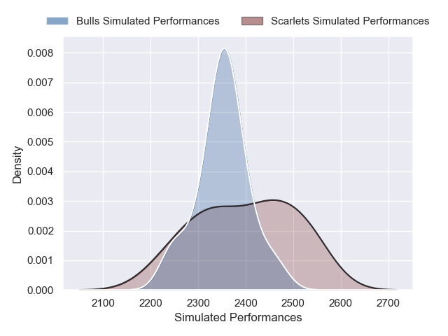

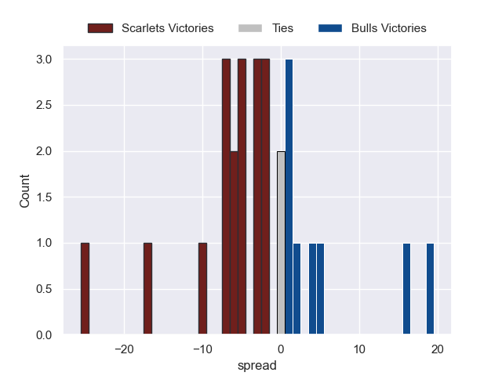

### Benetton Treviso V Munster on 2026-06-05

Average Margin: Benetton Treviso by 15.0

### Connacht V Bulls on 2026-06-05

Average Margin: Connacht by 11.0

### Ospreys V Stormers on 2026-06-05

Average Margin: Stormers by 11.0

### Ospreys V Ulster on 2026-06-05

Average Margin: Ulster by 15.0

### Edinburgh V Munster on 2026-06-05

Average Margin: Edinburgh by 1.0

### Edinburgh V Stormers on 2026-06-05

Average Margin: Edinburgh by 8.5

### Scarlets V Ulster on 2026-06-05

Average Margin: Scarlets by 2.0

### Connacht V Ulster on 2026-06-05

Average Margin: Connacht by 3.0

### Glasgow Warriors V Connacht on 2026-06-05

Average Margin: Glasgow Warriors by 14.5

### Ospreys V Cardiff Rugby on 2026-06-05

Average Margin: Ospreys by 1.0

### Ospreys V Glasgow Warriors on 2026-06-05

Average Margin: Ospreys by 0.5

### Benetton Treviso V Cardiff Rugby on 2026-06-05

Average Margin: Cardiff Rugby by 4.0

### Connacht V Sharks on 2026-06-05

Average Margin: Sharks by 6.0

### Dragons V Leinster on 2026-06-05

Average Margin: Dragons by 15.0

### Edinburgh V Cardiff Rugby on 2026-06-05

Average Margin: Edinburgh by 1.0

### Connacht V Cardiff Rugby on 2026-06-05

Average Margin: Connacht by 3.0

### Glasgow Warriors V Edinburgh on 2026-06-05

Average Margin: Glasgow Warriors by 5.5

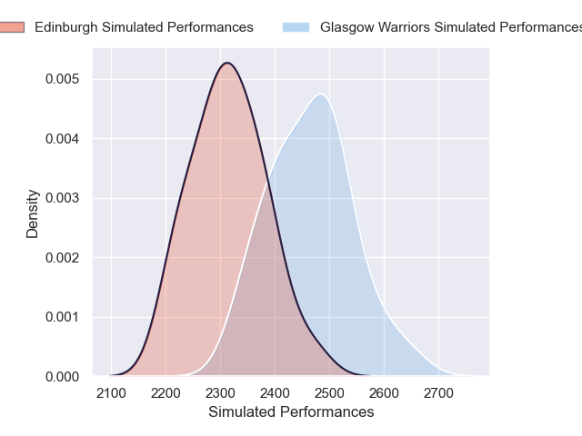
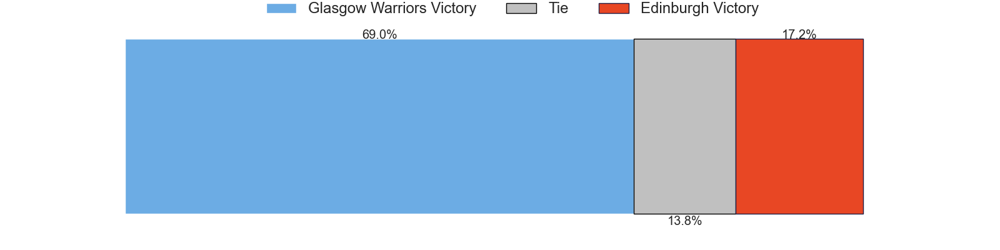
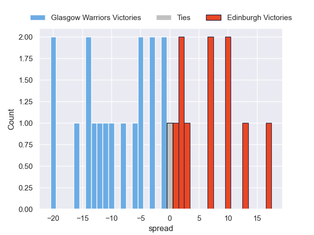

### Connacht V Leinster on 2026-06-05

Average Margin: Connacht by 3.4

### Leinster V Glasgow Warriors on 2026-06-05

Average Margin: Leinster by 5.2

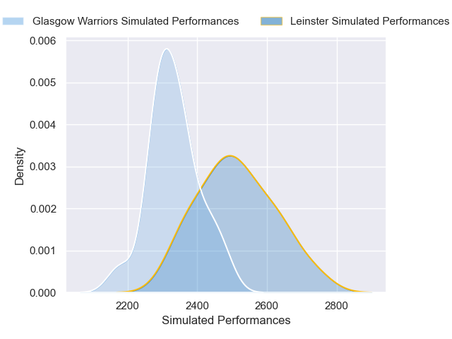

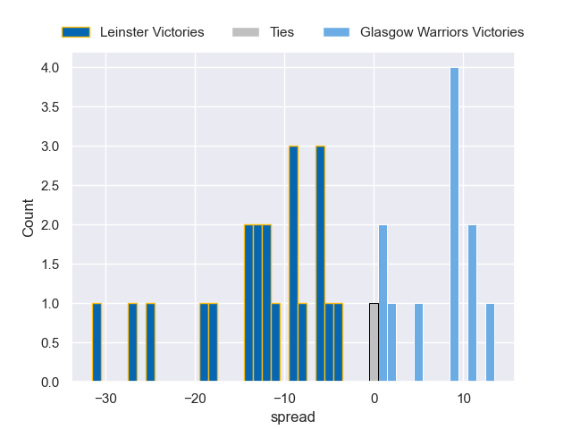

### Ulster V Sharks on 2026-06-05

Average Margin: Ulster by 1.6

### Munster V Stormers on 2026-06-05

Average Margin: Munster by 1.0

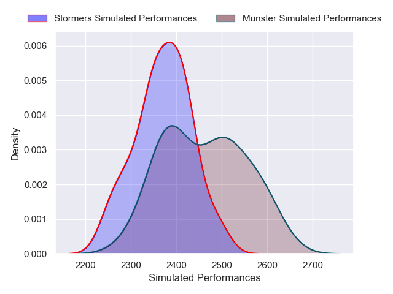

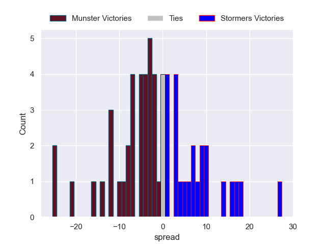

### Edinburgh V Glasgow Warriors on 2026-06-05

Average Margin: Edinburgh by 8.0

### Sharks V Connacht on 2026-06-05

Average Margin: Sharks by 7.8

### Munster V Benetton Treviso on 2026-06-05

Average Margin: Benetton Treviso by 3.5

### Leinster V Ospreys on 2026-06-05

Average Margin: Leinster by 8.2

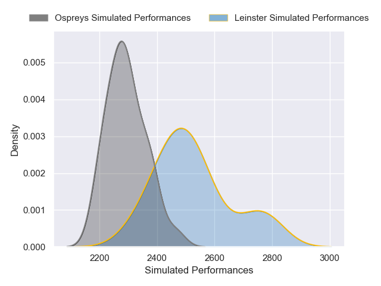

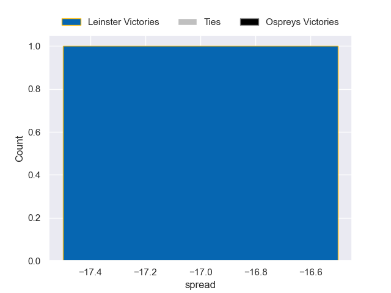

### Edinburgh V Sharks on 2026-06-05

Average Margin: Edinburgh by 22.0

### Lions V Connacht on 2026-06-05

Average Margin: Lions by 3.7

### Connacht V Glasgow Warriors on 2026-06-05

Average Margin: Connacht by 3.0

### Sharks V Bulls on 2026-06-05

Average Margin: Bulls by 0.2

### Munster V Cardiff Rugby on 2026-06-05

Average Margin: Munster by 8.2

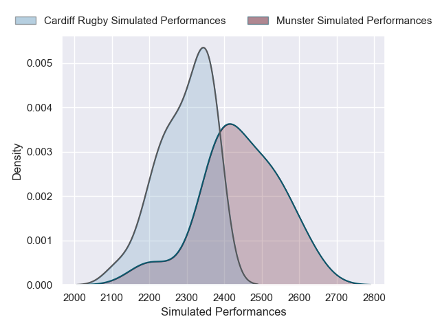

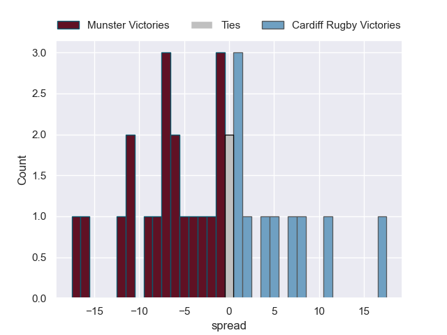

### Edinburgh V Leinster on 2026-06-05

Average Margin: Edinburgh by 9.5

### Munster V Ulster on 2026-06-05

Average Margin: Munster by 1.8

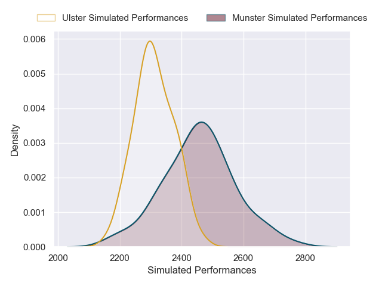

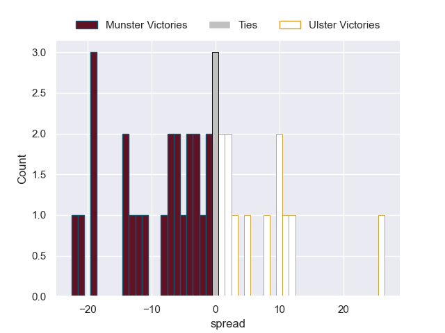

### Bulls V Lions on 2026-06-05

Average Margin: Lions by 0.8

### Bulls V Glasgow Warriors on 2026-06-05

Average Margin: Bulls by 0.6

### Cardiff Rugby V Lions on 2026-06-05

Average Margin: Cardiff Rugby by 11.8

### Munster V Glasgow Warriors on 2026-06-05

Average Margin: Munster by 3.6

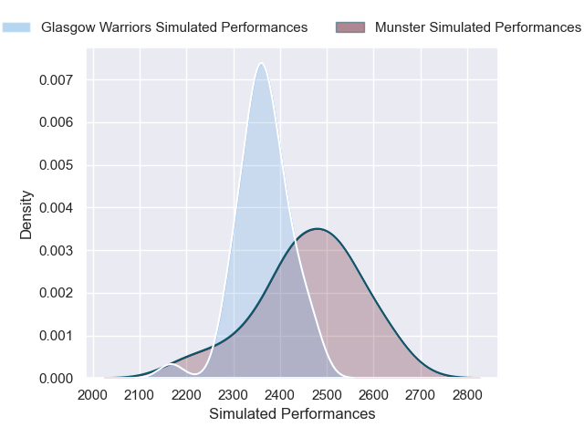

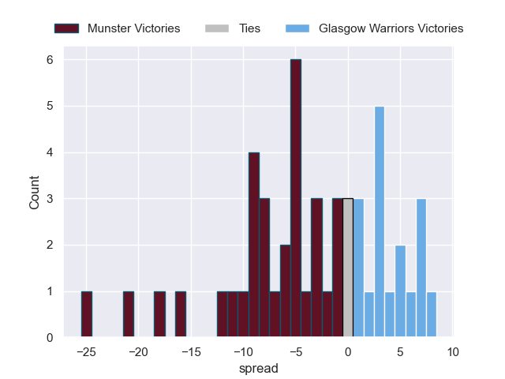

### Sharks V Stormers on 2026-06-05

Average Margin: Stormers by 1.8

### Ulster V Cardiff Rugby on 2026-06-05

Average Margin: Ulster by 3.6

### Glasgow Warriors V Stormers on 2026-06-05

Average Margin: Glasgow Warriors by 4.9

### Stormers V Lions on 2026-06-05

Average Margin: Stormers by 2.8

### Bulls V Stormers on 2026-06-05

Average Margin: Bulls by 4.3

### Munster V Bulls on 2026-06-05

Average Margin: Munster by 8.4

### Lions V Bulls on 2026-06-05

Average Margin: Lions by 3.8

### Bulls V Ulster on 2026-06-05

Average Margin: Ulster by 2.2

### Sharks V Cardiff Rugby on 2026-06-05

Average Margin: Sharks by 2.3

### Stormers V Cardiff Rugby on 2026-06-05

Average Margin: Stormers by 0.1

### Lions V Munster on 2026-06-05

Average Margin: Munster by 0.0

### Glasgow Warriors V Sharks on 2026-06-05

Average Margin: Glasgow Warriors by 3.8

### Ospreys V Leinster on 2026-06-05

Average Margin: Ospreys by 1.8

### Lions V Stormers on 2026-06-05

Average Margin: Stormers by 6.1

### Leinster V Bulls on 2026-06-05

Average Margin: Leinster by 7.2

### Glasgow Warriors V Munster on 2026-06-05

Average Margin: Glasgow Warriors by 2.8

### Leinster V Ulster on 2026-06-05

Average Margin: Leinster by 5.2

### Connacht V Munster on 2026-06-05

Average Margin: Connacht by 1.4

### Cardiff Rugby V Munster on 2026-06-05

Average Margin: Munster by 0.0

### Stormers V Munster on 2026-06-05

Average Margin: Stormers by 4.7

### Stormers V Bulls on 2026-06-05

Average Margin: Stormers by 2.6

### Sharks V Munster on 2026-06-05

Average Margin: Munster by 0.1

### Stormers V Ulster on 2026-06-05

Average Margin: Ulster by 0.1

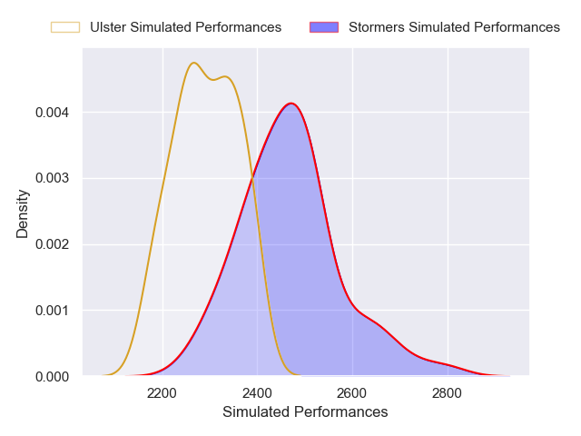
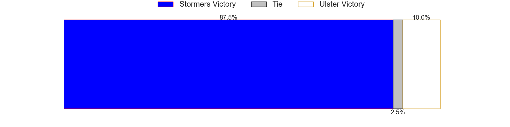
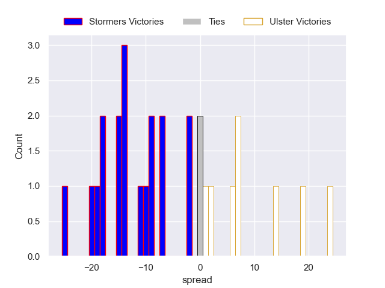

### Stormers V Glasgow Warriors on 2026-06-05

Average Margin: Stormers by 1.0

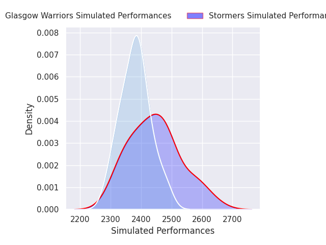

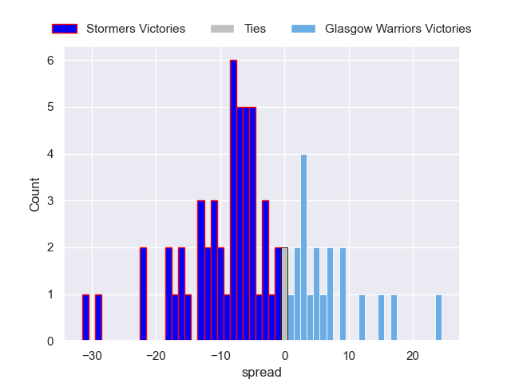

### Glasgow Warriors V Ulster on 2026-06-05

Average Margin: Glasgow Warriors by 5.6

### Sharks V Ulster on 2026-06-05

Average Margin: Sharks by 5.2

### Glasgow Warriors V Bulls on 2026-06-05

Average Margin: Glasgow Warriors by 6.1

### Glasgow Warriors V Cardiff Rugby on 2026-06-05

Average Margin: Glasgow Warriors by 4.3

### Glasgow Warriors V Leinster on 2026-06-05

Average Margin: Glasgow Warriors by 4.9

### Ospreys V Munster on 2026-06-05

Average Margin: Munster by 2.0

### Ulster V Edinburgh on 2026-06-05

Average Margin: Ulster by 7.0

### Lions V Leinster on 2026-06-05

Average Margin: Leinster by 0.3

### Stormers V Leinster on 2026-06-05

Average Margin: Stormers by 1.4

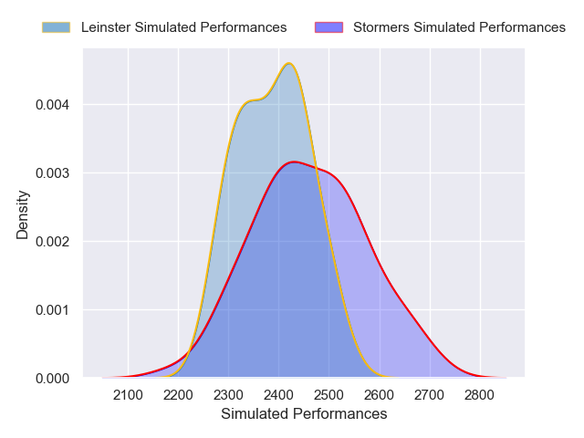

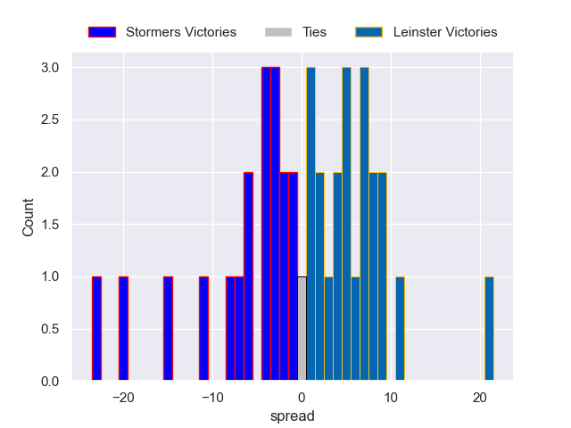

### Benetton Treviso V Leinster on 2026-06-05

Average Margin: Benetton Treviso by 7.9

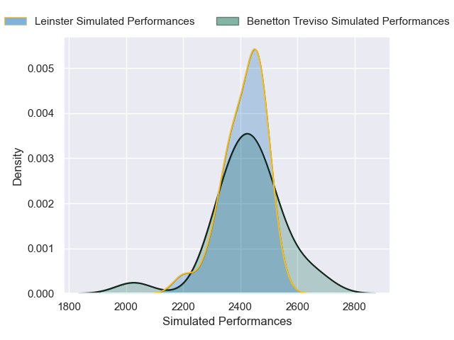

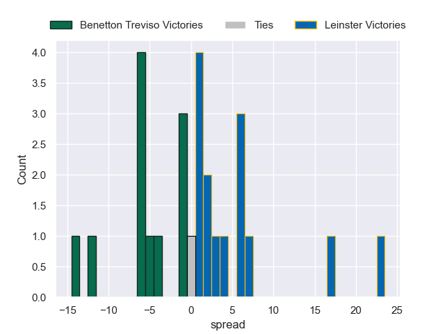

### Bulls V Sharks on 2026-06-05

Average Margin: Sharks by 1.1

### Stormers V Sharks on 2026-06-05

Average Margin: Stormers by 2.7

### Edinburgh V Bulls on 2026-06-05

Average Margin: Bulls by 25.0

### Lions V Cardiff Rugby on 2026-06-05

Average Margin: Lions by 2.8

### Benetton Treviso V Ulster on 2026-06-05

Average Margin: Ulster by 6.8

### Cardiff Rugby V Bulls on 2026-06-05

Average Margin: Cardiff Rugby by 6.8

### Lions V Ulster on 2026-06-05

Average Margin: Lions by 0.9

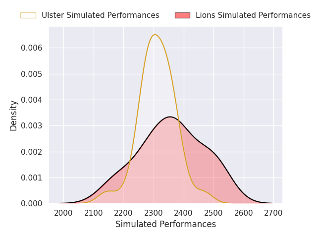
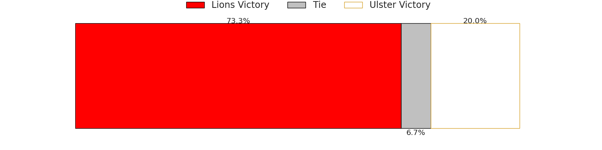
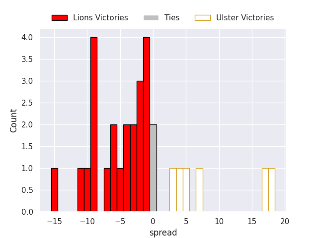

### Sharks V Lions on 2026-06-05

Average Margin: Sharks by 10.0

### Dragons V Cardiff Rugby on 2026-06-05

Average Margin: Dragons by 16.0

### Bulls V Munster on 2026-06-05

Average Margin: Bulls by 0.9

### Leinster V Connacht on 2026-06-05

Average Margin: Leinster by 9.5

### Scarlets V Munster on 2026-06-05

Average Margin: Munster by 4.0

### Glasgow Warriors V Lions on 2026-06-05

Average Margin: Glasgow Warriors by 3.2

### Connacht V Stormers on 2026-06-05

Average Margin: Connacht by 4.5

### Leinster V Sharks on 2026-06-05

Average Margin: Leinster by 6.6

### Ospreys V Bulls on 2026-06-05

Average Margin: Ospreys by 2.7

### Ulster V Munster on 2026-06-05

Average Margin: Ulster by 0.1

### Cardiff Rugby V Ulster on 2026-06-05

Average Margin: Cardiff Rugby by 1.1

### Cardiff Rugby V Leinster on 2026-06-05

Average Margin: Cardiff Rugby by 2.3

### Benetton Treviso V Glasgow Warriors on 2026-06-05

Average Margin: Benetton Treviso by 7.0

### Ulster V Benetton Treviso on 2026-06-05

Average Margin: Ulster by 1.0

## Final

### Leinster V Bulls on 2026-06-19

Average Margin: Leinster by 5.8

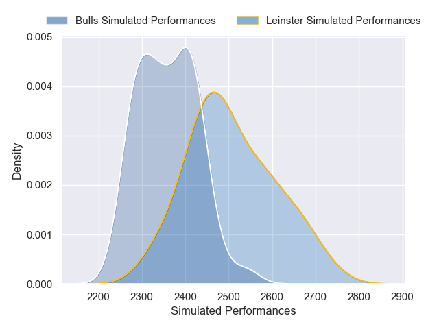

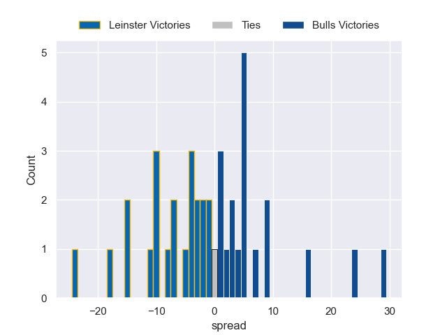

### Connacht V Glasgow Warriors on 2026-06-19

Average Margin: Connacht by 0.6

### Connacht V Munster on 2026-06-19

Average Margin: Munster by 3.0

### Benetton Treviso V Leinster on 2026-06-19

Average Margin: Leinster by 0.0

### Ulster V Bulls on 2026-06-19

Average Margin: Ulster by 2.6

### Cardiff Rugby V Stormers on 2026-06-19

Average Margin: Cardiff Rugby by 3.2

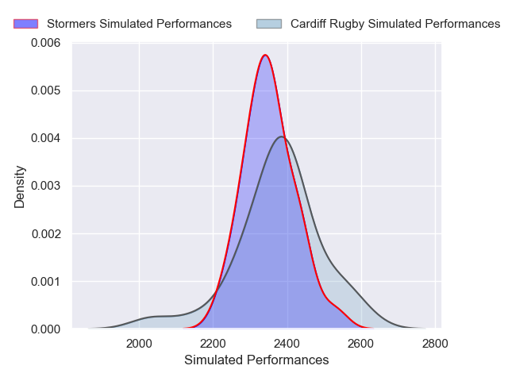

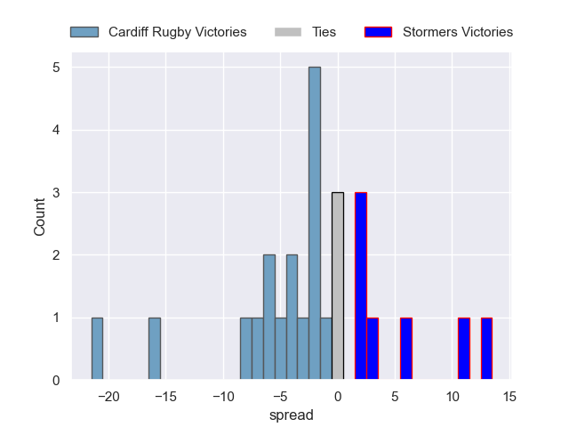

### Glasgow Warriors V Lions on 2026-06-19

Average Margin: Glasgow Warriors by 6.6

### Munster V Ulster on 2026-06-19

Average Margin: Ulster by 1.9

### Lions V Bulls on 2026-06-19

Average Margin: Lions by 6.5

### Leinster V Connacht on 2026-06-19

Average Margin: Connacht by 2.4

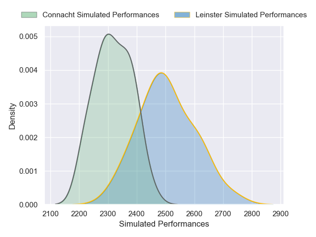

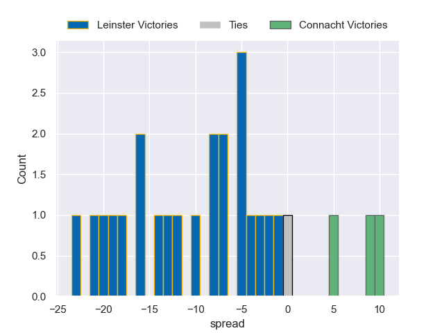

### Bulls V Connacht on 2026-06-19

Average Margin: Bulls by 0.3

### Bulls V Sharks on 2026-06-19

Average Margin: Sharks by 3.0

### Glasgow Warriors V Ospreys on 2026-06-19

Average Margin: Glasgow Warriors by 7.0

### Munster V Edinburgh on 2026-06-19

Average Margin: Munster by 10.7

### Edinburgh V Stormers on 2026-06-19

Average Margin: Edinburgh by 1.7

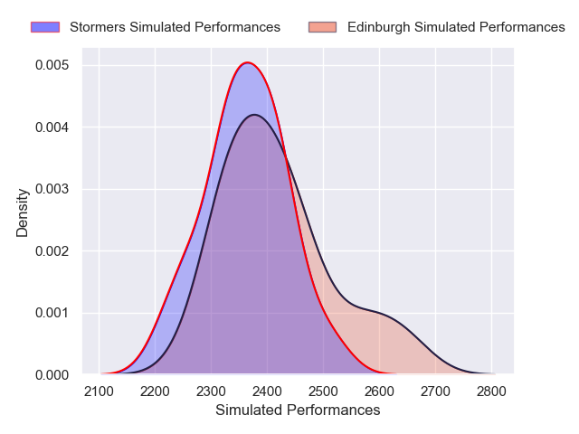

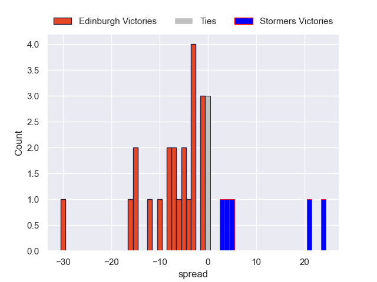

### Lions V Ulster on 2026-06-19

Average Margin: Lions by 1.0

### Ulster V Benetton Treviso on 2026-06-19

Average Margin: Benetton Treviso by 9.0

### Connacht V Ulster on 2026-06-19

Average Margin: Ulster by 1.0

### Edinburgh V Ulster on 2026-06-19

Average Margin: Edinburgh by 11.0

### Dragons V Cardiff Rugby on 2026-06-19

Average Margin: Cardiff Rugby by 11.0

### Sharks V Glasgow Warriors on 2026-06-19

Average Margin: Glasgow Warriors by 0.7

### Benetton Treviso V Stormers on 2026-06-19

Average Margin: Benetton Treviso by 11.0

### Sharks V Lions on 2026-06-19

Average Margin: Sharks by 9.3

### Leinster V Edinburgh on 2026-06-19

Average Margin: Edinburgh by 2.3

### Connacht V Cardiff Rugby on 2026-06-19

Average Margin: Connacht by 15.0

### Scarlets V Bulls on 2026-06-19

Average Margin: Scarlets by 6.0

### Benetton Treviso V Cardiff Rugby on 2026-06-19

Average Margin: Benetton Treviso by 18.0

### Benetton Treviso V Glasgow Warriors on 2026-06-19

Average Margin: Benetton Treviso by 7.7

### Bulls V Cardiff Rugby on 2026-06-19

Average Margin: Cardiff Rugby by 1.3

### Sharks V Munster on 2026-06-19

Average Margin: Sharks by 0.4

### Ospreys V Ulster on 2026-06-19

Average Margin: Ospreys by 6.8

### Cardiff Rugby V Sharks on 2026-06-19

Average Margin: Cardiff Rugby by 16.0

### Glasgow Warriors V Stormers on 2026-06-19

Average Margin: Glasgow Warriors by 5.0

### Glasgow Warriors V Bulls on 2026-06-19

Average Margin: Glasgow Warriors by 8.0

### Glasgow Warriors V Leinster on 2026-06-19

Average Margin: Glasgow Warriors by 2.4

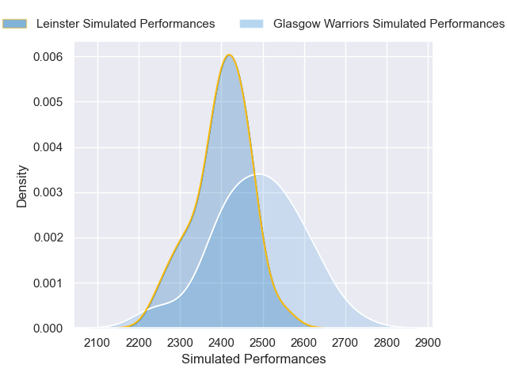

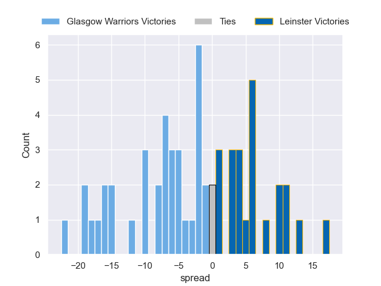

### Sharks V Leinster on 2026-06-19

Average Margin: Sharks by 2.1

### Ulster V Stormers on 2026-06-19

Average Margin: Ulster by 2.9

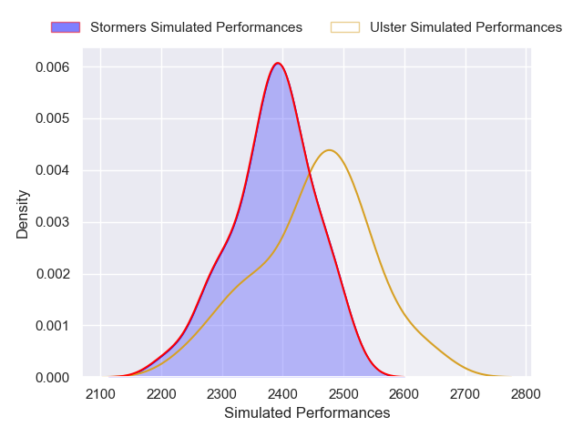

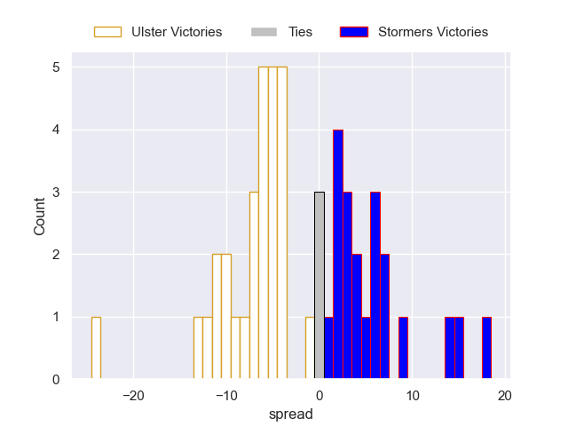

### Ulster V Sharks on 2026-06-19

Average Margin: Ulster by 0.5

### Leinster V Stormers on 2026-06-19

Average Margin: Leinster by 2.8

### Ospreys V Stormers on 2026-06-19

Average Margin: Stormers by 11.0

### Connacht V Stormers on 2026-06-19

Average Margin: Connacht by 4.2

### Glasgow Warriors V Ulster on 2026-06-19

Average Margin: Glasgow Warriors by 2.6

### Stormers V Munster on 2026-06-19

Average Margin: Stormers by 6.8

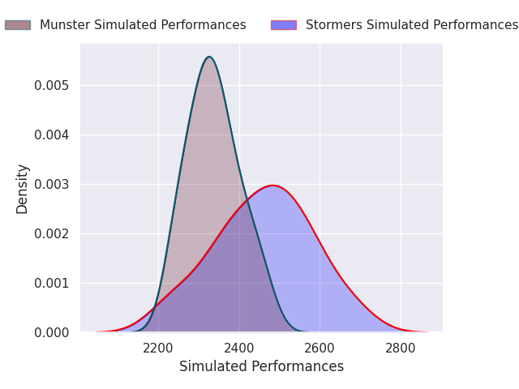

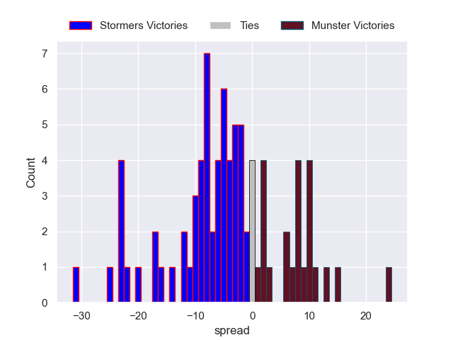

### Ulster V Leinster on 2026-06-19

Average Margin: Ulster by 2.8

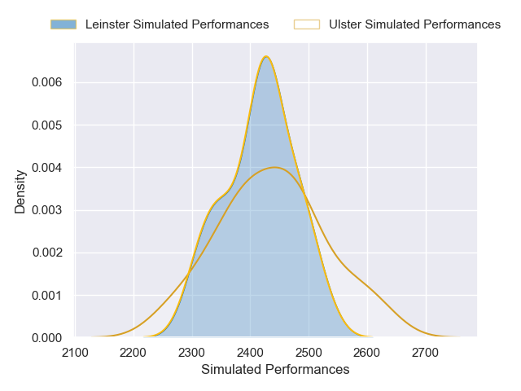

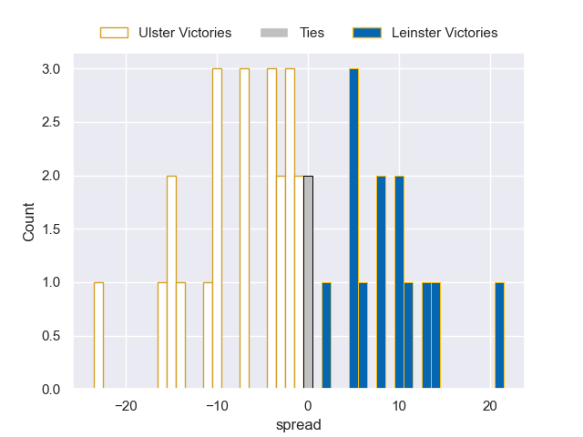

### Sharks V Stormers on 2026-06-19

Average Margin: Sharks by 3.5

### Edinburgh V Lions on 2026-06-19

Average Margin: Lions by 2.0

### Ospreys V Lions on 2026-06-19

Average Margin: Ospreys by 5.0

### Lions V Stormers on 2026-06-19

Average Margin: Lions by 3.4

### Bulls V Stormers on 2026-06-19

Average Margin: Bulls by 4.1

### Glasgow Warriors V Munster on 2026-06-19

Average Margin: Glasgow Warriors by 5.1

### Dragons V Ulster on 2026-06-19

Average Margin: Dragons by 13.0

### Glasgow Warriors V Cardiff Rugby on 2026-06-19

Average Margin: Glasgow Warriors by 4.8

### Leinster V Munster on 2026-06-19

Average Margin: Leinster by 4.3

### Cardiff Rugby V Ulster on 2026-06-19

Average Margin: Cardiff Rugby by 0.5

### Munster V Cardiff Rugby on 2026-06-19

Average Margin: Munster by 2.2

### Leinster V Ospreys on 2026-06-19

Average Margin: Ospreys by 4.3

### Cardiff Rugby V Leinster on 2026-06-19

Average Margin: Cardiff Rugby by 3.9

### Lions V Cardiff Rugby on 2026-06-19

Average Margin: Lions by 4.0

### Munster V Bulls on 2026-06-19

Average Margin: Bulls by 5.5

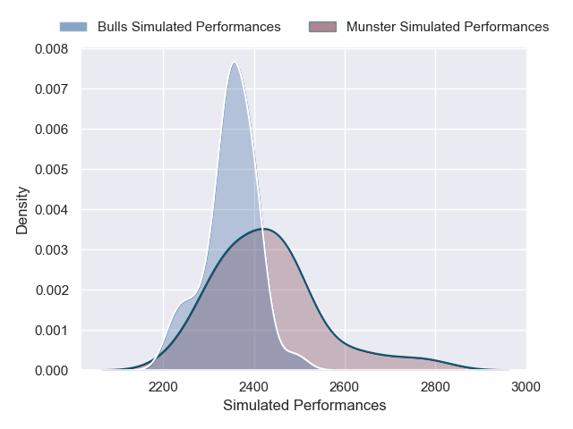

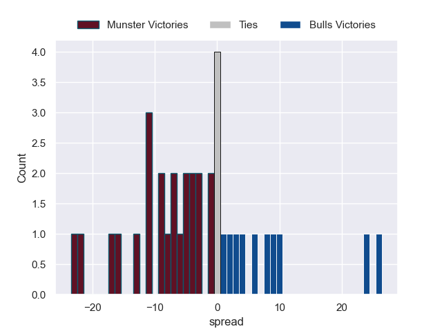

### Leinster V Lions on 2026-06-19

Average Margin: Leinster by 9.5

### Munster V Lions on 2026-06-19

Average Margin: Munster by 5.4

### Ospreys V Munster on 2026-06-19

Average Margin: Ospreys by 1.5

