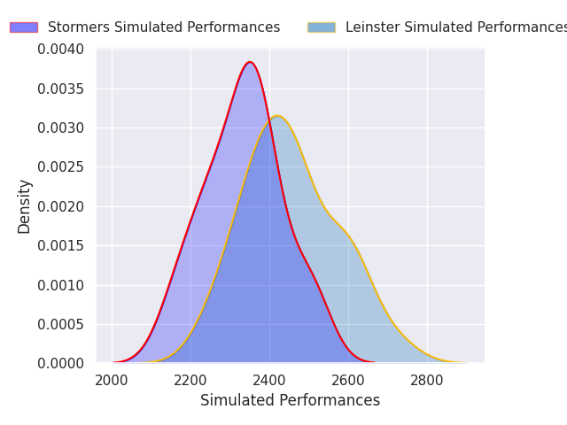
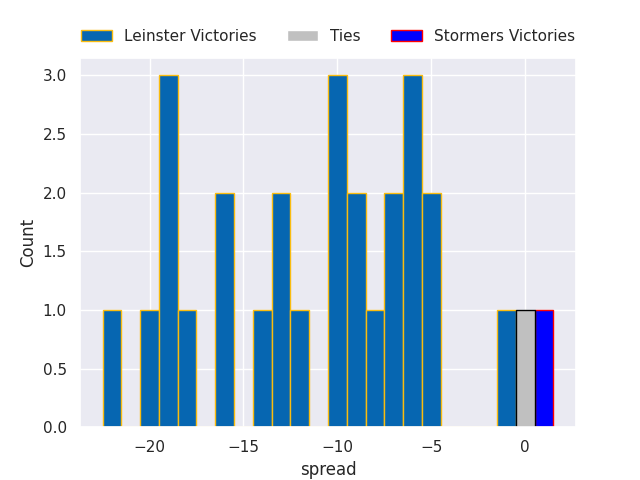

# Team Rankings

# Standings

## Current Standings

| Club             |   Played |   Wins |   Point Differential |   Losing Bonus Points |   Try Bonus Points |   Competition Points |
|:-----------------|---------:|-------:|---------------------:|----------------------:|-------------------:|---------------------:|
| Glasgow Warriors |       13 |     10 |                  171 |                     2 |                  8 |                   50 |
| Stormers         |       13 |     10 |                  120 |                     0 |                  5 |                   45 |
| Ulster           |       14 |      8 |                   97 |                     3 |                  7 |                   44 |
| Leinster         |       13 |      8 |                   45 |                     1 |                  8 |                   41 |
| Cardiff Rugby    |       13 |      8 |                   -3 |                     3 |                  3 |                   38 |
| Munster          |       13 |      8 |                  -22 |                     2 |                  4 |                   38 |
| Bulls            |       13 |      7 |                   54 |                     1 |                  6 |                   35 |
| Connacht         |       13 |      6 |                    3 |                     4 |                  7 |                   35 |
| Lions            |       12 |      6 |                    8 |                     2 |                  5 |                   33 |
| Sharks           |       12 |      5 |                  -20 |                     1 |                  6 |                   29 |
| Ospreys          |       13 |      5 |                  -25 |                     1 |                  4 |                   29 |
| Benetton Treviso |       13 |      5 |                  -53 |                     1 |                  3 |                   28 |
| Edinburgh        |       14 |      4 |                  -52 |                     4 |                  3 |                   25 |
| Scarlets         |       13 |      4 |                  -69 |                     2 |                  1 |                   21 |
| Dragons          |       13 |      2 |                  -67 |                     4 |                  2 |                   20 |
| Zebre            |       13 |      2 |                 -187 |                     2 |                  2 |                   12 |

## Projected Remaining Table

| Club             |   To Play |   Projected Wins |   Projected Differential |   Projected Losing Bonus Points | Projected Try Bonus Points   |   Projected Competition Points |
|:-----------------|----------:|-----------------:|-------------------------:|--------------------------------:|:-----------------------------|-------------------------------:|
| Sharks           |         7 |            3.734 |                   10.324 |                           1.58  |                              |                         17.204 |
| Bulls            |         6 |            3.425 |                   15.493 |                           1.266 |                              |                         15.606 |
| Lions            |         7 |            3.299 |                   -1.428 |                           1.622 |                              |                         15.52  |
| Stormers         |         6 |            3.17  |                    8.69  |                           1.422 |                              |                         14.68  |
| Connacht         |         6 |            3.121 |                    6.668 |                           1.454 |                              |                         14.496 |
| Leinster         |         5 |            3.064 |                   19.974 |                           0.982 |                              |                         13.596 |
| Glasgow Warriors |         5 |            2.956 |                   16.344 |                           1.039 |                              |                         13.305 |
| Ulster           |         5 |            2.824 |                    9.804 |                           1.105 |                              |                         12.949 |
| Scarlets         |         6 |            2.482 |                  -12.025 |                           1.461 |                              |                         11.947 |
| Edinburgh        |         5 |            2.232 |                   -3.3   |                           1.266 |                              |                         10.608 |
| Dragons          |         5 |            2.172 |                   -5.949 |                           1.28  |                              |                         10.482 |
| Munster          |         5 |            2.157 |                   -4.452 |                           1.307 |                              |                         10.465 |
| Cardiff Rugby    |         5 |            1.98  |                  -10.613 |                           1.289 |                              |                          9.639 |
| Ospreys          |         5 |            1.99  |                  -11.199 |                           1.218 |                              |                          9.59  |
| Benetton Treviso |         5 |            1.899 |                  -12.77  |                           1.229 |                              |                          9.255 |
| Zebre            |         5 |            1.445 |                  -25.561 |                           1.221 |                              |                          7.399 |

## Projected Total Table

| Club             |   Played |   Wins |   Point Differential |   Losing Bonus Points |   Try Bonus Points |   Competition Points |
|:-----------------|---------:|-------:|---------------------:|----------------------:|-------------------:|---------------------:|
| Glasgow Warriors |       18 | 12.956 |              187.344 |                 3.039 |                  8 |               63.305 |
| Stormers         |       19 | 13.17  |              128.69  |                 1.422 |                  5 |               59.68  |
| Ulster           |       19 | 10.824 |              106.804 |                 4.105 |                  7 |               56.949 |
| Leinster         |       18 | 11.064 |               64.974 |                 1.982 |                  8 |               54.596 |
| Bulls            |       19 | 10.425 |               69.493 |                 2.266 |                  6 |               50.606 |
| Connacht         |       19 |  9.121 |                9.668 |                 5.454 |                  7 |               49.496 |
| Lions            |       19 |  9.299 |                6.572 |                 3.622 |                  5 |               48.52  |
| Munster          |       18 | 10.157 |              -26.452 |                 3.307 |                  4 |               48.465 |
| Cardiff Rugby    |       18 |  9.98  |              -13.613 |                 4.289 |                  3 |               47.639 |
| Sharks           |       19 |  8.734 |               -9.676 |                 2.58  |                  6 |               46.204 |
| Ospreys          |       18 |  6.99  |              -36.199 |                 2.218 |                  4 |               38.59  |
| Benetton Treviso |       18 |  6.899 |              -65.77  |                 2.229 |                  3 |               37.255 |
| Edinburgh        |       19 |  6.232 |              -55.3   |                 5.266 |                  3 |               35.608 |
| Scarlets         |       19 |  6.482 |              -81.025 |                 3.461 |                  1 |               32.947 |
| Dragons          |       18 |  4.172 |              -72.949 |                 5.28  |                  2 |               30.482 |
| Zebre            |       18 |  3.445 |             -212.561 |                 3.221 |                  2 |               19.399 |

## Projected Playoff Results

|                  | Reach Quarterfinal   | Win Quarterfinal   | Reach Semifinal   | Win Semifinal   | Reach Final   | Win Final   |
|:-----------------|:---------------------|:-------------------|:------------------|:----------------|:--------------|:------------|
| Glasgow Warriors | 100.0 %              | 74.8 %             | 74.8 %            | 49.0 %          | 49.0 %        | 32.6 %      |
| Leinster         | 97.9 %               | 63.5 %             | 63.5 %            | 28.8 %          | 28.8 %        | 16.3 %      |
| Ulster           | 99.1 %               | 60.3 %             | 60.3 %            | 30.7 %          | 30.7 %        | 12.5 %      |
| Stormers         | 100.0 %              | 60.8 %             | 60.8 %            | 30.8 %          | 30.8 %        | 11.6 %      |
| Bulls            | 81.6 %               | 30.5 %             | 30.5 %            | 12.9 %          | 12.9 %        | 5.7 %       |
| Connacht         | 82.6 %               | 34.6 %             | 34.6 %            | 14.3 %          | 14.3 %        | 5.6 %       |
| Lions            | 87.1 %               | 28.5 %             | 28.5 %            | 10.6 %          | 10.6 %        | 4.9 %       |
| Cardiff Rugby    | 56.4 %               | 16.2 %             | 16.2 %            | 8.2 %           | 8.2 %         | 4.5 %       |
| Munster          | 63.0 %               | 20.6 %             | 20.6 %            | 9.8 %           | 9.8 %         | 4.1 %       |
| Sharks           | 28.3 %               | 8.6 %              | 8.6 %             | 4.5 %           | 4.5 %         | 2.1 %       |
| Ospreys          | 2.8 %                | 1.2 %              | 1.2 %             | 0.4 %           | 0.4 %         | 0.1 %       |
| Benetton Treviso | 1.1 %                | 0.3 %              | 0.3 %             | 0.0 %           | 0.0 %         | 0.0 %       |
| Edinburgh        | 0.1 %                | 0.1 %              | 0.1 %             | 0.0 %           | 0.0 %         | 0.0 %       |

# Completed Match Review

| Model | Percent Correct Predictions | Spread Error |
| ------ | ------ | ------ |
| Club Level | 60.7% | 9.0 |
| Player Level: Lineup | nan% | nan |
| Player Level: Minutes | nan% | nan |

# Future Predictions

## Week 15

### Connacht V Scarlets on 2025/10/04

Average Margin: Connacht by 4.2

## Week 16

### Lions V Sharks on 2025/12/25

Average Margin: Lions by 4.0

### Bulls V Stormers on 2025/12/25

Average Margin: Stormers by 1.3

## Week 17

### Lions V Sharks on 2026/02/21

Average Margin: Lions by 0.5

## Week 18

### Glasgow Warriors V Benetton Treviso on 2026/03/27

Average Margin: Glasgow Warriors by 8.3

### Sharks V Cardiff Rugby on 2026/03/27

Average Margin: Sharks by 4.3

### Bulls V Munster on 2026/03/28

Average Margin: Bulls by 3.7

### Lions V Dragons on 2026/03/28

Average Margin: Lions by 4.8

### Leinster V Scarlets on 2026/03/28

Average Margin: Leinster by 8.6

### Zebre V Ulster on 2026/03/28

Average Margin: Ulster by 4.4

### Connacht V Ospreys on 2026/03/28

Average Margin: Connacht by 5.5

### Stormers V Edinburgh on 2026/03/28

Average Margin: Stormers by 6.9

## Week 19

### Ulster V Leinster on 2026/04/17

Average Margin: Ulster by 1.6

### Edinburgh V Zebre on 2026/04/17

Average Margin: Edinburgh by 5.5

### Dragons V Bulls on 2026/04/17

Average Margin: Bulls by 0.2

### Benetton Treviso V Munster on 2026/04/18

Average Margin: Benetton Treviso by 3.3

### Ospreys V Sharks on 2026/04/18

Average Margin: Ospreys by 0.5

### Stormers V Connacht on 2026/04/18

Average Margin: Stormers by 3.8

### Scarlets V Cardiff Rugby on 2026/04/18

Average Margin: Scarlets by 1.9

### Lions V Glasgow Warriors on 2026/04/18

Average Margin: Glasgow Warriors by 2.2

## Week 20

### Zebre V Dragons on 2026/04/24

Average Margin: Zebre by 0.4

### Cardiff Rugby V Ospreys on 2026/04/24

Average Margin: Cardiff Rugby by 3.3

### Edinburgh V Sharks on 2026/04/24

Average Margin: Edinburgh by 0.3

### Scarlets V Bulls on 2026/04/25

Average Margin: Bulls by 0.3

### Benetton Treviso V Leinster on 2026/04/25

Average Margin: Benetton Treviso by 0.1

### Stormers V Glasgow Warriors on 2026/04/25

Average Margin: Stormers by 0.2

### Lions V Connacht on 2026/04/25

Average Margin: Lions by 1.8

### Munster V Ulster on 2026/04/25

Average Margin: Munster by 1.5

## Week 21

### Glasgow Warriors V Cardiff Rugby on 2026/05/08

Average Margin: Glasgow Warriors by 7.7

### Ulster V Stormers on 2026/05/08

Average Margin: Ulster by 3.6

### Dragons V Edinburgh on 2026/05/09

Average Margin: Dragons by 2.5

### Ospreys V Scarlets on 2026/05/09

Average Margin: Ospreys by 3.8

### Leinster V Lions on 2026/05/09

Average Margin: Leinster by 6.3

### Sharks V Benetton Treviso on 2026/05/09

Average Margin: Sharks by 3.8

### Bulls V Zebre on 2026/05/09

Average Margin: Bulls by 8.5

### Connacht V Munster on 2026/05/09

Average Margin: Connacht by 2.9

## Week 22

### Cardiff Rugby V Stormers on 2026/05/15

Average Margin: Stormers by 0.0

### Ulster V Glasgow Warriors on 2026/05/15

Average Margin: Ulster by 1.7

### Edinburgh V Connacht on 2026/05/15

Average Margin: Edinburgh by 0.3

### Sharks V Zebre on 2026/05/16

Average Margin: Sharks by 7.6

### Munster V Lions on 2026/05/16

Average Margin: Munster by 4.0

### Scarlets V Dragons on 2026/05/16

Average Margin: Scarlets by 3.0

### Leinster V Ospreys on 2026/05/16

Average Margin: Leinster by 6.8

### Bulls V Benetton Treviso on 2026/05/16

Average Margin: Bulls by 4.1

## Week 23

### Glasgow Warriors V Bulls on 2026-05-29

Average Margin: Glasgow Warriors by 6.5

### Glasgow Warriors V Stormers on 2026-05-29

Average Margin: Glasgow Warriors by 16.0

### Leinster V Connacht on 2026-05-29

Average Margin: Leinster by 4.1

### Leinster V Cardiff Rugby on 2026-05-29

Average Margin: Leinster by 5.8

### Munster V Bulls on 2026-05-29

Average Margin: Munster by 6.0

### Cardiff Rugby V Connacht on 2026-05-29

Average Margin: Cardiff Rugby by 2.0

### Lions V Bulls on 2026-05-29

Average Margin: Lions by 1.3

### Cardiff Rugby V Lions on 2026-05-29

Average Margin: Cardiff Rugby by 7.0

### Leinster V Sharks on 2026-05-29

Average Margin: Leinster by 5.0

### Connacht V Lions on 2026-05-29

Average Margin: Connacht by 4.9

### Connacht V Bulls on 2026-05-29

Average Margin: Connacht by 4.0

### Connacht V Munster on 2026-05-29

Average Margin: Munster by 0.3

### Leinster V Ulster on 2026-05-29

Average Margin: Leinster by 5.1

### Lions V Munster on 2026-05-29

Average Margin: Lions by 3.9

### Bulls V Cardiff Rugby on 2026-05-29

Average Margin: Bulls by 13.2

### Lions V Cardiff Rugby on 2026-05-29

Average Margin: Cardiff Rugby by 2.7

### Connacht V Cardiff Rugby on 2026-05-29

Average Margin: Connacht by 11.4

### Lions V Ospreys on 2026-05-29

Average Margin: Ospreys by 12.0

### Munster V Cardiff Rugby on 2026-05-29

Average Margin: Cardiff Rugby by 1.0

### Connacht V Sharks on 2026-05-29

Average Margin: Connacht by 5.5

### Munster V Ospreys on 2026-05-29

Average Margin: Munster by 3.0

### Lions V Sharks on 2026-05-29

Average Margin: Lions by 4.0

### Munster V Leinster on 2026-05-29

Average Margin: Munster by 2.0

### Bulls V Connacht on 2026-05-29

Average Margin: Bulls by 2.2

### Munster V Ulster on 2026-05-29

Average Margin: Munster by 3.6

### Bulls V Lions on 2026-05-29

Average Margin: Bulls by 5.8

### Connacht V Ulster on 2026-05-29

Average Margin: Connacht by 3.2

### Sharks V Lions on 2026-05-29

Average Margin: Sharks by 16.5

### Bulls V Munster on 2026-05-29

Average Margin: Bulls by 1.5

### Leinster V Benetton Treviso on 2026-05-29

Average Margin: Leinster by 2.0

### Leinster V Lions on 2026-05-29

Average Margin: Leinster by 6.7

### Leinster V Bulls on 2026-05-29

Average Margin: Leinster by 6.1

### Ulster V Stormers on 2026-05-29

Average Margin: Ulster by 3.4

### Leinster V Stormers on 2026-05-29

Average Margin: Leinster by 4.4

### Glasgow Warriors V Munster on 2026-05-29

Average Margin: Glasgow Warriors by 9.4

### Ulster V Cardiff Rugby on 2026-05-29

Average Margin: Ulster by 6.3

### Stormers V Bulls on 2026-05-29

Average Margin: Stormers by 3.9

### Glasgow Warriors V Sharks on 2026-05-29

Average Margin: Glasgow Warriors by 6.6

### Ulster V Lions on 2026-05-29

Average Margin: Ulster by 10.1

### Glasgow Warriors V Connacht on 2026-05-29

Average Margin: Glasgow Warriors by 6.0

### Glasgow Warriors V Cardiff Rugby on 2026-05-29

Average Margin: Glasgow Warriors by 7.8

### Stormers V Sharks on 2026-05-29

Average Margin: Stormers by 3.5

### Glasgow Warriors V Lions on 2026-05-29

Average Margin: Glasgow Warriors by 8.2

### Stormers V Cardiff Rugby on 2026-05-29

Average Margin: Stormers by 4.3

### Glasgow Warriors V Ospreys on 2026-05-29

Average Margin: Glasgow Warriors by 11.9

### Stormers V Connacht on 2026-05-29

Average Margin: Stormers by 3.8

### Stormers V Munster on 2026-05-29

Average Margin: Stormers by 5.5

### Glasgow Warriors V Leinster on 2026-05-29

Average Margin: Glasgow Warriors by 5.5

### Cardiff Rugby V Bulls on 2026-05-29

Average Margin: Bulls by 0.1

### Stormers V Lions on 2026-05-29

Average Margin: Stormers by 7.5

### Glasgow Warriors V Benetton Treviso on 2026-05-29

Average Margin: Glasgow Warriors by 8.7

### Glasgow Warriors V Ulster on 2026-05-29

Average Margin: Glasgow Warriors by 8.0

### Ulster V Connacht on 2026-05-29

Average Margin: Ulster by 4.3

### Stormers V Leinster on 2026-05-29

Average Margin: Stormers by 0.6

### Stormers V Benetton Treviso on 2026-05-29

Average Margin: Stormers by 9.2

### Ulster V Bulls on 2026-05-29

Average Margin: Ulster by 4.2

### Stormers V Ospreys on 2026-05-29

Average Margin: Stormers by 4.7

### Ulster V Ospreys on 2026-05-29

Average Margin: Ulster by 3.2

### Ulster V Sharks on 2026-05-29

Average Margin: Ulster by 5.1

### Leinster V Munster on 2026-05-29

Average Margin: Munster by 6.5

### Ulster V Leinster on 2026-05-29

Average Margin: Leinster by 1.2

### Ulster V Benetton Treviso on 2026-05-29

Average Margin: Ulster by 6.5

### Ulster V Munster on 2026-05-29

Average Margin: Munster by 0.8

### Glasgow Warriors V Edinburgh on 2026-05-29

Average Margin: Edinburgh by 3.0

### Stormers V Ulster on 2026-05-29

Average Margin: Stormers by 2.0

### Bulls V Sharks on 2026-05-29

Average Margin: Bulls by 8.0

## Week 24

### Bulls V Munster on 2026-06-05

Average Margin: Bulls by 1.3

### Edinburgh V Stormers on 2026-06-05

Average Margin: Stormers by 6.0

### Sharks V Cardiff Rugby on 2026-06-05

Average Margin: Sharks by 4.0

### Ospreys V Stormers on 2026-06-05

Average Margin: Stormers by 7.0

### Sharks V Munster on 2026-06-05

Average Margin: Sharks by 6.0

### Benetton Treviso V Ulster on 2026-06-05

Average Margin: Ulster by 2.0

### Cardiff Rugby V Munster on 2026-06-05

Average Margin: Cardiff Rugby by 5.0

### Bulls V Lions on 2026-06-05

Average Margin: Bulls by 5.5

### Ospreys V Munster on 2026-06-05

Average Margin: Munster by 23.0

### Stormers V Sharks on 2026-06-05

Average Margin: Stormers by 1.5

### Cardiff Rugby V Ulster on 2026-06-05

Average Margin: Cardiff Rugby by 6.4

### Bulls V Leinster on 2026-06-05

Average Margin: Bulls by 1.7

### Ospreys V Bulls on 2026-06-05

Average Margin: Ospreys by 10.0

### Stormers V Munster on 2026-06-05

Average Margin: Stormers by 4.3

### Ospreys V Leinster on 2026-06-05

Average Margin: Leinster by 1.0

### Stormers V Cardiff Rugby on 2026-06-05

Average Margin: Cardiff Rugby by 1.9

### Cardiff Rugby V Connacht on 2026-06-05

Average Margin: Cardiff Rugby by 0.3

### Connacht V Bulls on 2026-06-05

Average Margin: Connacht by 3.3

### Ulster V Lions on 2026-06-05

Average Margin: Ulster by 7.0

### Bulls V Ospreys on 2026-06-05

Average Margin: Bulls by 8.0

### Connacht V Cardiff Rugby on 2026-06-05

Average Margin: Connacht by 3.9

### Sharks V Stormers on 2026-06-05

Average Margin: Sharks by 4.6

### Benetton Treviso V Stormers on 2026-06-05

Average Margin: Stormers by 5.0

### Cardiff Rugby V Stormers on 2026-06-05

Average Margin: Cardiff Rugby by 2.5

### Sharks V Glasgow Warriors on 2026-06-05

Average Margin: Sharks by 1.0

### Leinster V Connacht on 2026-06-05

Average Margin: Leinster by 5.2

### Sharks V Bulls on 2026-06-05

Average Margin: Sharks by 0.5

### Connacht V Ospreys on 2026-06-05

Average Margin: Ospreys by 4.0

### Connacht V Ulster on 2026-06-05

Average Margin: Connacht by 0.9

### Bulls V Glasgow Warriors on 2026-06-05

Average Margin: Bulls by 4.1

### Ulster V Glasgow Warriors on 2026-06-05

Average Margin: Ulster by 2.7

### Bulls V Ulster on 2026-06-05

Average Margin: Bulls by 2.4

### Lions V Stormers on 2026-06-05

Average Margin: Lions by 1.1

### Glasgow Warriors V Ospreys on 2026-06-05

Average Margin: Glasgow Warriors by 5.0

### Lions V Munster on 2026-06-05

Average Margin: Munster by 3.7

### Sharks V Lions on 2026-06-05

Average Margin: Sharks by 6.0

### Lions V Bulls on 2026-06-05

Average Margin: Lions by 7.4

### Glasgow Warriors V Connacht on 2026-06-05

Average Margin: Glasgow Warriors by 3.8

### Glasgow Warriors V Sharks on 2026-06-05

Average Margin: Glasgow Warriors by 9.4

### Glasgow Warriors V Munster on 2026-06-05

Average Margin: Glasgow Warriors by 3.7

### Cardiff Rugby V Leinster on 2026-06-05

Average Margin: Leinster by 0.4

### Sharks V Leinster on 2026-06-05

Average Margin: Sharks by 0.1

### Lions V Ulster on 2026-06-05

Average Margin: Ulster by 8.0

### Glasgow Warriors V Lions on 2026-06-05

Average Margin: Glasgow Warriors by 5.2

### Stormers V Lions on 2026-06-05

Average Margin: Stormers by 1.5

### Ulster V Leinster on 2026-06-05

Average Margin: Ulster by 3.8

### Glasgow Warriors V Bulls on 2026-06-05

Average Margin: Glasgow Warriors by 5.7

### Glasgow Warriors V Leinster on 2026-06-05

Average Margin: Glasgow Warriors by 4.4

### Stormers V Ulster on 2026-06-05

Average Margin: Stormers by 4.2

### Ulster V Connacht on 2026-06-05

Average Margin: Ulster by 5.5

### Glasgow Warriors V Ulster on 2026-06-05

Average Margin: Glasgow Warriors by 6.2

### Glasgow Warriors V Stormers on 2026-06-05

Average Margin: Glasgow Warriors by 7.5

### Stormers V Bulls on 2026-06-05

Average Margin: Stormers by 2.7

### Connacht V Sharks on 2026-06-05

Average Margin: Connacht by 0.2

### Stormers V Leinster on 2026-06-05

Average Margin: Leinster by 0.6

### Glasgow Warriors V Cardiff Rugby on 2026-06-05

Average Margin: Glasgow Warriors by 3.8

### Ulster V Bulls on 2026-06-05

Average Margin: Ulster by 8.1

### Bulls V Connacht on 2026-06-05

Average Margin: Bulls by 3.4

### Bulls V Sharks on 2026-06-05

Average Margin: Bulls by 1.8

### Sharks V Ulster on 2026-06-05

Average Margin: Ulster by 6.7

### Cardiff Rugby V Bulls on 2026-06-05

Average Margin: Cardiff Rugby by 4.6

### Cardiff Rugby V Lions on 2026-06-05

Average Margin: Cardiff Rugby by 3.4

### Connacht V Lions on 2026-06-05

Average Margin: Connacht by 0.4

### Munster V Connacht on 2026-06-05

Average Margin: Munster by 3.3

### Benetton Treviso V Connacht on 2026-06-05

Average Margin: Connacht by 1.0

### Munster V Ulster on 2026-06-05

Average Margin: Munster by 1.0

### Stormers V Connacht on 2026-06-05

Average Margin: Stormers by 1.5

### Leinster V Lions on 2026-06-05

Average Margin: Leinster by 5.6

### Munster V Leinster on 2026-06-05

Average Margin: Leinster by 0.9

### Connacht V Leinster on 2026-06-05

Average Margin: Connacht by 1.4

### Ospreys V Cardiff Rugby on 2026-06-05

Average Margin: Cardiff Rugby by 6.0

### Ospreys V Ulster on 2026-06-05

Average Margin: Ulster by 0.0

## Final

### Munster V Ulster on 2026-06-19

Average Margin: Munster by 1.6

### Bulls V Connacht on 2026-06-19

Average Margin: Bulls by 4.9

### Stormers V Munster on 2026-06-19

Average Margin: Stormers by 0.9

### Munster V Cardiff Rugby on 2026-06-19

Average Margin: Munster by 6.7

### Cardiff Rugby V Ulster on 2026-06-19

Average Margin: Cardiff Rugby by 3.8

### Sharks V Leinster on 2026-06-19

Average Margin: Sharks by 3.8

### Stormers V Cardiff Rugby on 2026-06-19

Average Margin: Stormers by 0.7

### Sharks V Connacht on 2026-06-19

Average Margin: Sharks by 2.2

### Cardiff Rugby V Leinster on 2026-06-19

Average Margin: Leinster by 0.2

### Leinster V Ospreys on 2026-06-19

Average Margin: Leinster by 1.0

### Leinster V Connacht on 2026-06-19

Average Margin: Leinster by 3.8

### Cardiff Rugby V Lions on 2026-06-19

Average Margin: Cardiff Rugby by 2.1

### Lions V Sharks on 2026-06-19

Average Margin: Lions by 0.2

### Lions V Stormers on 2026-06-19

Average Margin: Lions by 0.4

### Sharks V Ulster on 2026-06-19

Average Margin: Sharks by 4.8

### Cardiff Rugby V Bulls on 2026-06-19

Average Margin: Cardiff Rugby by 1.6

### Munster V Connacht on 2026-06-19

Average Margin: Munster by 2.4

### Cardiff Rugby V Connacht on 2026-06-19

Average Margin: Connacht by 5.2

### Lions V Ulster on 2026-06-19

Average Margin: Lions by 0.6

### Glasgow Warriors V Ospreys on 2026-06-19

Average Margin: Glasgow Warriors by 6.0

### Lions V Munster on 2026-06-19

Average Margin: Lions by 5.0

### Bulls V Stormers on 2026-06-19

Average Margin: Bulls by 2.0

### Bulls V Ospreys on 2026-06-19

Average Margin: Bulls by 5.0

### Lions V Connacht on 2026-06-19

Average Margin: Lions by 2.1

### Leinster V Stormers on 2026-06-19

Average Margin: Leinster by 4.2

### Glasgow Warriors V Bulls on 2026-06-19

Average Margin: Glasgow Warriors by 3.7

### Connacht V Glasgow Warriors on 2026-06-19

Average Margin: Glasgow Warriors by 1.2

### Stormers V Connacht on 2026-06-19

Average Margin: Stormers by 1.7

### Glasgow Warriors V Munster on 2026-06-19

Average Margin: Glasgow Warriors by 6.0

### Ulster V Stormers on 2026-06-19

Average Margin: Ulster by 1.8

### Glasgow Warriors V Ulster on 2026-06-19

Average Margin: Glasgow Warriors by 5.0

### Glasgow Warriors V Stormers on 2026-06-19

Average Margin: Glasgow Warriors by 5.6

### Lions V Leinster on 2026-06-19

Average Margin: Lions by 6.0

### Ulster V Connacht on 2026-06-19

Average Margin: Ulster by 5.5

### Munster V Sharks on 2026-06-19

Average Margin: Munster by 2.0

### Sharks V Stormers on 2026-06-19

Average Margin: Sharks by 3.4

### Glasgow Warriors V Lions on 2026-06-19

Average Margin: Glasgow Warriors by 6.9

### Bulls V Lions on 2026-06-19

Average Margin: Bulls by 0.4

### Leinster V Ulster on 2026-06-19

Average Margin: Leinster by 4.4

### Bulls V Munster on 2026-06-19

Average Margin: Bulls by 0.1

### Bulls V Ulster on 2026-06-19

Average Margin: Bulls by 3.9

### Sharks V Glasgow Warriors on 2026-06-19

Average Margin: Glasgow Warriors by 1.9

### Leinster V Munster on 2026-06-19

Average Margin: Leinster by 8.7

### Cardiff Rugby V Glasgow Warriors on 2026-06-19

Average Margin: Cardiff Rugby by 3.1

### Leinster V Bulls on 2026-06-19

Average Margin: Leinster by 8.8

### Glasgow Warriors V Leinster on 2026-06-19

Average Margin: Glasgow Warriors by 4.6

### Cardiff Rugby V Sharks on 2026-06-19

Average Margin: Cardiff Rugby by 6.0

