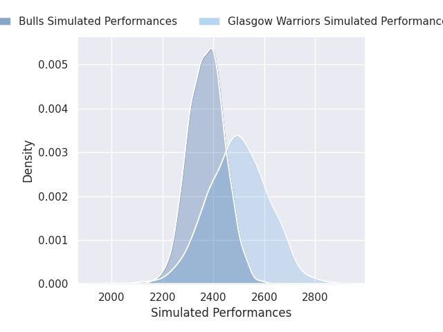
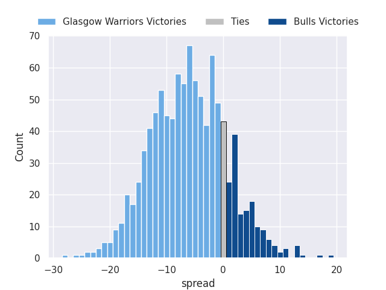

# Team Rankings

# Standings

## Current Standings

| Club             |   Played |   Wins |   Point Differential |   Losing Bonus Points |   Try Bonus Points |   Competition Points |
|:-----------------|---------:|-------:|---------------------:|----------------------:|-------------------:|---------------------:|
| Glasgow Warriors |       18 |     13 |                  141 |                     2 |                 13 |                   67 |
| Leinster         |       18 |     12 |                  145 |                     2 |                 13 |                   63 |
| Bulls            |       18 |     12 |                  160 |                     1 |                 10 |                   59 |
| Stormers         |       18 |     12 |                  160 |                     1 |                  8 |                   59 |
| Ulster           |       19 |      9 |                   74 |                     4 |                 10 |                   54 |
| Connacht         |       18 |     10 |                   47 |                     4 |                 10 |                   54 |
| Munster          |       18 |     11 |                   20 |                     3 |                  7 |                   54 |
| Lions            |       18 |     10 |                   59 |                     3 |                  8 |                   53 |
| Cardiff Rugby    |       18 |     11 |                  -19 |                     4 |                  3 |                   51 |
| Sharks           |       18 |      8 |                   39 |                     3 |                  9 |                   46 |
| Edinburgh        |       19 |      7 |                  -77 |                     4 |                  6 |                   40 |
| Ospreys          |       18 |      7 |                  -78 |                     3 |                  4 |                   39 |
| Benetton Treviso |       18 |      6 |                 -166 |                     1 |                  4 |                   33 |
| Scarlets         |       18 |      4 |                  -99 |                     5 |                  3 |                   28 |
| Dragons          |       18 |      3 |                 -131 |                     4 |                  3 |                   27 |
| Zebre            |       18 |      2 |                 -275 |                     4 |                  3 |                   15 |

## Projected Remaining Table

| Club     |   To Play |   Projected Wins |   Projected Differential |   Projected Losing Bonus Points | Projected Try Bonus Points   |   Projected Competition Points |
|:---------|----------:|-----------------:|-------------------------:|--------------------------------:|:-----------------------------|-------------------------------:|
| Lions    |         1 |            0.809 |                    7.235 |                           0.137 |                              |                          3.421 |
| Connacht |         1 |            0.807 |                    7.596 |                           0.123 |                              |                          3.407 |
| Stormers |         1 |            0.59  |                    1.946 |                           0.266 |                              |                          2.726 |
| Bulls    |         1 |            0.36  |                   -1.946 |                           0.366 |                              |                          1.906 |
| Sharks   |         1 |            0.167 |                   -7.235 |                           0.324 |                              |                          1.04  |
| Scarlets |         1 |            0.165 |                   -7.596 |                           0.3   |                              |                          1.016 |

## Projected Total Table

| Club             |   Played |   Wins |   Point Differential |   Losing Bonus Points |   Try Bonus Points |   Competition Points |
|:-----------------|---------:|-------:|---------------------:|----------------------:|-------------------:|---------------------:|
| Glasgow Warriors |       18 | 13     |              141     |                 2     |                 13 |               67     |
| Leinster         |       18 | 12     |              145     |                 2     |                 13 |               63     |
| Stormers         |       19 | 12.59  |              161.946 |                 1.266 |                  8 |               61.726 |
| Bulls            |       19 | 12.36  |              158.054 |                 1.366 |                 10 |               60.906 |
| Connacht         |       19 | 10.807 |               54.596 |                 4.123 |                 10 |               57.407 |
| Lions            |       19 | 10.809 |               66.235 |                 3.137 |                  8 |               56.421 |
| Ulster           |       19 |  9     |               74     |                 4     |                 10 |               54     |
| Munster          |       18 | 11     |               20     |                 3     |                  7 |               54     |
| Cardiff Rugby    |       18 | 11     |              -19     |                 4     |                  3 |               51     |
| Sharks           |       19 |  8.167 |               31.765 |                 3.324 |                  9 |               47.04  |
| Edinburgh        |       19 |  7     |              -77     |                 4     |                  6 |               40     |
| Ospreys          |       18 |  7     |              -78     |                 3     |                  4 |               39     |
| Benetton Treviso |       18 |  6     |             -166     |                 1     |                  4 |               33     |
| Scarlets         |       19 |  4.165 |             -106.596 |                 5.3   |                  3 |               29.016 |
| Dragons          |       18 |  3     |             -131     |                 4     |                  3 |               27     |
| Zebre            |       18 |  2     |             -275     |                 4     |                  3 |               15     |

## Projected Playoff Results

|                  | Reach Quarterfinal   | Win Quarterfinal   | Reach Semifinal   | Win Semifinal   | Reach Final   | Win Final   |
|:-----------------|:---------------------|:-------------------|:------------------|:----------------|:--------------|:------------|
| Glasgow Warriors | 100.0 %              | 100.0 %            | 100.0 %           | 80.6 %          | 80.6 %        | 58.5 %      |
| Leinster         | 100.0 %              | 100.0 %            | 100.0 %           | 84.1 %          | 84.1 %        | 24.7 %      |
| Bulls            | 100.0 %              | 100.0 %            | 100.0 %           | 19.4 %          | 19.4 %        | 13.1 %      |
| Stormers         | 100.0 %              | 100.0 %            | 100.0 %           | 15.9 %          | 15.9 %        | 3.7 %       |
| Connacht         | 100.0 %              | 0.0 %              | 0.0 %             | 0.0 %           | 0.0 %         | 0.0 %       |
| Munster          | 100.0 %              | 0.0 %              | 0.0 %             | 0.0 %           | 0.0 %         | 0.0 %       |
| Cardiff Rugby    | 100.0 %              | 0.0 %              | 0.0 %             | 0.0 %           | 0.0 %         | 0.0 %       |
| Lions            | 100.0 %              | 0.0 %              | 0.0 %             | 0.0 %           | 0.0 %         | 0.0 %       |

# Completed Match Review

| Model | Percent Correct Predictions | Spread Error |
| ------ | ------ | ------ |
| Club Level | 65.2% | 12.1 |
| Player Level: Lineup | nan% | nan |
| Player Level: Minutes | nan% | nan |

# Future Predictions

## Week 20

### Connacht V Scarlets on 2025/10/04

Average Margin: Connacht by 7.6

## Week 21

### Bulls V Stormers on 2025/12/25

Average Margin: Stormers by 1.9

### Lions V Sharks on 2025/12/25

Average Margin: Lions by 7.2

## Week 22

### Leinster V Stormers on 2026/06/06

Average Margin: Leinster by 7.6

### Glasgow Warriors V Bulls on 2026/06/06

Average Margin: Glasgow Warriors by 6.2

## Final

### Glasgow Warriors V Leinster on 2026-06-19

Average Margin: Glasgow Warriors by 4.3

### Bulls V Leinster on 2026-06-19

Average Margin: Bulls by 3.2

### Glasgow Warriors V Stormers on 2026-06-19

Average Margin: Glasgow Warriors by 5.3

### Bulls V Stormers on 2026-06-19

Average Margin: Bulls by 2.1

