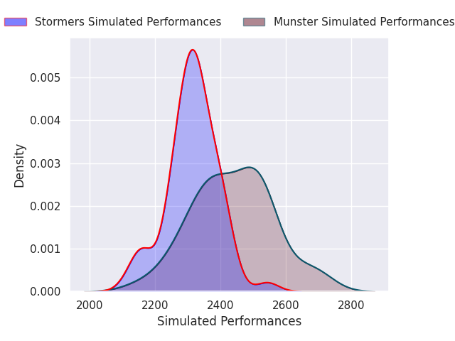
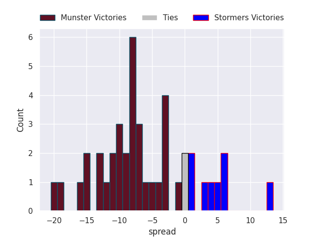
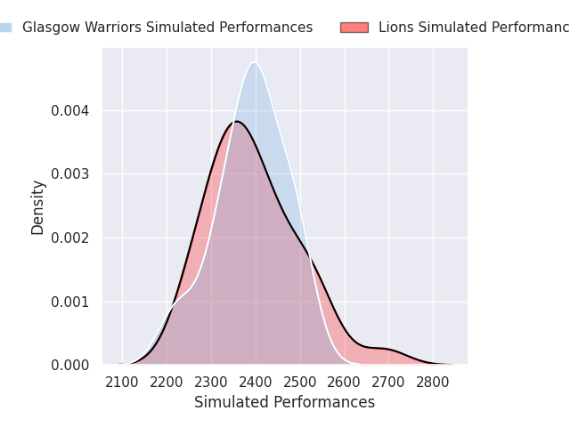
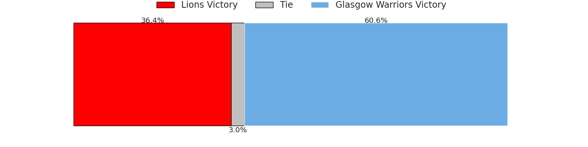
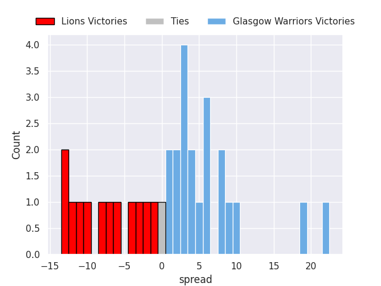
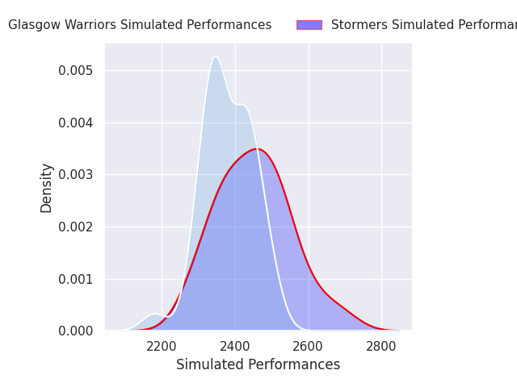
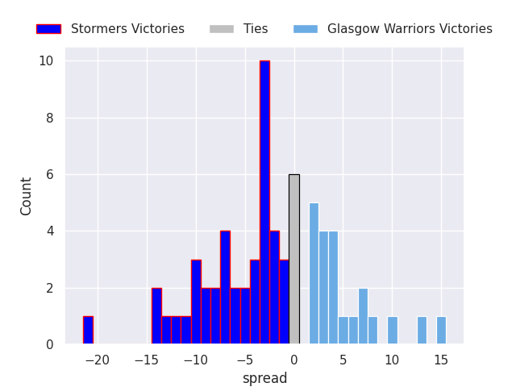
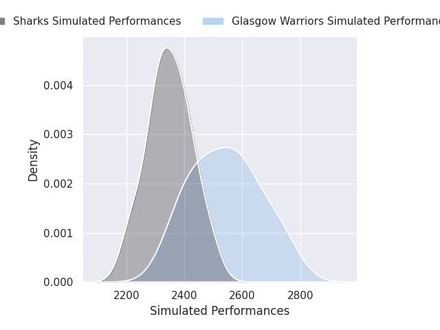
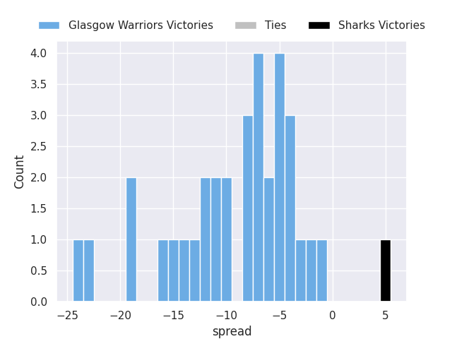

# Team Rankings

# Standings

## Current Standings

| Club             |   Played |   Wins |   Point Differential |   Losing Bonus Points |   Try Bonus Points |   Competition Points |
|:-----------------|---------:|-------:|---------------------:|----------------------:|-------------------:|---------------------:|
| Glasgow Warriors |       12 |      9 |                  150 |                     2 |                  7 |                   45 |
| Ulster           |       13 |      8 |                  104 |                     2 |                  7 |                   43 |
| Leinster         |       12 |      8 |                   66 |                     1 |                  8 |                   41 |
| Stormers         |       12 |      9 |                  112 |                     0 |                  4 |                   40 |
| Cardiff Rugby    |       12 |      8 |                   30 |                     3 |                  3 |                   38 |
| Munster          |       12 |      8 |                   23 |                     2 |                  4 |                   38 |
| Bulls            |       12 |      6 |                   21 |                     1 |                  5 |                   30 |
| Connacht         |       12 |      5 |                   -4 |                     4 |                  6 |                   30 |
| Ospreys          |       12 |      5 |                  -13 |                     1 |                  4 |                   29 |
| Lions            |       11 |      5 |                  -29 |                     2 |                  4 |                   28 |
| Edinburgh        |       13 |      4 |                  -15 |                     4 |                  3 |                   25 |
| Sharks           |       11 |      4 |                  -65 |                     1 |                  5 |                   24 |
| Benetton Treviso |       12 |      4 |                  -65 |                     1 |                  2 |                   23 |
| Dragons          |       12 |      2 |                  -59 |                     4 |                  2 |                   20 |
| Scarlets         |       12 |      3 |                  -88 |                     2 |                    |                   16 |
| Zebre            |       12 |      2 |                 -168 |                     2 |                  2 |                   12 |

## Projected Remaining Table

| Club             |   To Play |   Projected Wins |   Projected Differential |   Projected Losing Bonus Points | Projected Try Bonus Points   |   Projected Competition Points |
|:-----------------|----------:|-----------------:|-------------------------:|--------------------------------:|:-----------------------------|-------------------------------:|
| Sharks           |         8 |            4.023 |                    6.138 |                           1.885 |                              |                         18.791 |
| Lions            |         8 |            3.963 |                    1.707 |                           1.807 |                              |                         18.377 |
| Bulls            |         7 |            3.987 |                   16.761 |                           1.534 |                              |                         18.224 |
| Stormers         |         7 |            3.92  |                   14.677 |                           1.457 |                              |                         17.771 |
| Ulster           |         6 |            3.586 |                   16.017 |                           1.225 |                              |                         16.145 |
| Glasgow Warriors |         6 |            3.465 |                   16.208 |                           1.223 |                              |                         15.649 |
| Leinster         |         6 |            3.447 |                   19.56  |                           1.196 |                              |                         15.462 |
| Connacht         |         7 |            3.227 |                   -2.671 |                           1.7   |                              |                         15.254 |
| Scarlets         |         7 |            3.028 |                  -11.285 |                           1.602 |                              |                         14.352 |
| Munster          |         6 |            2.666 |                   -2.914 |                           1.609 |                              |                         12.905 |
| Edinburgh        |         6 |            2.705 |                   -4.32  |                           1.459 |                              |                         12.779 |
| Benetton Treviso |         6 |            2.568 |                   -7.887 |                           1.45  |                              |                         12.282 |
| Dragons          |         6 |            2.393 |                  -11.558 |                           1.542 |                              |                         11.752 |
| Cardiff Rugby    |         6 |            2.406 |                  -11.492 |                           1.556 |                              |                         11.706 |
| Ospreys          |         6 |            2.393 |                  -11.851 |                           1.465 |                              |                         11.575 |
| Zebre            |         6 |            1.79  |                  -27.09  |                           1.487 |                              |                          9.173 |

## Projected Total Table

| Club             |   Played |   Wins |   Point Differential |   Losing Bonus Points |   Try Bonus Points |   Competition Points |
|:-----------------|---------:|-------:|---------------------:|----------------------:|-------------------:|---------------------:|
| Glasgow Warriors |       18 | 12.465 |              166.208 |                 3.223 |                  7 |               60.649 |
| Ulster           |       19 | 11.586 |              120.017 |                 3.225 |                  7 |               59.145 |
| Stormers         |       19 | 12.92  |              126.677 |                 1.457 |                  4 |               57.771 |
| Leinster         |       18 | 11.447 |               85.56  |                 2.196 |                  8 |               56.462 |
| Munster          |       18 | 10.666 |               20.086 |                 3.609 |                  4 |               50.905 |
| Cardiff Rugby    |       18 | 10.406 |               18.508 |                 4.556 |                  3 |               49.706 |
| Bulls            |       19 |  9.987 |               37.761 |                 2.534 |                  5 |               48.224 |
| Lions            |       19 |  8.963 |              -27.293 |                 3.807 |                  4 |               46.377 |
| Connacht         |       19 |  8.227 |               -6.671 |                 5.7   |                  6 |               45.254 |
| Sharks           |       19 |  8.023 |              -58.862 |                 2.885 |                  5 |               42.791 |
| Ospreys          |       18 |  7.393 |              -24.851 |                 2.465 |                  4 |               40.575 |
| Edinburgh        |       19 |  6.705 |              -19.32  |                 5.459 |                  3 |               37.779 |
| Benetton Treviso |       18 |  6.568 |              -72.887 |                 2.45  |                  2 |               35.282 |
| Dragons          |       18 |  4.393 |              -70.558 |                 5.542 |                  2 |               31.752 |
| Scarlets         |       19 |  6.028 |              -99.285 |                 3.602 |                    |               30.352 |
| Zebre            |       18 |  3.79  |             -195.09  |                 3.487 |                  2 |               21.173 |

## Projected Playoff Results

|                  | Reach Quarterfinal   | Win Quarterfinal   | Reach Semifinal   | Win Semifinal   | Reach Final   | Win Final   |
|:-----------------|:---------------------|:-------------------|:------------------|:----------------|:--------------|:------------|
| Glasgow Warriors | 100.0 %              | 68.0 %             | 68.0 %            | 42.2 %          | 42.2 %        | 23.7 %      |
| Ulster           | 100.0 %              | 69.5 %             | 69.5 %            | 34.3 %          | 34.3 %        | 15.4 %      |
| Leinster         | 99.6 %               | 64.8 %             | 64.8 %            | 31.6 %          | 31.6 %        | 15.3 %      |
| Stormers         | 99.7 %               | 60.6 %             | 60.6 %            | 31.2 %          | 31.2 %        | 14.8 %      |
| Munster          | 87.8 %               | 40.7 %             | 40.7 %            | 17.4 %          | 17.4 %        | 7.8 %       |
| Bulls            | 76.6 %               | 24.4 %             | 24.4 %            | 10.2 %          | 10.2 %        | 5.7 %       |
| Connacht         | 52.3 %               | 15.3 %             | 15.3 %            | 8.5 %           | 8.5 %         | 5.1 %       |
| Lions            | 75.5 %               | 22.0 %             | 22.0 %            | 9.9 %           | 9.9 %         | 4.7 %       |
| Cardiff Rugby    | 82.2 %               | 25.6 %             | 25.6 %            | 9.9 %           | 9.9 %         | 4.5 %       |
| Sharks           | 10.2 %               | 4.2 %              | 4.2 %             | 2.3 %           | 2.3 %         | 1.6 %       |
| Ospreys          | 11.7 %               | 3.5 %              | 3.5 %             | 1.7 %           | 1.7 %         | 1.1 %       |
| Edinburgh        | 3.8 %                | 1.2 %              | 1.2 %             | 0.6 %           | 0.6 %         | 0.2 %       |
| Benetton Treviso | 0.6 %                | 0.2 %              | 0.2 %             | 0.2 %           | 0.2 %         | 0.1 %       |

# Completed Match Review

| Model | Percent Correct Predictions | Spread Error |
| ------ | ------ | ------ |
| Club Level | 63.9% | 8.6 |
| Player Level: Lineup | nan% | nan |
| Player Level: Minutes | nan% | nan |

# Future Predictions

## Week 14

### Connacht V Scarlets on 2025/10/04

Average Margin: Connacht by 4.7

## Week 15

### Lions V Sharks on 2025/12/25

Average Margin: Lions by 4.3

### Bulls V Stormers on 2025/12/25

Average Margin: Stormers by 1.3

## Week 16

### Lions V Sharks on 2026/02/21

Average Margin: Lions by 0.6

## Week 17

### Scarlets V Zebre on 2026/03/20

Average Margin: Scarlets by 4.4

### Bulls V Cardiff Rugby on 2026/03/20

Average Margin: Bulls by 5.1

### Ulster V Connacht on 2026/03/20

Average Margin: Ulster by 5.4

### Sharks V Munster on 2026/03/21

Average Margin: Sharks by 1.8

### Benetton Treviso V Ospreys on 2026/03/21

Average Margin: Benetton Treviso by 4.2

### Glasgow Warriors V Leinster on 2026/03/21

Average Margin: Glasgow Warriors by 3.2

### Stormers V Dragons on 2026/03/21

Average Margin: Stormers by 7.0

### Lions V Edinburgh on 2026/03/21

Average Margin: Lions by 4.0

## Week 18

### Glasgow Warriors V Benetton Treviso on 2026/03/27

Average Margin: Glasgow Warriors by 6.7

### Sharks V Cardiff Rugby on 2026/03/27

Average Margin: Sharks by 3.5

### Zebre V Ulster on 2026/03/28

Average Margin: Ulster by 4.0

### Bulls V Munster on 2026/03/28

Average Margin: Bulls by 2.5

### Lions V Dragons on 2026/03/28

Average Margin: Lions by 4.3

### Leinster V Scarlets on 2026/03/28

Average Margin: Leinster by 10.3

### Stormers V Edinburgh on 2026/03/28

Average Margin: Stormers by 6.2

### Connacht V Ospreys on 2026/03/28

Average Margin: Connacht by 4.5

## Week 19

### Dragons V Bulls on 2026/04/17

Average Margin: Dragons by 0.3

### Ulster V Leinster on 2026/04/17

Average Margin: Ulster by 2.0

### Edinburgh V Zebre on 2026/04/17

Average Margin: Edinburgh by 5.7

### Benetton Treviso V Munster on 2026/04/18

Average Margin: Benetton Treviso by 2.7

### Lions V Glasgow Warriors on 2026/04/18

Average Margin: Glasgow Warriors by 2.0

### Ospreys V Sharks on 2026/04/18

Average Margin: Ospreys by 2.2

### Stormers V Connacht on 2026/04/18

Average Margin: Stormers by 4.8

### Scarlets V Cardiff Rugby on 2026/04/18

Average Margin: Scarlets by 0.7

## Week 20

### Cardiff Rugby V Ospreys on 2026/04/24

Average Margin: Cardiff Rugby by 3.2

### Edinburgh V Sharks on 2026/04/24

Average Margin: Edinburgh by 1.2

### Zebre V Dragons on 2026/04/24

Average Margin: Zebre by 0.6

### Stormers V Glasgow Warriors on 2026/04/25

Average Margin: Stormers by 0.4

### Lions V Connacht on 2026/04/25

Average Margin: Lions by 2.0

### Munster V Ulster on 2026/04/25

Average Margin: Munster by 1.4

### Scarlets V Bulls on 2026/04/25

Average Margin: Scarlets by 0.5

### Benetton Treviso V Leinster on 2026/04/25

Average Margin: Leinster by 1.3

## Week 21

### Glasgow Warriors V Cardiff Rugby on 2026/05/08

Average Margin: Glasgow Warriors by 6.6

### Ulster V Stormers on 2026/05/08

Average Margin: Ulster by 3.9

### Ospreys V Scarlets on 2026/05/09

Average Margin: Ospreys by 4.7

### Sharks V Benetton Treviso on 2026/05/09

Average Margin: Sharks by 2.9

### Bulls V Zebre on 2026/05/09

Average Margin: Bulls by 7.4

### Connacht V Munster on 2026/05/09

Average Margin: Connacht by 2.3

### Leinster V Lions on 2026/05/09

Average Margin: Leinster by 6.4

### Dragons V Edinburgh on 2026/05/09

Average Margin: Dragons by 2.9

## Week 22

### Ulster V Glasgow Warriors on 2026/05/15

Average Margin: Ulster by 2.0

### Cardiff Rugby V Stormers on 2026/05/15

Average Margin: Cardiff Rugby by 1.2

### Edinburgh V Connacht on 2026/05/15

Average Margin: Edinburgh by 1.8

### Bulls V Benetton Treviso on 2026/05/16

Average Margin: Bulls by 3.9

### Scarlets V Dragons on 2026/05/16

Average Margin: Scarlets by 2.8

### Sharks V Zebre on 2026/05/16

Average Margin: Sharks by 6.2

### Leinster V Ospreys on 2026/05/16

Average Margin: Leinster by 6.8

### Munster V Lions on 2026/05/16

Average Margin: Munster by 5.0

## Week 23

### Leinster V Bulls on 2026-05-29

Average Margin: Leinster by 3.8

### Ulster V Glasgow Warriors on 2026-05-29

Average Margin: Glasgow Warriors by 0.4

### Bulls V Cardiff Rugby on 2026-05-29

Average Margin: Bulls by 2.0

### Bulls V Ospreys on 2026-05-29

Average Margin: Ospreys by 17.0

### Stormers V Ospreys on 2026-05-29

Average Margin: Ospreys by 3.7

### Glasgow Warriors V Ospreys on 2026-05-29

Average Margin: Ospreys by 7.0

### Stormers V Munster on 2026-05-29

Average Margin: Stormers by 2.5

### Stormers V Sharks on 2026-05-29

Average Margin: Sharks by 0.6

### Glasgow Warriors V Sharks on 2026-05-29

Average Margin: Sharks by 0.6

### Leinster V Munster on 2026-05-29

Average Margin: Leinster by 6.4

### Glasgow Warriors V Cardiff Rugby on 2026-05-29

Average Margin: Glasgow Warriors by 8.2

### Ulster V Sharks on 2026-05-29

Average Margin: Sharks by 0.3

### Munster V Ospreys on 2026-05-29

Average Margin: Munster by 14.0

### Stormers V Glasgow Warriors on 2026-05-29

Average Margin: Stormers by 31.0

### Leinster V Edinburgh on 2026-05-29

Average Margin: Leinster by 1.0

### Ulster V Stormers on 2026-05-29

Average Margin: Ulster by 7.7

### Glasgow Warriors V Benetton Treviso on 2026-05-29

Average Margin: Benetton Treviso by 3.0

### Cardiff Rugby V Bulls on 2026-05-29

Average Margin: Bulls by 4.0

### Munster V Edinburgh on 2026-05-29

Average Margin: Munster by 18.0

### Glasgow Warriors V Ulster on 2026-05-29

Average Margin: Glasgow Warriors by 4.0

### Stormers V Edinburgh on 2026-05-29

Average Margin: Stormers by 14.0

### Ulster V Ospreys on 2026-05-29

Average Margin: Ulster by 3.9

### Leinster V Sharks on 2026-05-29

Average Margin: Leinster by 1.0

### Munster V Bulls on 2026-05-29

Average Margin: Munster by 6.2

### Glasgow Warriors V Edinburgh on 2026-05-29

Average Margin: Glasgow Warriors by 20.0

### Leinster V Stormers on 2026-05-29

Average Margin: Leinster by 1.4

### Lions V Connacht on 2026-05-29

Average Margin: Connacht by 14.0

### Glasgow Warriors V Leinster on 2026-05-29

Average Margin: Glasgow Warriors by 4.1

### Cardiff Rugby V Lions on 2026-05-29

Average Margin: Cardiff Rugby by 1.4

### Bulls V Sharks on 2026-05-29

Average Margin: Bulls by 26.0

### Ulster V Connacht on 2026-05-29

Average Margin: Ulster by 1.6

### Bulls V Munster on 2026-05-29

Average Margin: Bulls by 6.0

### Glasgow Warriors V Connacht on 2026-05-29

Average Margin: Glasgow Warriors by 4.5

### Ulster V Edinburgh on 2026-05-29

Average Margin: Ulster by 10.0

### Ulster V Leinster on 2026-05-29

Average Margin: Ulster by 3.4

### Leinster V Cardiff Rugby on 2026-05-29

Average Margin: Leinster by 6.4

### Munster V Leinster on 2026-05-29

Average Margin: Munster by 0.6

### Leinster V Glasgow Warriors on 2026-05-29

Average Margin: Leinster by 3.6

### Glasgow Warriors V Lions on 2026-05-29

Average Margin: Glasgow Warriors by 2.5

### Stormers V Lions on 2026-05-29

Average Margin: Stormers by 0.4

### Munster V Stormers on 2026-05-29

Average Margin: Munster by 6.0

### Ulster V Munster on 2026-05-29

Average Margin: Ulster by 4.1

### Stormers V Bulls on 2026-05-29

Average Margin: Stormers by 3.5

### Leinster V Connacht on 2026-05-29

Average Margin: Leinster by 3.4

### Munster V Connacht on 2026-05-29

Average Margin: Munster by 5.4

### Ulster V Cardiff Rugby on 2026-05-29

Average Margin: Ulster by 4.5

### Stormers V Leinster on 2026-05-29

Average Margin: Stormers by 1.3

### Leinster V Lions on 2026-05-29

Average Margin: Leinster by 7.7

### Ulster V Benetton Treviso on 2026-05-29

Average Margin: Ulster by 13.0

### Stormers V Cardiff Rugby on 2026-05-29

Average Margin: Stormers by 3.6

### Cardiff Rugby V Glasgow Warriors on 2026-05-29

Average Margin: Cardiff Rugby by 4.9

### Stormers V Connacht on 2026-05-29

Average Margin: Stormers by 1.6

### Lions V Cardiff Rugby on 2026-05-29

Average Margin: Cardiff Rugby by 3.8

### Ulster V Bulls on 2026-05-29

Average Margin: Ulster by 6.1

### Munster V Lions on 2026-05-29

Average Margin: Munster by 6.2

### Glasgow Warriors V Munster on 2026-05-29

Average Margin: Glasgow Warriors by 5.7

### Munster V Cardiff Rugby on 2026-05-29

Average Margin: Munster by 3.2

### Leinster V Ospreys on 2026-05-29

Average Margin: Ospreys by 6.0

### Stormers V Ulster on 2026-05-29

Average Margin: Stormers by 0.8

### Glasgow Warriors V Stormers on 2026-05-29

Average Margin: Glasgow Warriors by 0.4

### Glasgow Warriors V Bulls on 2026-05-29

Average Margin: Glasgow Warriors by 6.0

### Connacht V Bulls on 2026-05-29

Average Margin: Connacht by 4.0

### Lions V Bulls on 2026-05-29

Average Margin: Bulls by 0.6

### Cardiff Rugby V Connacht on 2026-05-29

Average Margin: Cardiff Rugby by 4.8

### Ulster V Lions on 2026-05-29

Average Margin: Ulster by 7.7

### Stormers V Benetton Treviso on 2026-05-29

Average Margin: Stormers by 4.0

## Week 24

### Glasgow Warriors V Leinster on 2026-06-05

Average Margin: Glasgow Warriors by 4.2

### Stormers V Connacht on 2026-06-05

Average Margin: Stormers by 10.3

### Leinster V Ulster on 2026-06-05

Average Margin: Leinster by 3.7

### Stormers V Lions on 2026-06-05

Average Margin: Lions by 0.8

### Stormers V Ulster on 2026-06-05

Average Margin: Stormers by 2.0

### Munster V Ulster on 2026-06-05

Average Margin: Munster by 1.5

### Sharks V Stormers on 2026-06-05

Average Margin: Stormers by 2.0

### Ospreys V Lions on 2026-06-05

Average Margin: Ospreys by 2.0

### Ulster V Bulls on 2026-06-05

Average Margin: Ulster by 5.8

### Sharks V Munster on 2026-06-05

Average Margin: Munster by 3.7

### Connacht V Bulls on 2026-06-05

Average Margin: Bulls by 6.5

### Sharks V Lions on 2026-06-05

Average Margin: Sharks by 11.0

### Ospreys V Bulls on 2026-06-05

Average Margin: Ospreys by 4.0

### Edinburgh V Stormers on 2026-06-05

Average Margin: Stormers by 7.0

### Sharks V Glasgow Warriors on 2026-06-05

Average Margin: Sharks by 8.0

### Sharks V Ulster on 2026-06-05

Average Margin: Ulster by 2.0

### Edinburgh V Ulster on 2026-06-05

Average Margin: Edinburgh by 8.0

### Ospreys V Ulster on 2026-06-05

Average Margin: Ulster by 3.0

### Sharks V Bulls on 2026-06-05

Average Margin: Sharks by 1.0

### Munster V Glasgow Warriors on 2026-06-05

Average Margin: Glasgow Warriors by 2.3

### Leinster V Connacht on 2026-06-05

Average Margin: Leinster by 4.6

### Sharks V Connacht on 2026-06-05

Average Margin: Sharks by 23.0

### Ospreys V Connacht on 2026-06-05

Average Margin: Connacht by 2.0

### Cardiff Rugby V Lions on 2026-06-05

Average Margin: Cardiff Rugby by 8.2

### Stormers V Edinburgh on 2026-06-05

Average Margin: Stormers by 10.0

### Benetton Treviso V Munster on 2026-06-05

Average Margin: Benetton Treviso by 5.0

### Lions V Connacht on 2026-06-05

Average Margin: Connacht by 5.3

### Benetton Treviso V Stormers on 2026-06-05

Average Margin: Benetton Treviso by 6.0

### Bulls V Cardiff Rugby on 2026-06-05

Average Margin: Cardiff Rugby by 3.9

### Lions V Glasgow Warriors on 2026-06-05

Average Margin: Glasgow Warriors by 0.0

### Munster V Lions on 2026-06-05

Average Margin: Munster by 4.8

### Ulster V Connacht on 2026-06-05

Average Margin: Ulster by 9.1

### Munster V Stormers on 2026-06-05

Average Margin: Munster by 2.1

### Munster V Ospreys on 2026-06-05

Average Margin: Munster by 7.0

### Bulls V Sharks on 2026-06-05

Average Margin: Sharks by 7.5

### Bulls V Lions on 2026-06-05

Average Margin: Bulls by 2.4

### Glasgow Warriors V Stormers on 2026-06-05

Average Margin: Glasgow Warriors by 3.6

### Glasgow Warriors V Bulls on 2026-06-05

Average Margin: Glasgow Warriors by 5.8

### Ospreys V Cardiff Rugby on 2026-06-05

Average Margin: Ospreys by 2.5

### Connacht V Lions on 2026-06-05

Average Margin: Lions by 1.5

### Stormers V Bulls on 2026-06-05

Average Margin: Stormers by 3.0

### Lions V Leinster on 2026-06-05

Average Margin: Leinster by 1.0

### Cardiff Rugby V Munster on 2026-06-05

Average Margin: Munster by 2.0

### Lions V Bulls on 2026-06-05

Average Margin: Lions by 5.6

### Glasgow Warriors V Ulster on 2026-06-05

Average Margin: Glasgow Warriors by 5.9

### Lions V Cardiff Rugby on 2026-06-05

Average Margin: Lions by 4.4

### Lions V Munster on 2026-06-05

Average Margin: Munster by 2.6

### Ulster V Munster on 2026-06-05

Average Margin: Ulster by 4.9

### Connacht V Cardiff Rugby on 2026-06-05

Average Margin: Connacht by 9.1

### Lions V Ulster on 2026-06-05

Average Margin: Ulster by 0.3

### Glasgow Warriors V Cardiff Rugby on 2026-06-05

Average Margin: Glasgow Warriors by 4.5

### Glasgow Warriors V Munster on 2026-06-05

Average Margin: Glasgow Warriors by 4.2

### Glasgow Warriors V Lions on 2026-06-05

Average Margin: Glasgow Warriors by 8.6

### Stormers V Glasgow Warriors on 2026-06-05

Average Margin: Stormers by 0.4

### Sharks V Leinster on 2026-06-05

Average Margin: Sharks by 4.0

### Bulls V Leinster on 2026-06-05

Average Margin: Bulls by 1.2

### Stormers V Leinster on 2026-06-05

Average Margin: Leinster by 0.8

### Bulls V Glasgow Warriors on 2026-06-05

Average Margin: Bulls by 1.2

### Edinburgh V Leinster on 2026-06-05

Average Margin: Leinster by 5.0

### Connacht V Stormers on 2026-06-05

Average Margin: Connacht by 1.9

### Ulster V Leinster on 2026-06-05

Average Margin: Ulster by 4.2

### Connacht V Munster on 2026-06-05

Average Margin: Connacht by 6.3

### Connacht V Glasgow Warriors on 2026-06-05

Average Margin: Glasgow Warriors by 0.7

### Stormers V Cardiff Rugby on 2026-06-05

Average Margin: Stormers by 3.0

### Connacht V Ulster on 2026-06-05

Average Margin: Connacht by 4.3

### Leinster V Cardiff Rugby on 2026-06-05

Average Margin: Leinster by 3.5

### Connacht V Leinster on 2026-06-05

Average Margin: Connacht by 3.4

### Bulls V Munster on 2026-06-05

Average Margin: Bulls by 2.5

### Cardiff Rugby V Bulls on 2026-06-05

Average Margin: Cardiff Rugby by 0.3

### Bulls V Ulster on 2026-06-05

Average Margin: Bulls by 5.4

### Lions V Stormers on 2026-06-05

Average Margin: Lions by 2.1

### Stormers V Munster on 2026-06-05

Average Margin: Stormers by 3.4

### Ospreys V Munster on 2026-06-05

Average Margin: Ospreys by 7.0

### Ospreys V Leinster on 2026-06-05

Average Margin: Ospreys by 2.1

### Ospreys V Glasgow Warriors on 2026-06-05

Average Margin: Ospreys by 6.8

### Ulster V Stormers on 2026-06-05

Average Margin: Ulster by 3.3

### Ulster V Cardiff Rugby on 2026-06-05

Average Margin: Ulster by 7.0

### Munster V Leinster on 2026-06-05

Average Margin: Munster by 1.0

### Cardiff Rugby V Sharks on 2026-06-05

Average Margin: Cardiff Rugby by 7.5

## Final

### Glasgow Warriors V Munster on 2026-06-19

Average Margin: Glasgow Warriors by 3.7

### Ulster V Sharks on 2026-06-19

Average Margin: Sharks by 4.7

### Lions V Cardiff Rugby on 2026-06-19

Average Margin: Cardiff Rugby by 2.0

### Connacht V Glasgow Warriors on 2026-06-19

Average Margin: Connacht by 7.1

### Cardiff Rugby V Leinster on 2026-06-19

Average Margin: Leinster by 2.6

### Munster V Ulster on 2026-06-19

Average Margin: Munster by 2.5

### Stormers V Connacht on 2026-06-19

Average Margin: Stormers by 4.7

### Connacht V Lions on 2026-06-19

Average Margin: Connacht by 12.2

### Edinburgh V Stormers on 2026-06-19

Average Margin: Edinburgh by 7.0

### Connacht V Ulster on 2026-06-19

Average Margin: Connacht by 2.1

### Connacht V Benetton Treviso on 2026-06-19

Average Margin: Connacht by 5.0

### Bulls V Lions on 2026-06-19

Average Margin: Bulls by 5.8

### Edinburgh V Ulster on 2026-06-19

Average Margin: Ulster by 4.0

### Cardiff Rugby V Glasgow Warriors on 2026-06-19

Average Margin: Cardiff Rugby by 2.0

### Sharks V Stormers on 2026-06-19

Average Margin: Sharks by 5.7

### Connacht V Edinburgh on 2026-06-19

Average Margin: Connacht by 15.0

### Edinburgh V Leinster on 2026-06-19

Average Margin: Leinster by 3.5

### Glasgow Warriors V Sharks on 2026-06-19

Average Margin: Sharks by 2.0

### Stormers V Cardiff Rugby on 2026-06-19

Average Margin: Stormers by 0.7

### Connacht V Bulls on 2026-06-19

Average Margin: Connacht by 2.1

### Glasgow Warriors V Edinburgh on 2026-06-19

Average Margin: Glasgow Warriors by 24.0

### Ospreys V Leinster on 2026-06-19

Average Margin: Ospreys by 2.6

### Ospreys V Ulster on 2026-06-19

Average Margin: Ospreys by 25.0

### Connacht V Munster on 2026-06-19

Average Margin: Connacht by 4.4

### Ospreys V Lions on 2026-06-19

Average Margin: Lions by 1.5

### Ospreys V Bulls on 2026-06-19

Average Margin: Bulls by 13.0

### Ospreys V Connacht on 2026-06-19

Average Margin: Ospreys by 9.0

### Bulls V Benetton Treviso on 2026-06-19

Average Margin: Benetton Treviso by 7.0

### Cardiff Rugby V Sharks on 2026-06-19

Average Margin: Sharks by 4.0

### Connacht V Cardiff Rugby on 2026-06-19

Average Margin: Connacht by 2.8

### Bulls V Munster on 2026-06-19

Average Margin: Bulls by 5.5

### Glasgow Warriors V Stormers on 2026-06-19

Average Margin: Glasgow Warriors by 5.7

### Leinster V Glasgow Warriors on 2026-06-19

Average Margin: Leinster by 3.6

### Bulls V Stormers on 2026-06-19

Average Margin: Bulls by 2.5

### Sharks V Lions on 2026-06-19

Average Margin: Sharks by 20.0

### Stormers V Leinster on 2026-06-19

Average Margin: Stormers by 3.6

### Glasgow Warriors V Ulster on 2026-06-19

Average Margin: Glasgow Warriors by 5.0

### Cardiff Rugby V Munster on 2026-06-19

Average Margin: Munster by 1.0

### Bulls V Sharks on 2026-06-19

Average Margin: Sharks by 2.0

### Lions V Stormers on 2026-06-19

Average Margin: Lions by 1.7

### Ulster V Leinster on 2026-06-19

Average Margin: Ulster by 4.4

### Lions V Ulster on 2026-06-19

Average Margin: Lions by 1.0

### Cardiff Rugby V Ulster on 2026-06-19

Average Margin: Ulster by 1.0

### Leinster V Sharks on 2026-06-19

Average Margin: Leinster by 5.5

### Lions V Leinster on 2026-06-19

Average Margin: Leinster by 0.0

### Lions V Munster on 2026-06-19

Average Margin: Munster by 3.2

### Connacht V Leinster on 2026-06-19

Average Margin: Connacht by 0.6

### Stormers V Munster on 2026-06-19

Average Margin: Stormers by 4.2

### Stormers V Ulster on 2026-06-19

Average Margin: Stormers by 1.3

### Bulls V Leinster on 2026-06-19

Average Margin: Bulls by 2.7

### Bulls V Ulster on 2026-06-19

Average Margin: Bulls by 3.4

### Glasgow Warriors V Bulls on 2026-06-19

Average Margin: Glasgow Warriors by 5.0

### Munster V Sharks on 2026-06-19

Average Margin: Sharks by 5.5

### Leinster V Munster on 2026-06-19

Average Margin: Leinster by 3.5

### Glasgow Warriors V Lions on 2026-06-19

Average Margin: Glasgow Warriors by 5.9

### Ospreys V Glasgow Warriors on 2026-06-19

Average Margin: Ospreys by 4.7

### Ospreys V Stormers on 2026-06-19

Average Margin: Ospreys by 7.3

### Cardiff Rugby V Bulls on 2026-06-19

Average Margin: Cardiff Rugby by 1.0

### Ospreys V Munster on 2026-06-19

Average Margin: Ospreys by 1.0

