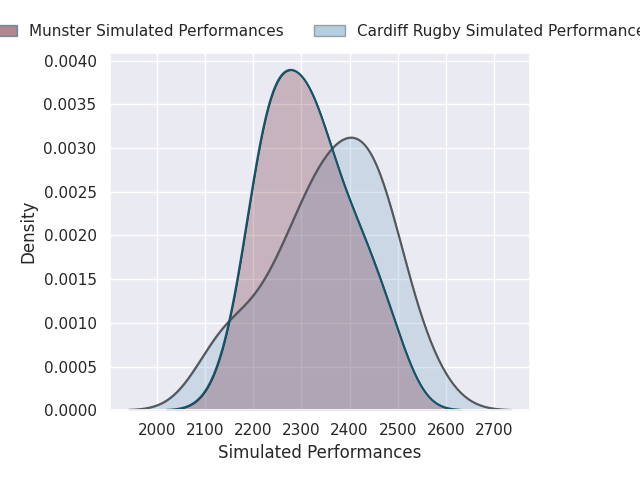
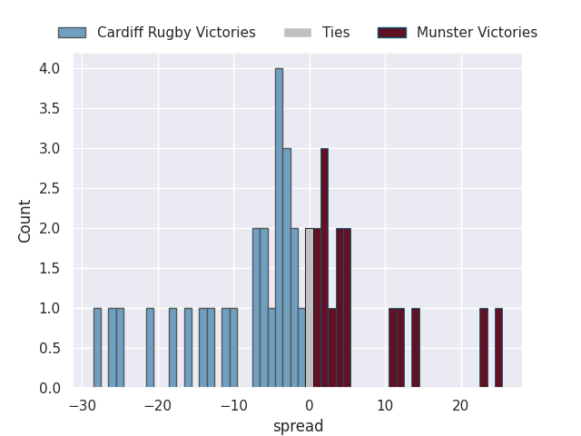
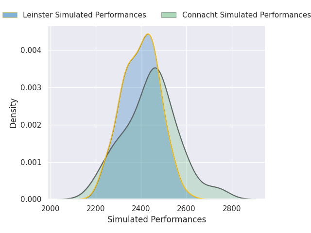
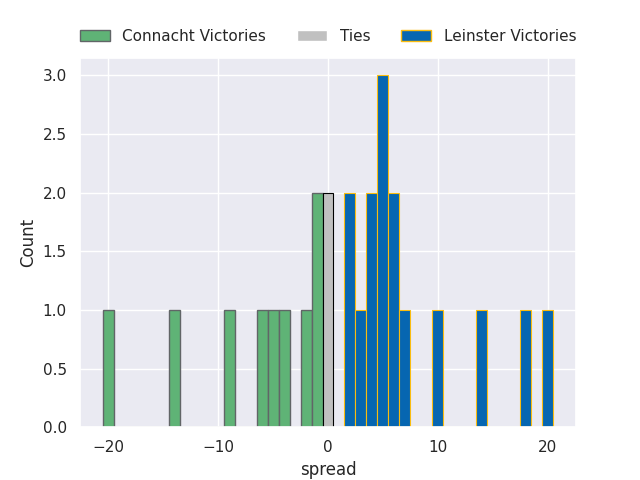
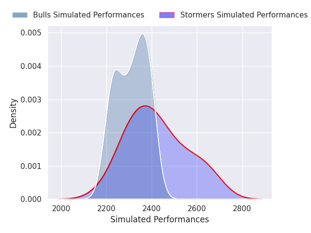
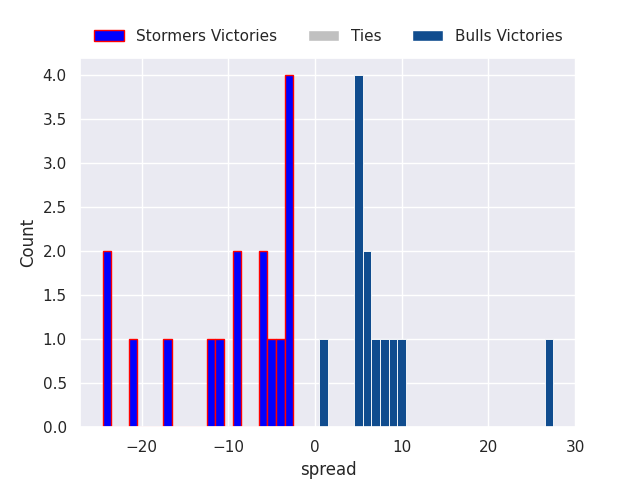
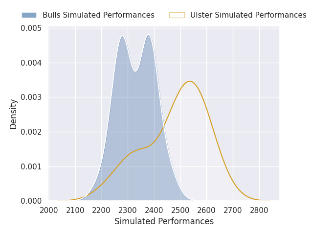
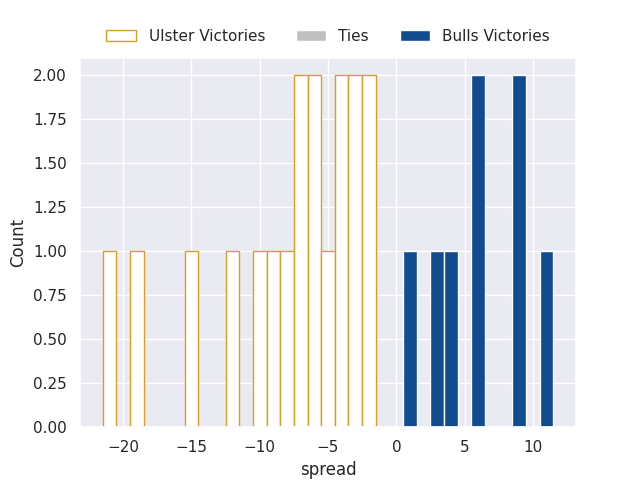

# Team Rankings

# Standings

## Current Standings

| Club             |   Played |   Wins |   Point Differential |   Losing Bonus Points |   Try Bonus Points |   Competition Points |
|:-----------------|---------:|-------:|---------------------:|----------------------:|-------------------:|---------------------:|
| Glasgow Warriors |       14 |     11 |                  192 |                     2 |                  9 |                   55 |
| Stormers         |       14 |     11 |                  139 |                     0 |                  6 |                   50 |
| Ulster           |       15 |      9 |                  113 |                     3 |                  8 |                   49 |
| Leinster         |       14 |      9 |                   62 |                     1 |                  9 |                   46 |
| Bulls            |       14 |      8 |                   57 |                     1 |                  7 |                   40 |
| Munster          |       14 |      8 |                  -25 |                     3 |                  5 |                   40 |
| Connacht         |       14 |      7 |                   10 |                     4 |                  7 |                   39 |
| Cardiff Rugby    |       14 |      8 |                   -9 |                     4 |                  3 |                   39 |
| Lions            |       13 |      7 |                   24 |                     2 |                  6 |                   38 |
| Sharks           |       13 |      6 |                  -14 |                     1 |                  6 |                   33 |
| Ospreys          |       14 |      5 |                  -32 |                     2 |                  4 |                   30 |
| Benetton Treviso |       14 |      5 |                  -74 |                     1 |                  3 |                   28 |
| Edinburgh        |       15 |      4 |                  -71 |                     4 |                  3 |                   25 |
| Dragons          |       14 |      2 |                  -83 |                     4 |                  3 |                   21 |
| Scarlets         |       14 |      4 |                  -86 |                     2 |                  1 |                   21 |
| Zebre            |       14 |      2 |                 -203 |                     2 |                  2 |                   12 |

## Projected Remaining Table

| Club             |   To Play |   Projected Wins |   Projected Differential |   Projected Losing Bonus Points | Projected Try Bonus Points   |   Projected Competition Points |
|:-----------------|----------:|-----------------:|-------------------------:|--------------------------------:|:-----------------------------|-------------------------------:|
| Sharks           |         6 |            3.178 |                    7.632 |                           1.281 |                              |                         14.571 |
| Bulls            |         5 |            2.817 |                   12.689 |                           1.078 |                              |                         12.812 |
| Lions            |         6 |            2.634 |                   -5.303 |                           1.486 |                              |                         12.612 |
| Stormers         |         5 |            2.503 |                    2.638 |                           1.246 |                              |                         11.73  |
| Connacht         |         5 |            2.418 |                    1.405 |                           1.219 |                              |                         11.393 |
| Scarlets         |         5 |            2.295 |                   -2.934 |                           1.249 |                              |                         10.893 |
| Leinster         |         4 |            2.319 |                   11.702 |                           0.807 |                              |                         10.455 |
| Glasgow Warriors |         4 |            2.183 |                    8.282 |                           0.897 |                              |                         10.025 |
| Ulster           |         4 |            2.121 |                    4.495 |                           0.957 |                              |                          9.893 |
| Edinburgh        |         4 |            1.939 |                    2.174 |                           0.993 |                              |                          9.173 |
| Dragons          |         4 |            1.85  |                   -0.712 |                           1.077 |                              |                          8.921 |
| Munster          |         4 |            1.819 |                   -1.127 |                           1.036 |                              |                          8.778 |
| Cardiff Rugby    |         4 |            1.709 |                   -6.161 |                           0.965 |                              |                          8.185 |
| Ospreys          |         4 |            1.685 |                   -5.992 |                           0.933 |                              |                          8.073 |
| Benetton Treviso |         4 |            1.607 |                   -6.497 |                           1.042 |                              |                          7.898 |
| Zebre            |         4 |            1.126 |                  -22.291 |                           0.898 |                              |                          5.752 |

## Projected Total Table

| Club             |   Played |   Wins |   Point Differential |   Losing Bonus Points |   Try Bonus Points |   Competition Points |
|:-----------------|---------:|-------:|---------------------:|----------------------:|-------------------:|---------------------:|
| Glasgow Warriors |       18 | 13.183 |              200.282 |                 2.897 |                  9 |               65.025 |
| Stormers         |       19 | 13.503 |              141.638 |                 1.246 |                  6 |               61.73  |
| Ulster           |       19 | 11.121 |              117.495 |                 3.957 |                  8 |               58.893 |
| Leinster         |       18 | 11.319 |               73.702 |                 1.807 |                  9 |               56.455 |
| Bulls            |       19 | 10.817 |               69.689 |                 2.078 |                  7 |               52.812 |
| Lions            |       19 |  9.634 |               18.697 |                 3.486 |                  6 |               50.612 |
| Connacht         |       19 |  9.418 |               11.405 |                 5.219 |                  7 |               50.393 |
| Munster          |       18 |  9.819 |              -26.127 |                 4.036 |                  5 |               48.778 |
| Sharks           |       19 |  9.178 |               -6.368 |                 2.281 |                  6 |               47.571 |
| Cardiff Rugby    |       18 |  9.709 |              -15.161 |                 4.965 |                  3 |               47.185 |
| Ospreys          |       18 |  6.685 |              -37.992 |                 2.933 |                  4 |               38.073 |
| Benetton Treviso |       18 |  6.607 |              -80.497 |                 2.042 |                  3 |               35.898 |
| Edinburgh        |       19 |  5.939 |              -68.826 |                 4.993 |                  3 |               34.173 |
| Scarlets         |       19 |  6.295 |              -88.934 |                 3.249 |                  1 |               31.893 |
| Dragons          |       18 |  3.85  |              -83.712 |                 5.077 |                  3 |               29.921 |
| Zebre            |       18 |  3.126 |             -225.291 |                 2.898 |                  2 |               17.752 |

## Projected Playoff Results

|                  | Reach Quarterfinal   | Win Quarterfinal   | Reach Semifinal   | Win Semifinal   | Reach Final   | Win Final   |
|:-----------------|:---------------------|:-------------------|:------------------|:----------------|:--------------|:------------|
| Glasgow Warriors | 100.0 %              | 70.6 %             | 70.6 %            | 45.1 %          | 45.1 %        | 30.2 %      |
| Leinster         | 99.1 %               | 65.4 %             | 65.4 %            | 28.2 %          | 28.2 %        | 15.6 %      |
| Stormers         | 100.0 %              | 65.9 %             | 65.9 %            | 38.4 %          | 38.4 %        | 14.2 %      |
| Ulster           | 99.9 %               | 59.4 %             | 59.4 %            | 25.8 %          | 25.8 %        | 11.0 %      |
| Connacht         | 84.6 %               | 35.0 %             | 35.0 %            | 14.4 %          | 14.4 %        | 7.2 %       |
| Bulls            | 90.7 %               | 30.0 %             | 30.0 %            | 12.6 %          | 12.6 %        | 6.0 %       |
| Lions            | 84.8 %               | 27.2 %             | 27.2 %            | 12.1 %          | 12.1 %        | 4.5 %       |
| Sharks           | 41.9 %               | 15.3 %             | 15.3 %            | 8.5 %           | 8.5 %         | 4.5 %       |
| Munster          | 58.3 %               | 18.8 %             | 18.8 %            | 9.3 %           | 9.3 %         | 4.3 %       |
| Cardiff Rugby    | 40.3 %               | 12.3 %             | 12.3 %            | 5.5 %           | 5.5 %         | 2.4 %       |
| Ospreys          | 0.4 %                | 0.1 %              | 0.1 %             | 0.1 %           | 0.1 %         | 0.1 %       |

# Completed Match Review

| Model | Percent Correct Predictions | Spread Error |
| ------ | ------ | ------ |
| Club Level | 60.9% | 9.9 |
| Player Level: Lineup | nan% | nan |
| Player Level: Minutes | nan% | nan |

# Future Predictions

## Week 16

### Connacht V Scarlets on 2025/10/04

Average Margin: Connacht by 4.0

## Week 17

### Bulls V Stormers on 2025/12/25

Average Margin: Stormers by 0.8

### Lions V Sharks on 2025/12/25

Average Margin: Lions by 4.6

## Week 18

### Lions V Sharks on 2026/02/21

Average Margin: Lions by 0.1

## Week 19

### Dragons V Bulls on 2026/04/17

Average Margin: Bulls by 0.8

### Edinburgh V Zebre on 2026/04/17

Average Margin: Edinburgh by 5.9

### Ulster V Leinster on 2026/04/17

Average Margin: Ulster by 1.9

### Benetton Treviso V Munster on 2026/04/18

Average Margin: Benetton Treviso by 2.3

### Lions V Glasgow Warriors on 2026/04/18

Average Margin: Glasgow Warriors by 2.3

### Scarlets V Cardiff Rugby on 2026/04/18

Average Margin: Scarlets by 1.9

### Ospreys V Sharks on 2026/04/18

Average Margin: Ospreys by 0.2

### Stormers V Connacht on 2026/04/18

Average Margin: Stormers by 4.0

## Week 20

### Cardiff Rugby V Ospreys on 2026/04/24

Average Margin: Cardiff Rugby by 3.3

### Edinburgh V Sharks on 2026/04/24

Average Margin: Sharks by 0.9

### Zebre V Dragons on 2026/04/24

Average Margin: Dragons by 0.2

### Scarlets V Bulls on 2026/04/25

Average Margin: Scarlets by 0.2

### Lions V Connacht on 2026/04/25

Average Margin: Lions by 2.0

### Stormers V Glasgow Warriors on 2026/04/25

Average Margin: Stormers by 0.3

### Benetton Treviso V Leinster on 2026/04/25

Average Margin: Leinster by 0.5

### Munster V Ulster on 2026/04/25

Average Margin: Munster by 1.1

## Week 21

### Glasgow Warriors V Cardiff Rugby on 2026/05/08

Average Margin: Glasgow Warriors by 7.3

### Ulster V Stormers on 2026/05/08

Average Margin: Ulster by 2.7

### Ospreys V Scarlets on 2026/05/09

Average Margin: Ospreys by 4.3

### Connacht V Munster on 2026/05/09

Average Margin: Connacht by 3.7

### Leinster V Lions on 2026/05/09

Average Margin: Leinster by 5.9

### Bulls V Zebre on 2026/05/09

Average Margin: Bulls by 8.3

### Dragons V Edinburgh on 2026/05/09

Average Margin: Dragons by 3.2

### Sharks V Benetton Treviso on 2026/05/09

Average Margin: Sharks by 3.8

## Week 22

### Edinburgh V Connacht on 2026/05/15

Average Margin: Edinburgh by 0.3

### Cardiff Rugby V Stormers on 2026/05/15

Average Margin: Stormers by 0.3

### Ulster V Glasgow Warriors on 2026/05/15

Average Margin: Ulster by 1.1

### Leinster V Ospreys on 2026/05/16

Average Margin: Leinster by 7.1

### Munster V Lions on 2026/05/16

Average Margin: Munster by 3.8

### Scarlets V Dragons on 2026/05/16

Average Margin: Scarlets by 3.3

### Bulls V Benetton Treviso on 2026/05/16

Average Margin: Bulls by 4.5

### Sharks V Zebre on 2026/05/16

Average Margin: Sharks by 7.9

## Week 23

### Stormers V Connacht on 2026-05-29

Average Margin: Stormers by 3.4

### Connacht V Cardiff Rugby on 2026-05-29

Average Margin: Cardiff Rugby by 5.0

### Connacht V Munster on 2026-05-29

Average Margin: Connacht by 7.0

### Lions V Connacht on 2026-05-29

Average Margin: Connacht by 2.0

### Leinster V Ulster on 2026-05-29

Average Margin: Leinster by 6.7

### Munster V Bulls on 2026-05-29

Average Margin: Munster by 4.2

### Connacht V Sharks on 2026-05-29

Average Margin: Sharks by 3.0

### Bulls V Connacht on 2026-05-29

Average Margin: Bulls by 5.3

### Lions V Sharks on 2026-05-29

Average Margin: Lions by 11.0

### Cardiff Rugby V Munster on 2026-05-29

Average Margin: Munster by 1.0

### Connacht V Lions on 2026-05-29

Average Margin: Connacht by 7.3

### Lions V Bulls on 2026-05-29

Average Margin: Lions by 1.7

### Lions V Munster on 2026-05-29

Average Margin: Lions by 6.0

### Bulls V Sharks on 2026-05-29

Average Margin: Sharks by 19.0

### Munster V Sharks on 2026-05-29

Average Margin: Munster by 8.0

### Stormers V Ospreys on 2026-05-29

Average Margin: Stormers by 13.0

### Glasgow Warriors V Ospreys on 2026-05-29

Average Margin: Glasgow Warriors by 4.0

### Bulls V Ulster on 2026-05-29

Average Margin: Bulls by 2.5

### Connacht V Bulls on 2026-05-29

Average Margin: Connacht by 3.6

### Connacht V Leinster on 2026-05-29

Average Margin: Connacht by 0.6

### Connacht V Ulster on 2026-05-29

Average Margin: Connacht by 2.8

### Connacht V Stormers on 2026-05-29

Average Margin: Connacht by 5.0

### Connacht V Glasgow Warriors on 2026-05-29

Average Margin: Glasgow Warriors by 1.3

### Bulls V Munster on 2026-05-29

Average Margin: Bulls by 8.9

### Munster V Cardiff Rugby on 2026-05-29

Average Margin: Cardiff Rugby by 12.0

### Sharks V Lions on 2026-05-29

Average Margin: Lions by 1.0

### Leinster V Bulls on 2026-05-29

Average Margin: Leinster by 10.0

### Cardiff Rugby V Bulls on 2026-05-29

Average Margin: Cardiff Rugby by 4.0

### Glasgow Warriors V Ulster on 2026-05-29

Average Margin: Glasgow Warriors by 13.0

### Glasgow Warriors V Munster on 2026-05-29

Average Margin: Glasgow Warriors by 2.5

### Stormers V Munster on 2026-05-29

Average Margin: Stormers by 2.6

### Stormers V Bulls on 2026-05-29

Average Margin: Stormers by 5.3

### Stormers V Cardiff Rugby on 2026-05-29

Average Margin: Stormers by 3.7

### Stormers V Lions on 2026-05-29

Average Margin: Stormers by 3.7

### Ulster V Bulls on 2026-05-29

Average Margin: Ulster by 4.0

### Glasgow Warriors V Bulls on 2026-05-29

Average Margin: Glasgow Warriors by 7.4

### Stormers V Sharks on 2026-05-29

Average Margin: Stormers by 1.7

### Ulster V Lions on 2026-05-29

Average Margin: Ulster by 7.7

### Leinster V Sharks on 2026-05-29

Average Margin: Leinster by 2.8

### Glasgow Warriors V Connacht on 2026-05-29

Average Margin: Glasgow Warriors by 6.7

### Ulster V Munster on 2026-05-29

Average Margin: Ulster by 5.6

### Glasgow Warriors V Leinster on 2026-05-29

Average Margin: Glasgow Warriors by 5.3

### Glasgow Warriors V Sharks on 2026-05-29

Average Margin: Glasgow Warriors by 5.8

### Leinster V Cardiff Rugby on 2026-05-29

Average Margin: Leinster by 10.3

### Ulster V Sharks on 2026-05-29

Average Margin: Ulster by 3.6

### Stormers V Leinster on 2026-05-29

Average Margin: Stormers by 4.7

### Ulster V Connacht on 2026-05-29

Average Margin: Ulster by 5.6

### Leinster V Connacht on 2026-05-29

Average Margin: Leinster by 4.5

### Glasgow Warriors V Lions on 2026-05-29

Average Margin: Glasgow Warriors by 4.5

### Leinster V Lions on 2026-05-29

Average Margin: Leinster by 9.3

### Ulster V Leinster on 2026-05-29

Average Margin: Ulster by 1.6

### Stormers V Ulster on 2026-05-29

Average Margin: Ulster by 4.8

### Ulster V Cardiff Rugby on 2026-05-29

Average Margin: Ulster by 8.0

### Glasgow Warriors V Cardiff Rugby on 2026-05-29

Average Margin: Glasgow Warriors by 7.5

### Leinster V Munster on 2026-05-29

Average Margin: Leinster by 4.1

### Lions V Cardiff Rugby on 2026-05-29

Average Margin: Cardiff Rugby by 0.0

### Leinster V Glasgow Warriors on 2026-05-29

Average Margin: Glasgow Warriors by 1.0

## Week 24

### Glasgow Warriors V Leinster on 2026-06-05

Average Margin: Glasgow Warriors by 3.9

### Bulls V Cardiff Rugby on 2026-06-05

Average Margin: Cardiff Rugby by 1.5

### Ulster V Bulls on 2026-06-05

Average Margin: Ulster by 4.2

### Leinster V Bulls on 2026-06-05

Average Margin: Leinster by 3.6

### Cardiff Rugby V Stormers on 2026-06-05

Average Margin: Cardiff Rugby by 3.5

### Cardiff Rugby V Lions on 2026-06-05

Average Margin: Cardiff Rugby by 0.4

### Cardiff Rugby V Connacht on 2026-06-05

Average Margin: Cardiff Rugby by 6.0

### Sharks V Stormers on 2026-06-05

Average Margin: Stormers by 7.4

### Connacht V Leinster on 2026-06-05

Average Margin: Connacht by 4.2

### Glasgow Warriors V Sharks on 2026-06-05

Average Margin: Sharks by 13.0

### Sharks V Ulster on 2026-06-05

Average Margin: Sharks by 4.2

### Cardiff Rugby V Munster on 2026-06-05

Average Margin: Cardiff Rugby by 13.0

### Ospreys V Ulster on 2026-06-05

Average Margin: Ospreys by 6.0

### Connacht V Ulster on 2026-06-05

Average Margin: Ulster by 0.5

### Bulls V Munster on 2026-06-05

Average Margin: Bulls by 2.1

### Ulster V Glasgow Warriors on 2026-06-05

Average Margin: Ulster by 0.1

### Bulls V Leinster on 2026-06-05

Average Margin: Bulls by 5.3

### Stormers V Sharks on 2026-06-05

Average Margin: Sharks by 0.8

### Bulls V Ulster on 2026-06-05

Average Margin: Bulls by 1.1

### Bulls V Sharks on 2026-06-05

Average Margin: Bulls by 2.8

### Connacht V Glasgow Warriors on 2026-06-05

Average Margin: Connacht by 5.4

### Lions V Munster on 2026-06-05

Average Margin: Lions by 13.5

### Connacht V Munster on 2026-06-05

Average Margin: Connacht by 4.6

### Sharks V Munster on 2026-06-05

Average Margin: Munster by 12.0

### Glasgow Warriors V Cardiff Rugby on 2026-06-05

Average Margin: Glasgow Warriors by 10.5

### Connacht V Bulls on 2026-06-05

Average Margin: Connacht by 2.6

### Ulster V Cardiff Rugby on 2026-06-05

Average Margin: Ulster by 3.1

### Sharks V Lions on 2026-06-05

Average Margin: Lions by 3.5

### Stormers V Lions on 2026-06-05

Average Margin: Stormers by 4.0

### Munster V Glasgow Warriors on 2026-06-05

Average Margin: Munster by 3.9

### Lions V Ulster on 2026-06-05

Average Margin: Ulster by 3.0

### Munster V Lions on 2026-06-05

Average Margin: Munster by 6.2

### Glasgow Warriors V Lions on 2026-06-05

Average Margin: Glasgow Warriors by 5.5

### Glasgow Warriors V Bulls on 2026-06-05

Average Margin: Glasgow Warriors by 4.5

### Munster V Bulls on 2026-06-05

Average Margin: Bulls by 0.2

### Glasgow Warriors V Ulster on 2026-06-05

Average Margin: Glasgow Warriors by 5.5

### Stormers V Leinster on 2026-06-05

Average Margin: Stormers by 2.9

### Stormers V Munster on 2026-06-05

Average Margin: Stormers by 6.2

### Glasgow Warriors V Connacht on 2026-06-05

Average Margin: Glasgow Warriors by 6.2

### Stormers V Bulls on 2026-06-05

Average Margin: Stormers by 1.3

### Glasgow Warriors V Stormers on 2026-06-05

Average Margin: Glasgow Warriors by 9.0

### Cardiff Rugby V Leinster on 2026-06-05

Average Margin: Leinster by 0.5

### Ulster V Connacht on 2026-06-05

Average Margin: Ulster by 6.8

### Stormers V Ulster on 2026-06-05

Average Margin: Stormers by 6.2

### Sharks V Leinster on 2026-06-05

Average Margin: Sharks by 3.3

### Munster V Ulster on 2026-06-05

Average Margin: Munster by 1.0

### Bulls V Connacht on 2026-06-05

Average Margin: Bulls by 5.4

### Lions V Leinster on 2026-06-05

Average Margin: Lions by 2.8

### Sharks V Connacht on 2026-06-05

Average Margin: Connacht by 0.2

### Cardiff Rugby V Ulster on 2026-06-05

Average Margin: Cardiff Rugby by 3.1

### Lions V Sharks on 2026-06-05

Average Margin: Lions by 4.9

### Lions V Connacht on 2026-06-05

Average Margin: Lions by 3.5

### Munster V Leinster on 2026-06-05

Average Margin: Munster by 0.7

### Lions V Bulls on 2026-06-05

Average Margin: Lions by 5.3

### Ulster V Leinster on 2026-06-05

Average Margin: Ulster by 1.6

### Munster V Connacht on 2026-06-05

Average Margin: Munster by 3.0

### Stormers V Connacht on 2026-06-05

Average Margin: Stormers by 5.8

### Cardiff Rugby V Glasgow Warriors on 2026-06-05

Average Margin: Cardiff Rugby by 4.3

### Glasgow Warriors V Munster on 2026-06-05

Average Margin: Glasgow Warriors by 2.9

### Sharks V Bulls on 2026-06-05

Average Margin: Sharks by 2.2

### Munster V Cardiff Rugby on 2026-06-05

Average Margin: Cardiff Rugby by 0.0

## Final

### Glasgow Warriors V Connacht on 2026-06-19

Average Margin: Glasgow Warriors by 5.0

### Leinster V Lions on 2026-06-19

Average Margin: Leinster by 5.5

### Connacht V Sharks on 2026-06-19

Average Margin: Connacht by 4.2

### Bulls V Connacht on 2026-06-19

Average Margin: Connacht by 0.8

### Cardiff Rugby V Leinster on 2026-06-19

Average Margin: Leinster by 0.0

### Stormers V Bulls on 2026-06-19

Average Margin: Stormers by 2.8

### Sharks V Leinster on 2026-06-19

Average Margin: Sharks by 2.2

### Lions V Connacht on 2026-06-19

Average Margin: Lions by 2.8

### Cardiff Rugby V Lions on 2026-06-19

Average Margin: Cardiff Rugby by 7.2

### Lions V Bulls on 2026-06-19

Average Margin: Lions by 1.0

### Cardiff Rugby V Stormers on 2026-06-19

Average Margin: Cardiff Rugby by 2.3

### Sharks V Munster on 2026-06-19

Average Margin: Sharks by 8.3

### Cardiff Rugby V Munster on 2026-06-19

Average Margin: Munster by 0.5

### Leinster V Munster on 2026-06-19

Average Margin: Leinster by 4.2

### Connacht V Ulster on 2026-06-19

Average Margin: Connacht by 3.9

### Cardiff Rugby V Sharks on 2026-06-19

Average Margin: Sharks by 17.0

### Cardiff Rugby V Ulster on 2026-06-19

Average Margin: Ulster by 0.4

### Sharks V Lions on 2026-06-19

Average Margin: Sharks by 0.3

### Cardiff Rugby V Bulls on 2026-06-19

Average Margin: Bulls by 5.6

### Bulls V Sharks on 2026-06-19

Average Margin: Bulls by 7.5

### Sharks V Ulster on 2026-06-19

Average Margin: Sharks by 9.1

### Munster V Ulster on 2026-06-19

Average Margin: Munster by 5.0

### Munster V Lions on 2026-06-19

Average Margin: Munster by 3.6

### Stormers V Lions on 2026-06-19

Average Margin: Stormers by 2.4

### Leinster V Stormers on 2026-06-19

Average Margin: Leinster by 2.9

### Glasgow Warriors V Munster on 2026-06-19

Average Margin: Glasgow Warriors by 5.8

### Glasgow Warriors V Cardiff Rugby on 2026-06-19

Average Margin: Glasgow Warriors by 5.4

### Glasgow Warriors V Leinster on 2026-06-19

Average Margin: Glasgow Warriors by 3.6

### Munster V Stormers on 2026-06-19

Average Margin: Munster by 3.0

### Glasgow Warriors V Stormers on 2026-06-19

Average Margin: Glasgow Warriors by 6.0

### Stormers V Ulster on 2026-06-19

Average Margin: Stormers by 0.2

### Bulls V Leinster on 2026-06-19

Average Margin: Leinster by 0.1

### Glasgow Warriors V Ulster on 2026-06-19

Average Margin: Glasgow Warriors by 3.0

### Cardiff Rugby V Connacht on 2026-06-19

Average Margin: Cardiff Rugby by 2.0

### Glasgow Warriors V Sharks on 2026-06-19

Average Margin: Glasgow Warriors by 4.9

### Leinster V Ulster on 2026-06-19

Average Margin: Leinster by 3.2

### Ulster V Bulls on 2026-06-19

Average Margin: Ulster by 5.0

### Sharks V Stormers on 2026-06-19

Average Margin: Sharks by 4.3

### Leinster V Connacht on 2026-06-19

Average Margin: Leinster by 3.3

### Connacht V Stormers on 2026-06-19

Average Margin: Connacht by 3.6

### Glasgow Warriors V Lions on 2026-06-19

Average Margin: Glasgow Warriors by 7.6

### Lions V Ulster on 2026-06-19

Average Margin: Ulster by 1.8

### Bulls V Munster on 2026-06-19

Average Margin: Munster by 5.7

### Connacht V Munster on 2026-06-19

Average Margin: Munster by 0.5

### Bulls V Glasgow Warriors on 2026-06-19

Average Margin: Bulls by 1.8

### Ospreys V Stormers on 2026-06-19

Average Margin: Ospreys by 4.0

