# Team Rankings

# Standings

## Current Standings

| Club             |   Played |   Wins |   Point Differential |   Losing Bonus Points |   Try Bonus Points |   Competition Points |
|:-----------------|---------:|-------:|---------------------:|----------------------:|-------------------:|---------------------:|
| Glasgow Warriors |       10 |      8 |                  146 |                     1 |                  6 |                   39 |
| Stormers         |        9 |      8 |                  125 |                     0 |                  4 |                   36 |
| Leinster         |       10 |      7 |                   59 |                     0 |                  7 |                   35 |
| Ulster           |       10 |      6 |                   87 |                     2 |                  6 |                   34 |
| Cardiff Rugby    |       10 |      7 |                   36 |                     2 |                  3 |                   33 |
| Munster          |       10 |      7 |                   18 |                     2 |                  3 |                   33 |
| Lions            |        9 |      4 |                   -8 |                     2 |                  4 |                   24 |
| Ospreys          |       10 |      3 |                  -30 |                     1 |                  4 |                   21 |
| Edinburgh        |       10 |      3 |                    9 |                     4 |                  2 |                   20 |
| Bulls            |        9 |      4 |                  -30 |                     1 |                  3 |                   20 |
| Benetton Treviso |       10 |      4 |                  -65 |                     1 |                  2 |                   19 |
| Sharks           |        9 |      3 |                  -48 |                     1 |                  3 |                   18 |
| Dragons          |       10 |      2 |                  -53 |                     3 |                  2 |                   17 |
| Connacht         |        9 |      2 |                  -42 |                     4 |                  4 |                   16 |
| Scarlets         |        9 |      3 |                  -66 |                     1 |                    |                   13 |
| Zebre            |       10 |      2 |                 -138 |                     2 |                  2 |                   12 |

## Projected Remaining Table

| Club             |   To Play |   Projected Wins |   Projected Differential |   Projected Losing Bonus Points | Projected Try Bonus Points   |   Projected Competition Points |
|:-----------------|----------:|-----------------:|-------------------------:|--------------------------------:|:-----------------------------|-------------------------------:|
| Bulls            |        10 |            5.762 |                   22.488 |                           2.219 |                              |                         26.273 |
| Stormers         |        10 |            5.452 |                   18.827 |                           2.345 |                              |                         25.177 |
| Lions            |        10 |            5.037 |                    3.959 |                           2.361 |                              |                         23.457 |
| Sharks           |        10 |            4.662 |                    0.082 |                           2.723 |                              |                         22.445 |
| Leinster         |         8 |            4.979 |                   34.731 |                           1.508 |                              |                         22.098 |
| Glasgow Warriors |         8 |            4.728 |                   22.842 |                           1.679 |                              |                         21.417 |
| Ulster           |         8 |            4.574 |                   16.835 |                           1.818 |                              |                         20.94  |
| Connacht         |         9 |            3.896 |                   -8.18  |                           2.349 |                              |                         18.925 |
| Edinburgh        |         8 |            3.936 |                    0.141 |                           1.68  |                              |                         18.142 |
| Munster          |         8 |            3.784 |                    2.691 |                           2.013 |                              |                         17.991 |
| Scarlets         |         9 |            3.689 |                  -18.166 |                           2.103 |                              |                         17.675 |
| Benetton Treviso |         8 |            3.692 |                   -2.158 |                           1.995 |                              |                         17.561 |
| Ospreys          |         8 |            3.421 |                  -11.277 |                           1.958 |                              |                         16.374 |
| Cardiff Rugby    |         8 |            2.791 |                  -24.099 |                           2.117 |                              |                         14.043 |
| Dragons          |         8 |            2.712 |                  -25.059 |                           2.255 |                              |                         13.867 |
| Zebre            |         8 |            2.535 |                  -33.657 |                           2.058 |                              |                         12.796 |

## Projected Total Table

| Club             |   Played |   Wins |   Point Differential |   Losing Bonus Points |   Try Bonus Points |   Competition Points |
|:-----------------|---------:|-------:|---------------------:|----------------------:|-------------------:|---------------------:|
| Stormers         |       19 | 13.452 |              143.827 |                 2.345 |                  4 |               61.177 |
| Glasgow Warriors |       18 | 12.728 |              168.842 |                 2.679 |                  6 |               60.417 |
| Leinster         |       18 | 11.979 |               93.731 |                 1.508 |                  7 |               57.098 |
| Ulster           |       18 | 10.574 |              103.835 |                 3.818 |                  6 |               54.94  |
| Munster          |       18 | 10.784 |               20.691 |                 4.013 |                  3 |               50.991 |
| Lions            |       19 |  9.037 |               -4.041 |                 4.361 |                  4 |               47.457 |
| Cardiff Rugby    |       18 |  9.791 |               11.901 |                 4.117 |                  3 |               47.043 |
| Bulls            |       19 |  9.762 |               -7.512 |                 3.219 |                  3 |               46.273 |
| Sharks           |       19 |  7.662 |              -47.918 |                 3.723 |                  3 |               40.445 |
| Edinburgh        |       18 |  6.936 |                9.141 |                 5.68  |                  2 |               38.142 |
| Ospreys          |       18 |  6.421 |              -41.277 |                 2.958 |                  4 |               37.374 |
| Benetton Treviso |       18 |  7.692 |              -67.158 |                 2.995 |                  2 |               36.561 |
| Connacht         |       18 |  5.896 |              -50.18  |                 6.349 |                  4 |               34.925 |
| Dragons          |       18 |  4.712 |              -78.059 |                 5.255 |                  2 |               30.867 |
| Scarlets         |       18 |  6.689 |              -84.166 |                 3.103 |                    |               30.675 |
| Zebre            |       18 |  4.535 |             -171.657 |                 4.058 |                  2 |               24.796 |

# Completed Match Review

| Model | Percent Correct Predictions | Spread Error |
| ------ | ------ | ------ |
| Club Level | 63.7% | 10.5 |
| Player Level: Lineup | nan% | nan |
| Player Level: Minutes | nan% | nan |

# Future Predictions

## Week 11

### Connacht V Scarlets on 2025/10/04

Average Margin: Connacht by 4.2

## Week 12

### Bulls V Stormers on 2025/12/25

Average Margin: Bulls by 1.3

### Lions V Sharks on 2025/12/25

Average Margin: Lions by 3.5

## Week 13

### Benetton Treviso V Scarlets on 2026/01/30

Average Margin: Benetton Treviso by 5.3

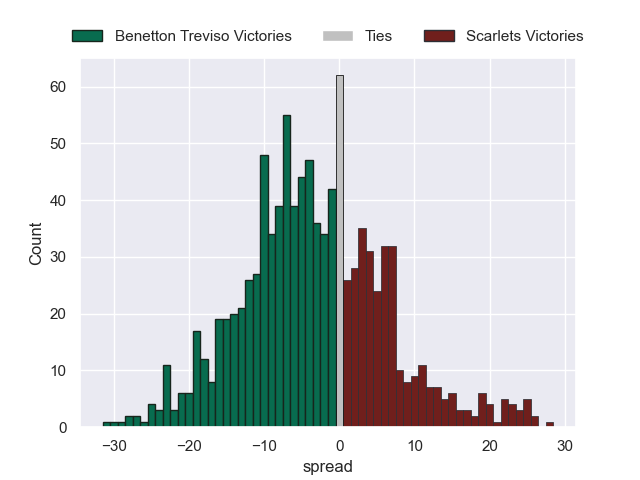

### Glasgow Warriors V Munster on 2026/01/30

Average Margin: Glasgow Warriors by 5.5

### Ulster V Cardiff Rugby on 2026/01/31

Average Margin: Ulster by 6.5

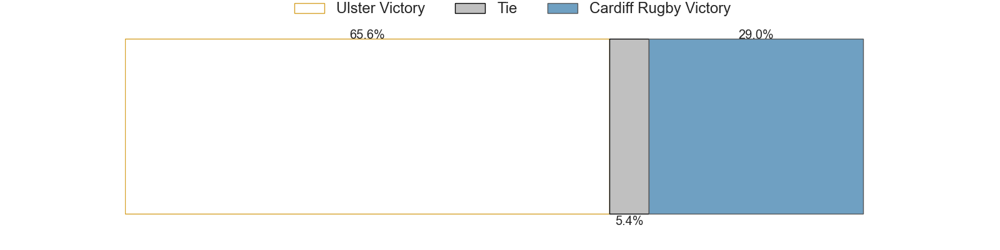

### Ospreys V Dragons on 2026/01/31

Average Margin: Ospreys by 5.0

### Leinster V Edinburgh on 2026/01/31

Average Margin: Leinster by 8.3

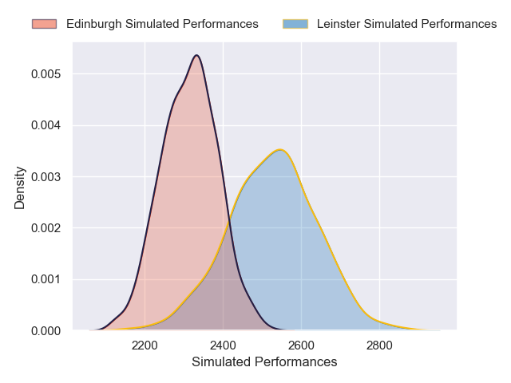

### Zebre V Connacht on 2026/01/31

Average Margin: Connacht by 1.0

### Sharks V Stormers on 2026/01/31

Average Margin: Stormers by 0.6

### Lions V Bulls on 2026/01/31

Average Margin: Lions by 1.7

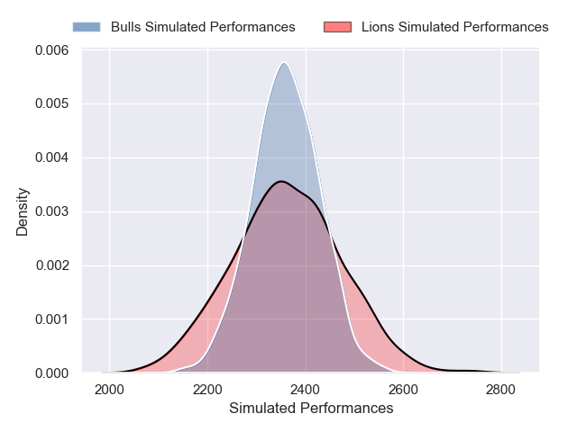

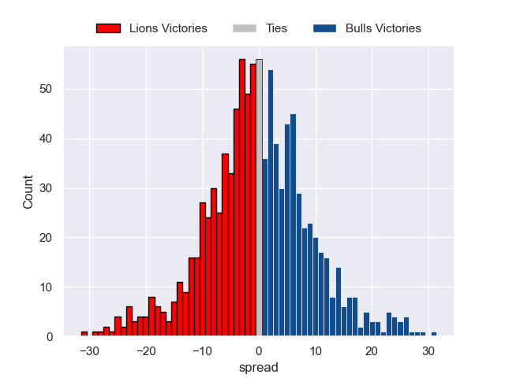

## Week 14

### Lions V Sharks on 2026/02/21

Average Margin: Lions by 1.8

## Week 15

### Edinburgh V Scarlets on 2026/02/27

Average Margin: Edinburgh by 5.7

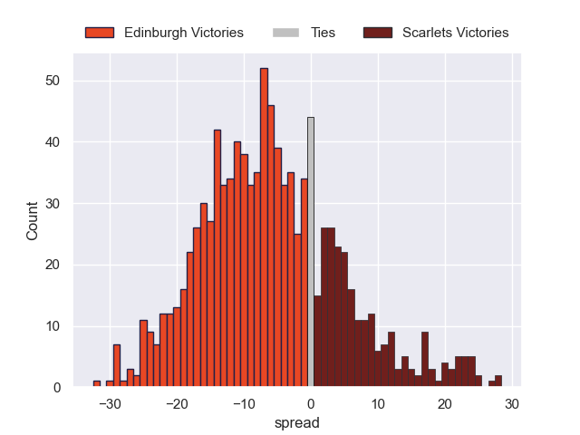

### Cardiff Rugby V Leinster on 2026/02/27

Average Margin: Leinster by 3.5

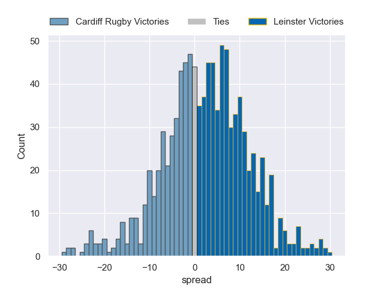

### Munster V Zebre on 2026/02/28

Average Margin: Munster by 8.0

### Ospreys V Ulster on 2026/02/28

Average Margin: Ulster by 0.6

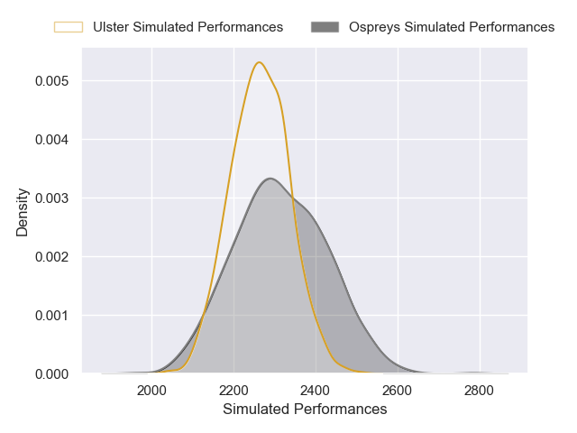

### Lions V Stormers on 2026/02/28

Average Margin: Stormers by 0.7

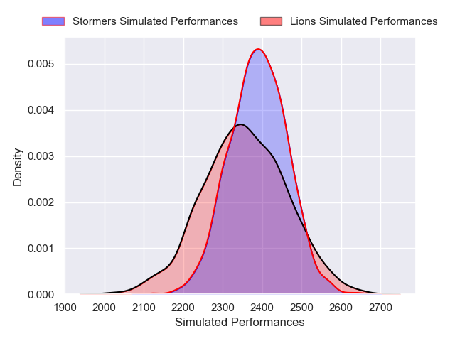

### Dragons V Benetton Treviso on 2026/02/28

Average Margin: Benetton Treviso by 0.8

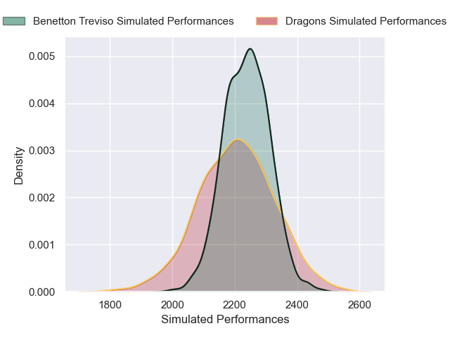

### Bulls V Sharks on 2026/02/28

Average Margin: Bulls by 3.2

### Connacht V Glasgow Warriors on 2026/02/28

Average Margin: Glasgow Warriors by 0.9

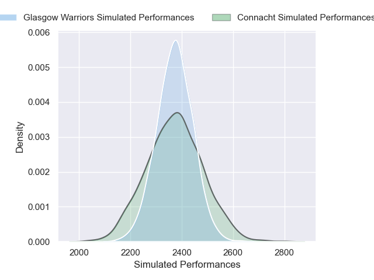

## Week 16

### Bulls V Stormers on 2026/03/14

Average Margin: Bulls by 0.9

## Week 17

### Scarlets V Zebre on 2026/03/20

Average Margin: Scarlets by 5.1

### Ulster V Connacht on 2026/03/20

Average Margin: Ulster by 5.3

### Bulls V Cardiff Rugby on 2026/03/20

Average Margin: Bulls by 4.7

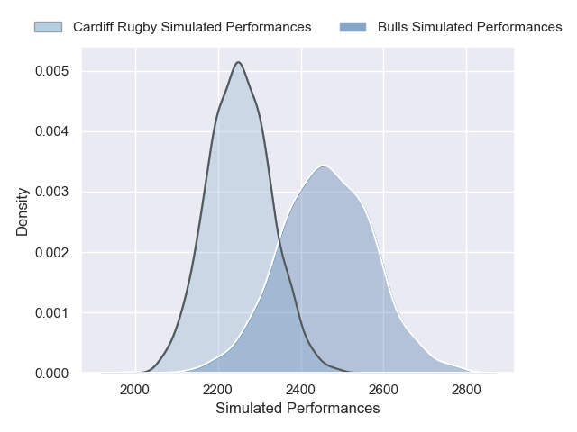

### Stormers V Dragons on 2026/03/21

Average Margin: Stormers by 8.1

### Lions V Edinburgh on 2026/03/21

Average Margin: Lions by 3.1

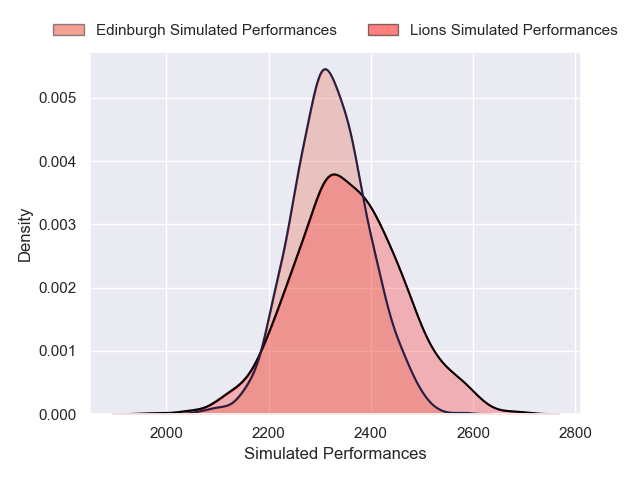

### Glasgow Warriors V Leinster on 2026/03/21

Average Margin: Glasgow Warriors by 2.4

### Sharks V Munster on 2026/03/21

Average Margin: Sharks by 1.1

### Benetton Treviso V Ospreys on 2026/03/21

Average Margin: Benetton Treviso by 4.0

## Week 18

### Sharks V Cardiff Rugby on 2026/03/27

Average Margin: Sharks by 3.7

### Glasgow Warriors V Benetton Treviso on 2026/03/27

Average Margin: Glasgow Warriors by 7.3

### Zebre V Ulster on 2026/03/28

Average Margin: Ulster by 2.5

### Lions V Dragons on 2026/03/28

Average Margin: Lions by 5.1

### Stormers V Edinburgh on 2026/03/28

Average Margin: Stormers by 6.2

### Connacht V Ospreys on 2026/03/28

Average Margin: Connacht by 4.1

### Leinster V Scarlets on 2026/03/28

Average Margin: Leinster by 9.2

### Bulls V Munster on 2026/03/28

Average Margin: Bulls by 2.6

## Week 19

### Ulster V Leinster on 2026/04/17

Average Margin: Ulster by 0.8

### Dragons V Bulls on 2026/04/17

Average Margin: Bulls by 0.6

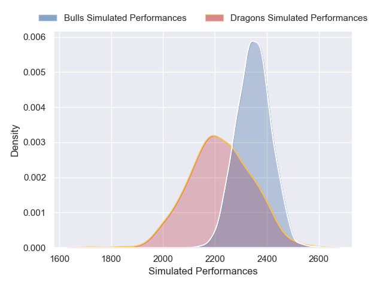

### Edinburgh V Zebre on 2026/04/17

Average Margin: Edinburgh by 6.3

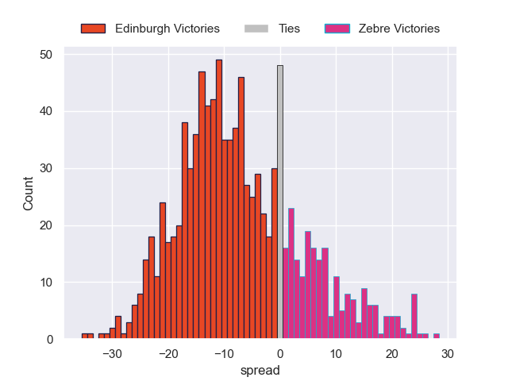

### Stormers V Connacht on 2026/04/18

Average Margin: Stormers by 6.2

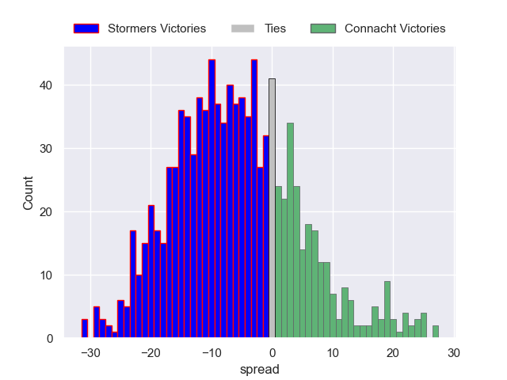

### Benetton Treviso V Munster on 2026/04/18

Average Margin: Benetton Treviso by 1.9

### Scarlets V Cardiff Rugby on 2026/04/18

Average Margin: Scarlets by 1.2

### Lions V Glasgow Warriors on 2026/04/18

Average Margin: Glasgow Warriors by 1.2

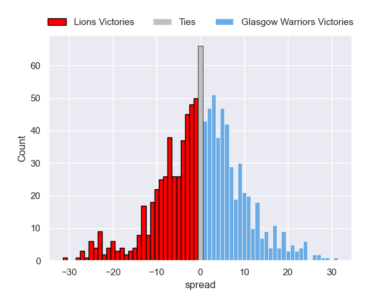

### Ospreys V Sharks on 2026/04/18

Average Margin: Ospreys by 1.1

## Week 20

### Cardiff Rugby V Ospreys on 2026/04/24

Average Margin: Cardiff Rugby by 3.6

### Zebre V Dragons on 2026/04/24

Average Margin: Zebre by 2.0

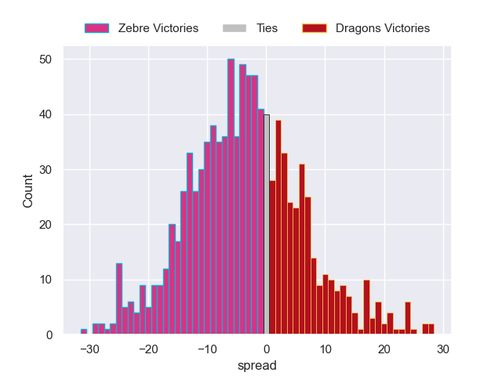

### Edinburgh V Sharks on 2026/04/24

Average Margin: Edinburgh by 2.5

### Lions V Connacht on 2026/04/25

Average Margin: Lions by 3.1

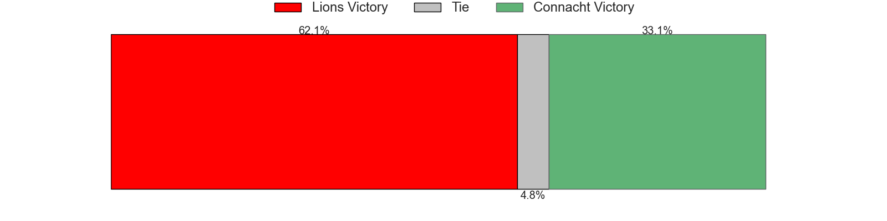

### Stormers V Glasgow Warriors on 2026/04/25

Average Margin: Stormers by 1.2

### Munster V Ulster on 2026/04/25

Average Margin: Munster by 2.3

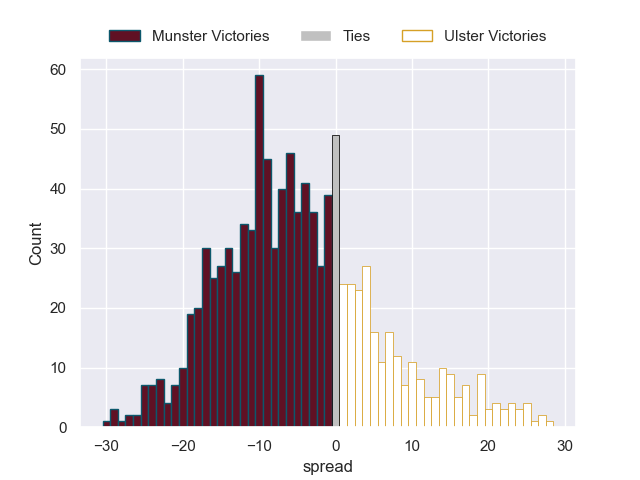

### Scarlets V Bulls on 2026/04/25

Average Margin: Bulls by 0.2

### Benetton Treviso V Leinster on 2026/04/25

Average Margin: Leinster by 1.1

## Week 21

### Ulster V Stormers on 2026/05/08

Average Margin: Ulster by 2.7

### Glasgow Warriors V Cardiff Rugby on 2026/05/08

Average Margin: Glasgow Warriors by 7.6

### Sharks V Benetton Treviso on 2026/05/09

Average Margin: Sharks by 2.2

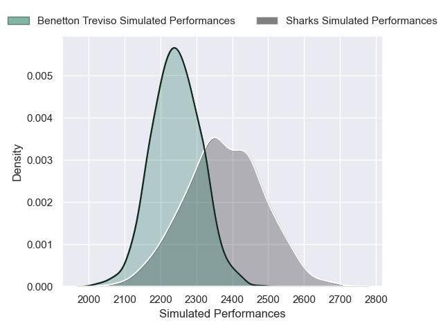

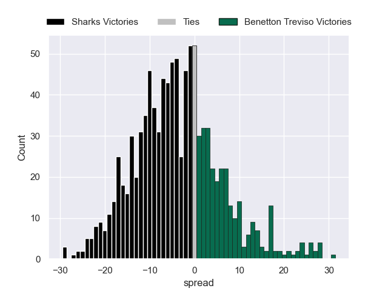

### Ospreys V Scarlets on 2026/05/09

Average Margin: Ospreys by 3.2

### Connacht V Munster on 2026/05/09

Average Margin: Connacht by 1.3

### Dragons V Edinburgh on 2026/05/09

Average Margin: Edinburgh by 0.0

### Leinster V Lions on 2026/05/09

Average Margin: Leinster by 7.6

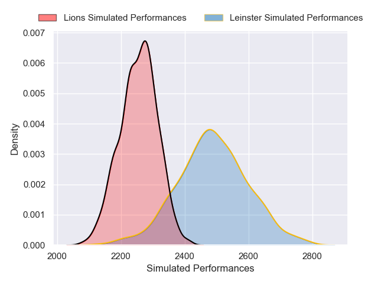

### Bulls V Zebre on 2026/05/09

Average Margin: Bulls by 7.2

## Week 22

### Edinburgh V Connacht on 2026/05/15

Average Margin: Edinburgh by 3.3

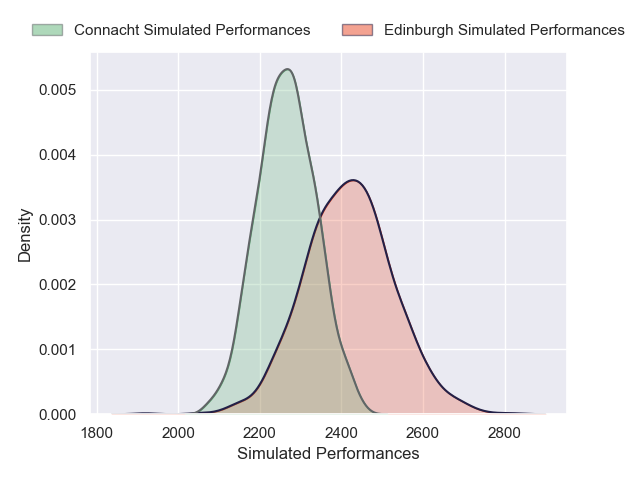

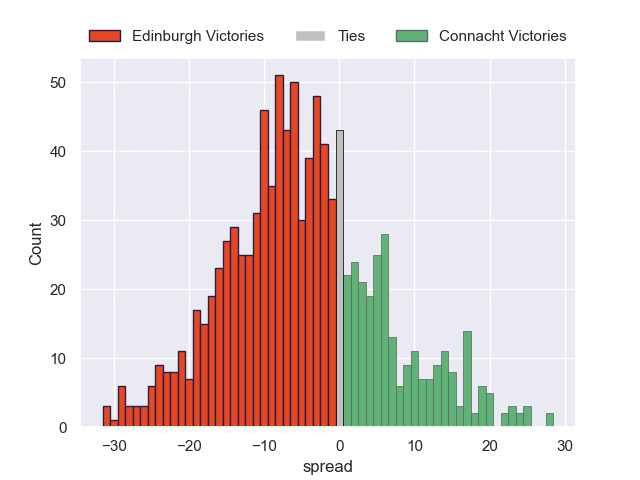

### Ulster V Glasgow Warriors on 2026/05/15

Average Margin: Ulster by 0.8

### Cardiff Rugby V Stormers on 2026/05/15

Average Margin: Stormers by 0.7

### Scarlets V Dragons on 2026/05/16

Average Margin: Scarlets by 3.4

### Leinster V Ospreys on 2026/05/16

Average Margin: Leinster by 8.3

### Bulls V Benetton Treviso on 2026/05/16

Average Margin: Bulls by 3.5

### Sharks V Zebre on 2026/05/16

Average Margin: Sharks by 5.7

### Munster V Lions on 2026/05/16

Average Margin: Munster by 4.8

