# Team Rankings

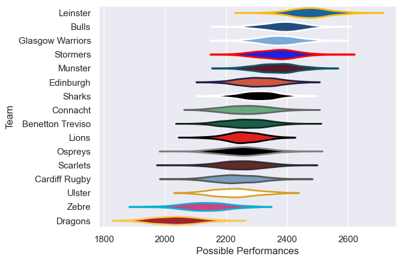
# Standings

## Current Standings

| Club             |   Played |   Wins |   Point Differential |   Losing Bonus Points |   Try Bonus Points |   Competition Points |
|:-----------------|---------:|-------:|---------------------:|----------------------:|-------------------:|---------------------:|
| Stormers         |        8 |      8 |                  136 |                     0 |                  4 |                   36 |
| Glasgow Warriors |        9 |      7 |                  141 |                     1 |                  5 |                   34 |
| Ulster           |        9 |      6 |                   92 |                     1 |                  6 |                   33 |
| Leinster         |        9 |      6 |                   48 |                     0 |                  6 |                   30 |
| Cardiff Rugby    |        9 |      6 |                   27 |                     2 |                  3 |                   29 |
| Munster          |        9 |      6 |                   16 |                     2 |                  3 |                   29 |
| Lions            |        8 |      4 |                   -8 |                     2 |                  3 |                   21 |
| Edinburgh        |        9 |      3 |                   11 |                     3 |                  2 |                   19 |
| Benetton Treviso |        9 |      4 |                  -56 |                     1 |                  2 |                   19 |
| Ospreys          |        9 |      3 |                  -30 |                     1 |                  3 |                   18 |
| Connacht         |        8 |      2 |                  -31 |                     4 |                  4 |                   16 |
| Bulls            |        8 |      3 |                  -32 |                     1 |                  3 |                   16 |
| Dragons          |        9 |      2 |                  -51 |                     2 |                  2 |                   16 |
| Sharks           |        8 |      2 |                  -59 |                     1 |                  2 |                   13 |
| Zebre            |        9 |      2 |                 -133 |                     1 |                  2 |                   11 |
| Scarlets         |        8 |      2 |                  -71 |                     1 |                    |                    9 |

## Projected Remaining Table

| Club             |   To Play |   Projected Wins |   Projected Differential |   Projected Losing Bonus Points | Projected Try Bonus Points   |   Projected Competition Points |
|:-----------------|----------:|-----------------:|-------------------------:|--------------------------------:|:-----------------------------|-------------------------------:|
| Stormers         |        11 |            6.449 |                   30.882 |                           2.329 |                              |                         29.215 |
| Bulls            |        11 |            6.1   |                   19.226 |                           2.578 |                              |                         28.104 |
| Lions            |        11 |            5.49  |                    4.414 |                           2.62  |                              |                         25.69  |
| Leinster         |         9 |            5.563 |                   34.769 |                           1.734 |                              |                         24.792 |
| Glasgow Warriors |         9 |            5.341 |                   24.322 |                           1.834 |                              |                         24.076 |
| Ulster           |         9 |            4.895 |                   13.272 |                           2.096 |                              |                         22.612 |
| Sharks           |        11 |            4.571 |                  -12.5   |                           3.083 |                              |                         22.431 |
| Munster          |         9 |            4.766 |                   16.874 |                           2.099 |                              |                         21.951 |
| Edinburgh        |         9 |            4.82  |                    9.777 |                           1.841 |                              |                         21.865 |
| Scarlets         |        10 |            4.211 |                  -13.434 |                           2.488 |                              |                         20.326 |
| Connacht         |        10 |            4.143 |                  -14.006 |                           2.651 |                              |                         20.229 |
| Ospreys          |         9 |            4.241 |                   -1.925 |                           2.111 |                              |                         19.977 |
| Benetton Treviso |         9 |            4.068 |                   -5.554 |                           2.321 |                              |                         19.517 |
| Cardiff Rugby    |         9 |            3.316 |                  -20.544 |                           2.538 |                              |                         16.706 |
| Zebre            |         9 |            2.743 |                  -39.984 |                           2.211 |                              |                         13.951 |
| Dragons          |         9 |            2.579 |                  -45.589 |                           2.382 |                              |                         13.474 |

## Projected Total Table

| Club             |   Played |   Wins |   Point Differential |   Losing Bonus Points |   Try Bonus Points |   Competition Points |
|:-----------------|---------:|-------:|---------------------:|----------------------:|-------------------:|---------------------:|
| Stormers         |       19 | 14.449 |              166.882 |                 2.329 |                  4 |               65.215 |
| Glasgow Warriors |       18 | 12.341 |              165.322 |                 2.834 |                  5 |               58.076 |
| Ulster           |       18 | 10.895 |              105.272 |                 3.096 |                  6 |               55.612 |
| Leinster         |       18 | 11.563 |               82.769 |                 1.734 |                  6 |               54.792 |
| Munster          |       18 | 10.766 |               32.874 |                 4.099 |                  3 |               50.951 |
| Lions            |       19 |  9.49  |               -3.586 |                 4.62  |                  3 |               46.69  |
| Cardiff Rugby    |       18 |  9.316 |                6.456 |                 4.538 |                  3 |               45.706 |
| Bulls            |       19 |  9.1   |              -12.774 |                 3.578 |                  3 |               44.104 |
| Edinburgh        |       18 |  7.82  |               20.777 |                 4.841 |                  2 |               40.865 |
| Benetton Treviso |       18 |  8.068 |              -61.554 |                 3.321 |                  2 |               38.517 |
| Ospreys          |       18 |  7.241 |              -31.925 |                 3.111 |                  3 |               37.977 |
| Connacht         |       18 |  6.143 |              -45.006 |                 6.651 |                  4 |               36.229 |
| Sharks           |       19 |  6.571 |              -71.5   |                 4.083 |                  2 |               35.431 |
| Dragons          |       18 |  4.579 |              -96.589 |                 4.382 |                  2 |               29.474 |
| Scarlets         |       18 |  6.211 |              -84.434 |                 3.488 |                    |               29.326 |
| Zebre            |       18 |  4.743 |             -172.984 |                 3.211 |                  2 |               24.951 |

## Projected Playoff Results

|                  | Reach Quarterfinal   | Win Quarterfinal   | Reach Semifinal   | Win Semifinal   | Reach Final   | Win Final   |
|:-----------------|:---------------------|:-------------------|:------------------|:----------------|:--------------|:------------|
| Stormers         | 100.0 %              | 71.6 %             | 71.6 %            | 43.8 %          | 43.8 %        | 25.7 %      |
| Glasgow Warriors | 99.6 %               | 68.5 %             | 68.5 %            | 39.5 %          | 39.5 %        | 17.0 %      |
| Leinster         | 98.4 %               | 63.5 %             | 63.5 %            | 32.6 %          | 32.6 %        | 16.6 %      |
| Ulster           | 98.8 %               | 59.3 %             | 59.3 %            | 28.4 %          | 28.4 %        | 13.0 %      |
| Munster          | 93.4 %               | 42.3 %             | 42.3 %            | 18.3 %          | 18.3 %        | 10.7 %      |
| Bulls            | 67.5 %               | 22.0 %             | 22.0 %            | 7.7 %           | 7.7 %         | 4.5 %       |
| Lions            | 79.4 %               | 25.6 %             | 25.6 %            | 7.4 %           | 7.4 %         | 3.4 %       |
| Cardiff Rugby    | 70.1 %               | 19.0 %             | 19.0 %            | 7.3 %           | 7.3 %         | 3.1 %       |
| Edinburgh        | 36.0 %               | 11.8 %             | 11.8 %            | 6.3 %           | 6.3 %         | 2.8 %       |
| Benetton Treviso | 18.5 %               | 5.6 %              | 5.6 %             | 3.2 %           | 3.2 %         | 1.3 %       |
| Ospreys          | 17.4 %               | 4.8 %              | 4.8 %             | 2.3 %           | 2.3 %         | 0.8 %       |
| Connacht         | 11.8 %               | 3.9 %              | 3.9 %             | 2.1 %           | 2.1 %         | 0.7 %       |
| Sharks           | 8.0 %                | 1.9 %              | 1.9 %             | 1.1 %           | 1.1 %         | 0.4 %       |
| Dragons          | 0.6 %                | 0.1 %              | 0.1 %             | 0.0 %           | 0.0 %         | 0.0 %       |
| Scarlets         | 0.5 %                | 0.1 %              | 0.1 %             | 0.0 %           | 0.0 %         | 0.0 %       |

# Completed Match Review

| Model | Percent Correct Predictions | Spread Error |
| ------ | ------ | ------ |
| Club Level | 67.2% | 7.6 |
| Player Level: Lineup | nan% | nan |
| Player Level: Minutes | nan% | nan |

# Future Predictions

## Week 10

### Connacht V Scarlets on 2025/10/04

Average Margin: Connacht by 3.2

## Week 11

### Lions V Sharks on 2025/12/25

Average Margin: Lions by 3.2

### Bulls V Stormers on 2025/12/25

Average Margin: Bulls by 1.1

## Week 12

### Ospreys V Lions on 2026/01/23

Average Margin: Ospreys by 2.9

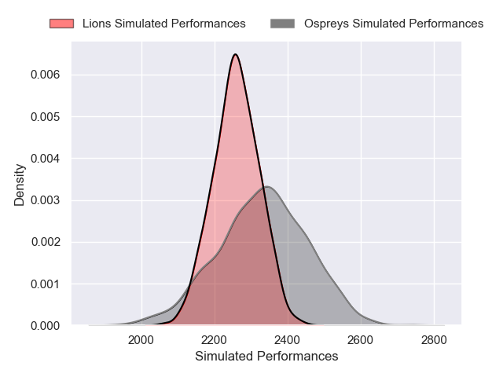

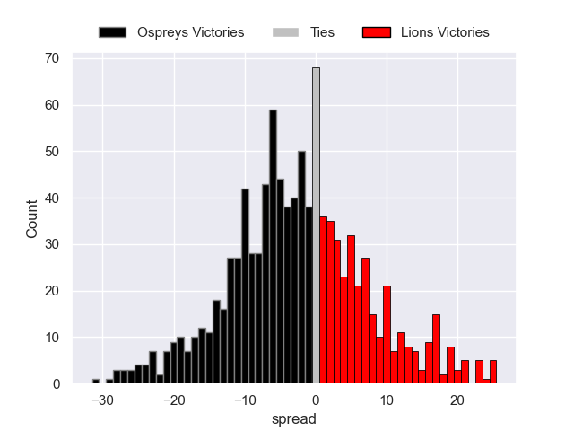

### Munster V Dragons on 2026/01/23

Average Margin: Munster by 9.5

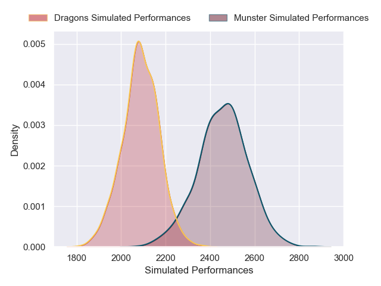

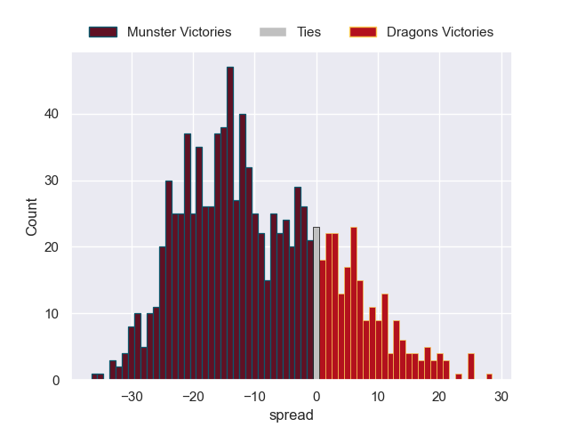

### Edinburgh V Bulls on 2026/01/23

Average Margin: Edinburgh by 3.2

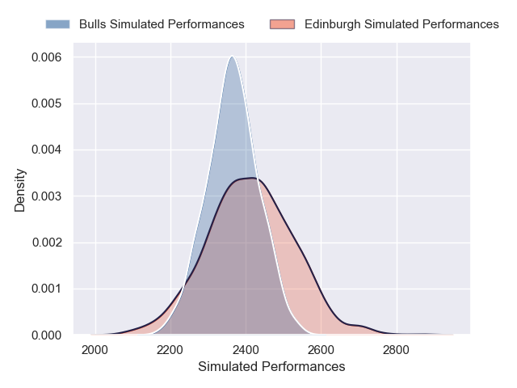

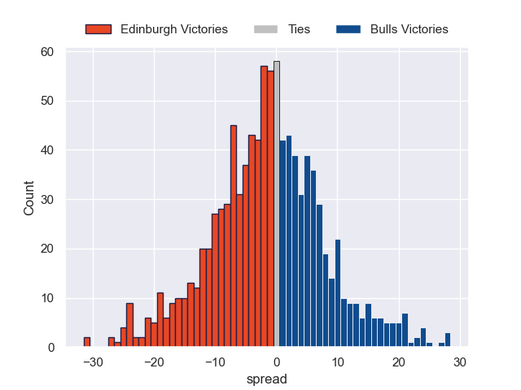

### Cardiff Rugby V Benetton Treviso on 2026/01/24

Average Margin: Cardiff Rugby by 1.6

### Scarlets V Ulster on 2026/01/24

Average Margin: Ulster by 0.8

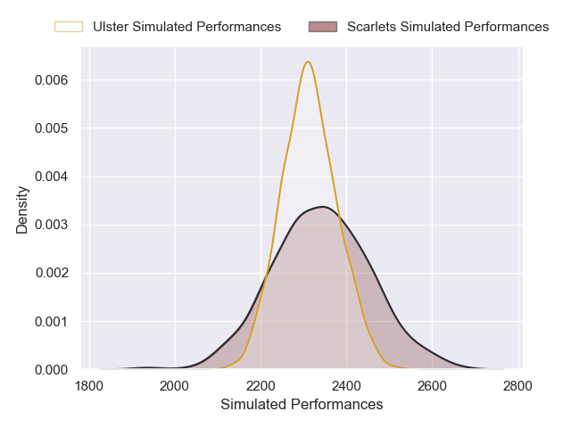

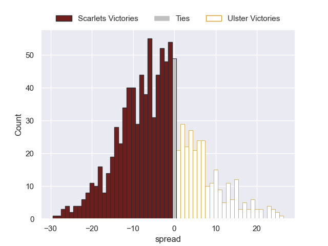

### Connacht V Leinster on 2026/01/24

Average Margin: Leinster by 2.3

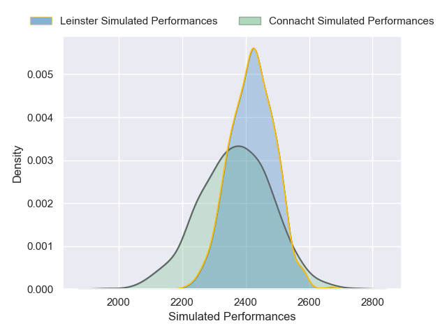

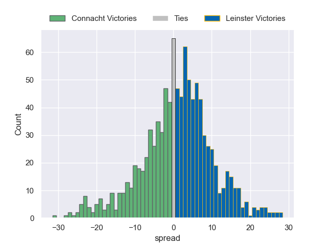

### Stormers V Sharks on 2026/01/24

Average Margin: Stormers by 6.6

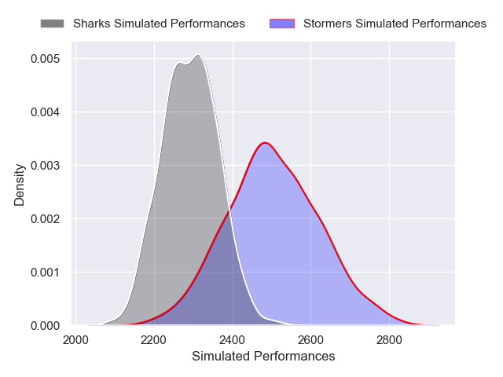

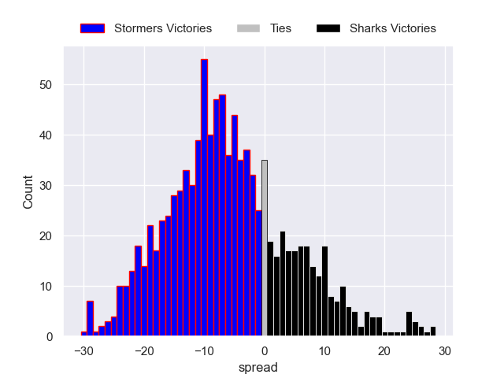

### Zebre V Glasgow Warriors on 2026/01/24

Average Margin: Glasgow Warriors by 5.5

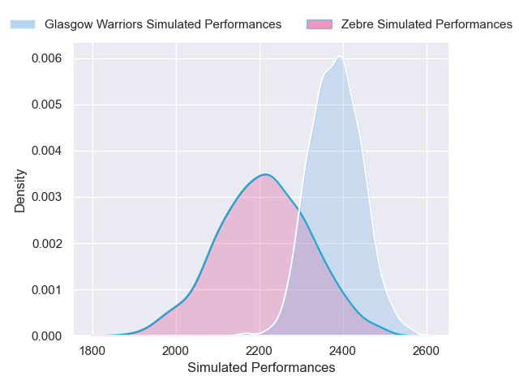

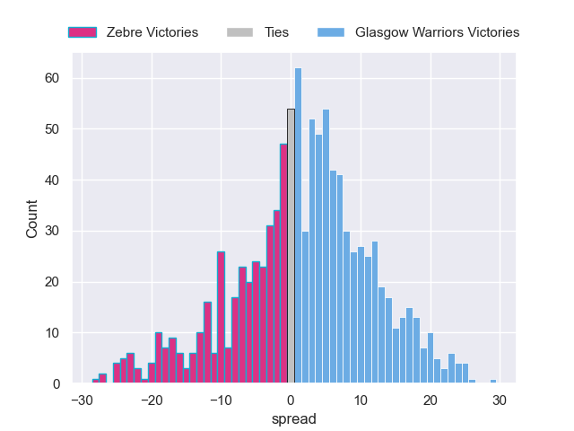

## Week 13

### Glasgow Warriors V Munster on 2026/01/30

Average Margin: Glasgow Warriors by 4.6

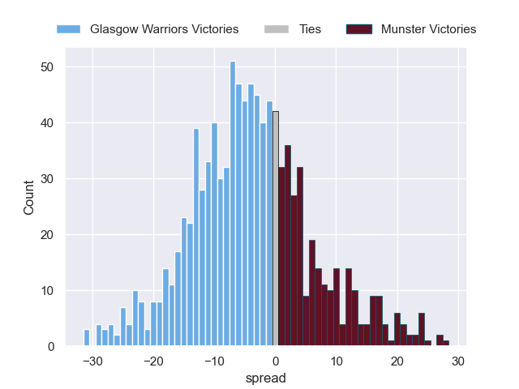

### Benetton Treviso V Scarlets on 2026/01/30

Average Margin: Benetton Treviso by 4.7

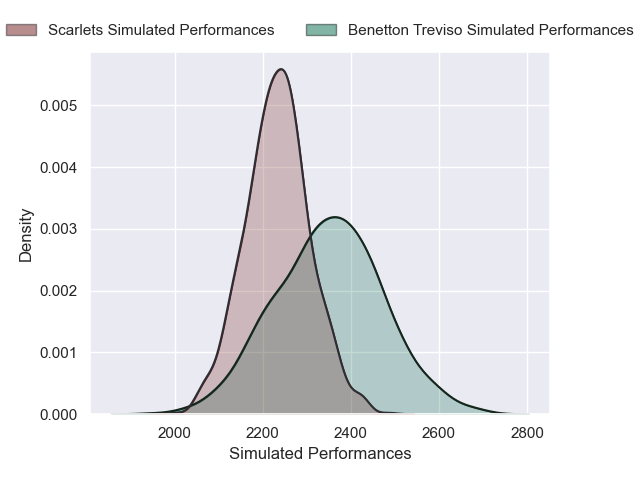

### Zebre V Connacht on 2026/01/31

Average Margin: Connacht by 1.1

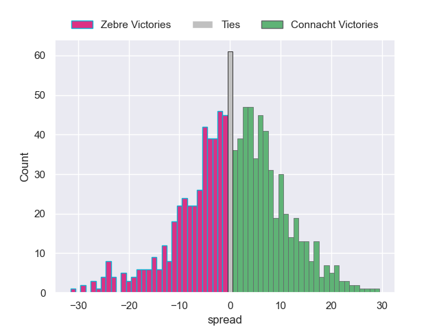

### Ospreys V Dragons on 2026/01/31

Average Margin: Ospreys by 6.6

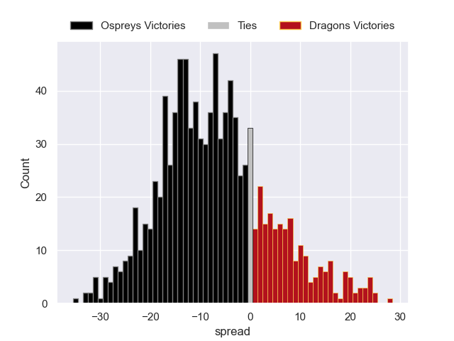

### Ulster V Cardiff Rugby on 2026/01/31

Average Margin: Ulster by 6.3

### Leinster V Edinburgh on 2026/01/31

Average Margin: Leinster by 7.5

### Sharks V Stormers on 2026/01/31

Average Margin: Stormers by 1.6

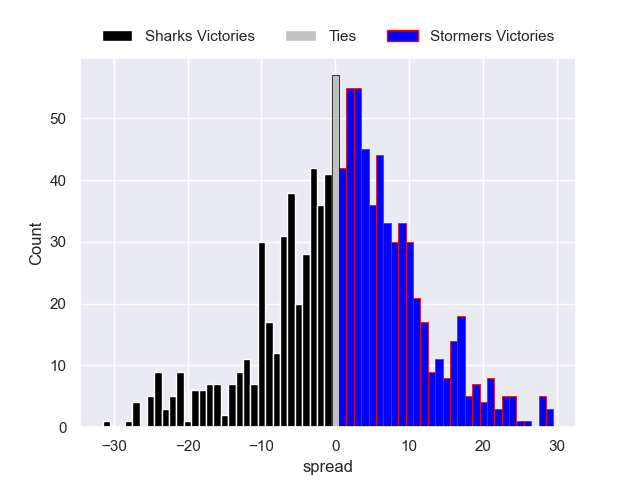

### Lions V Bulls on 2026/01/31

Average Margin: Lions by 2.1

## Week 14

### Lions V Sharks on 2026/02/21

Average Margin: Lions by 2.5

## Week 15

### Edinburgh V Scarlets on 2026/02/27

Average Margin: Edinburgh by 4.8

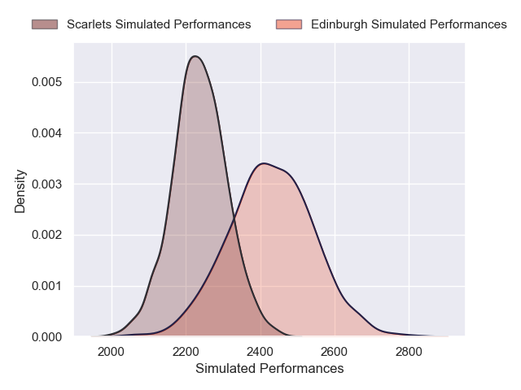

### Cardiff Rugby V Leinster on 2026/02/27

Average Margin: Leinster by 2.5

### Dragons V Benetton Treviso on 2026/02/28

Average Margin: Benetton Treviso by 0.8

### Ospreys V Ulster on 2026/02/28

Average Margin: Ospreys by 0.5

### Munster V Zebre on 2026/02/28

Average Margin: Munster by 9.0

### Lions V Stormers on 2026/02/28

Average Margin: Stormers by 0.6

### Bulls V Sharks on 2026/02/28

Average Margin: Bulls by 4.0

### Connacht V Glasgow Warriors on 2026/02/28

Average Margin: Glasgow Warriors by 1.2

## Week 16

### Bulls V Stormers on 2026/03/14

Average Margin: Bulls by 0.4

## Week 17

### Ulster V Connacht on 2026/03/20

Average Margin: Ulster by 5.9

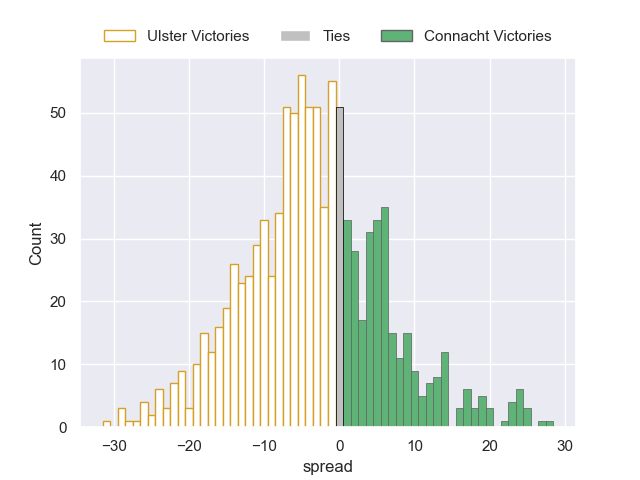

### Bulls V Cardiff Rugby on 2026/03/20

Average Margin: Bulls by 4.8

### Scarlets V Zebre on 2026/03/20

Average Margin: Scarlets by 5.2

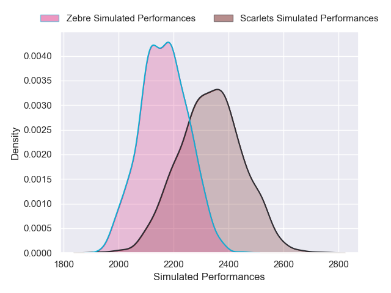

### Lions V Edinburgh on 2026/03/21

Average Margin: Lions by 2.2

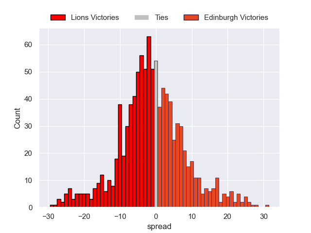

### Stormers V Dragons on 2026/03/21

Average Margin: Stormers by 10.4

### Glasgow Warriors V Leinster on 2026/03/21

Average Margin: Glasgow Warriors by 2.5

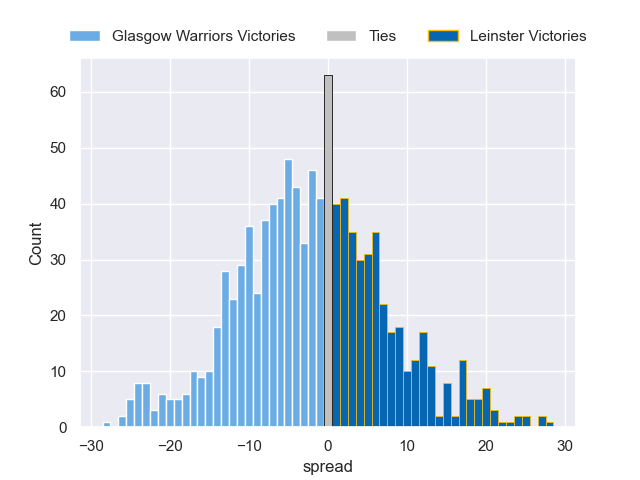

### Sharks V Munster on 2026/03/21

Average Margin: Sharks by 0.4

### Benetton Treviso V Ospreys on 2026/03/21

Average Margin: Benetton Treviso by 3.9

## Week 18

### Glasgow Warriors V Benetton Treviso on 2026/03/27

Average Margin: Glasgow Warriors by 6.4

### Sharks V Cardiff Rugby on 2026/03/27

Average Margin: Sharks by 3.0

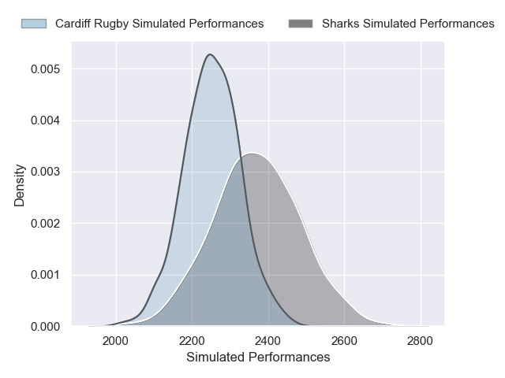

### Stormers V Edinburgh on 2026/03/28

Average Margin: Stormers by 5.8

### Leinster V Scarlets on 2026/03/28

Average Margin: Leinster by 9.3

### Lions V Dragons on 2026/03/28

Average Margin: Lions by 6.7

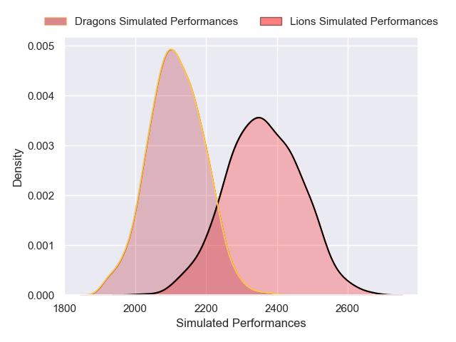

### Zebre V Ulster on 2026/03/28

Average Margin: Ulster by 2.3

### Bulls V Munster on 2026/03/28

Average Margin: Bulls by 2.4

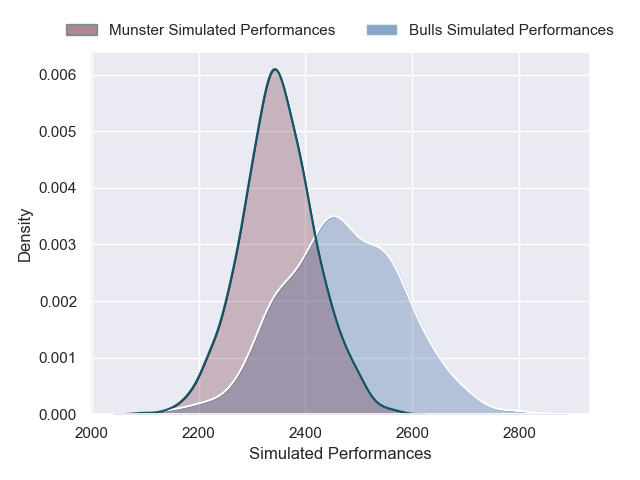

### Connacht V Ospreys on 2026/03/28

Average Margin: Connacht by 3.5

## Week 19

### Dragons V Bulls on 2026/04/17

Average Margin: Bulls by 1.8

### Ulster V Leinster on 2026/04/17

Average Margin: Leinster by 0.2

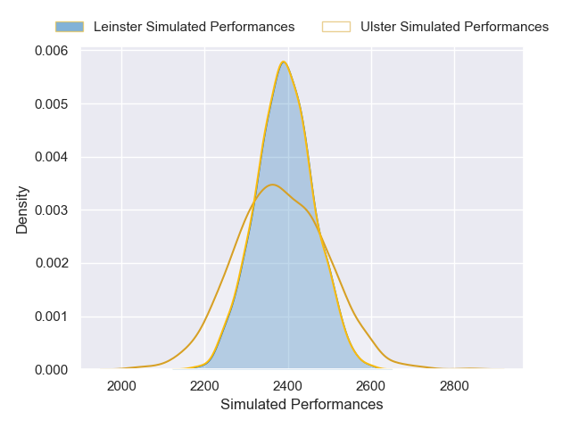

### Edinburgh V Zebre on 2026/04/17

Average Margin: Edinburgh by 7.8

### Scarlets V Cardiff Rugby on 2026/04/18

Average Margin: Scarlets by 1.9

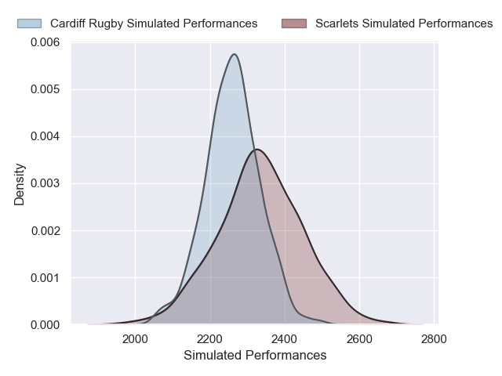

### Ospreys V Sharks on 2026/04/18

Average Margin: Ospreys by 2.3

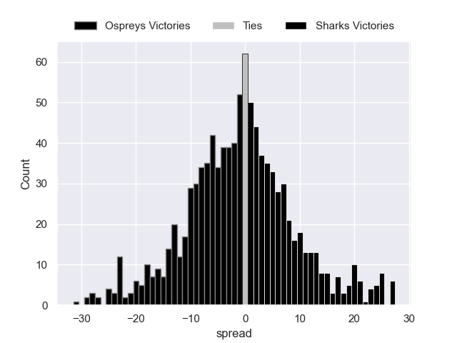

### Benetton Treviso V Munster on 2026/04/18

Average Margin: Benetton Treviso by 0.6

### Lions V Glasgow Warriors on 2026/04/18

Average Margin: Glasgow Warriors by 1.1

### Stormers V Connacht on 2026/04/18

Average Margin: Stormers by 6.1

## Week 20

### Edinburgh V Sharks on 2026/04/24

Average Margin: Edinburgh by 3.4

### Cardiff Rugby V Ospreys on 2026/04/24

Average Margin: Cardiff Rugby by 3.0

### Zebre V Dragons on 2026/04/24

Average Margin: Zebre by 3.5

### Munster V Ulster on 2026/04/25

Average Margin: Munster by 3.8

### Scarlets V Bulls on 2026/04/25

Average Margin: Scarlets by 0.8

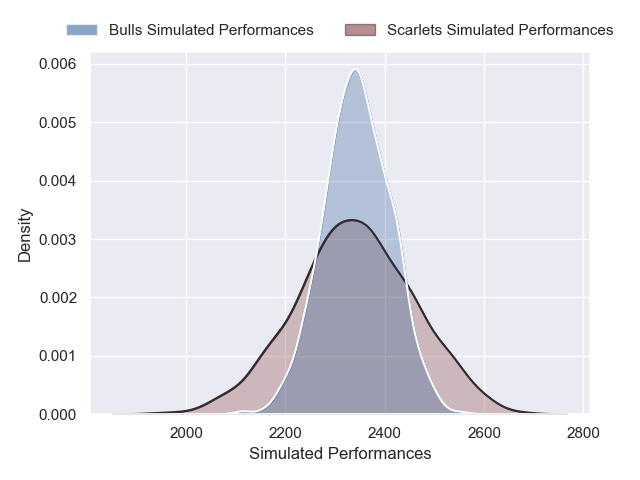

### Benetton Treviso V Leinster on 2026/04/25

Average Margin: Leinster by 1.4

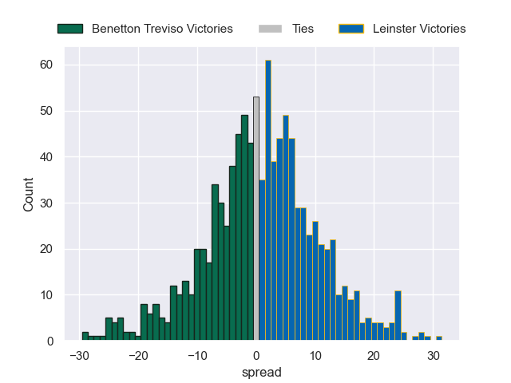

### Stormers V Glasgow Warriors on 2026/04/25

Average Margin: Stormers by 2.0

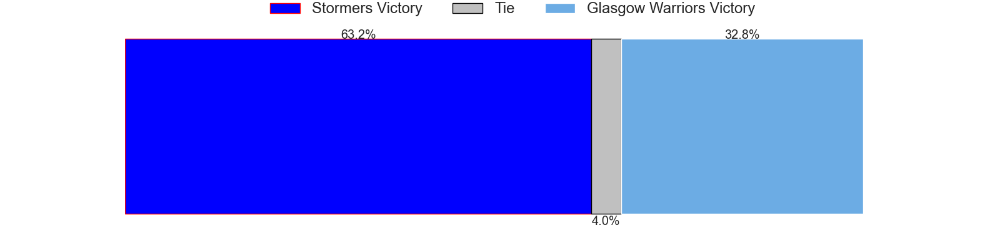

### Lions V Connacht on 2026/04/25

Average Margin: Lions by 3.0

## Week 21

### Ulster V Stormers on 2026/05/08

Average Margin: Ulster by 1.3

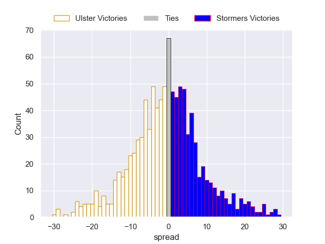

### Glasgow Warriors V Cardiff Rugby on 2026/05/08

Average Margin: Glasgow Warriors by 6.2

### Ospreys V Scarlets on 2026/05/09

Average Margin: Ospreys by 3.4

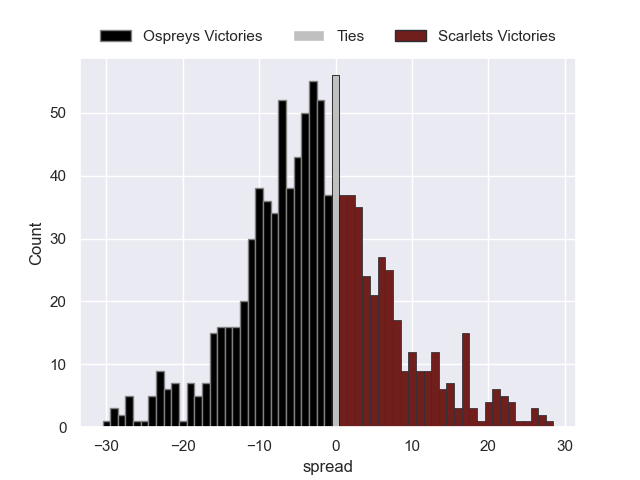

### Connacht V Munster on 2026/05/09

Average Margin: Connacht by 1.3

### Dragons V Edinburgh on 2026/05/09

Average Margin: Edinburgh by 1.4

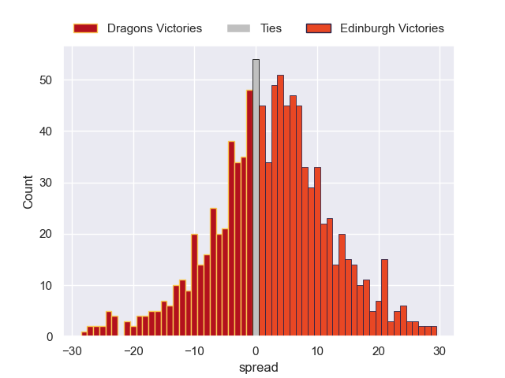

### Leinster V Lions on 2026/05/09

Average Margin: Leinster by 6.8

### Bulls V Zebre on 2026/05/09

Average Margin: Bulls by 7.2

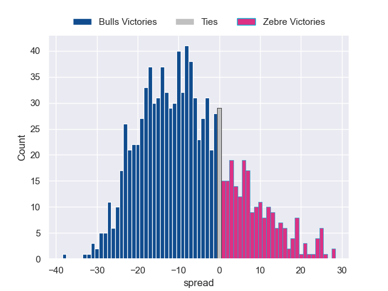

### Sharks V Benetton Treviso on 2026/05/09

Average Margin: Sharks by 2.3

## Week 22

### Ulster V Glasgow Warriors on 2026/05/15

Average Margin: Ulster by 1.2

### Cardiff Rugby V Stormers on 2026/05/15

Average Margin: Stormers by 0.6

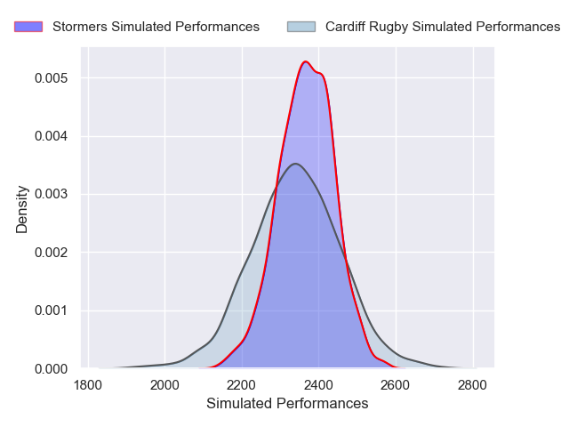

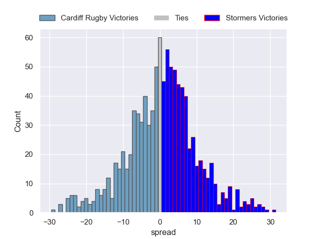

### Edinburgh V Connacht on 2026/05/15

Average Margin: Edinburgh by 4.6

### Bulls V Benetton Treviso on 2026/05/16

Average Margin: Bulls by 3.8

### Sharks V Zebre on 2026/05/16

Average Margin: Sharks by 5.3

### Scarlets V Dragons on 2026/05/16

Average Margin: Scarlets by 4.9

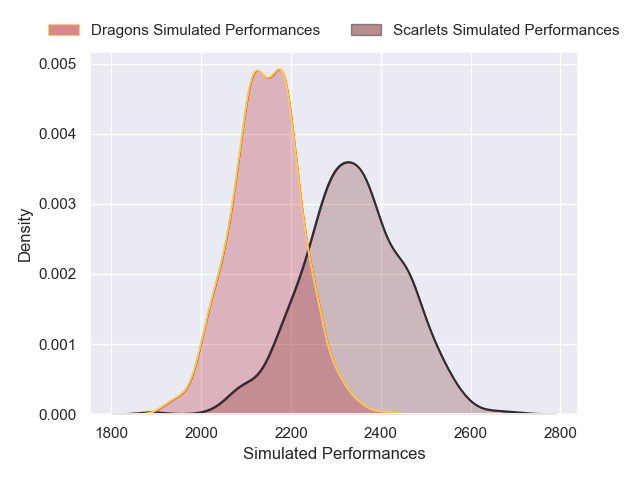

### Munster V Lions on 2026/05/16

Average Margin: Munster by 3.9

### Leinster V Ospreys on 2026/05/16

Average Margin: Leinster by 7.3

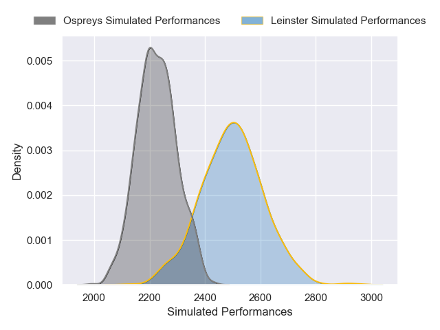

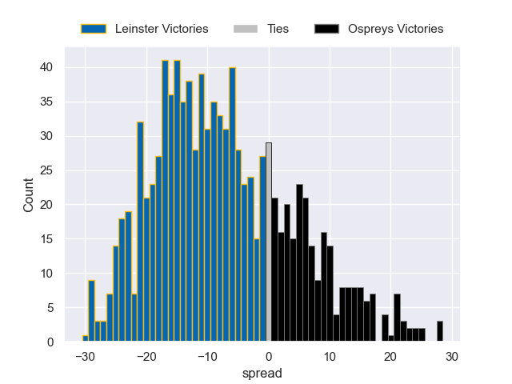

## Week 23

### Ulster V Lions on 2026-05-29

Average Margin: Ulster by 5.7

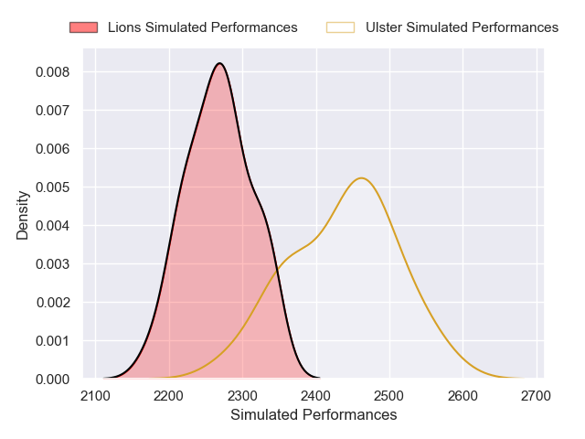

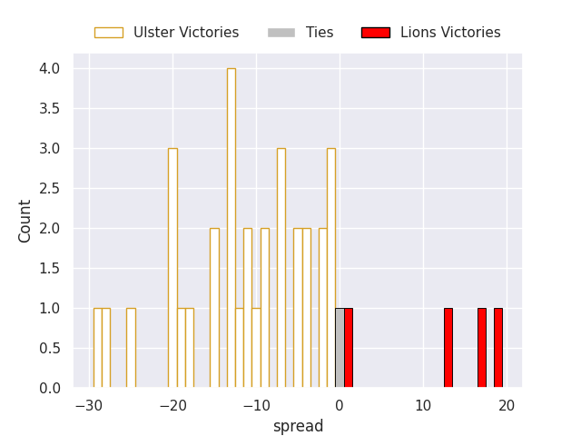

### Bulls V Ulster on 2026-05-29

Average Margin: Bulls by 2.4

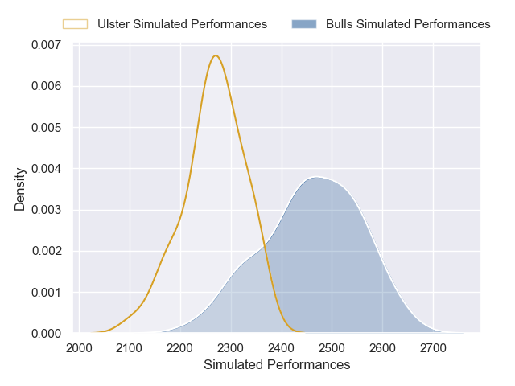

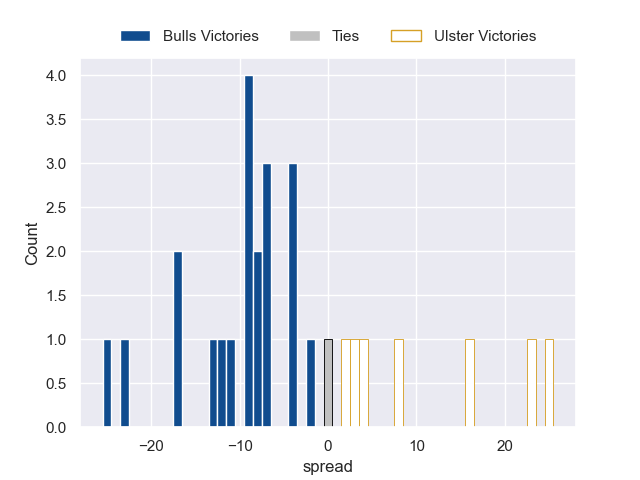

### Edinburgh V Lions on 2026-05-29

Average Margin: Edinburgh by 4.8

### Bulls V Munster on 2026-05-29

Average Margin: Bulls by 3.1

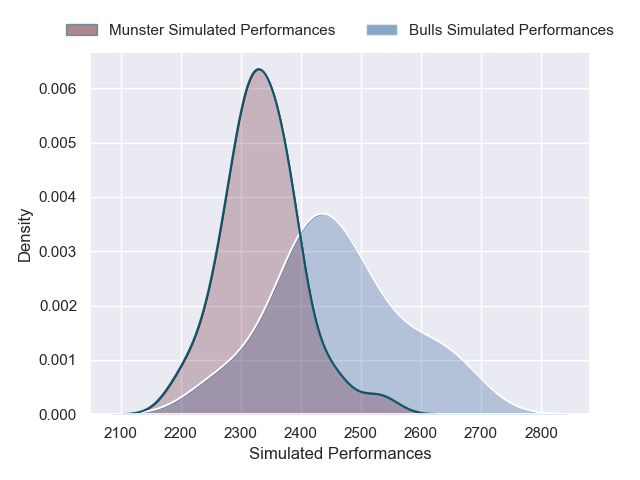

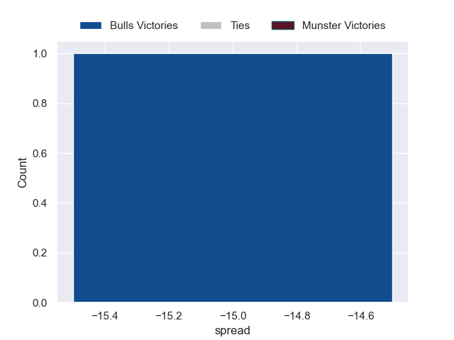

### Lions V Cardiff Rugby on 2026-05-29

Average Margin: Lions by 5.3

### Munster V Leinster on 2026-05-29

Average Margin: Munster by 0.7

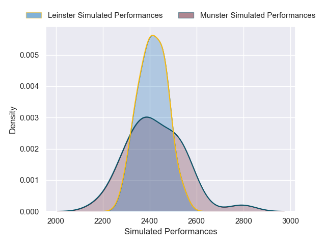


### Bulls V Glasgow Warriors on 2026-05-29

Average Margin: Bulls by 3.0


### Munster V Glasgow Warriors on 2026-05-29

Average Margin: Munster by 0.7


### Ulster V Leinster on 2026-05-29

Average Margin: Ulster by 1.4


### Ulster V Munster on 2026-05-29

Average Margin: Ulster by 2.4


### Edinburgh V Leinster on 2026-05-29

Average Margin: Leinster by 1.7


### Lions V Munster on 2026-05-29

Average Margin: Lions by 0.2


### Glasgow Warriors V Sharks on 2026-05-29

Average Margin: Glasgow Warriors by 15.0


### Ulster V Sharks on 2026-05-29

Average Margin: Ulster by 15.5


### Munster V Sharks on 2026-05-29

Average Margin: Munster by 6.7

### Edinburgh V Bulls on 2026-05-29

Average Margin: Edinburgh by 5.0


### Glasgow Warriors V Ospreys on 2026-05-29

Average Margin: Glasgow Warriors by 1.0


### Ospreys V Cardiff Rugby on 2026-05-29

Average Margin: Ospreys by 3.0

### Stormers V Benetton Treviso on 2026-05-29

Average Margin: Stormers by 5.3


### Leinster V Sharks on 2026-05-29

Average Margin: Leinster by 9.0


### Stormers V Sharks on 2026-05-29

Average Margin: Sharks by 13.0


### Edinburgh V Benetton Treviso on 2026-05-29

Average Margin: Edinburgh by 13.0

### Cardiff Rugby V Munster on 2026-05-29

Average Margin: Cardiff Rugby by 2.2


### Cardiff Rugby V Ulster on 2026-05-29

Average Margin: Ulster by 1.5


### Ulster V Glasgow Warriors on 2026-05-29

Average Margin: Glasgow Warriors by 0.4


### Leinster V Dragons on 2026-05-29

Average Margin: Leinster by 6.0

### Lions V Scarlets on 2026-05-29

Average Margin: Lions by 13.0

### Lions V Ospreys on 2026-05-29

Average Margin: Lions by 26.0

### Glasgow Warriors V Scarlets on 2026-05-29

Average Margin: Scarlets by 0.0


### Bulls V Ospreys on 2026-05-29

Average Margin: Bulls by 4.0

### Stormers V Ospreys on 2026-05-29

Average Margin: Stormers by 2.3


### Connacht V Lions on 2026-05-29

Average Margin: Connacht by 17.0

### Ulster V Dragons on 2026-05-29

Average Margin: Ulster by 14.0

### Cardiff Rugby V Benetton Treviso on 2026-05-29

Average Margin: Cardiff Rugby by 9.0

### Connacht V Ulster on 2026-05-29

Average Margin: Connacht by 11.0

### Bulls V Connacht on 2026-05-29

Average Margin: Connacht by 11.0


### Ospreys V Leinster on 2026-05-29

Average Margin: Leinster by 3.0

### Leinster V Stormers on 2026-05-29

Average Margin: Leinster by 4.3


### Bulls V Edinburgh on 2026-05-29

Average Margin: Bulls by 4.7


### Benetton Treviso V Bulls on 2026-05-29

Average Margin: Benetton Treviso by 3.5

### Stormers V Ulster on 2026-05-29

Average Margin: Stormers by 8.0


### Bulls V Cardiff Rugby on 2026-05-29

Average Margin: Bulls by 3.7


### Benetton Treviso V Leinster on 2026-05-29

Average Margin: Benetton Treviso by 1.0


### Lions V Leinster on 2026-05-29

Average Margin: Leinster by 1.6


### Glasgow Warriors V Leinster on 2026-05-29

Average Margin: Glasgow Warriors by 0.8


### Bulls V Lions on 2026-05-29

Average Margin: Bulls by 3.6


### Ulster V Stormers on 2026-05-29

Average Margin: Ulster by 2.0


### Stormers V Dragons on 2026-05-29

Average Margin: Stormers by 12.0

### Ulster V Benetton Treviso on 2026-05-29

Average Margin: Ulster by 4.8

### Munster V Ospreys on 2026-05-29

Average Margin: Munster by 0.5


### Munster V Edinburgh on 2026-05-29

Average Margin: Munster by 4.0


### Ulster V Bulls on 2026-05-29

Average Margin: Ulster by 5.1


### Glasgow Warriors V Munster on 2026-05-29

Average Margin: Glasgow Warriors by 4.8


### Munster V Cardiff Rugby on 2026-05-29

Average Margin: Munster by 4.5


### Leinster V Lions on 2026-05-29

Average Margin: Leinster by 6.9


### Glasgow Warriors V Lions on 2026-05-29

Average Margin: Glasgow Warriors by 6.1


### Stormers V Cardiff Rugby on 2026-05-29

Average Margin: Stormers by 3.4


### Leinster V Ulster on 2026-05-29

Average Margin: Leinster by 6.9


### Leinster V Edinburgh on 2026-05-29

Average Margin: Leinster by 5.0


### Lions V Benetton Treviso on 2026-05-29

Average Margin: Lions by 2.2

### Glasgow Warriors V Edinburgh on 2026-05-29

Average Margin: Glasgow Warriors by 0.9


### Glasgow Warriors V Bulls on 2026-05-29

Average Margin: Glasgow Warriors by 6.2


### Leinster V Bulls on 2026-05-29

Average Margin: Leinster by 6.1


### Leinster V Connacht on 2026-05-29

Average Margin: Leinster by 6.8


### Munster V Ulster on 2026-05-29

Average Margin: Munster by 2.7


### Leinster V Cardiff Rugby on 2026-05-29

Average Margin: Leinster by 8.7


### Leinster V Munster on 2026-05-29

Average Margin: Leinster by 6.7


### Munster V Lions on 2026-05-29

Average Margin: Munster by 6.8


### Leinster V Ospreys on 2026-05-29

Average Margin: Leinster by 4.2


### Leinster V Glasgow Warriors on 2026-05-29

Average Margin: Leinster by 6.0


### Munster V Bulls on 2026-05-29

Average Margin: Munster by 5.9


### Stormers V Lions on 2026-05-29

Average Margin: Stormers by 1.3


### Ulster V Cardiff Rugby on 2026-05-29

Average Margin: Ulster by 8.3


### Stormers V Munster on 2026-05-29

Average Margin: Stormers by 1.7


### Cardiff Rugby V Bulls on 2026-05-29

Average Margin: Bulls by 3.8


### Lions V Edinburgh on 2026-05-29

Average Margin: Edinburgh by 1.0

### Munster V Benetton Treviso on 2026-05-29

Average Margin: Munster by 11.5


### Lions V Bulls on 2026-05-29

Average Margin: Lions by 2.7

### Cardiff Rugby V Lions on 2026-05-29

Average Margin: Lions by 5.0


### Munster V Connacht on 2026-05-29

Average Margin: Munster by 1.5


### Ulster V Ospreys on 2026-05-29

Average Margin: Ulster by 8.7

### Glasgow Warriors V Connacht on 2026-05-29

Average Margin: Glasgow Warriors by 4.2


### Lions V Connacht on 2026-05-29

Average Margin: Connacht by 2.0

### Glasgow Warriors V Benetton Treviso on 2026-05-29

Average Margin: Glasgow Warriors by 2.5


### Stormers V Glasgow Warriors on 2026-05-29

Average Margin: Glasgow Warriors by 1.0


### Ulster V Connacht on 2026-05-29

Average Margin: Connacht by 1.7


### Cardiff Rugby V Connacht on 2026-05-29

Average Margin: Connacht by 1.0


### Leinster V Benetton Treviso on 2026-05-29

Average Margin: Leinster by 1.7


### Stormers V Connacht on 2026-05-29

Average Margin: Stormers by 9.0


### Glasgow Warriors V Ulster on 2026-05-29

Average Margin: Glasgow Warriors by 8.1


### Stormers V Bulls on 2026-05-29

Average Margin: Stormers by 1.6


### Ulster V Edinburgh on 2026-05-29

Average Margin: Ulster by 5.3


### Stormers V Leinster on 2026-05-29

Average Margin: Stormers by 5.6


### Glasgow Warriors V Cardiff Rugby on 2026-05-29

Average Margin: Glasgow Warriors by 8.9


### Stormers V Edinburgh on 2026-05-29

Average Margin: Stormers by 10.4


### Cardiff Rugby V Edinburgh on 2026-05-29

Average Margin: Edinburgh by 1.3


### Stormers V Scarlets on 2026-05-29

Average Margin: Stormers by 7.3


## Week 24

### Munster V Glasgow Warriors on 2026-06-05

Average Margin: Munster by 2.5


### Lions V Leinster on 2026-06-05

Average Margin: Lions by 2.7

### Glasgow Warriors V Munster on 2026-06-05

Average Margin: Glasgow Warriors by 6.5

### Sharks V Ospreys on 2026-06-05

Average Margin: Ospreys by 3.0

### Ulster V Leinster on 2026-06-05

Average Margin: Ulster by 0.3


### Sharks V Munster on 2026-06-05

Average Margin: Munster by 3.0

### Connacht V Edinburgh on 2026-06-05

Average Margin: Connacht by 5.0

### Connacht V Bulls on 2026-06-05

Average Margin: Connacht by 10.0


### Sharks V Ulster on 2026-06-05

Average Margin: Sharks by 1.0

### Stormers V Ospreys on 2026-06-05

Average Margin: Stormers by 0.2

### Glasgow Warriors V Leinster on 2026-06-05

Average Margin: Glasgow Warriors by 2.0


### Connacht V Lions on 2026-06-05

Average Margin: Connacht by 7.5

### Benetton Treviso V Leinster on 2026-06-05

Average Margin: Benetton Treviso by 9.2


### Connacht V Leinster on 2026-06-05

Average Margin: Connacht by 2.8

### Connacht V Ulster on 2026-06-05

Average Margin: Connacht by 13.7

### Stormers V Connacht on 2026-06-05

Average Margin: Stormers by 2.0


### Edinburgh V Ospreys on 2026-06-05

Average Margin: Edinburgh by 1.3

### Sharks V Glasgow Warriors on 2026-06-05

Average Margin: Glasgow Warriors by 2.0

### Ospreys V Ulster on 2026-06-05

Average Margin: Ospreys by 1.2

### Sharks V Leinster on 2026-06-05

Average Margin: Sharks by 5.7

### Connacht V Munster on 2026-06-05

Average Margin: Connacht by 1.0

### Glasgow Warriors V Connacht on 2026-06-05

Average Margin: Glasgow Warriors by 6.0


### Benetton Treviso V Glasgow Warriors on 2026-06-05

Average Margin: Benetton Treviso by 9.2

### Ulster V Glasgow Warriors on 2026-06-05

Average Margin: Ulster by 1.0


### Munster V Leinster on 2026-06-05

Average Margin: Munster by 1.1


### Benetton Treviso V Connacht on 2026-06-05

Average Margin: Connacht by 0.0


### Connacht V Cardiff Rugby on 2026-06-05

Average Margin: Connacht by 7.0

### Bulls V Connacht on 2026-06-05

Average Margin: Connacht by 11.0

### Dragons V Leinster on 2026-06-05

Average Margin: Leinster by 15.0

### Ulster V Sharks on 2026-06-05

Average Margin: Sharks by 2.0

### Ospreys V Glasgow Warriors on 2026-06-05

Average Margin: Ospreys by 3.5

### Glasgow Warriors V Benetton Treviso on 2026-06-05

Average Margin: Glasgow Warriors by 3.6

### Scarlets V Leinster on 2026-06-05

Average Margin: Leinster by 6.0


### Leinster V Connacht on 2026-06-05

Average Margin: Leinster by 6.5


### Glasgow Warriors V Edinburgh on 2026-06-05

Average Margin: Glasgow Warriors by 6.5


### Munster V Ospreys on 2026-06-05

Average Margin: Ospreys by 0.8

### Ospreys V Stormers on 2026-06-05

Average Margin: Stormers by 1.5

### Munster V Cardiff Rugby on 2026-06-05

Average Margin: Munster by 0.1


### Leinster V Cardiff Rugby on 2026-06-05

Average Margin: Leinster by 5.9


### Glasgow Warriors V Lions on 2026-06-05

Average Margin: Glasgow Warriors by 6.8


### Ulster V Stormers on 2026-06-05

Average Margin: Ulster by 2.1


### Ulster V Edinburgh on 2026-06-05

Average Margin: Ulster by 2.9

### Lions V Bulls on 2026-06-05

Average Margin: Bulls by 2.0

### Cardiff Rugby V Ulster on 2026-06-05

Average Margin: Cardiff Rugby by 1.4


### Bulls V Cardiff Rugby on 2026-06-05

Average Margin: Bulls by 6.3


### Ulster V Lions on 2026-06-05

Average Margin: Ulster by 6.2

### Ospreys V Cardiff Rugby on 2026-06-05

Average Margin: Cardiff Rugby by 12.0

### Benetton Treviso V Lions on 2026-06-05

Average Margin: Benetton Treviso by 7.0

### Cardiff Rugby V Lions on 2026-06-05

Average Margin: Cardiff Rugby by 5.4

### Cardiff Rugby V Leinster on 2026-06-05

Average Margin: Cardiff Rugby by 1.8


### Ulster V Cardiff Rugby on 2026-06-05

Average Margin: Ulster by 2.5


### Stormers V Glasgow Warriors on 2026-06-05

Average Margin: Stormers by 1.6


### Lions V Ulster on 2026-06-05

Average Margin: Lions by 4.6


### Munster V Lions on 2026-06-05

Average Margin: Munster by 6.7


### Glasgow Warriors V Bulls on 2026-06-05

Average Margin: Glasgow Warriors by 9.3


### Stormers V Lions on 2026-06-05

Average Margin: Stormers by 5.8


### Edinburgh V Bulls on 2026-06-05

Average Margin: Edinburgh by 8.8


### Ulster V Munster on 2026-06-05

Average Margin: Ulster by 3.0


### Benetton Treviso V Stormers on 2026-06-05

Average Margin: Benetton Treviso by 4.0


### Sharks V Stormers on 2026-06-05

Average Margin: Sharks by 8.0

### Leinster V Ulster on 2026-06-05

Average Margin: Leinster by 6.5


### Stormers V Munster on 2026-06-05

Average Margin: Stormers by 3.5


### Ulster V Bulls on 2026-06-05

Average Margin: Ulster by 3.3


### Lions V Glasgow Warriors on 2026-06-05

Average Margin: Glasgow Warriors by 0.9


### Edinburgh V Munster on 2026-06-05

Average Margin: Edinburgh by 5.5

### Benetton Treviso V Ulster on 2026-06-05

Average Margin: Benetton Treviso by 2.7


### Stormers V Leinster on 2026-06-05

Average Margin: Stormers by 3.1


### Stormers V Ulster on 2026-06-05

Average Margin: Stormers by 3.8


### Bulls V Lions on 2026-06-05

Average Margin: Bulls by 4.8

### Ospreys V Lions on 2026-06-05

Average Margin: Ospreys by 6.0

### Benetton Treviso V Munster on 2026-06-05

Average Margin: Munster by 3.4

### Bulls V Munster on 2026-06-05

Average Margin: Bulls by 7.0


### Glasgow Warriors V Ulster on 2026-06-05

Average Margin: Glasgow Warriors by 8.9


### Sharks V Lions on 2026-06-05

Average Margin: Sharks by 4.0

### Stormers V Bulls on 2026-06-05

Average Margin: Stormers by 4.8


### Edinburgh V Leinster on 2026-06-05

Average Margin: Edinburgh by 4.4


### Edinburgh V Lions on 2026-06-05

Average Margin: Edinburgh by 6.0

### Ospreys V Bulls on 2026-06-05

Average Margin: Bulls by 0.0

### Stormers V Cardiff Rugby on 2026-06-05

Average Margin: Stormers by 5.0


### Ospreys V Munster on 2026-06-05

Average Margin: Munster by 4.0

### Cardiff Rugby V Edinburgh on 2026-06-05

Average Margin: Cardiff Rugby by 7.0

### Bulls V Leinster on 2026-06-05

Average Margin: Leinster by 1.8


### Glasgow Warriors V Cardiff Rugby on 2026-06-05

Average Margin: Glasgow Warriors by 6.6


### Bulls V Benetton Treviso on 2026-06-05

Average Margin: Bulls by 1.0

### Ospreys V Leinster on 2026-06-05

Average Margin: Leinster by 2.8

### Stormers V Edinburgh on 2026-06-05

Average Margin: Stormers by 2.8


### Cardiff Rugby V Bulls on 2026-06-05

Average Margin: Cardiff Rugby by 0.1

### Leinster V Lions on 2026-06-05

Average Margin: Leinster by 10.7

### Edinburgh V Glasgow Warriors on 2026-06-05

Average Margin: Edinburgh by 4.6

### Glasgow Warriors V Ospreys on 2026-06-05

Average Margin: Glasgow Warriors by 10.0

### Leinster V Munster on 2026-06-05

Average Margin: Leinster by 5.6


### Cardiff Rugby V Munster on 2026-06-05

Average Margin: Munster by 2.1


### Edinburgh V Ulster on 2026-06-05

Average Margin: Edinburgh by 3.6

### Leinster V Glasgow Warriors on 2026-06-05

Average Margin: Leinster by 2.6


### Benetton Treviso V Cardiff Rugby on 2026-06-05

Average Margin: Benetton Treviso by 10.0

## Final

### Glasgow Warriors V Connacht on 2026-06-19

Average Margin: Connacht by 2.6

### Cardiff Rugby V Benetton Treviso on 2026-06-19

Average Margin: Cardiff Rugby by 9.5

### Benetton Treviso V Ulster on 2026-06-19

Average Margin: Benetton Treviso by 2.8

### Leinster V Connacht on 2026-06-19

Average Margin: Leinster by 9.5


### Sharks V Glasgow Warriors on 2026-06-19

Average Margin: Sharks by 0.5

### Munster V Leinster on 2026-06-19

Average Margin: Munster by 0.8


### Edinburgh V Ulster on 2026-06-19

Average Margin: Edinburgh by 3.3

### Stormers V Connacht on 2026-06-19

Average Margin: Connacht by 5.3


### Munster V Cardiff Rugby on 2026-06-19

Average Margin: Munster by 7.4

### Sharks V Ulster on 2026-06-19

Average Margin: Ulster by 8.5

### Ospreys V Leinster on 2026-06-19

Average Margin: Leinster by 1.2

### Bulls V Edinburgh on 2026-06-19

Average Margin: Bulls by 15.0


### Munster V Benetton Treviso on 2026-06-19

Average Margin: Munster by 9.0

### Cardiff Rugby V Ospreys on 2026-06-19

Average Margin: Cardiff Rugby by 8.0

### Bulls V Leinster on 2026-06-19

Average Margin: Bulls by 2.0


### Cardiff Rugby V Ulster on 2026-06-19

Average Margin: Ulster by 0.2

### Munster V Lions on 2026-06-19

Average Margin: Munster by 10.6

### Connacht V Munster on 2026-06-19

Average Margin: Munster by 2.5

### Benetton Treviso V Bulls on 2026-06-19

Average Margin: Bulls by 5.0

### Cardiff Rugby V Lions on 2026-06-19

Average Margin: Cardiff Rugby by 0.2

### Benetton Treviso V Stormers on 2026-06-19

Average Margin: Stormers by 5.2

### Benetton Treviso V Connacht on 2026-06-19

Average Margin: Benetton Treviso by 9.0

### Lions V Sharks on 2026-06-19

Average Margin: Lions by 5.0

### Stormers V Sharks on 2026-06-19

Average Margin: Sharks by 4.0

### Ulster V Connacht on 2026-06-19

Average Margin: Ulster by 6.3

### Munster V Ospreys on 2026-06-19

Average Margin: Munster by 9.0

### Edinburgh V Cardiff Rugby on 2026-06-19

Average Margin: Cardiff Rugby by 8.0

### Lions V Ospreys on 2026-06-19

Average Margin: Lions by 1.0

### Benetton Treviso V Lions on 2026-06-19

Average Margin: Benetton Treviso by 5.0

### Edinburgh V Lions on 2026-06-19

Average Margin: Edinburgh by 6.5

### Bulls V Ulster on 2026-06-19

Average Margin: Ulster by 0.8

### Edinburgh V Benetton Treviso on 2026-06-19

Average Margin: Benetton Treviso by 2.8

### Lions V Stormers on 2026-06-19

Average Margin: Stormers by 1.6

### Lions V Ulster on 2026-06-19

Average Margin: Lions by 7.0

### Stormers V Ospreys on 2026-06-19

Average Margin: Stormers by 4.2

### Leinster V Glasgow Warriors on 2026-06-19

Average Margin: Leinster by 2.9


### Benetton Treviso V Glasgow Warriors on 2026-06-19

Average Margin: Glasgow Warriors by 3.0

### Edinburgh V Leinster on 2026-06-19

Average Margin: Leinster by 0.1


### Stormers V Cardiff Rugby on 2026-06-19

Average Margin: Stormers by 5.6


### Stormers V Glasgow Warriors on 2026-06-19

Average Margin: Stormers by 1.3


### Lions V Leinster on 2026-06-19

Average Margin: Leinster by 0.4


### Stormers V Leinster on 2026-06-19

Average Margin: Stormers by 2.1


### Bulls V Munster on 2026-06-19

Average Margin: Bulls by 0.5


### Stormers V Ulster on 2026-06-19

Average Margin: Stormers by 2.6


### Ulster V Glasgow Warriors on 2026-06-19

Average Margin: Ulster by 1.9


### Ospreys V Glasgow Warriors on 2026-06-19

Average Margin: Ospreys by 0.1

### Sharks V Leinster on 2026-06-19

Average Margin: Leinster by 1.4


### Edinburgh V Glasgow Warriors on 2026-06-19

Average Margin: Edinburgh by 0.2


### Lions V Glasgow Warriors on 2026-06-19

Average Margin: Glasgow Warriors by 1.7

### Munster V Stormers on 2026-06-19

Average Margin: Munster by 3.9


### Lions V Bulls on 2026-06-19

Average Margin: Lions by 3.5

### Munster V Edinburgh on 2026-06-19

Average Margin: Munster by 0.2

### Ulster V Leinster on 2026-06-19

Average Margin: Leinster by 1.7


### Ulster V Munster on 2026-06-19

Average Margin: Ulster by 0.9


### Cardiff Rugby V Glasgow Warriors on 2026-06-19

Average Margin: Glasgow Warriors by 1.3


### Benetton Treviso V Leinster on 2026-06-19

Average Margin: Benetton Treviso by 1.2


### Bulls V Cardiff Rugby on 2026-06-19

Average Margin: Cardiff Rugby by 13.5

### Bulls V Stormers on 2026-06-19

Average Margin: Bulls by 3.3


### Munster V Glasgow Warriors on 2026-06-19

Average Margin: Munster by 1.1


### Bulls V Glasgow Warriors on 2026-06-19

Average Margin: Bulls by 2.8


### Cardiff Rugby V Leinster on 2026-06-19

Average Margin: Cardiff Rugby by 0.2

### Stormers V Edinburgh on 2026-06-19

Average Margin: Stormers by 8.0


### Connacht V Lions on 2026-06-19

Average Margin: Lions by 3.0

### Ospreys V Edinburgh on 2026-06-19

Average Margin: Ospreys by 2.0

