# Team Rankings

# Standings

## Current Standings

| Club             |   Played |   Wins |   Point Differential |   Losing Bonus Points |   Try Bonus Points |   Competition Points |
|:-----------------|---------:|-------:|---------------------:|----------------------:|-------------------:|---------------------:|
| Stormers         |        8 |      8 |                  136 |                     0 |                  4 |                   36 |
| Glasgow Warriors |        9 |      7 |                  141 |                     1 |                  5 |                   34 |
| Ulster           |        9 |      6 |                   92 |                     1 |                  6 |                   33 |
| Leinster         |        9 |      6 |                   48 |                     0 |                  6 |                   30 |
| Cardiff Rugby    |        9 |      6 |                   27 |                     2 |                  3 |                   29 |
| Munster          |        9 |      6 |                   16 |                     2 |                  3 |                   29 |
| Lions            |        8 |      4 |                   -8 |                     2 |                  3 |                   21 |
| Edinburgh        |        9 |      3 |                   11 |                     3 |                  2 |                   19 |
| Benetton Treviso |        9 |      4 |                  -56 |                     1 |                  2 |                   19 |
| Ospreys          |        9 |      3 |                  -30 |                     1 |                  3 |                   18 |
| Connacht         |        8 |      2 |                  -31 |                     4 |                  4 |                   16 |
| Bulls            |        8 |      3 |                  -32 |                     1 |                  3 |                   16 |
| Dragons          |        9 |      2 |                  -51 |                     2 |                  2 |                   16 |
| Sharks           |        8 |      2 |                  -59 |                     1 |                  2 |                   13 |
| Zebre            |        9 |      2 |                 -133 |                     1 |                  2 |                   11 |
| Scarlets         |        8 |      2 |                  -71 |                     1 |                    |                    9 |

## Projected Remaining Table

| Club             |   To Play |   Projected Wins |   Projected Differential |   Projected Losing Bonus Points | Projected Try Bonus Points   |   Projected Competition Points |
|:-----------------|----------:|-----------------:|-------------------------:|--------------------------------:|:-----------------------------|-------------------------------:|
| Stormers         |        11 |            6.71  |                   36.913 |                           2.204 |                              |                         30.06  |
| Bulls            |        11 |            6.139 |                   20.884 |                           2.529 |                              |                         28.173 |
| Lions            |        11 |            5.324 |                   -0.858 |                           2.653 |                              |                         25.077 |
| Leinster         |         9 |            5.532 |                   34.154 |                           1.72  |                              |                         24.644 |
| Glasgow Warriors |         9 |            5.275 |                   24.054 |                           1.88  |                              |                         23.816 |
| Ulster           |         9 |            4.966 |                   16.077 |                           2.068 |                              |                         22.884 |
| Sharks           |        11 |            4.644 |                  -11.247 |                           3.038 |                              |                         22.68  |
| Munster          |         9 |            4.768 |                   16.204 |                           2.077 |                              |                         21.997 |
| Edinburgh        |         9 |            4.725 |                    6.835 |                           1.828 |                              |                         21.548 |
| Scarlets         |        10 |            4.336 |                  -10.315 |                           2.471 |                              |                         20.797 |
| Connacht         |        10 |            4.122 |                  -14.477 |                           2.675 |                              |                         20.173 |
| Ospreys          |         9 |            4.251 |                   -1.887 |                           2.122 |                              |                         20.11  |
| Benetton Treviso |         9 |            3.873 |                  -10.055 |                           2.337 |                              |                         18.651 |
| Cardiff Rugby    |         9 |            3.196 |                  -24.382 |                           2.503 |                              |                         16.139 |
| Dragons          |         9 |            2.731 |                  -39.881 |                           2.463 |                              |                         14.211 |
| Zebre            |         9 |            2.716 |                  -42.019 |                           2.167 |                              |                         13.775 |

## Projected Total Table

| Club             |   Played |   Wins |   Point Differential |   Losing Bonus Points |   Try Bonus Points |   Competition Points |
|:-----------------|---------:|-------:|---------------------:|----------------------:|-------------------:|---------------------:|
| Stormers         |       19 | 14.71  |              172.913 |                 2.204 |                  4 |               66.06  |
| Glasgow Warriors |       18 | 12.275 |              165.054 |                 2.88  |                  5 |               57.816 |
| Ulster           |       18 | 10.966 |              108.077 |                 3.068 |                  6 |               55.884 |
| Leinster         |       18 | 11.532 |               82.154 |                 1.72  |                  6 |               54.644 |
| Munster          |       18 | 10.768 |               32.204 |                 4.077 |                  3 |               50.997 |
| Lions            |       19 |  9.324 |               -8.858 |                 4.653 |                  3 |               46.077 |
| Cardiff Rugby    |       18 |  9.196 |                2.618 |                 4.503 |                  3 |               45.139 |
| Bulls            |       19 |  9.139 |              -11.116 |                 3.529 |                  3 |               44.173 |
| Edinburgh        |       18 |  7.725 |               17.835 |                 4.828 |                  2 |               40.548 |
| Ospreys          |       18 |  7.251 |              -31.887 |                 3.122 |                  3 |               38.11  |
| Benetton Treviso |       18 |  7.873 |              -66.055 |                 3.337 |                  2 |               37.651 |
| Connacht         |       18 |  6.122 |              -45.477 |                 6.675 |                  4 |               36.173 |
| Sharks           |       19 |  6.644 |              -70.247 |                 4.038 |                  2 |               35.68  |
| Dragons          |       18 |  4.731 |              -90.881 |                 4.463 |                  2 |               30.211 |
| Scarlets         |       18 |  6.336 |              -81.315 |                 3.471 |                    |               29.797 |
| Zebre            |       18 |  4.716 |             -175.019 |                 3.167 |                  2 |               24.775 |

## Projected Playoff Results

|                  | Reach Quarterfinal   | Win Quarterfinal   | Reach Semifinal   | Win Semifinal   | Reach Final   | Win Final   |
|:-----------------|:---------------------|:-------------------|:------------------|:----------------|:--------------|:------------|
| Stormers         | 100.0 %              | 75.6 %             | 75.6 %            | 48.7 %          | 48.7 %        | 31.3 %      |
| Glasgow Warriors | 99.9 %               | 67.5 %             | 67.5 %            | 42.0 %          | 42.0 %        | 16.4 %      |
| Leinster         | 98.4 %               | 61.2 %             | 61.2 %            | 30.7 %          | 30.7 %        | 15.9 %      |
| Ulster           | 99.4 %               | 66.3 %             | 66.3 %            | 26.1 %          | 26.1 %        | 12.0 %      |
| Munster          | 93.4 %               | 40.1 %             | 40.1 %            | 14.5 %          | 14.5 %        | 7.0 %       |
| Bulls            | 71.0 %               | 22.8 %             | 22.8 %            | 9.3 %           | 9.3 %         | 5.4 %       |
| Cardiff Rugby    | 66.2 %               | 19.2 %             | 19.2 %            | 7.4 %           | 7.4 %         | 3.0 %       |
| Lions            | 79.5 %               | 21.9 %             | 21.9 %            | 8.7 %           | 8.7 %         | 2.8 %       |
| Edinburgh        | 34.9 %               | 10.0 %             | 10.0 %            | 4.1 %           | 4.1 %         | 1.8 %       |
| Ospreys          | 19.0 %               | 4.4 %              | 4.4 %             | 2.3 %           | 2.3 %         | 1.8 %       |
| Connacht         | 13.1 %               | 4.0 %              | 4.0 %             | 2.5 %           | 2.5 %         | 1.1 %       |
| Benetton Treviso | 15.0 %               | 4.5 %              | 4.5 %             | 2.3 %           | 2.3 %         | 1.0 %       |
| Sharks           | 7.5 %                | 1.7 %              | 1.7 %             | 1.2 %           | 1.2 %         | 0.5 %       |
| Dragons          | 2.1 %                | 0.7 %              | 0.7 %             | 0.2 %           | 0.2 %         | 0.0 %       |
| Scarlets         | 0.6 %                | 0.1 %              | 0.1 %             | 0.0 %           | 0.0 %         | 0.0 %       |

# Completed Match Review

| Model | Percent Correct Predictions | Spread Error |
| ------ | ------ | ------ |
| Club Level | 63.9% | 8.6 |
| Player Level: Lineup | nan% | nan |
| Player Level: Minutes | nan% | nan |

# Future Predictions

## Week 10

### Connacht V Scarlets on 2025/10/04

Average Margin: Connacht by 3.8

## Week 11

### Lions V Sharks on 2025/12/25

Average Margin: Lions by 3.3

### Bulls V Stormers on 2025/12/25

Average Margin: Bulls by 0.9

## Week 12

### Ospreys V Lions on 2026/01/23

Average Margin: Ospreys by 2.9

### Munster V Dragons on 2026/01/23

Average Margin: Munster by 8.6

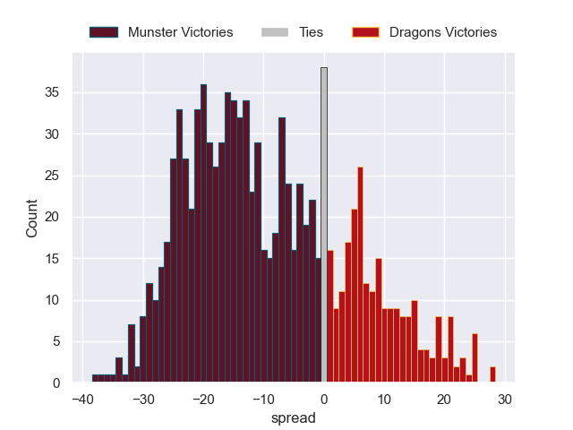

### Edinburgh V Bulls on 2026/01/23

Average Margin: Edinburgh by 2.3

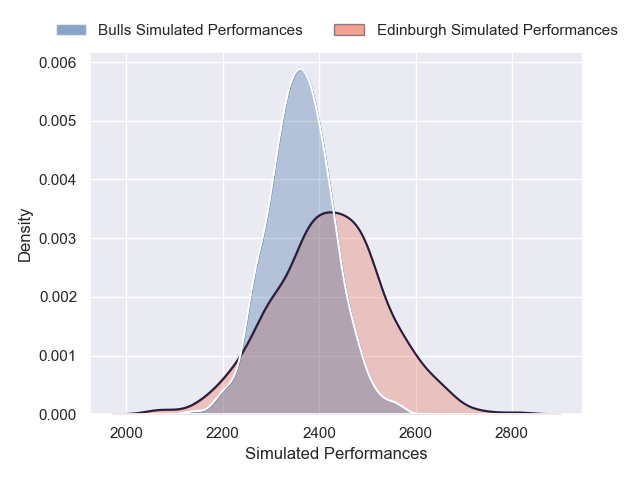

### Scarlets V Ulster on 2026/01/24

Average Margin: Ulster by 0.7

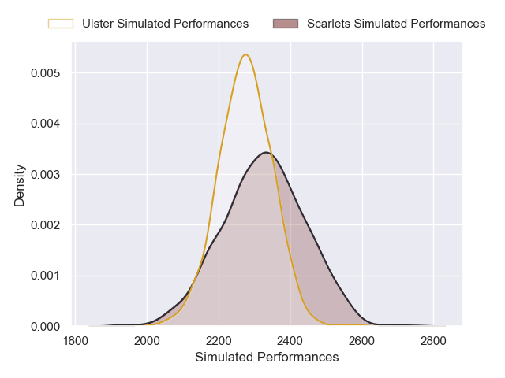

### Connacht V Leinster on 2026/01/24

Average Margin: Leinster by 2.0

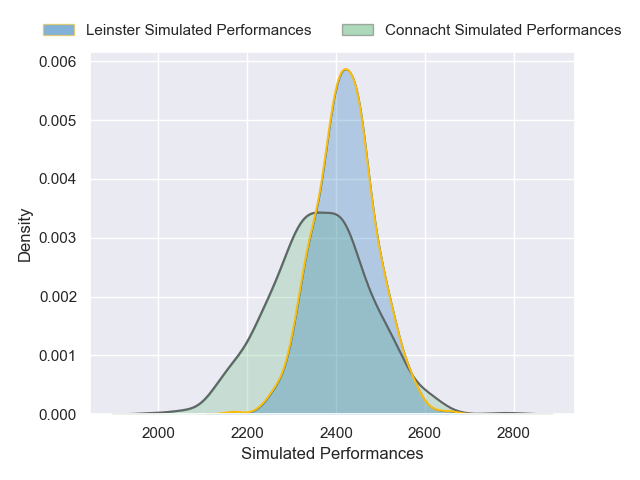

### Stormers V Sharks on 2026/01/24

Average Margin: Stormers by 6.9

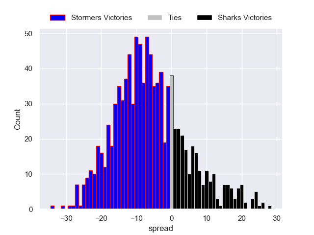

### Zebre V Glasgow Warriors on 2026/01/24

Average Margin: Glasgow Warriors by 5.9

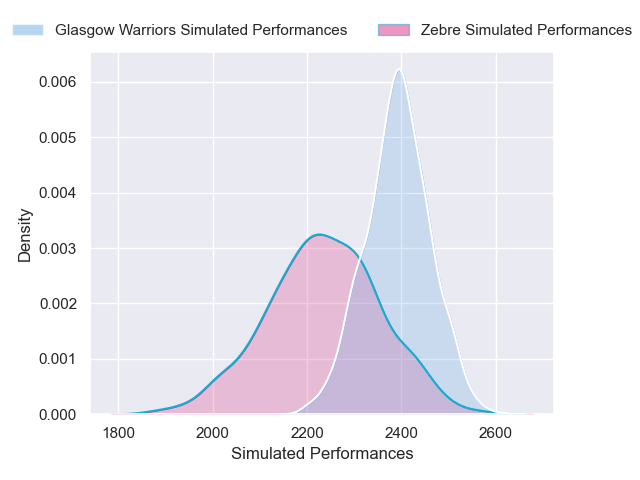

### Cardiff Rugby V Benetton Treviso on 2026/01/24

Average Margin: Cardiff Rugby by 1.7

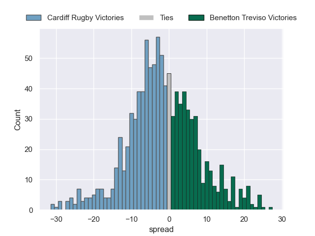

## Week 13

### Glasgow Warriors V Munster on 2026/01/30

Average Margin: Glasgow Warriors by 4.4

### Benetton Treviso V Scarlets on 2026/01/30

Average Margin: Benetton Treviso by 3.5

### Zebre V Connacht on 2026/01/31

Average Margin: Connacht by 1.0

### Ulster V Cardiff Rugby on 2026/01/31

Average Margin: Ulster by 6.4

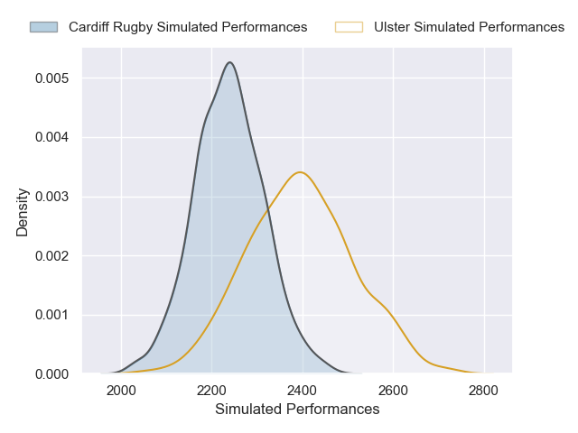

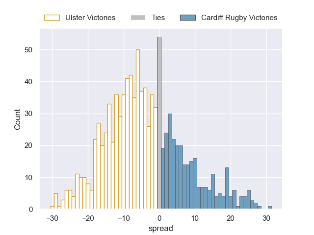

### Leinster V Edinburgh on 2026/01/31

Average Margin: Leinster by 7.7

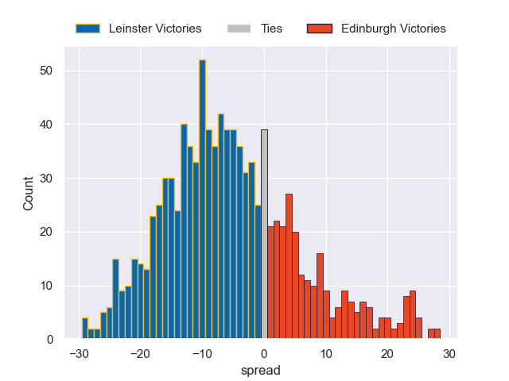

### Sharks V Stormers on 2026/01/31

Average Margin: Stormers by 3.2

### Lions V Bulls on 2026/01/31

Average Margin: Lions by 1.9

### Ospreys V Dragons on 2026/01/31

Average Margin: Ospreys by 6.2

## Week 14

### Lions V Sharks on 2026/02/21

Average Margin: Lions by 1.8

## Week 15

### Cardiff Rugby V Leinster on 2026/02/27

Average Margin: Leinster by 3.3

### Edinburgh V Scarlets on 2026/02/27

Average Margin: Edinburgh by 4.6

### Ospreys V Ulster on 2026/02/28

Average Margin: Ospreys by 0.8

### Lions V Stormers on 2026/02/28

Average Margin: Stormers by 1.6

### Dragons V Benetton Treviso on 2026/02/28

Average Margin: Benetton Treviso by 0.1

### Bulls V Sharks on 2026/02/28

Average Margin: Bulls by 4.0

### Connacht V Glasgow Warriors on 2026/02/28

Average Margin: Glasgow Warriors by 1.0

### Munster V Zebre on 2026/02/28

Average Margin: Munster by 8.8

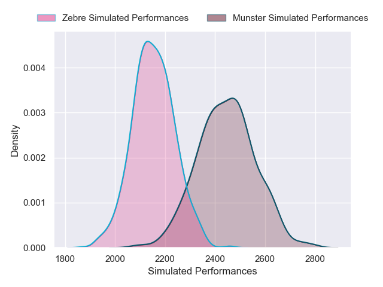

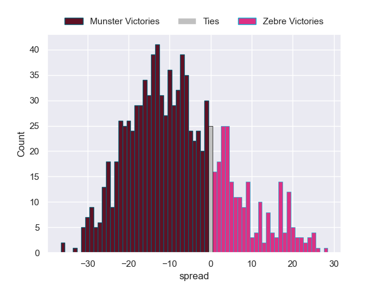

## Week 16

### Bulls V Stormers on 2026/03/14

Average Margin: Stormers by 0.0

## Week 17

### Scarlets V Zebre on 2026/03/20

Average Margin: Scarlets by 5.4

### Bulls V Cardiff Rugby on 2026/03/20

Average Margin: Bulls by 4.7

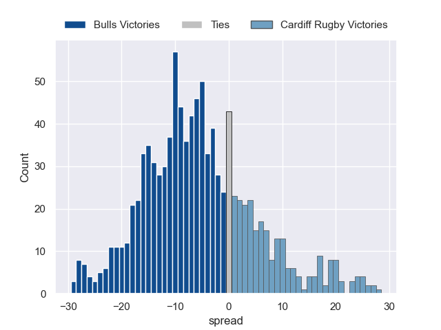

### Ulster V Connacht on 2026/03/20

Average Margin: Ulster by 6.0

### Stormers V Dragons on 2026/03/21

Average Margin: Stormers by 9.4

### Glasgow Warriors V Leinster on 2026/03/21

Average Margin: Glasgow Warriors by 2.2

### Sharks V Munster on 2026/03/21

Average Margin: Sharks by 0.6

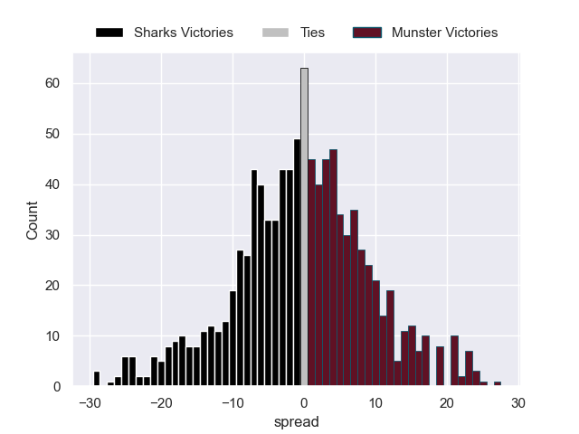

### Benetton Treviso V Ospreys on 2026/03/21

Average Margin: Benetton Treviso by 3.7

### Lions V Edinburgh on 2026/03/21

Average Margin: Lions by 2.0

## Week 18

### Sharks V Cardiff Rugby on 2026/03/27

Average Margin: Sharks by 3.3

### Glasgow Warriors V Benetton Treviso on 2026/03/27

Average Margin: Glasgow Warriors by 7.4

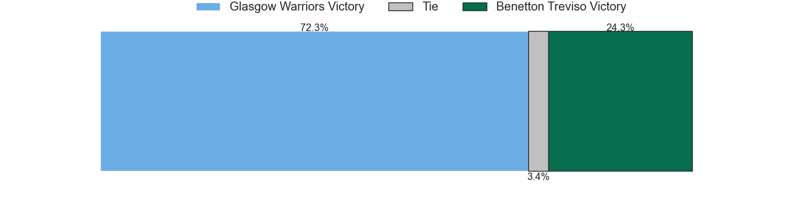
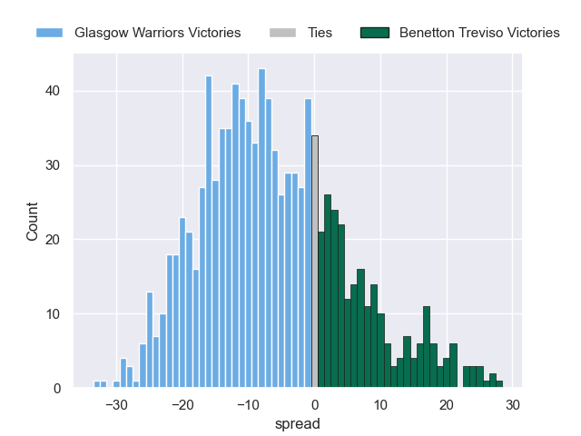

### Stormers V Edinburgh on 2026/03/28

Average Margin: Stormers by 6.1

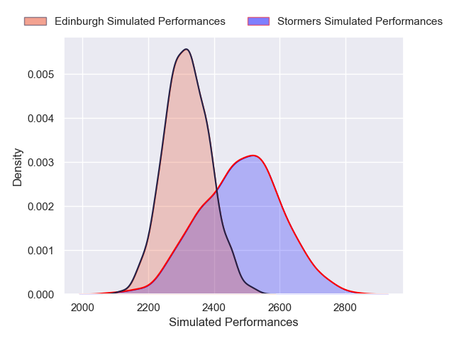

### Leinster V Scarlets on 2026/03/28

Average Margin: Leinster by 7.8

### Zebre V Ulster on 2026/03/28

Average Margin: Ulster by 2.8

### Bulls V Munster on 2026/03/28

Average Margin: Bulls by 1.9

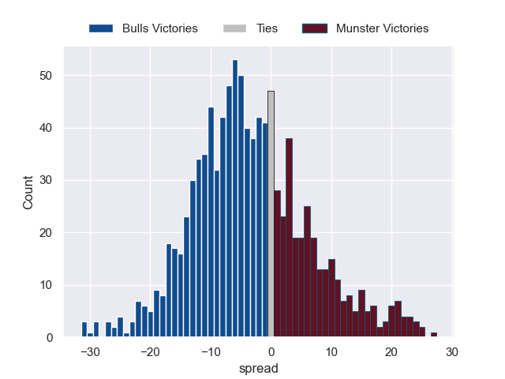

### Connacht V Ospreys on 2026/03/28

Average Margin: Connacht by 2.9

### Lions V Dragons on 2026/03/28

Average Margin: Lions by 5.8

## Week 19

### Edinburgh V Zebre on 2026/04/17

Average Margin: Edinburgh by 7.0

### Dragons V Bulls on 2026/04/17

Average Margin: Bulls by 2.0

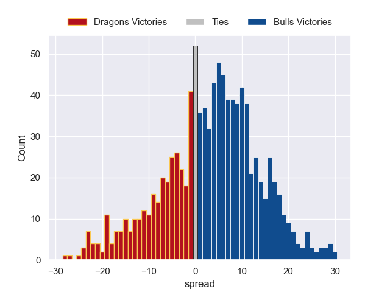

### Ulster V Leinster on 2026/04/17

Average Margin: Ulster by 1.1

### Ospreys V Sharks on 2026/04/18

Average Margin: Ospreys by 1.9

### Benetton Treviso V Munster on 2026/04/18

Average Margin: Benetton Treviso by 1.2

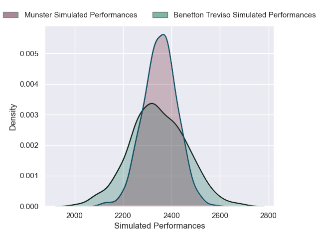

### Lions V Glasgow Warriors on 2026/04/18

Average Margin: Glasgow Warriors by 1.0

### Stormers V Connacht on 2026/04/18

Average Margin: Stormers by 7.4

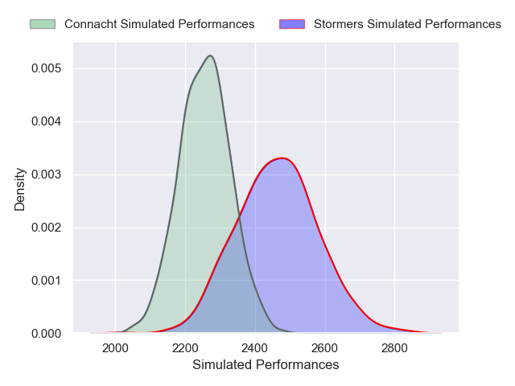

### Scarlets V Cardiff Rugby on 2026/04/18

Average Margin: Scarlets by 2.5

## Week 20

### Cardiff Rugby V Ospreys on 2026/04/24

Average Margin: Cardiff Rugby by 2.3

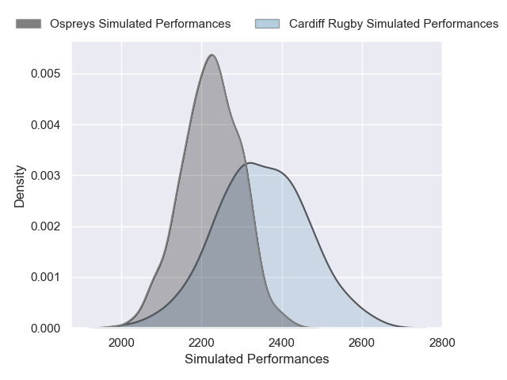
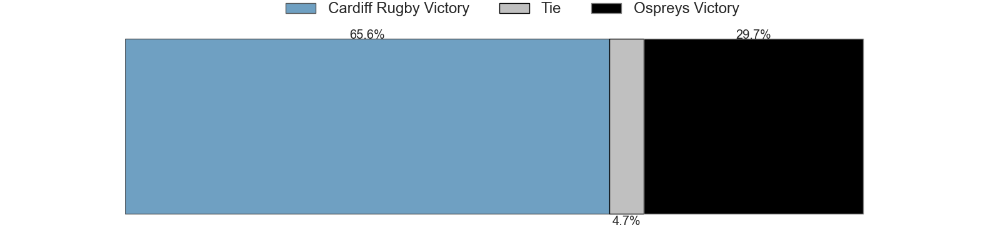
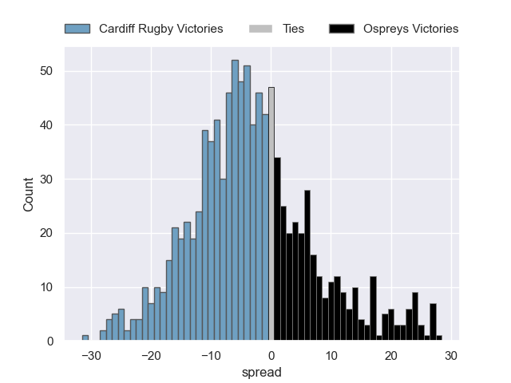

### Zebre V Dragons on 2026/04/24

Average Margin: Zebre by 2.4

### Edinburgh V Sharks on 2026/04/24

Average Margin: Edinburgh by 3.4

### Munster V Ulster on 2026/04/25

Average Margin: Munster by 3.1

### Scarlets V Bulls on 2026/04/25

Average Margin: Scarlets by 0.8

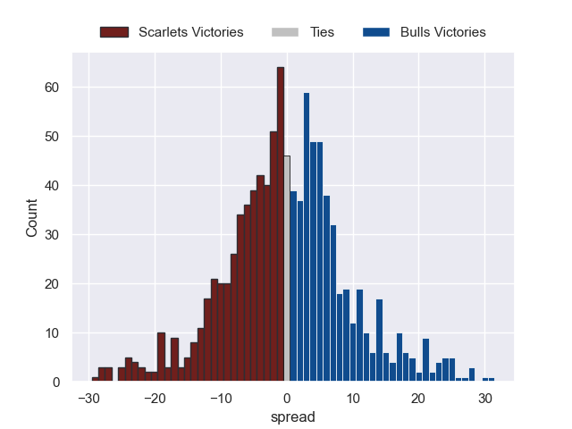

### Benetton Treviso V Leinster on 2026/04/25

Average Margin: Leinster by 1.4

### Lions V Connacht on 2026/04/25

Average Margin: Lions by 2.7

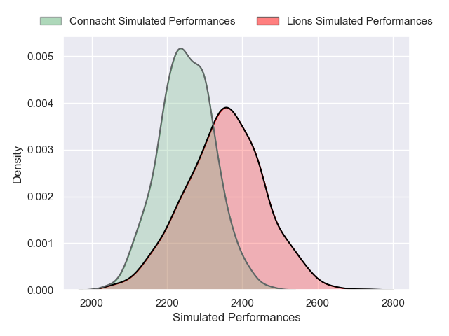

### Stormers V Glasgow Warriors on 2026/04/25

Average Margin: Stormers by 2.8

## Week 21

### Ulster V Stormers on 2026/05/08

Average Margin: Ulster by 1.3

### Glasgow Warriors V Cardiff Rugby on 2026/05/08

Average Margin: Glasgow Warriors by 6.5

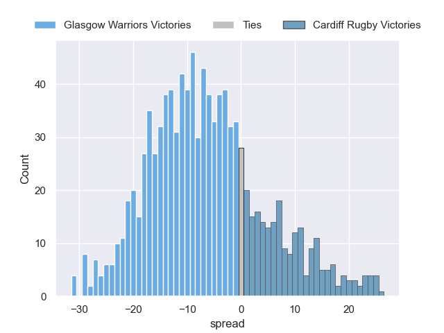

### Connacht V Munster on 2026/05/09

Average Margin: Connacht by 1.2

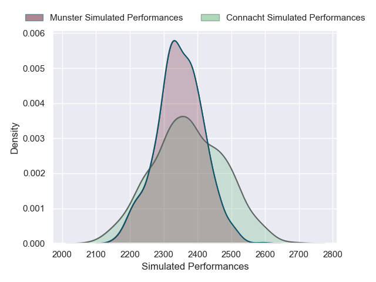

### Dragons V Edinburgh on 2026/05/09

Average Margin: Edinburgh by 1.1

### Leinster V Lions on 2026/05/09

Average Margin: Leinster by 7.5

### Bulls V Zebre on 2026/05/09

Average Margin: Bulls by 7.4

### Sharks V Benetton Treviso on 2026/05/09

Average Margin: Sharks by 3.2

### Ospreys V Scarlets on 2026/05/09

Average Margin: Ospreys by 2.9

## Week 22

### Edinburgh V Connacht on 2026/05/15

Average Margin: Edinburgh by 4.2

### Ulster V Glasgow Warriors on 2026/05/15

Average Margin: Ulster by 1.6

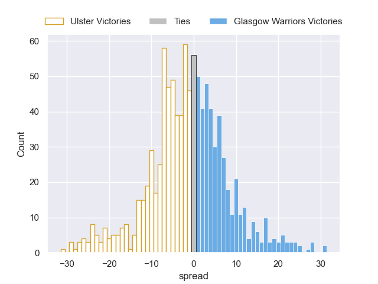

### Cardiff Rugby V Stormers on 2026/05/15

Average Margin: Stormers by 1.7

### Leinster V Ospreys on 2026/05/16

Average Margin: Leinster by 7.8

### Bulls V Benetton Treviso on 2026/05/16

Average Margin: Bulls by 4.9

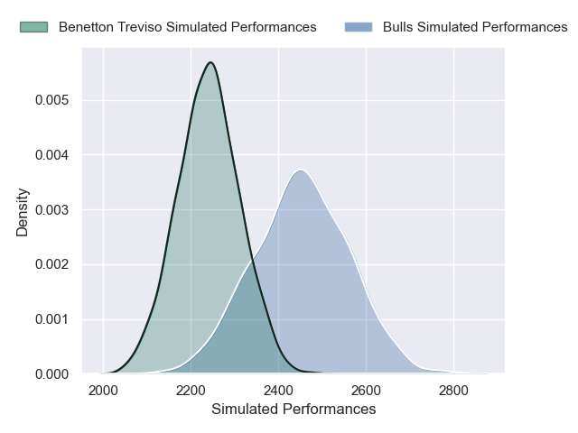

### Sharks V Zebre on 2026/05/16

Average Margin: Sharks by 6.0

### Munster V Lions on 2026/05/16

Average Margin: Munster by 5.1

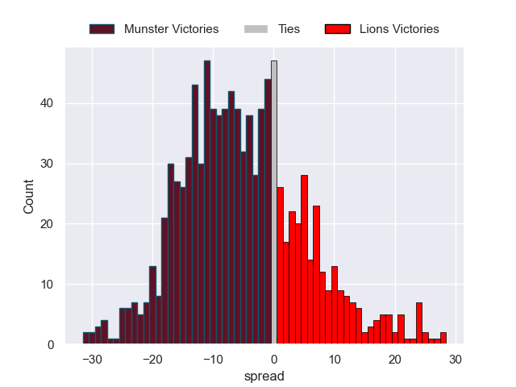

### Scarlets V Dragons on 2026/05/16

Average Margin: Scarlets by 4.4

## Week 23

### Leinster V Lions on 2026-05-29

Average Margin: Leinster by 11.1

### Glasgow Warriors V Dragons on 2026-05-29

Average Margin: Dragons by 1.0

### Stormers V Dragons on 2026-05-29

Average Margin: Stormers by 12.0

### Bulls V Edinburgh on 2026-05-29

Average Margin: Edinburgh by 5.0

### Lions V Ospreys on 2026-05-29

Average Margin: Lions by 10.0

### Cardiff Rugby V Edinburgh on 2026-05-29

Average Margin: Cardiff Rugby by 3.0

### Cardiff Rugby V Benetton Treviso on 2026-05-29

Average Margin: Benetton Treviso by 10.0

### Lions V Edinburgh on 2026-05-29

Average Margin: Edinburgh by 0.0

### Lions V Benetton Treviso on 2026-05-29

Average Margin: Lions by 8.0

### Glasgow Warriors V Leinster on 2026-05-29

Average Margin: Glasgow Warriors by 1.1

### Bulls V Cardiff Rugby on 2026-05-29

Average Margin: Bulls by 4.0

### Stormers V Edinburgh on 2026-05-29

Average Margin: Stormers by 9.3

### Ulster V Dragons on 2026-05-29

Average Margin: Ulster by 5.3

### Stormers V Benetton Treviso on 2026-05-29

Average Margin: Stormers by 13.5

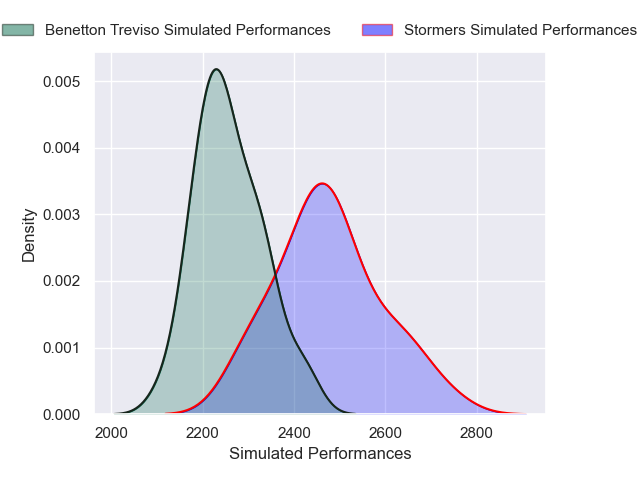

### Stormers V Ulster on 2026-05-29

Average Margin: Stormers by 7.5

### Stormers V Glasgow Warriors on 2026-05-29

Average Margin: Stormers by 6.0

### Ulster V Sharks on 2026-05-29

Average Margin: Ulster by 8.7

### Glasgow Warriors V Scarlets on 2026-05-29

Average Margin: Glasgow Warriors by 17.0

### Lions V Connacht on 2026-05-29

Average Margin: Lions by 1.0

### Bulls V Benetton Treviso on 2026-05-29

Average Margin: Benetton Treviso by 9.0

### Glasgow Warriors V Ulster on 2026-05-29

Average Margin: Glasgow Warriors by 14.5

### Stormers V Scarlets on 2026-05-29

Average Margin: Stormers by 21.0

### Ospreys V Leinster on 2026-05-29

Average Margin: Leinster by 3.7

### Edinburgh V Bulls on 2026-05-29

Average Margin: Edinburgh by 9.0

### Connacht V Lions on 2026-05-29

Average Margin: Connacht by 12.0

### Lions V Stormers on 2026-05-29

Average Margin: Lions by 0.1

### Cardiff Rugby V Glasgow Warriors on 2026-05-29

Average Margin: Glasgow Warriors by 1.3

### Sharks V Munster on 2026-05-29

Average Margin: Sharks by 1.0

### Cardiff Rugby V Lions on 2026-05-29

Average Margin: Cardiff Rugby by 3.1

### Lions V Leinster on 2026-05-29

Average Margin: Leinster by 3.4

### Bulls V Munster on 2026-05-29

Average Margin: Bulls by 1.7

### Munster V Leinster on 2026-05-29

Average Margin: Munster by 2.8

### Lions V Munster on 2026-05-29

Average Margin: Lions by 1.4

### Munster V Sharks on 2026-05-29

Average Margin: Munster by 11.0

### Lions V Dragons on 2026-05-29

Average Margin: Dragons by 12.0

### Bulls V Connacht on 2026-05-29

Average Margin: Bulls by 8.0

### Leinster V Scarlets on 2026-05-29

Average Margin: Scarlets by 0.0

### Glasgow Warriors V Stormers on 2026-05-29

Average Margin: Stormers by 3.0

### Cardiff Rugby V Leinster on 2026-05-29

Average Margin: Leinster by 2.6

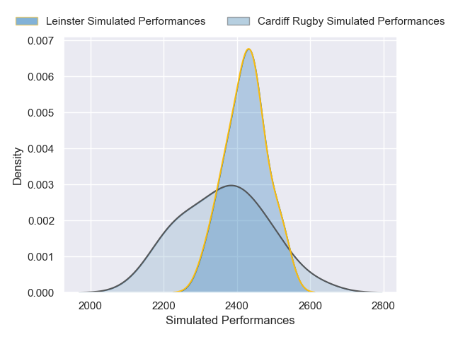

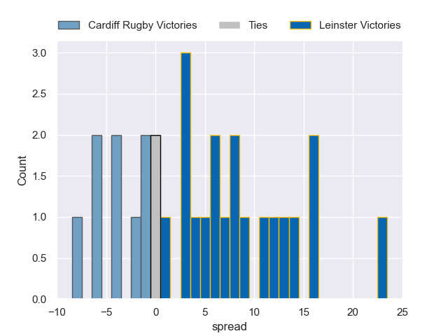

### Bulls V Lions on 2026-05-29

Average Margin: Bulls by 7.6

### Cardiff Rugby V Bulls on 2026-05-29

Average Margin: Bulls by 0.2

### Bulls V Leinster on 2026-05-29

Average Margin: Leinster by 1.0

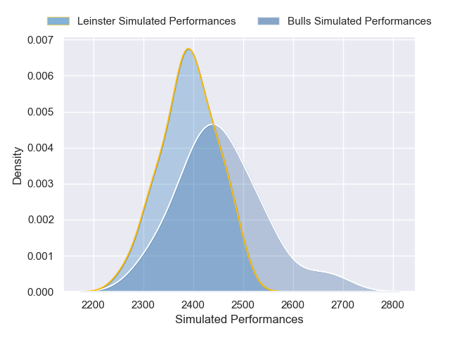

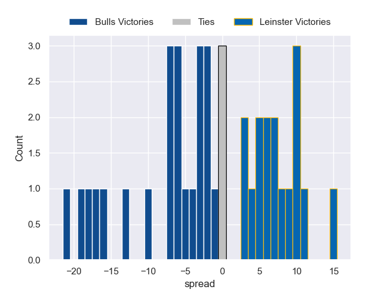

### Stormers V Connacht on 2026-05-29

Average Margin: Connacht by 6.6

### Munster V Connacht on 2026-05-29

Average Margin: Munster by 8.7

### Cardiff Rugby V Connacht on 2026-05-29

Average Margin: Cardiff Rugby by 8.0

### Glasgow Warriors V Connacht on 2026-05-29

Average Margin: Glasgow Warriors by 1.8

### Ulster V Glasgow Warriors on 2026-05-29

Average Margin: Ulster by 2.6

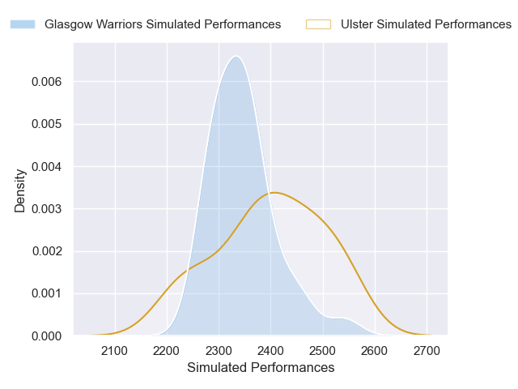

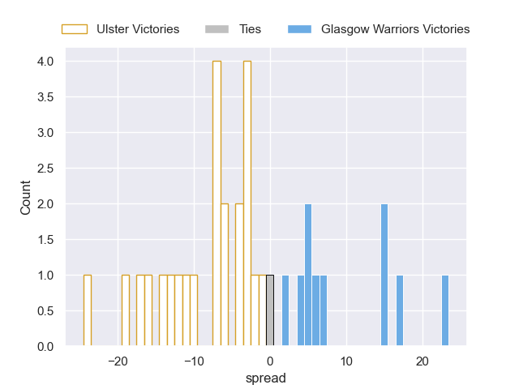

### Ulster V Munster on 2026-05-29

Average Margin: Ulster by 4.6

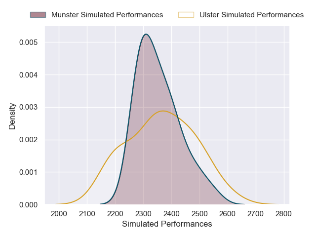

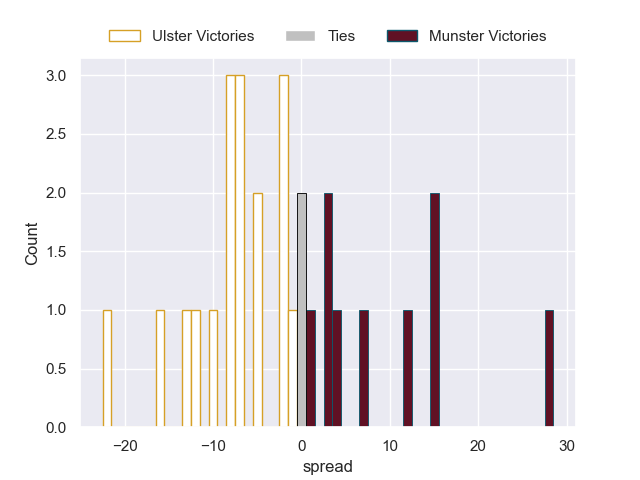

### Ulster V Bulls on 2026-05-29

Average Margin: Ulster by 7.4

### Munster V Cardiff Rugby on 2026-05-29

Average Margin: Munster by 10.1

### Ulster V Leinster on 2026-05-29

Average Margin: Leinster by 1.2

### Leinster V Glasgow Warriors on 2026-05-29

Average Margin: Leinster by 3.4

### Ulster V Lions on 2026-05-29

Average Margin: Ulster by 8.6

### Ulster V Ospreys on 2026-05-29

Average Margin: Ulster by 10.9

### Stormers V Lions on 2026-05-29

Average Margin: Stormers by 7.1

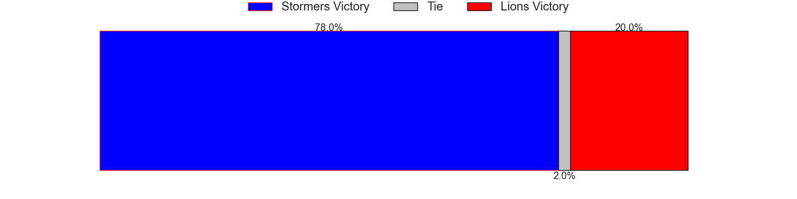
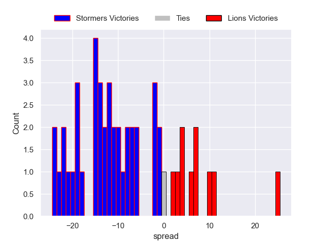

### Glasgow Warriors V Edinburgh on 2026-05-29

Average Margin: Glasgow Warriors by 7.5

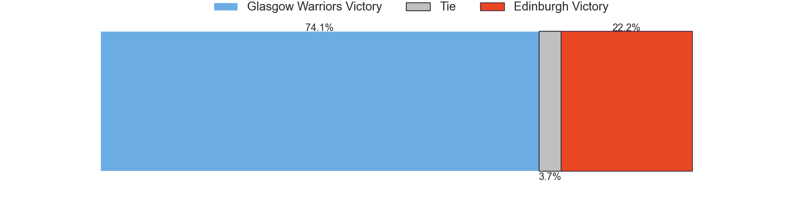
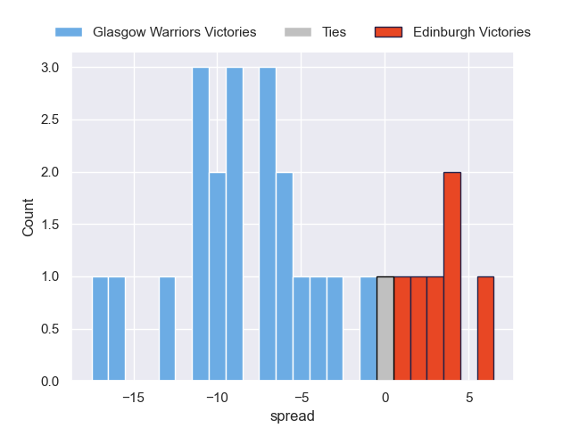

### Glasgow Warriors V Munster on 2026-05-29

Average Margin: Glasgow Warriors by 5.9

### Glasgow Warriors V Cardiff Rugby on 2026-05-29

Average Margin: Glasgow Warriors by 10.3

### Leinster V Cardiff Rugby on 2026-05-29

Average Margin: Leinster by 7.9

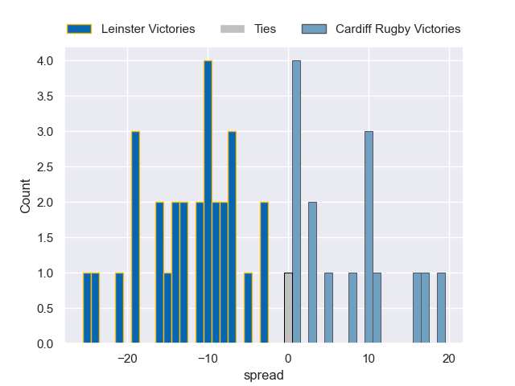

### Glasgow Warriors V Lions on 2026-05-29

Average Margin: Glasgow Warriors by 6.2

### Leinster V Ospreys on 2026-05-29

Average Margin: Ospreys by 1.3

### Stormers V Ospreys on 2026-05-29

Average Margin: Stormers by 8.0

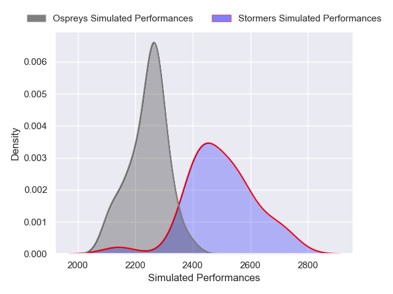

### Stormers V Cardiff Rugby on 2026-05-29

Average Margin: Stormers by 5.2

### Glasgow Warriors V Bulls on 2026-05-29

Average Margin: Glasgow Warriors by 5.8

### Stormers V Munster on 2026-05-29

Average Margin: Stormers by 8.6

### Glasgow Warriors V Sharks on 2026-05-29

Average Margin: Glasgow Warriors by 8.2

### Bulls V Ospreys on 2026-05-29

Average Margin: Ospreys by 9.0

### Leinster V Edinburgh on 2026-05-29

Average Margin: Leinster by 3.1

### Leinster V Munster on 2026-05-29

Average Margin: Leinster by 8.0

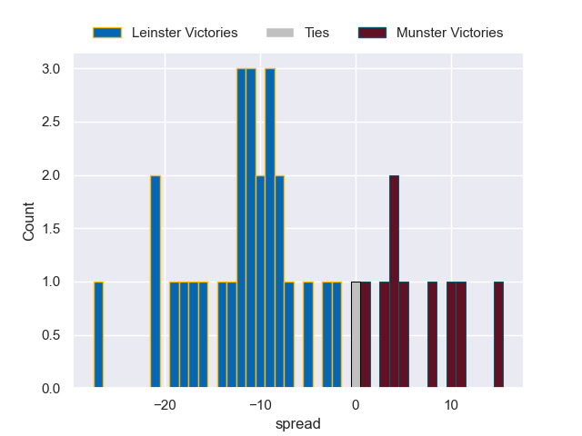

### Munster V Edinburgh on 2026-05-29

Average Margin: Munster by 9.4

### Ulster V Benetton Treviso on 2026-05-29

Average Margin: Ulster by 6.5

### Lions V Bulls on 2026-05-29

Average Margin: Bulls by 7.5

### Leinster V Sharks on 2026-05-29

Average Margin: Leinster by 10.2

### Munster V Bulls on 2026-05-29

Average Margin: Munster by 6.8

### Munster V Lions on 2026-05-29

Average Margin: Munster by 1.8

### Lions V Cardiff Rugby on 2026-05-29

Average Margin: Lions by 2.8

### Leinster V Connacht on 2026-05-29

Average Margin: Connacht by 5.2

### Munster V Benetton Treviso on 2026-05-29

Average Margin: Munster by 0.5

### Stormers V Leinster on 2026-05-29

Average Margin: Leinster by 1.4

### Glasgow Warriors V Ospreys on 2026-05-29

Average Margin: Glasgow Warriors by 7.1

### Leinster V Benetton Treviso on 2026-05-29

Average Margin: Leinster by 12.0

### Stormers V Sharks on 2026-05-29

Average Margin: Stormers by 5.5

### Munster V Ospreys on 2026-05-29

Average Margin: Ospreys by 0.7

### Stormers V Bulls on 2026-05-29

Average Margin: Stormers by 4.6

### Ulster V Connacht on 2026-05-29

Average Margin: Ulster by 3.2

### Ulster V Edinburgh on 2026-05-29

Average Margin: Ulster by 6.2

### Ulster V Cardiff Rugby on 2026-05-29

Average Margin: Ulster by 3.6

### Glasgow Warriors V Benetton Treviso on 2026-05-29

Average Margin: Glasgow Warriors by 3.0

### Leinster V Bulls on 2026-05-29

Average Margin: Leinster by 2.6

### Ospreys V Cardiff Rugby on 2026-05-29

Average Margin: Ospreys by 15.0

## Week 24

### Stormers V Munster on 2026-06-05

Average Margin: Stormers by 3.7

### Ulster V Leinster on 2026-06-05

Average Margin: Ulster by 0.9

### Cardiff Rugby V Stormers on 2026-06-05

Average Margin: Cardiff Rugby by 2.6

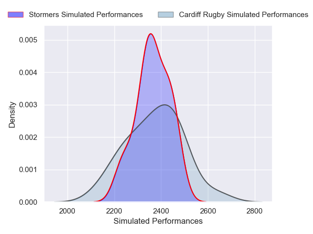
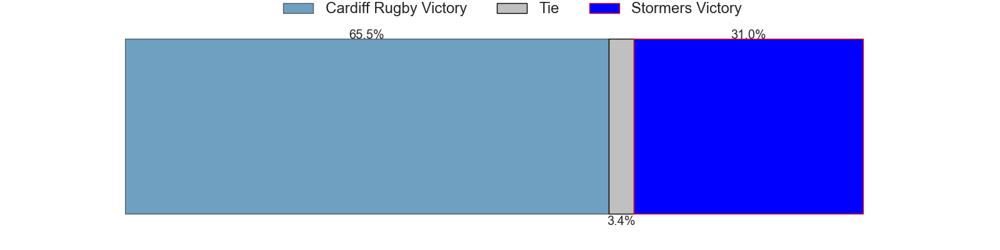
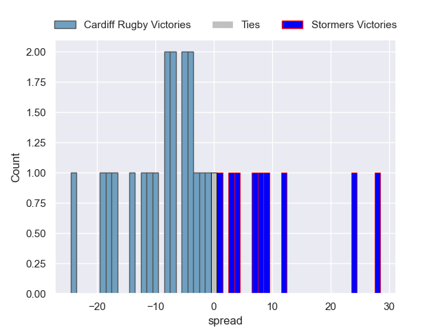

### Ospreys V Glasgow Warriors on 2026-06-05

Average Margin: Glasgow Warriors by 1.8

### Stormers V Glasgow Warriors on 2026-06-05

Average Margin: Stormers by 1.6

### Benetton Treviso V Stormers on 2026-06-05

Average Margin: Stormers by 1.0

### Stormers V Ospreys on 2026-06-05

Average Margin: Stormers by 3.0

### Benetton Treviso V Cardiff Rugby on 2026-06-05

Average Margin: Cardiff Rugby by 6.0

### Connacht V Cardiff Rugby on 2026-06-05

Average Margin: Connacht by 1.0

### Bulls V Cardiff Rugby on 2026-06-05

Average Margin: Bulls by 6.7

### Ospreys V Bulls on 2026-06-05

Average Margin: Ospreys by 7.0

### Connacht V Leinster on 2026-06-05

Average Margin: Leinster by 7.0

### Dragons V Munster on 2026-06-05

Average Margin: Dragons by 1.5

### Bulls V Edinburgh on 2026-06-05

Average Margin: Bulls by 13.0

### Sharks V Ulster on 2026-06-05

Average Margin: Sharks by 17.0

### Edinburgh V Cardiff Rugby on 2026-06-05

Average Margin: Edinburgh by 11.0

### Sharks V Munster on 2026-06-05

Average Margin: Sharks by 7.3

### Benetton Treviso V Munster on 2026-06-05

Average Margin: Benetton Treviso by 7.0

### Glasgow Warriors V Ospreys on 2026-06-05

Average Margin: Glasgow Warriors by 4.0

### Ospreys V Munster on 2026-06-05

Average Margin: Munster by 5.8

### Lions V Ulster on 2026-06-05

Average Margin: Lions by 2.2

### Edinburgh V Benetton Treviso on 2026-06-05

Average Margin: Benetton Treviso by 11.5

### Leinster V Munster on 2026-06-05

Average Margin: Leinster by 7.7

### Leinster V Benetton Treviso on 2026-06-05

Average Margin: Leinster by 2.9

### Dragons V Glasgow Warriors on 2026-06-05

Average Margin: Glasgow Warriors by 7.5

### Munster V Dragons on 2026-06-05

Average Margin: Dragons by 2.0

### Stormers V Connacht on 2026-06-05

Average Margin: Stormers by 13.5

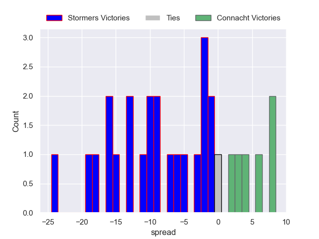

### Connacht V Munster on 2026-06-05

Average Margin: Connacht by 4.0

### Dragons V Stormers on 2026-06-05

Average Margin: Stormers by 2.0

### Connacht V Glasgow Warriors on 2026-06-05

Average Margin: Connacht by 0.5

### Lions V Ospreys on 2026-06-05

Average Margin: Ospreys by 2.0

### Ulster V Benetton Treviso on 2026-06-05

Average Margin: Benetton Treviso by 1.0

### Bulls V Benetton Treviso on 2026-06-05

Average Margin: Benetton Treviso by 0.0

### Connacht V Bulls on 2026-06-05

Average Margin: Connacht by 11.5

### Leinster V Edinburgh on 2026-06-05

Average Margin: Leinster by 6.6

### Leinster V Connacht on 2026-06-05

Average Margin: Leinster by 4.7

### Lions V Glasgow Warriors on 2026-06-05

Average Margin: Glasgow Warriors by 4.0

### Glasgow Warriors V Bulls on 2026-06-05

Average Margin: Glasgow Warriors by 4.2

### Edinburgh V Glasgow Warriors on 2026-06-05

Average Margin: Edinburgh by 0.4

### Lions V Connacht on 2026-06-05

Average Margin: Lions by 9.3

### Lions V Leinster on 2026-06-05

Average Margin: Lions by 1.5

### Lions V Munster on 2026-06-05

Average Margin: Munster by 0.2

### Ulster V Edinburgh on 2026-06-05

Average Margin: Ulster by 1.7

### Munster V Bulls on 2026-06-05

Average Margin: Munster by 1.9

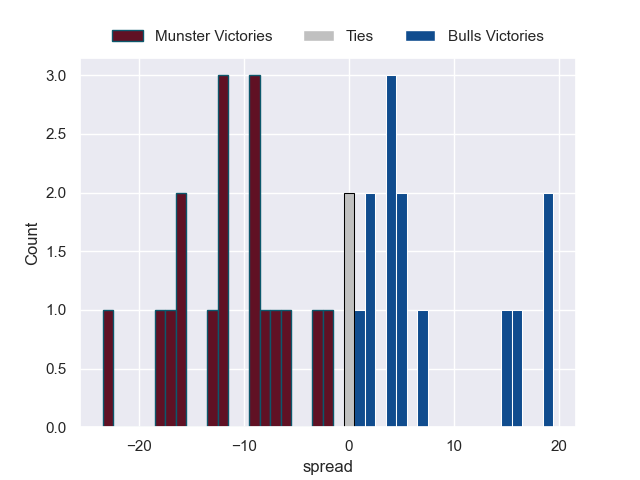

### Benetton Treviso V Lions on 2026-06-05

Average Margin: Benetton Treviso by 10.0

### Glasgow Warriors V Scarlets on 2026-06-05

Average Margin: Glasgow Warriors by 26.0

### Munster V Leinster on 2026-06-05

Average Margin: Leinster by 0.0

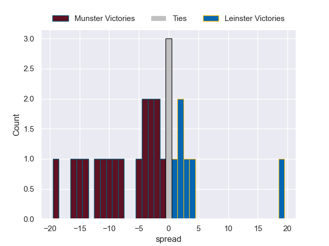

### Glasgow Warriors V Edinburgh on 2026-06-05

Average Margin: Glasgow Warriors by 8.7

### Benetton Treviso V Ulster on 2026-06-05

Average Margin: Benetton Treviso by 3.3

### Cardiff Rugby V Ulster on 2026-06-05

Average Margin: Cardiff Rugby by 0.9

### Leinster V Ulster on 2026-06-05

Average Margin: Leinster by 6.3

### Glasgow Warriors V Lions on 2026-06-05

Average Margin: Glasgow Warriors by 0.9

### Glasgow Warriors V Cardiff Rugby on 2026-06-05

Average Margin: Glasgow Warriors by 9.4

### Bulls V Glasgow Warriors on 2026-06-05

Average Margin: Bulls by 2.1

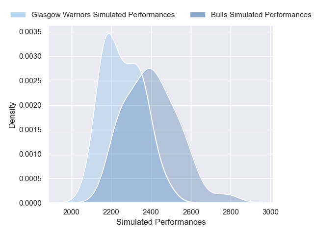

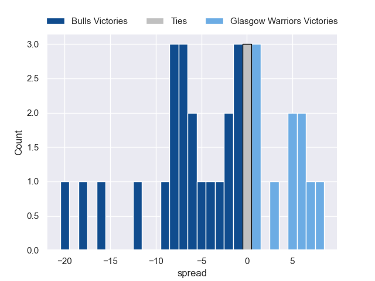

### Stormers V Ulster on 2026-06-05

Average Margin: Stormers by 4.6

### Glasgow Warriors V Stormers on 2026-06-05

Average Margin: Glasgow Warriors by 1.1

### Cardiff Rugby V Munster on 2026-06-05

Average Margin: Cardiff Rugby by 1.8

### Glasgow Warriors V Leinster on 2026-06-05

Average Margin: Glasgow Warriors by 0.8

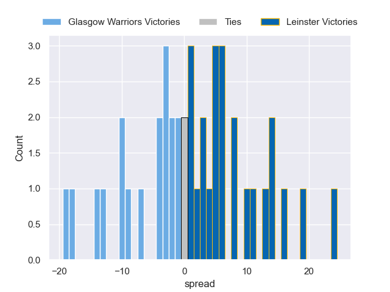

### Ospreys V Leinster on 2026-06-05

Average Margin: Ospreys by 0.2

### Stormers V Bulls on 2026-06-05

Average Margin: Stormers by 3.6

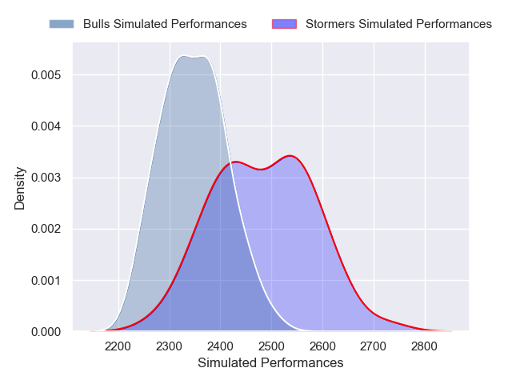
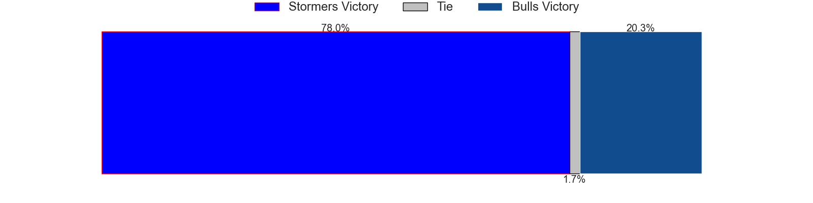
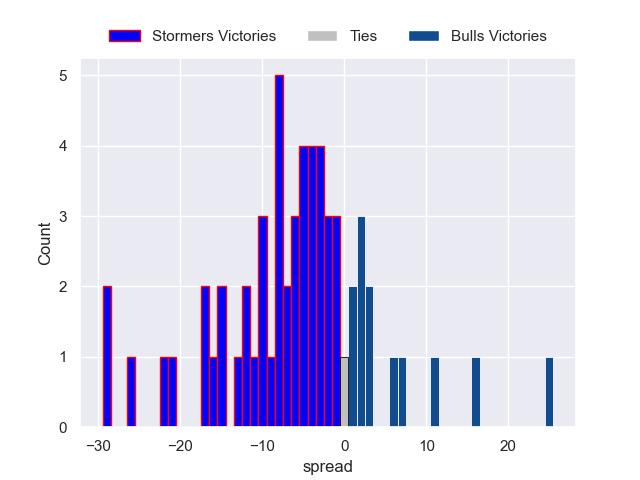

### Stormers V Cardiff Rugby on 2026-06-05

Average Margin: Stormers by 3.6

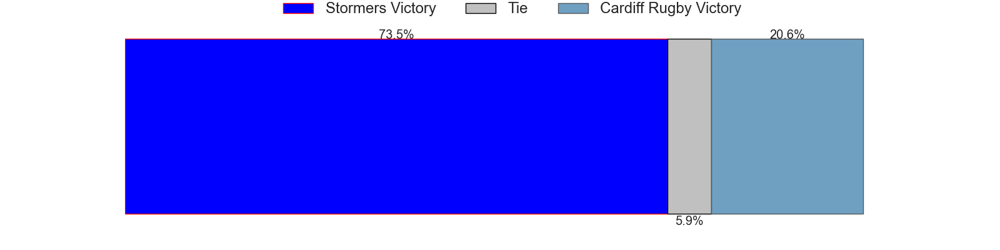
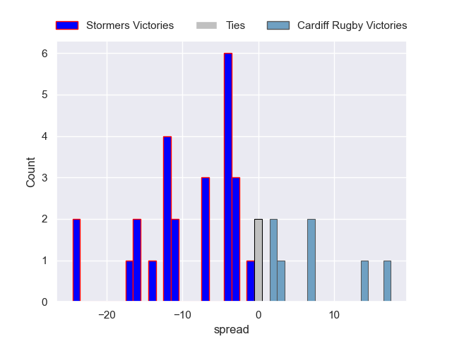

### Stormers V Lions on 2026-06-05

Average Margin: Stormers by 5.5

### Edinburgh V Ulster on 2026-06-05

Average Margin: Edinburgh by 2.9

### Glasgow Warriors V Munster on 2026-06-05

Average Margin: Glasgow Warriors by 3.6

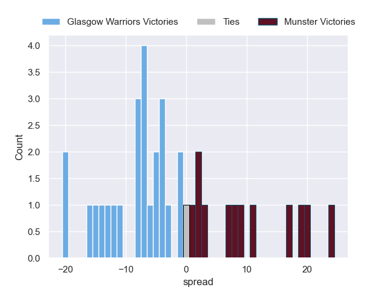

### Ulster V Lions on 2026-06-05

Average Margin: Ulster by 3.1

### Stormers V Leinster on 2026-06-05

Average Margin: Stormers by 3.2

### Sharks V Leinster on 2026-06-05

Average Margin: Leinster by 7.8

### Ulster V Munster on 2026-06-05

Average Margin: Ulster by 1.6

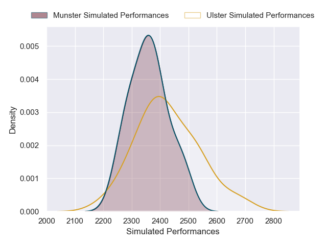

### Benetton Treviso V Leinster on 2026-06-05

Average Margin: Leinster by 0.0

### Edinburgh V Munster on 2026-06-05

Average Margin: Munster by 6.8

### Lions V Bulls on 2026-06-05

Average Margin: Bulls by 10.0

### Ospreys V Lions on 2026-06-05

Average Margin: Lions by 3.0

### Lions V Edinburgh on 2026-06-05

Average Margin: Edinburgh by 2.4

### Connacht V Lions on 2026-06-05

Average Margin: Connacht by 4.0

### Glasgow Warriors V Connacht on 2026-06-05

Average Margin: Connacht by 5.7

### Cardiff Rugby V Leinster on 2026-06-05

Average Margin: Leinster by 2.2

### Benetton Treviso V Glasgow Warriors on 2026-06-05

Average Margin: Glasgow Warriors by 1.4

### Ulster V Bulls on 2026-06-05

Average Margin: Ulster by 5.4

### Lions V Cardiff Rugby on 2026-06-05

Average Margin: Lions by 1.2

### Leinster V Lions on 2026-06-05

Average Margin: Leinster by 7.6

### Dragons V Bulls on 2026-06-05

Average Margin: Bulls by 2.0

### Glasgow Warriors V Ulster on 2026-06-05

Average Margin: Glasgow Warriors by 3.0

### Stormers V Edinburgh on 2026-06-05

Average Margin: Stormers by 6.8

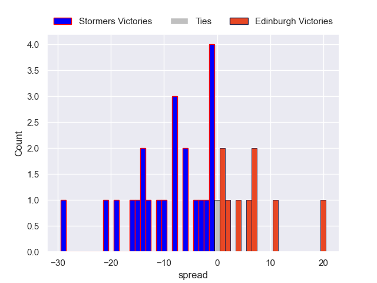

### Ospreys V Ulster on 2026-06-05

Average Margin: Ospreys by 6.0

### Munster V Lions on 2026-06-05

Average Margin: Munster by 5.3

### Leinster V Bulls on 2026-06-05

Average Margin: Leinster by 5.6

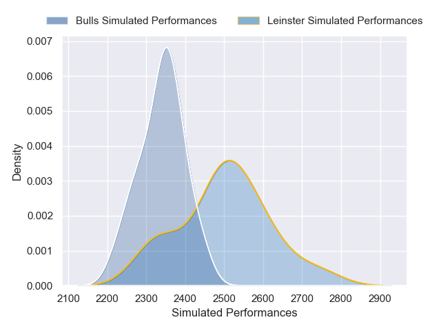

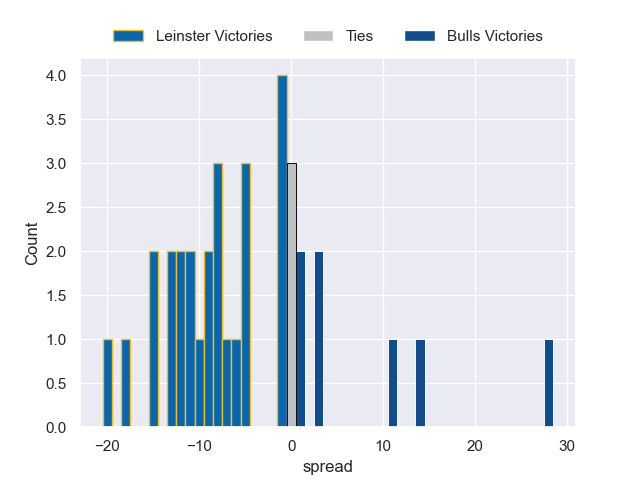

### Sharks V Glasgow Warriors on 2026-06-05

Average Margin: Sharks by 1.5

### Connacht V Ulster on 2026-06-05

Average Margin: Connacht by 5.2

### Edinburgh V Leinster on 2026-06-05

Average Margin: Edinburgh by 1.1

### Bulls V Munster on 2026-06-05

Average Margin: Bulls by 9.0

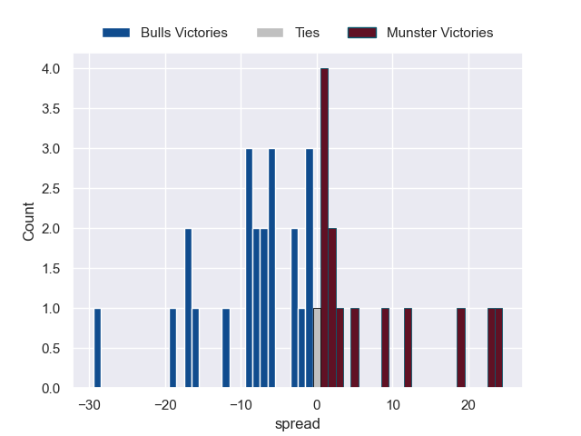

### Stormers V Sharks on 2026-06-05

Average Margin: Stormers by 17.0

### Sharks V Lions on 2026-06-05

Average Margin: Sharks by 6.0

### Edinburgh V Lions on 2026-06-05

Average Margin: Lions by 18.0

## Final

### Stormers V Leinster on 2026-06-19

Average Margin: Stormers by 0.6

### Sharks V Ulster on 2026-06-19

Average Margin: Ulster by 14.5

### Ulster V Cardiff Rugby on 2026-06-19

Average Margin: Ulster by 12.2

### Stormers V Edinburgh on 2026-06-19

Average Margin: Stormers by 7.3

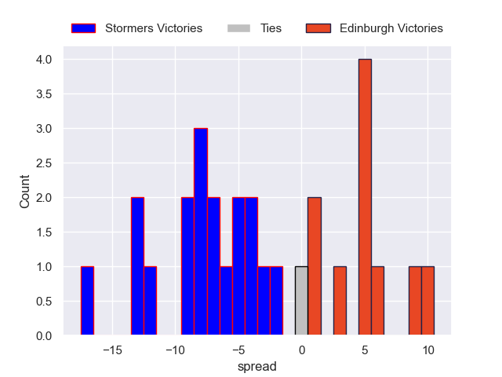

### Edinburgh V Benetton Treviso on 2026-06-19

Average Margin: Benetton Treviso by 4.0

### Munster V Bulls on 2026-06-19

Average Margin: Munster by 3.1

### Connacht V Leinster on 2026-06-19

Average Margin: Connacht by 5.2

### Glasgow Warriors V Connacht on 2026-06-19

Average Margin: Glasgow Warriors by 6.0

### Leinster V Ospreys on 2026-06-19

Average Margin: Ospreys by 2.5

### Lions V Ulster on 2026-06-19

Average Margin: Ulster by 0.9

### Lions V Munster on 2026-06-19

Average Margin: Lions by 1.3

### Lions V Connacht on 2026-06-19

Average Margin: Lions by 0.5

### Edinburgh V Lions on 2026-06-19

Average Margin: Edinburgh by 8.0

### Munster V Edinburgh on 2026-06-19

Average Margin: Edinburgh by 3.7

### Stormers V Ospreys on 2026-06-19

Average Margin: Stormers by 3.6

### Lions V Bulls on 2026-06-19

Average Margin: Bulls by 1.8

### Stormers V Sharks on 2026-06-19

Average Margin: Stormers by 3.5

### Glasgow Warriors V Sharks on 2026-06-19

Average Margin: Glasgow Warriors by 5.7

### Ospreys V Glasgow Warriors on 2026-06-19

Average Margin: Ospreys by 3.4

### Cardiff Rugby V Connacht on 2026-06-19

Average Margin: Cardiff Rugby by 27.0

### Connacht V Munster on 2026-06-19

Average Margin: Munster by 0.0

### Cardiff Rugby V Ospreys on 2026-06-19

Average Margin: Cardiff Rugby by 2.0

### Bulls V Dragons on 2026-06-19

Average Margin: Bulls by 11.0

### Edinburgh V Leinster on 2026-06-19

Average Margin: Leinster by 0.2

### Cardiff Rugby V Bulls on 2026-06-19

Average Margin: Bulls by 0.0

### Glasgow Warriors V Benetton Treviso on 2026-06-19

Average Margin: Glasgow Warriors by 5.3

### Benetton Treviso V Munster on 2026-06-19

Average Margin: Benetton Treviso by 9.0

### Benetton Treviso V Connacht on 2026-06-19

Average Margin: Benetton Treviso by 6.0

### Dragons V Stormers on 2026-06-19

Average Margin: Stormers by 1.0

### Edinburgh V Cardiff Rugby on 2026-06-19

Average Margin: Edinburgh by 23.0

### Ulster V Glasgow Warriors on 2026-06-19

Average Margin: Ulster by 1.4

### Edinburgh V Ulster on 2026-06-19

Average Margin: Edinburgh by 2.3

### Ospreys V Bulls on 2026-06-19

Average Margin: Ospreys by 9.0

### Sharks V Edinburgh on 2026-06-19

Average Margin: Sharks by 3.5

### Stormers V Glasgow Warriors on 2026-06-19

Average Margin: Stormers by 3.0

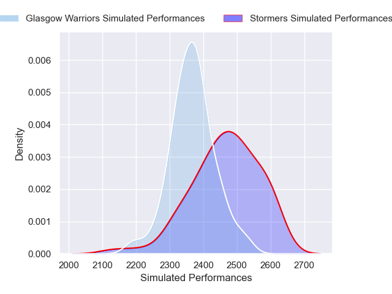

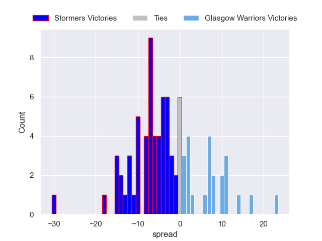

### Lions V Glasgow Warriors on 2026-06-19

Average Margin: Glasgow Warriors by 1.8

### Edinburgh V Glasgow Warriors on 2026-06-19

Average Margin: Edinburgh by 3.9

### Leinster V Glasgow Warriors on 2026-06-19

Average Margin: Leinster by 2.9

### Munster V Cardiff Rugby on 2026-06-19

Average Margin: Munster by 6.0

### Stormers V Ulster on 2026-06-19

Average Margin: Stormers by 6.1

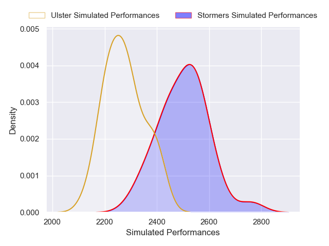

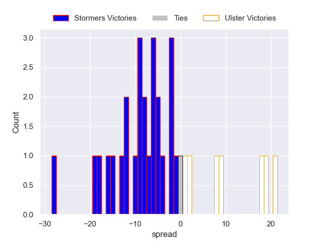

### Ospreys V Ulster on 2026-06-19

Average Margin: Ospreys by 2.0

### Munster V Ulster on 2026-06-19

Average Margin: Munster by 4.2

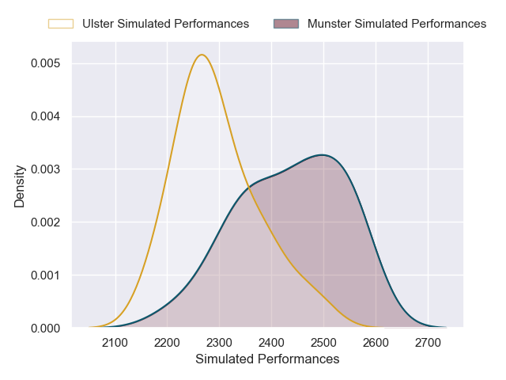

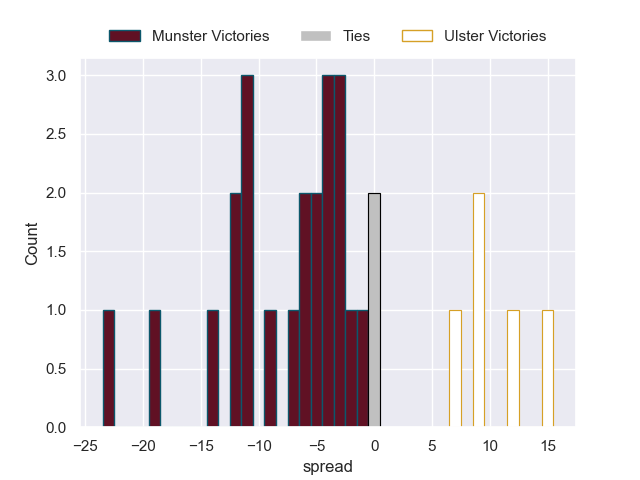

### Bulls V Ulster on 2026-06-19

Average Margin: Bulls by 1.4

### Leinster V Lions on 2026-06-19

Average Margin: Leinster by 7.2

### Stormers V Benetton Treviso on 2026-06-19

Average Margin: Stormers by 2.6

### Bulls V Leinster on 2026-06-19

Average Margin: Leinster by 0.3

### Cardiff Rugby V Lions on 2026-06-19

Average Margin: Cardiff Rugby by 7.4

### Cardiff Rugby V Leinster on 2026-06-19

Average Margin: Leinster by 3.1

### Benetton Treviso V Leinster on 2026-06-19

Average Margin: Benetton Treviso by 11.0

### Glasgow Warriors V Munster on 2026-06-19

Average Margin: Glasgow Warriors by 1.6

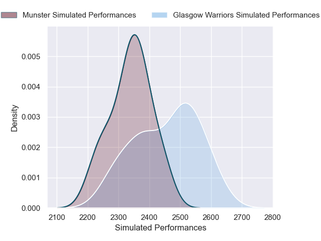

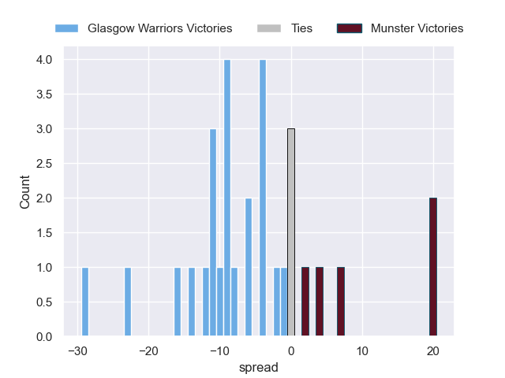

### Stormers V Munster on 2026-06-19

Average Margin: Stormers by 5.0

### Benetton Treviso V Ulster on 2026-06-19

Average Margin: Benetton Treviso by 1.5

### Munster V Leinster on 2026-06-19

Average Margin: Leinster by 0.6

### Bulls V Stormers on 2026-06-19

Average Margin: Bulls by 2.8

### Ulster V Leinster on 2026-06-19

Average Margin: Ulster by 0.7

### Stormers V Cardiff Rugby on 2026-06-19

Average Margin: Stormers by 3.1

### Cardiff Rugby V Glasgow Warriors on 2026-06-19

Average Margin: Glasgow Warriors by 1.4

### Edinburgh V Connacht on 2026-06-19

Average Margin: Edinburgh by 5.0

### Stormers V Lions on 2026-06-19

Average Margin: Stormers by 7.0

### Connacht V Stormers on 2026-06-19

Average Margin: Connacht by 5.7

### Sharks V Leinster on 2026-06-19

Average Margin: Leinster by 1.0

### Bulls V Glasgow Warriors on 2026-06-19

Average Margin: Bulls by 4.0

### Ospreys V Munster on 2026-06-19

Average Margin: Ospreys by 8.0

### Cardiff Rugby V Sharks on 2026-06-19

Average Margin: Cardiff Rugby by 19.0

