# Team Rankings

# Standings

## Current Standings

| Club             |   Played |   Wins |   Point Differential |   Losing Bonus Points |   Try Bonus Points |   Competition Points |
|:-----------------|---------:|-------:|---------------------:|----------------------:|-------------------:|---------------------:|
| Glasgow Warriors |       11 |      9 |                  155 |                     1 |                  7 |                   44 |
| Leinster         |       11 |      8 |                   67 |                     0 |                  8 |                   40 |
| Ulster           |       11 |      7 |                   94 |                     2 |                  6 |                   38 |
| Stormers         |       10 |      8 |                  113 |                     0 |                  4 |                   36 |
| Cardiff Rugby    |       11 |      7 |                   29 |                     3 |                  3 |                   34 |
| Munster          |       11 |      7 |                    9 |                     2 |                  4 |                   34 |
| Bulls            |       10 |      5 |                    5 |                     1 |                  4 |                   25 |
| Ospreys          |       11 |      4 |                  -24 |                     1 |                  4 |                   25 |
| Lions            |       10 |      4 |                  -43 |                     2 |                  4 |                   24 |
| Sharks           |       10 |      4 |                  -36 |                     1 |                  4 |                   23 |
| Connacht         |       10 |      3 |                  -26 |                     4 |                  5 |                   21 |
| Benetton Treviso |       11 |      4 |                  -65 |                     1 |                  2 |                   21 |
| Edinburgh        |       11 |      3 |                    1 |                     4 |                  2 |                   20 |
| Dragons          |       11 |      2 |                  -59 |                     4 |                  2 |                   18 |
| Scarlets         |       10 |      3 |                  -66 |                     1 |                    |                   15 |
| Zebre            |       11 |      2 |                 -154 |                     2 |                  2 |                   12 |

## Projected Remaining Table

| Club             |   To Play |   Projected Wins |   Projected Differential |   Projected Losing Bonus Points | Projected Try Bonus Points   |   Projected Competition Points |
|:-----------------|----------:|-----------------:|-------------------------:|--------------------------------:|:-----------------------------|-------------------------------:|
| Bulls            |         9 |            5.137 |                   19.584 |                           1.956 |                              |                         23.366 |
| Stormers         |         9 |            4.67  |                   11.815 |                           2.145 |                              |                         21.719 |
| Sharks           |         9 |            4.645 |                    9.53  |                           2.114 |                              |                         21.566 |
| Lions            |         9 |            4.306 |                   -2.077 |                           2.06  |                              |                         20.144 |
| Glasgow Warriors |         7 |            4.201 |                   20.786 |                           1.34  |                              |                         18.822 |
| Leinster         |         7 |            4.087 |                   23.35  |                           1.4   |                              |                         18.37  |
| Ulster           |         7 |            4.011 |                   16.311 |                           1.468 |                              |                         18.238 |
| Connacht         |         8 |            3.597 |                   -4.613 |                           1.996 |                              |                         17.108 |
| Scarlets         |         8 |            3.361 |                  -14.13  |                           1.894 |                              |                         16.042 |
| Edinburgh        |         7 |            3.42  |                    1.629 |                           1.622 |                              |                         15.984 |
| Munster          |         7 |            3.347 |                    2.649 |                           1.756 |                              |                         15.778 |
| Dragons          |         7 |            2.933 |                   -9.889 |                           1.815 |                              |                         14.221 |
| Benetton Treviso |         7 |            2.908 |                  -11.57  |                           1.738 |                              |                         13.994 |
| Cardiff Rugby    |         7 |            2.71  |                  -14.133 |                           1.85  |                              |                         13.422 |
| Ospreys          |         7 |            2.661 |                  -16.419 |                           1.758 |                              |                         13.098 |
| Zebre            |         7 |            2.118 |                  -32.823 |                           1.704 |                              |                         10.744 |

## Projected Total Table

| Club             |   Played |   Wins |   Point Differential |   Losing Bonus Points |   Try Bonus Points |   Competition Points |
|:-----------------|---------:|-------:|---------------------:|----------------------:|-------------------:|---------------------:|
| Glasgow Warriors |       18 | 13.201 |              175.786 |                 2.34  |                  7 |               62.822 |
| Leinster         |       18 | 12.087 |               90.35  |                 1.4   |                  8 |               58.37  |
| Stormers         |       19 | 12.67  |              124.815 |                 2.145 |                  4 |               57.719 |
| Ulster           |       18 | 11.011 |              110.311 |                 3.468 |                  6 |               56.238 |
| Munster          |       18 | 10.347 |               11.649 |                 3.756 |                  4 |               49.778 |
| Bulls            |       19 | 10.137 |               24.584 |                 2.956 |                  4 |               48.366 |
| Cardiff Rugby    |       18 |  9.71  |               14.867 |                 4.85  |                  3 |               47.422 |
| Sharks           |       19 |  8.645 |              -26.47  |                 3.114 |                  4 |               44.566 |
| Lions            |       19 |  8.306 |              -45.077 |                 4.06  |                  4 |               44.144 |
| Connacht         |       18 |  6.597 |              -30.613 |                 5.996 |                  5 |               38.108 |
| Ospreys          |       18 |  6.661 |              -40.419 |                 2.758 |                  4 |               38.098 |
| Edinburgh        |       18 |  6.42  |                2.629 |                 5.622 |                  2 |               35.984 |
| Benetton Treviso |       18 |  6.908 |              -76.57  |                 2.738 |                  2 |               34.994 |
| Dragons          |       18 |  4.933 |              -68.889 |                 5.815 |                  2 |               32.221 |
| Scarlets         |       18 |  6.361 |              -80.13  |                 2.894 |                    |               31.042 |
| Zebre            |       18 |  4.118 |             -186.823 |                 3.704 |                  2 |               22.744 |

## Projected Playoff Results

|                  | Reach Quarterfinal   | Win Quarterfinal   | Reach Semifinal   | Win Semifinal   | Reach Final   | Win Final   |
|:-----------------|:---------------------|:-------------------|:------------------|:----------------|:--------------|:------------|
| Glasgow Warriors | 100.0 %              | 73.0 %             | 73.0 %            | 45.9 %          | 45.9 %        | 26.8 %      |
| Leinster         | 99.7 %               | 67.1 %             | 67.1 %            | 37.7 %          | 37.7 %        | 17.1 %      |
| Ulster           | 99.4 %               | 62.0 %             | 62.0 %            | 25.5 %          | 25.5 %        | 15.3 %      |
| Stormers         | 99.9 %               | 61.6 %             | 61.6 %            | 30.5 %          | 30.5 %        | 12.1 %      |
| Munster          | 87.9 %               | 38.4 %             | 38.4 %            | 15.6 %          | 15.6 %        | 6.4 %       |
| Bulls            | 78.4 %               | 27.1 %             | 27.1 %            | 11.9 %          | 11.9 %        | 5.9 %       |
| Sharks           | 52.2 %               | 17.1 %             | 17.1 %            | 8.0 %           | 8.0 %         | 4.6 %       |
| Cardiff Rugby    | 81.2 %               | 24.1 %             | 24.1 %            | 9.6 %           | 9.6 %         | 3.7 %       |
| Lions            | 60.2 %               | 17.2 %             | 17.2 %            | 7.9 %           | 7.9 %         | 3.4 %       |
| Connacht         | 17.0 %               | 5.2 %              | 5.2 %             | 3.1 %           | 3.1 %         | 2.1 %       |
| Ospreys          | 12.6 %               | 4.4 %              | 4.4 %             | 2.7 %           | 2.7 %         | 1.8 %       |
| Edinburgh        | 7.8 %                | 1.7 %              | 1.7 %             | 1.0 %           | 1.0 %         | 0.5 %       |
| Dragons          | 1.0 %                | 0.3 %              | 0.3 %             | 0.2 %           | 0.2 %         | 0.2 %       |
| Benetton Treviso | 2.5 %                | 0.8 %              | 0.8 %             | 0.4 %           | 0.4 %         | 0.1 %       |
| Scarlets         | 0.2 %                | 0.0 %              | 0.0 %             | 0.0 %           | 0.0 %         | 0.0 %       |

# Completed Match Review

| Model | Percent Correct Predictions | Spread Error |
| ------ | ------ | ------ |
| Club Level | 63.5% | 9.1 |
| Player Level: Lineup | nan% | nan |
| Player Level: Minutes | nan% | nan |

# Future Predictions

## Week 12

### Connacht V Scarlets on 2025/10/04

Average Margin: Connacht by 4.8

## Week 13

### Bulls V Stormers on 2025/12/25

Average Margin: Stormers by 1.4

### Lions V Sharks on 2025/12/25

Average Margin: Lions by 4.0

## Week 14

### Lions V Sharks on 2026/02/21

Average Margin: Lions by 0.1

## Week 15

### Cardiff Rugby V Leinster on 2026/02/27

Average Margin: Leinster by 2.7

### Edinburgh V Scarlets on 2026/02/27

Average Margin: Edinburgh by 4.1

### Munster V Zebre on 2026/02/28

Average Margin: Munster by 7.2

### Bulls V Sharks on 2026/02/28

Average Margin: Bulls by 2.3

### Connacht V Glasgow Warriors on 2026/02/28

Average Margin: Glasgow Warriors by 1.7

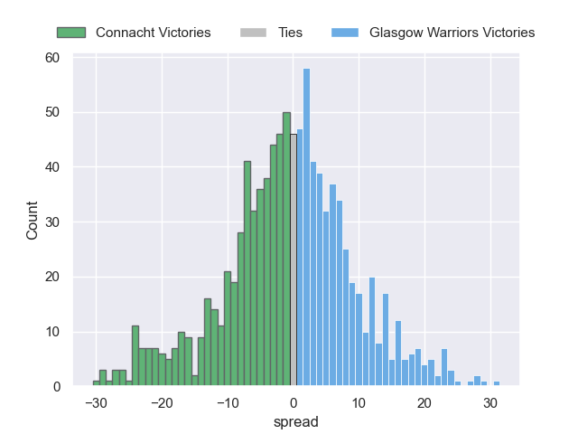

### Ospreys V Ulster on 2026/02/28

Average Margin: Ulster by 1.7

### Dragons V Benetton Treviso on 2026/02/28

Average Margin: Dragons by 1.2

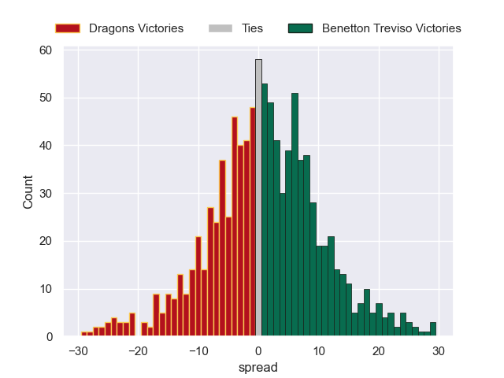

### Lions V Stormers on 2026/02/28

Average Margin: Stormers by 0.2

## Week 16

### Bulls V Stormers on 2026/03/14

Average Margin: Bulls by 1.8

## Week 17

### Bulls V Cardiff Rugby on 2026/03/20

Average Margin: Bulls by 4.4

### Scarlets V Zebre on 2026/03/20

Average Margin: Scarlets by 4.7

### Ulster V Connacht on 2026/03/20

Average Margin: Ulster by 6.0

### Lions V Edinburgh on 2026/03/21

Average Margin: Lions by 3.0

### Stormers V Dragons on 2026/03/21

Average Margin: Stormers by 6.7

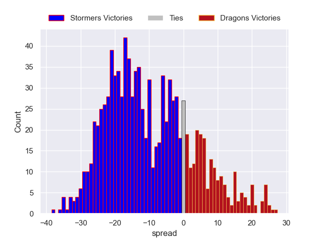

### Benetton Treviso V Ospreys on 2026/03/21

Average Margin: Benetton Treviso by 4.0

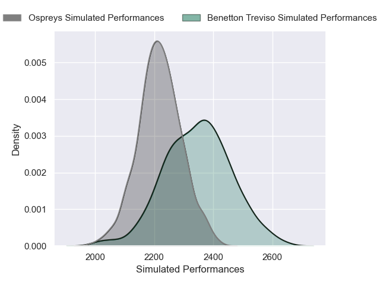

### Glasgow Warriors V Leinster on 2026/03/21

Average Margin: Glasgow Warriors by 3.1

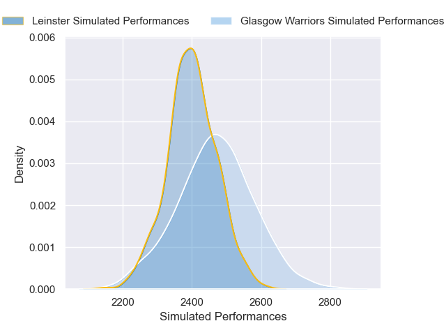

### Sharks V Munster on 2026/03/21

Average Margin: Sharks by 2.8

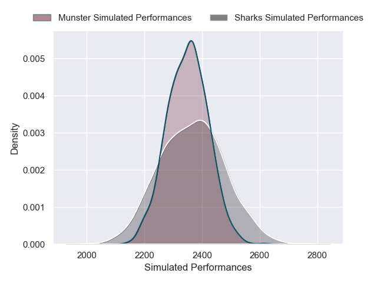

## Week 18

### Glasgow Warriors V Benetton Treviso on 2026/03/27

Average Margin: Glasgow Warriors by 7.8

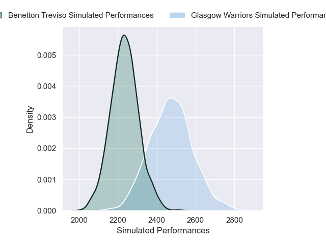

### Sharks V Cardiff Rugby on 2026/03/27

Average Margin: Sharks by 3.6

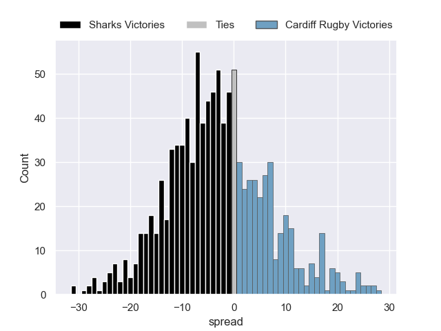

### Zebre V Ulster on 2026/03/28

Average Margin: Ulster by 3.5

### Leinster V Scarlets on 2026/03/28

Average Margin: Leinster by 8.8

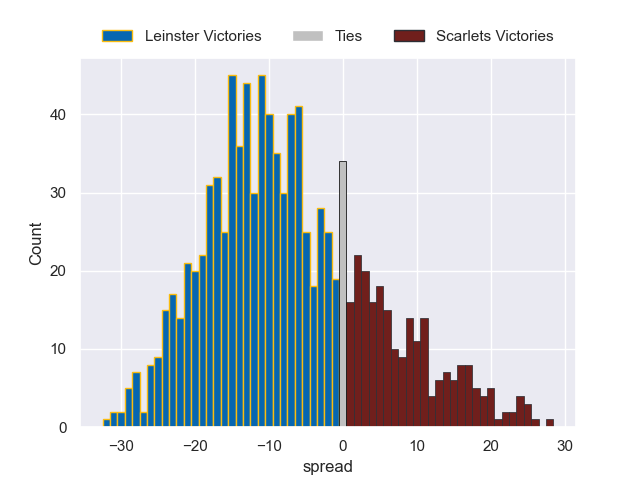

### Stormers V Edinburgh on 2026/03/28

Average Margin: Stormers by 6.2

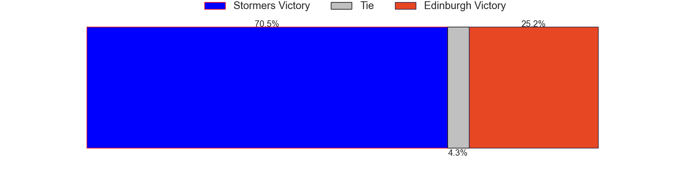

### Lions V Dragons on 2026/03/28

Average Margin: Lions by 4.3

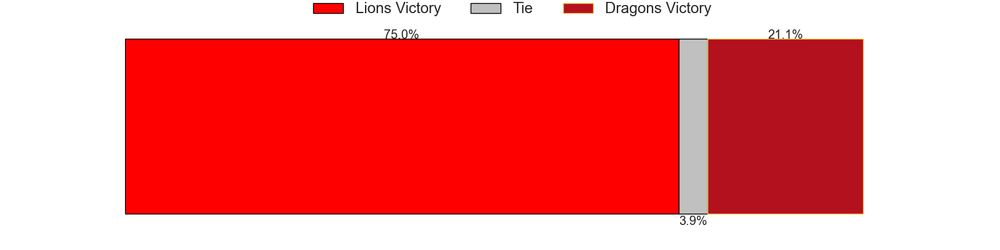

### Connacht V Ospreys on 2026/03/28

Average Margin: Connacht by 4.5

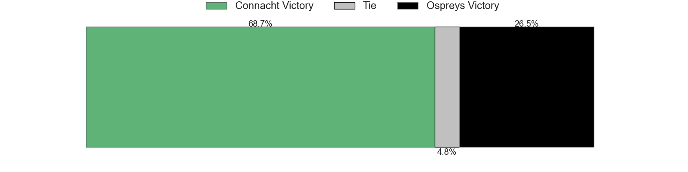
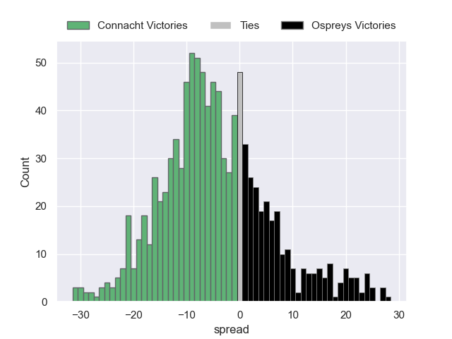

### Bulls V Munster on 2026/03/28

Average Margin: Bulls by 3.1

## Week 19

### Edinburgh V Zebre on 2026/04/17

Average Margin: Edinburgh by 5.3

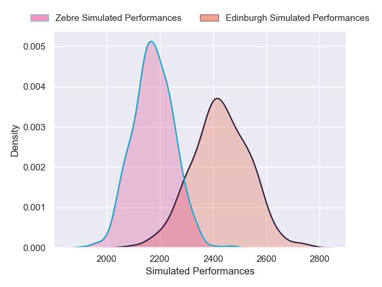

### Dragons V Bulls on 2026/04/17

Average Margin: Dragons by 0.6

### Ulster V Leinster on 2026/04/17

Average Margin: Ulster by 1.4

### Scarlets V Cardiff Rugby on 2026/04/18

Average Margin: Scarlets by 0.9

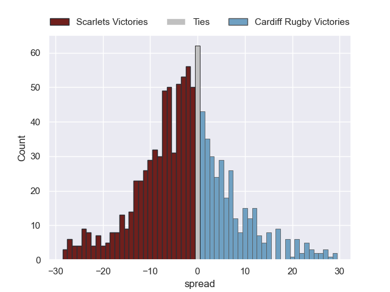

### Benetton Treviso V Munster on 2026/04/18

Average Margin: Benetton Treviso by 2.4

### Ospreys V Sharks on 2026/04/18

Average Margin: Ospreys by 0.3

### Stormers V Connacht on 2026/04/18

Average Margin: Stormers by 4.3

### Lions V Glasgow Warriors on 2026/04/18

Average Margin: Glasgow Warriors by 2.4

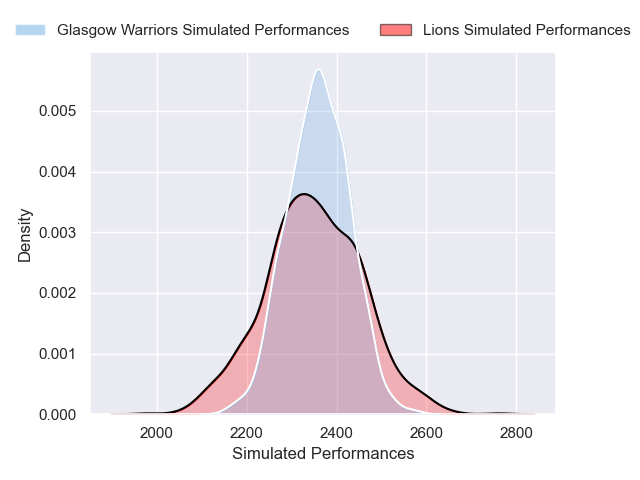

## Week 20

### Zebre V Dragons on 2026/04/24

Average Margin: Zebre by 1.0

### Cardiff Rugby V Ospreys on 2026/04/24

Average Margin: Cardiff Rugby by 3.2

### Edinburgh V Sharks on 2026/04/24

Average Margin: Edinburgh by 0.8

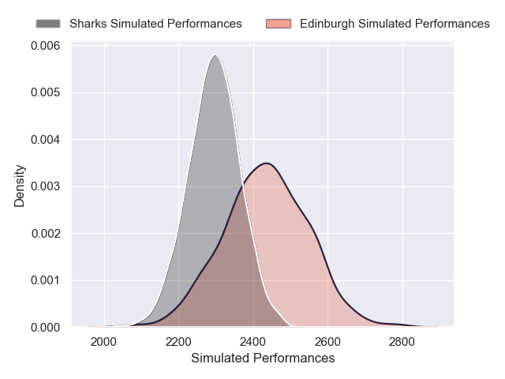

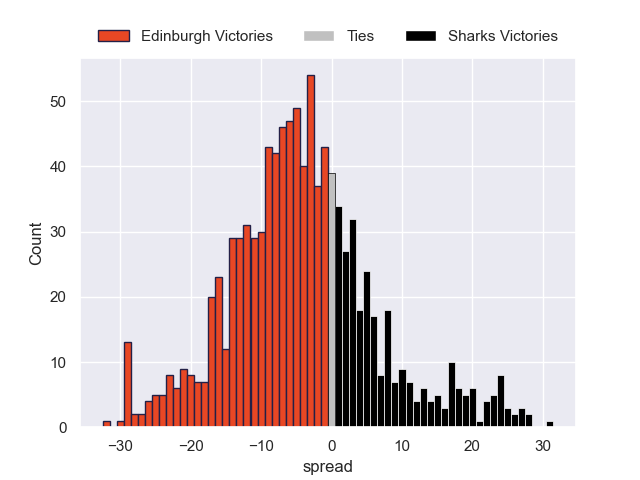

### Munster V Ulster on 2026/04/25

Average Margin: Munster by 1.4

### Stormers V Glasgow Warriors on 2026/04/25

Average Margin: Glasgow Warriors by 0.5

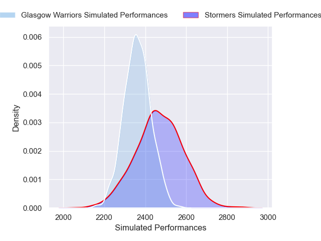

### Lions V Connacht on 2026/04/25

Average Margin: Lions by 1.5

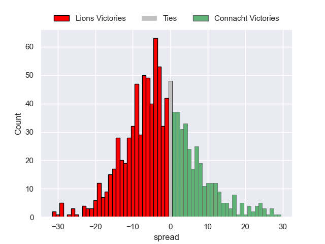

### Benetton Treviso V Leinster on 2026/04/25

Average Margin: Leinster by 1.0

### Scarlets V Bulls on 2026/04/25

Average Margin: Scarlets by 0.3

## Week 21

### Glasgow Warriors V Cardiff Rugby on 2026/05/08

Average Margin: Glasgow Warriors by 6.6

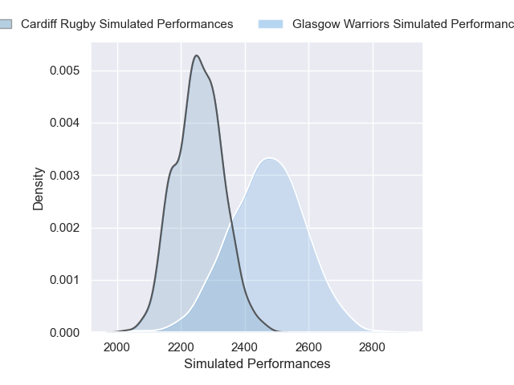

### Ulster V Stormers on 2026/05/08

Average Margin: Ulster by 3.8

### Sharks V Benetton Treviso on 2026/05/09

Average Margin: Sharks by 4.2

### Bulls V Zebre on 2026/05/09

Average Margin: Bulls by 6.7

### Connacht V Munster on 2026/05/09

Average Margin: Connacht by 2.2

### Dragons V Edinburgh on 2026/05/09

Average Margin: Dragons by 1.9

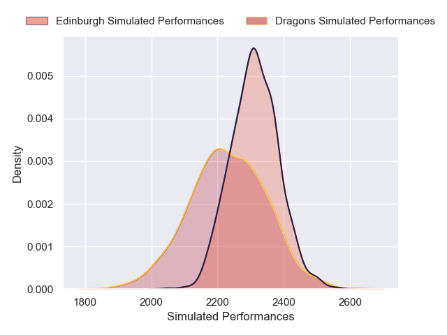

### Leinster V Lions on 2026/05/09

Average Margin: Leinster by 7.9

### Ospreys V Scarlets on 2026/05/09

Average Margin: Ospreys by 4.0

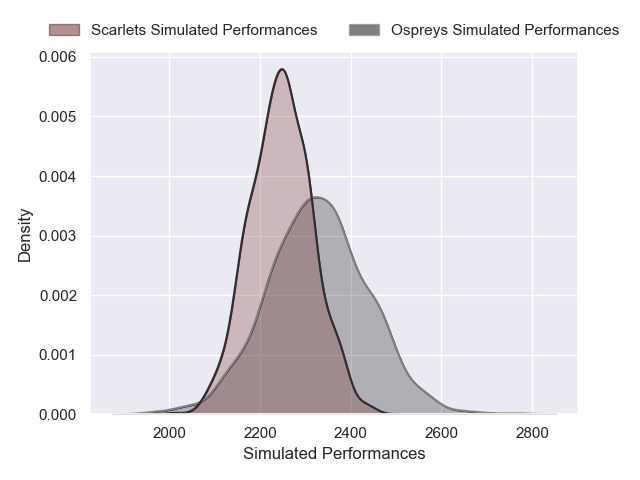

## Week 22

### Ulster V Glasgow Warriors on 2026/05/15

Average Margin: Ulster by 1.3

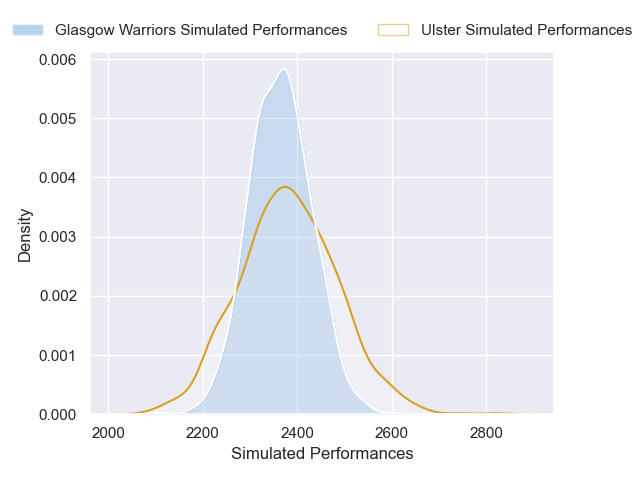

### Edinburgh V Connacht on 2026/05/15

Average Margin: Edinburgh by 2.5

### Cardiff Rugby V Stormers on 2026/05/15

Average Margin: Cardiff Rugby by 1.0

### Munster V Lions on 2026/05/16

Average Margin: Munster by 4.5

### Leinster V Ospreys on 2026/05/16

Average Margin: Leinster by 7.4

### Scarlets V Dragons on 2026/05/16

Average Margin: Scarlets by 1.6

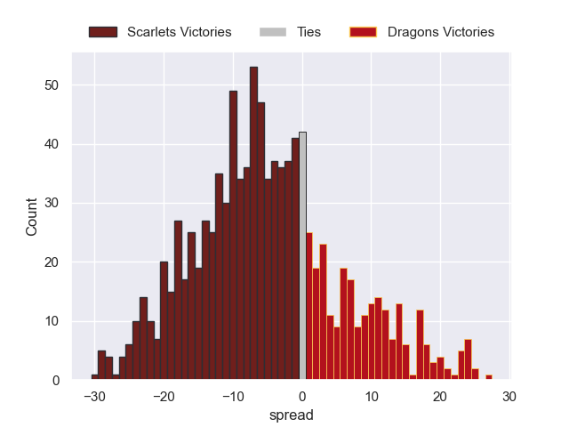

### Sharks V Zebre on 2026/05/16

Average Margin: Sharks by 6.2

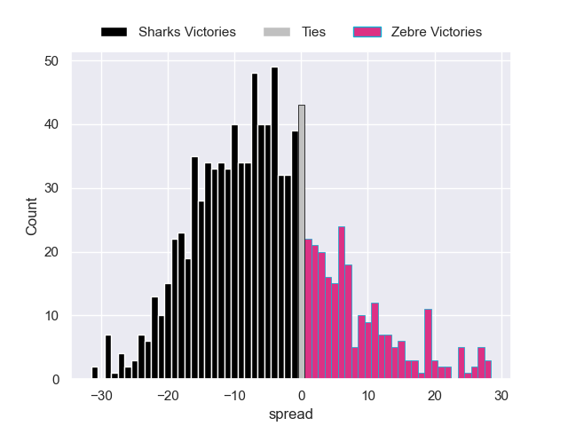

### Bulls V Benetton Treviso on 2026/05/16

Average Margin: Bulls by 3.7

## Week 23

### Stormers V Leinster on 2026-05-29

Average Margin: Stormers by 7.9

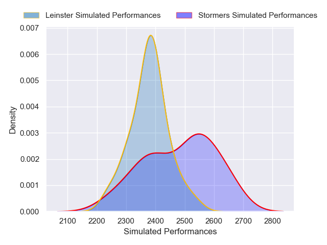
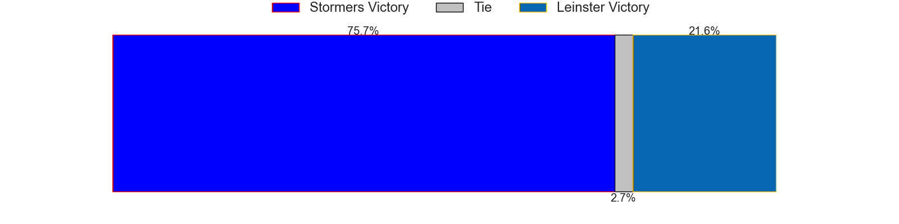

### Lions V Sharks on 2026-05-29

Average Margin: Lions by 26.0

### Sharks V Cardiff Rugby on 2026-05-29

Average Margin: Sharks by 18.7

### Bulls V Lions on 2026-05-29

Average Margin: Bulls by 5.0

### Bulls V Sharks on 2026-05-29

Average Margin: Bulls by 3.8

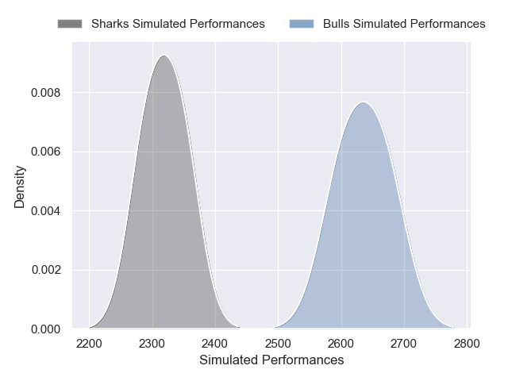

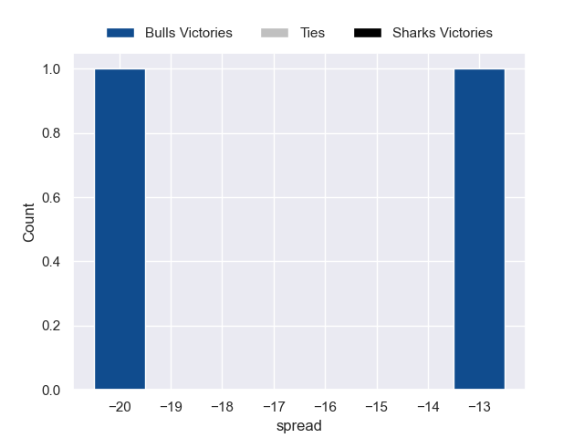

### Munster V Bulls on 2026-05-29

Average Margin: Munster by 5.2

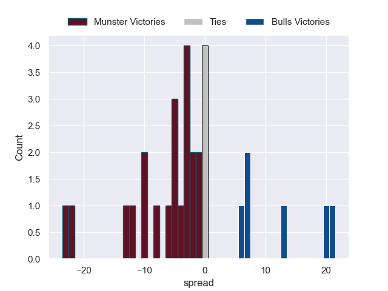

### Ulster V Stormers on 2026-05-29

Average Margin: Ulster by 3.1

### Munster V Cardiff Rugby on 2026-05-29

Average Margin: Munster by 4.9

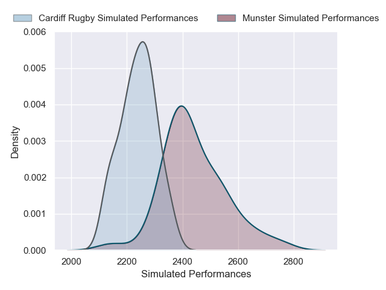

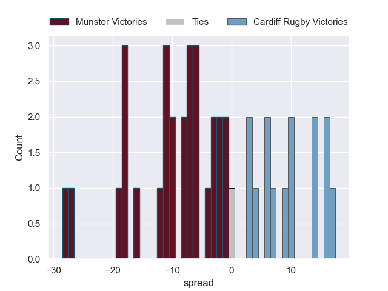

### Lions V Cardiff Rugby on 2026-05-29

Average Margin: Lions by 2.2

### Leinster V Benetton Treviso on 2026-05-29

Average Margin: Leinster by 1.0

### Leinster V Dragons on 2026-05-29

Average Margin: Leinster by 8.0

### Stormers V Edinburgh on 2026-05-29

Average Margin: Stormers by 5.0

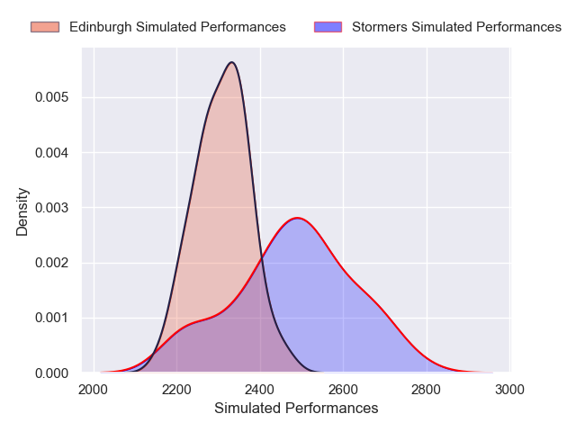

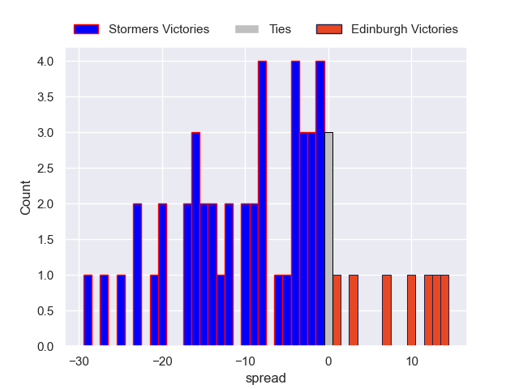

### Stormers V Benetton Treviso on 2026-05-29

Average Margin: Stormers by 3.0

### Cardiff Rugby V Sharks on 2026-05-29

Average Margin: Sharks by 15.0

### Cardiff Rugby V Edinburgh on 2026-05-29

Average Margin: Edinburgh by 0.0

### Glasgow Warriors V Leinster on 2026-05-29

Average Margin: Leinster by 11.0

### Munster V Sharks on 2026-05-29

Average Margin: Munster by 10.5

### Glasgow Warriors V Benetton Treviso on 2026-05-29

Average Margin: Benetton Treviso by 12.5

### Glasgow Warriors V Dragons on 2026-05-29

Average Margin: Glasgow Warriors by 3.2

### Ulster V Leinster on 2026-05-29

Average Margin: Ulster by 8.0

### Ulster V Dragons on 2026-05-29

Average Margin: Ulster by 1.5

### Ulster V Scarlets on 2026-05-29

Average Margin: Ulster by 18.0

### Connacht V Cardiff Rugby on 2026-05-29

Average Margin: Cardiff Rugby by 2.0

### Ospreys V Cardiff Rugby on 2026-05-29

Average Margin: Ospreys by 4.0

### Lions V Munster on 2026-05-29

Average Margin: Lions by 3.4

### Munster V Connacht on 2026-05-29

Average Margin: Munster by 9.0

### Bulls V Cardiff Rugby on 2026-05-29

Average Margin: Cardiff Rugby by 2.1

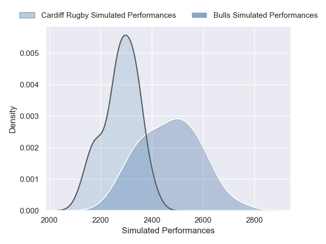

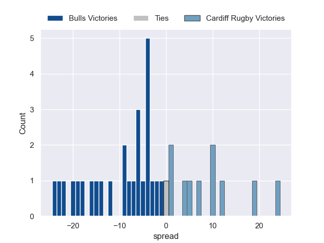

### Ospreys V Sharks on 2026-05-29

Average Margin: Ospreys by 7.5

### Ulster V Glasgow Warriors on 2026-05-29

Average Margin: Ulster by 4.2

### Cardiff Rugby V Stormers on 2026-05-29

Average Margin: Cardiff Rugby by 2.7

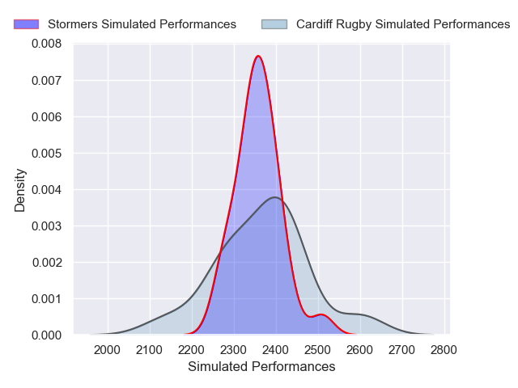

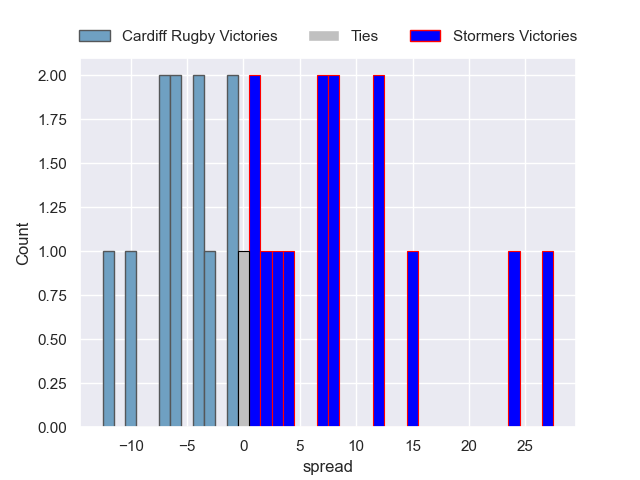

### Glasgow Warriors V Stormers on 2026-05-29

Average Margin: Glasgow Warriors by 7.0

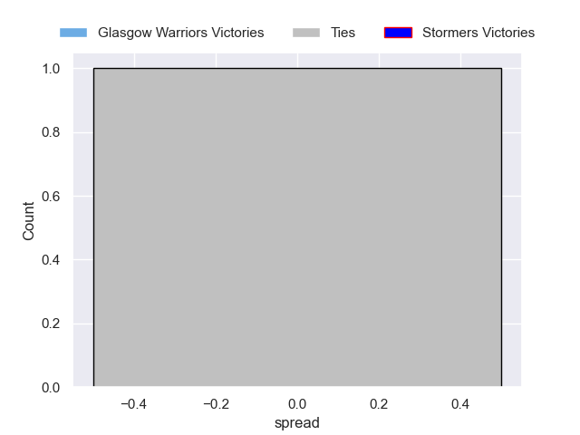

### Sharks V Lions on 2026-05-29

Average Margin: Lions by 11.0

### Lions V Leinster on 2026-05-29

Average Margin: Leinster by 0.4

### Bulls V Connacht on 2026-05-29

Average Margin: Bulls by 1.0

### Munster V Ulster on 2026-05-29

Average Margin: Munster by 2.5

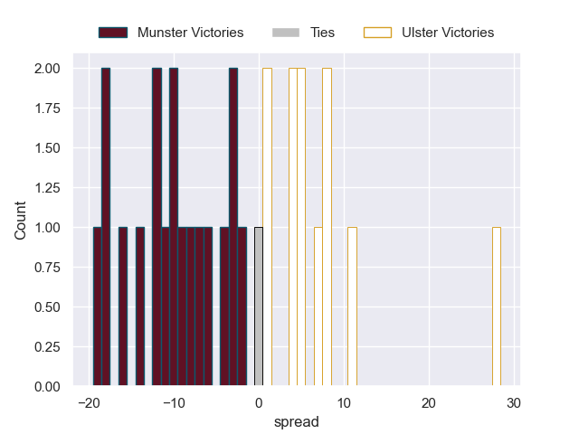

### Munster V Stormers on 2026-05-29

Average Margin: Munster by 1.7

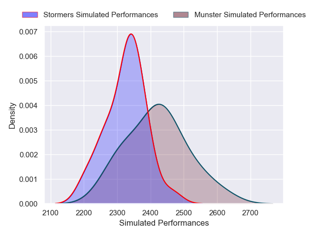

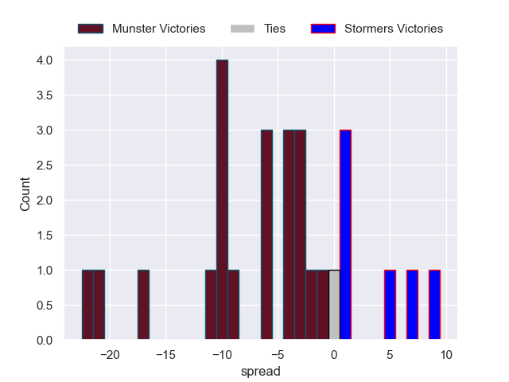

### Munster V Leinster on 2026-05-29

Average Margin: Munster by 1.4

### Cardiff Rugby V Connacht on 2026-05-29

Average Margin: Cardiff Rugby by 3.0

### Cardiff Rugby V Lions on 2026-05-29

Average Margin: Cardiff Rugby by 12.5

### Stormers V Scarlets on 2026-05-29

Average Margin: Stormers by 13.0

### Leinster V Stormers on 2026-05-29

Average Margin: Leinster by 7.5

### Munster V Ospreys on 2026-05-29

Average Margin: Munster by 15.0

### Stormers V Dragons on 2026-05-29

Average Margin: Stormers by 6.0

### Ulster V Benetton Treviso on 2026-05-29

Average Margin: Ulster by 1.0

### Ulster V Munster on 2026-05-29

Average Margin: Ulster by 5.0

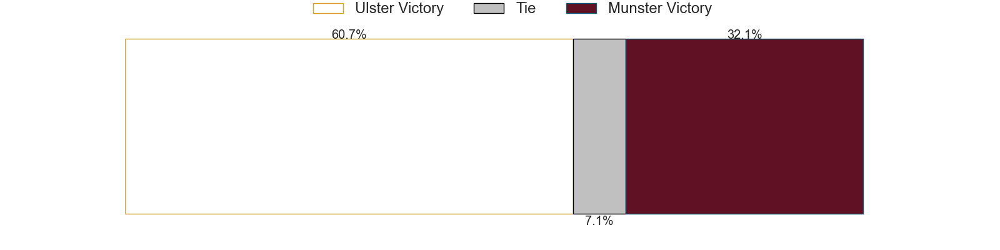

### Glasgow Warriors V Ulster on 2026-05-29

Average Margin: Glasgow Warriors by 6.4

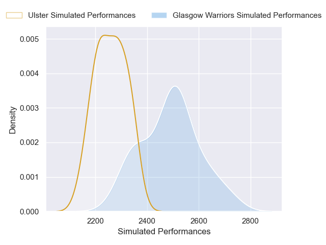

### Stormers V Munster on 2026-05-29

Average Margin: Stormers by 3.5

### Leinster V Sharks on 2026-05-29

Average Margin: Leinster by 6.4

### Stormers V Sharks on 2026-05-29

Average Margin: Stormers by 6.3

### Ulster V Lions on 2026-05-29

Average Margin: Ulster by 4.3

### Stormers V Lions on 2026-05-29

Average Margin: Stormers by 6.5

### Glasgow Warriors V Bulls on 2026-05-29

Average Margin: Glasgow Warriors by 6.4

### Ulster V Bulls on 2026-05-29

Average Margin: Ulster by 3.1

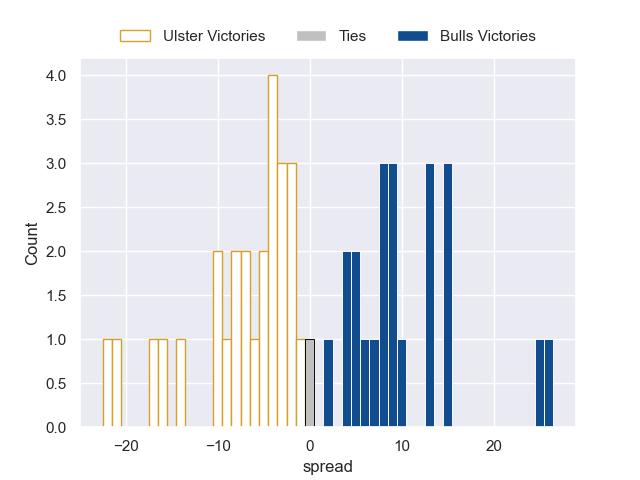

### Cardiff Rugby V Bulls on 2026-05-29

Average Margin: Cardiff Rugby by 6.0

### Glasgow Warriors V Lions on 2026-05-29

Average Margin: Glasgow Warriors by 6.6

### Stormers V Cardiff Rugby on 2026-05-29

Average Margin: Stormers by 4.9

### Stormers V Connacht on 2026-05-29

Average Margin: Stormers by 2.5

### Glasgow Warriors V Edinburgh on 2026-05-29

Average Margin: Glasgow Warriors by 14.8

### Glasgow Warriors V Cardiff Rugby on 2026-05-29

Average Margin: Glasgow Warriors by 6.2

### Glasgow Warriors V Munster on 2026-05-29

Average Margin: Glasgow Warriors by 4.6

### Leinster V Lions on 2026-05-29

Average Margin: Leinster by 9.2

### Stormers V Bulls on 2026-05-29

Average Margin: Stormers by 5.7

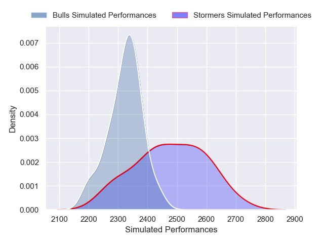

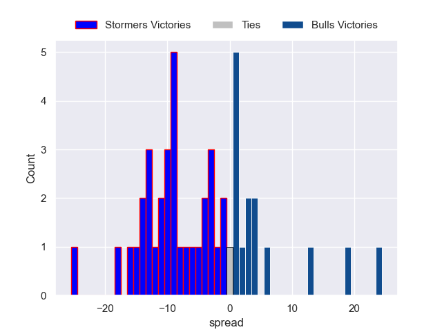

### Leinster V Munster on 2026-05-29

Average Margin: Leinster by 8.0

### Leinster V Glasgow Warriors on 2026-05-29

Average Margin: Glasgow Warriors by 6.0

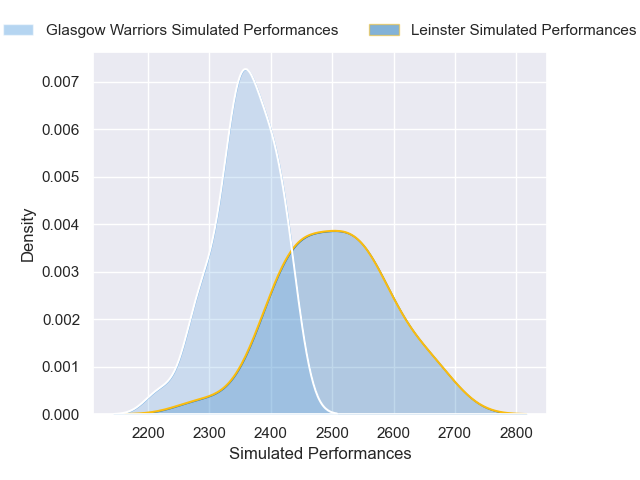

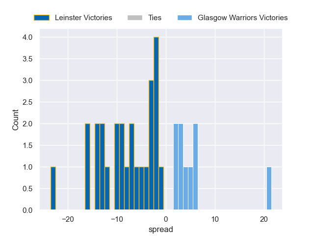

### Stormers V Ulster on 2026-05-29

Average Margin: Stormers by 7.6

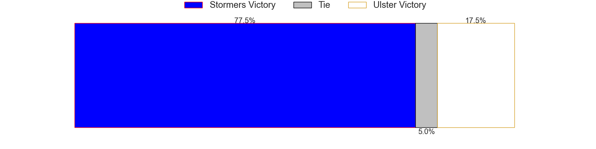
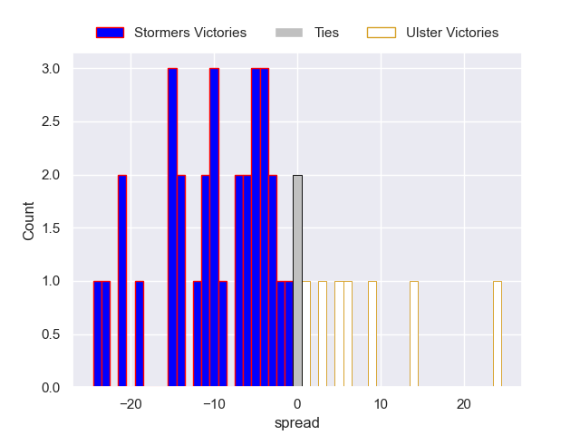

### Stormers V Ospreys on 2026-05-29

Average Margin: Stormers by 3.2

### Glasgow Warriors V Ospreys on 2026-05-29

Average Margin: Glasgow Warriors by 6.2

### Leinster V Edinburgh on 2026-05-29

Average Margin: Edinburgh by 15.0

### Munster V Edinburgh on 2026-05-29

Average Margin: Munster by 0.5

### Glasgow Warriors V Connacht on 2026-05-29

Average Margin: Glasgow Warriors by 10.0

### Ulster V Edinburgh on 2026-05-29

Average Margin: Ulster by 8.8

### Leinster V Ospreys on 2026-05-29

Average Margin: Ospreys by 5.8

### Ulster V Connacht on 2026-05-29

Average Margin: Ulster by 6.3

### Munster V Lions on 2026-05-29

Average Margin: Munster by 0.3

### Leinster V Bulls on 2026-05-29

Average Margin: Leinster by 7.6

### Lions V Bulls on 2026-05-29

Average Margin: Bulls by 10.0

### Ulster V Ospreys on 2026-05-29

Average Margin: Ulster by 12.0

### Ulster V Cardiff Rugby on 2026-05-29

Average Margin: Ulster by 7.6

### Leinster V Cardiff Rugby on 2026-05-29

Average Margin: Leinster by 7.2

### Glasgow Warriors V Sharks on 2026-05-29

Average Margin: Glasgow Warriors by 6.9

### Cardiff Rugby V Munster on 2026-05-29

Average Margin: Munster by 1.8

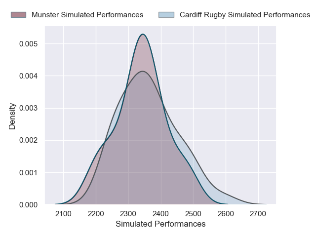

### Bulls V Munster on 2026-05-29

Average Margin: Munster by 0.3

### Ulster V Sharks on 2026-05-29

Average Margin: Ulster by 2.4

### Leinster V Connacht on 2026-05-29

Average Margin: Leinster by 4.1

### Leinster V Ulster on 2026-05-29

Average Margin: Leinster by 2.2

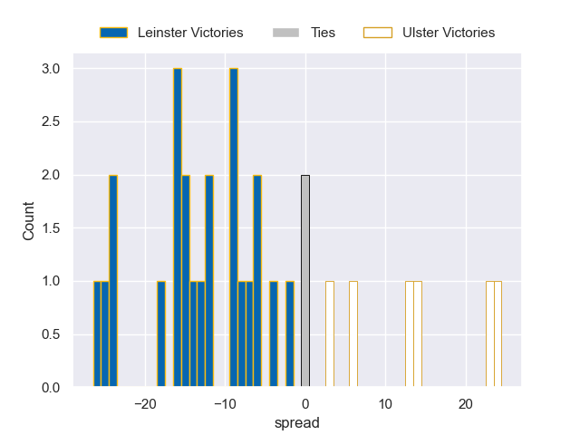

### Stormers V Glasgow Warriors on 2026-05-29

Average Margin: Stormers by 9.5

## Week 24

### Glasgow Warriors V Cardiff Rugby on 2026-06-05

Average Margin: Glasgow Warriors by 8.3

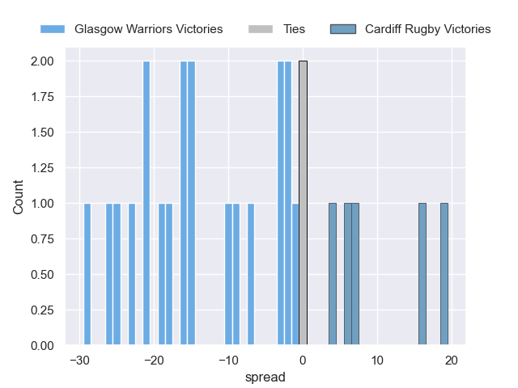

### Cardiff Rugby V Lions on 2026-06-05

Average Margin: Cardiff Rugby by 3.5

### Stormers V Lions on 2026-06-05

Average Margin: Stormers by 0.2

### Munster V Ulster on 2026-06-05

Average Margin: Munster by 2.9

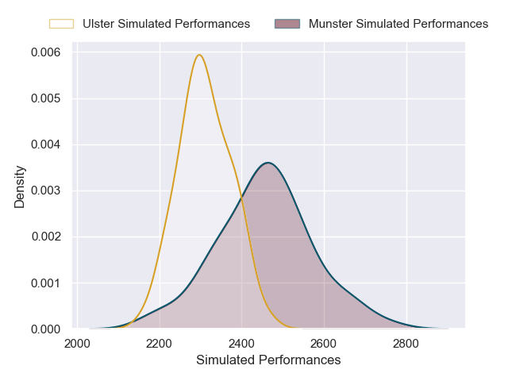

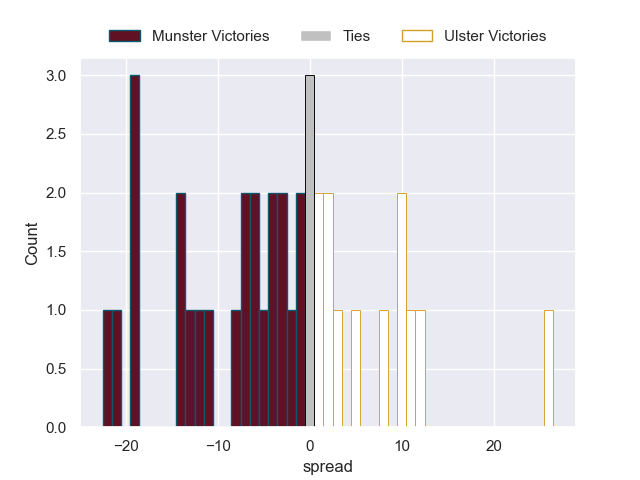

### Leinster V Bulls on 2026-06-05

Average Margin: Leinster by 3.6

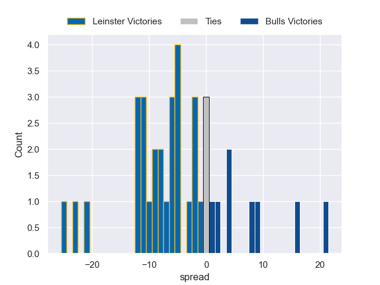

### Connacht V Sharks on 2026-06-05

Average Margin: Sharks by 15.0

### Edinburgh V Munster on 2026-06-05

Average Margin: Munster by 4.0

### Ospreys V Bulls on 2026-06-05

Average Margin: Bulls by 0.0

### Dragons V Leinster on 2026-06-05

Average Margin: Leinster by 8.0

### Leinster V Lions on 2026-06-05

Average Margin: Leinster by 12.1

### Benetton Treviso V Leinster on 2026-06-05

Average Margin: Benetton Treviso by 8.5

### Connacht V Munster on 2026-06-05

Average Margin: Connacht by 3.9

### Edinburgh V Stormers on 2026-06-05

Average Margin: Stormers by 10.0

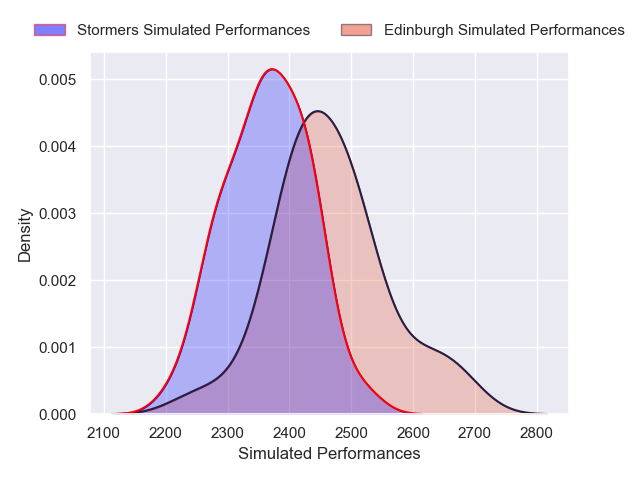

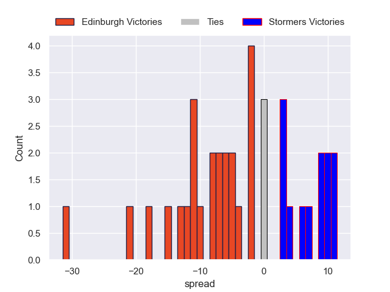

### Edinburgh V Ulster on 2026-06-05

Average Margin: Ulster by 4.7

### Connacht V Stormers on 2026-06-05

Average Margin: Connacht by 12.5

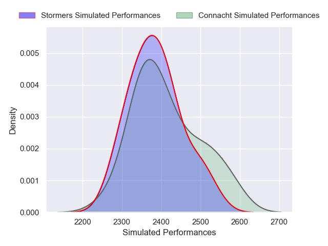

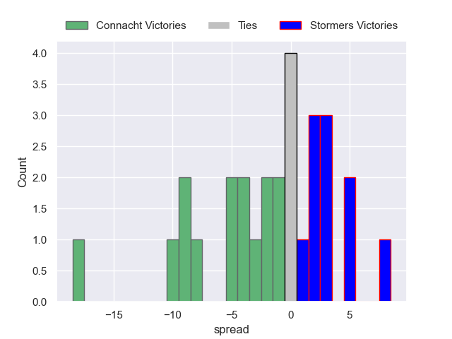

### Lions V Leinster on 2026-06-05

Average Margin: Leinster by 2.1

### Ospreys V Munster on 2026-06-05

Average Margin: Ospreys by 7.0

### Edinburgh V Cardiff Rugby on 2026-06-05

Average Margin: Edinburgh by 1.5

### Glasgow Warriors V Edinburgh on 2026-06-05

Average Margin: Edinburgh by 1.0

### Sharks V Bulls on 2026-06-05

Average Margin: Sharks by 9.0

### Lions V Cardiff Rugby on 2026-06-05

Average Margin: Cardiff Rugby by 6.2

### Stormers V Glasgow Warriors on 2026-06-05

Average Margin: Stormers by 1.7

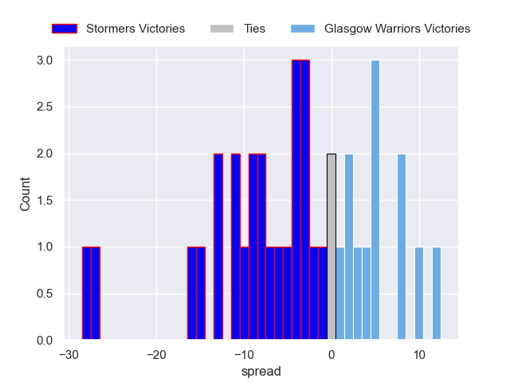

### Stormers V Munster on 2026-06-05

Average Margin: Stormers by 1.6

### Ospreys V Sharks on 2026-06-05

Average Margin: Ospreys by 18.0

### Lions V Benetton Treviso on 2026-06-05

Average Margin: Lions by 9.0

### Glasgow Warriors V Connacht on 2026-06-05

Average Margin: Connacht by 10.0

### Edinburgh V Lions on 2026-06-05

Average Margin: Lions by 19.0

### Connacht V Bulls on 2026-06-05

Average Margin: Connacht by 10.5

### Leinster V Edinburgh on 2026-06-05

Average Margin: Edinburgh by 4.0

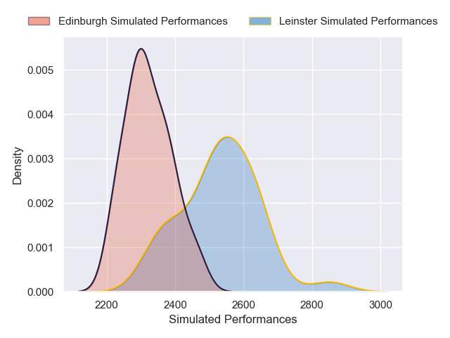
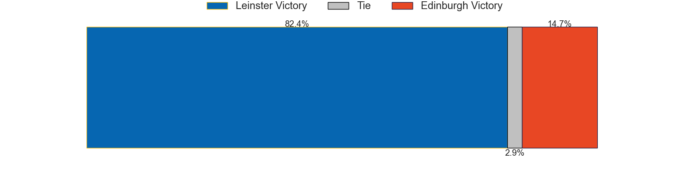
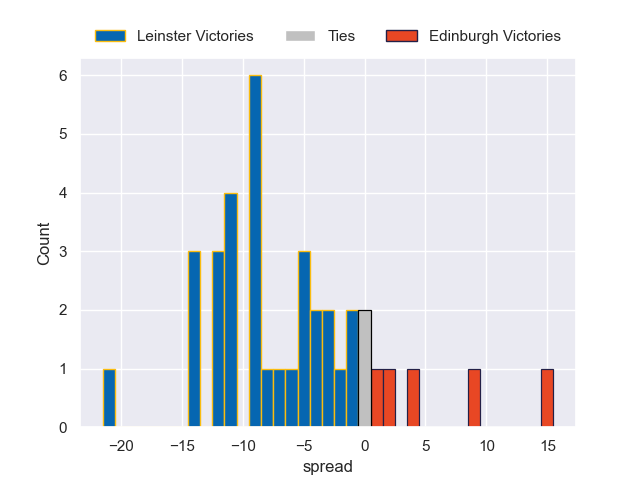

### Stormers V Connacht on 2026-06-05

Average Margin: Stormers by 5.0

### Sharks V Lions on 2026-06-05

Average Margin: Lions by 3.3

### Ulster V Cardiff Rugby on 2026-06-05

Average Margin: Ulster by 3.6

### Ulster V Edinburgh on 2026-06-05

Average Margin: Edinburgh by 6.5

### Stormers V Sharks on 2026-06-05

Average Margin: Stormers by 4.7

### Cardiff Rugby V Bulls on 2026-06-05

Average Margin: Bulls by 0.0

### Leinster V Sharks on 2026-06-05

Average Margin: Leinster by 4.8

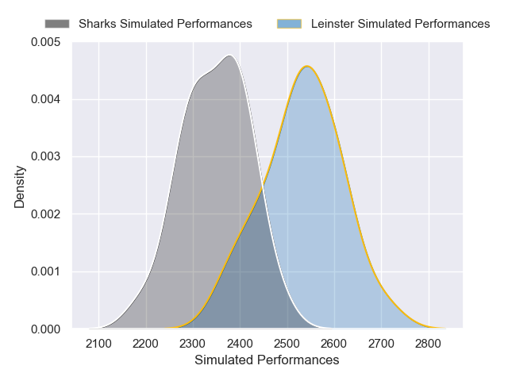

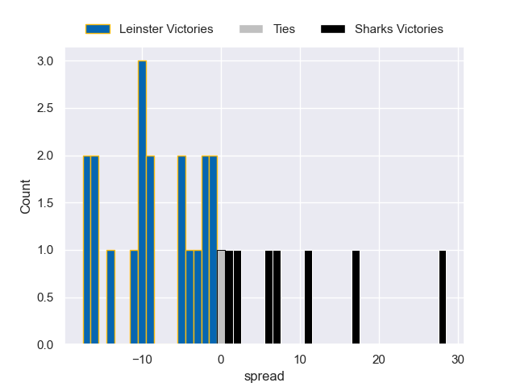

### Bulls V Munster on 2026-06-05

Average Margin: Munster by 1.0

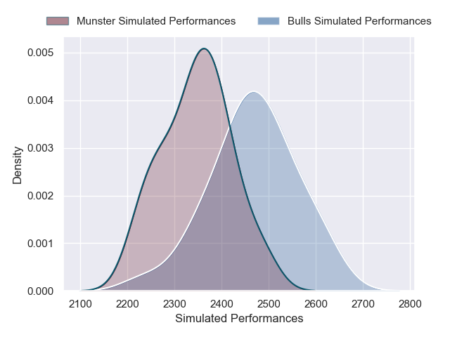

### Leinster V Ospreys on 2026-06-05

Average Margin: Leinster by 21.0

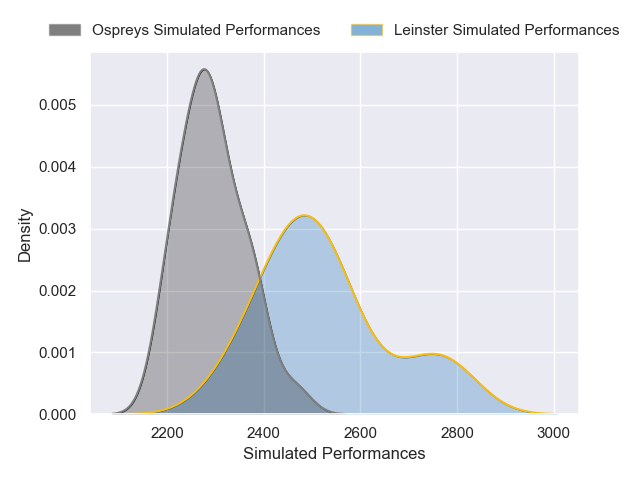

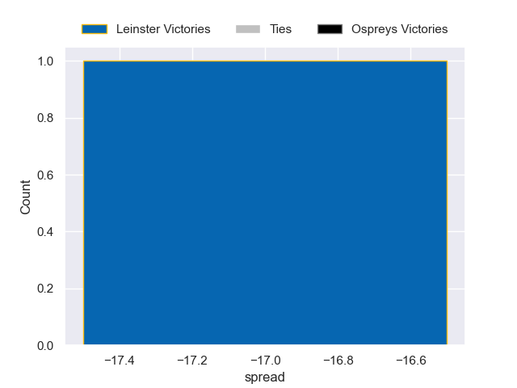

### Cardiff Rugby V Glasgow Warriors on 2026-06-05

Average Margin: Cardiff Rugby by 1.9

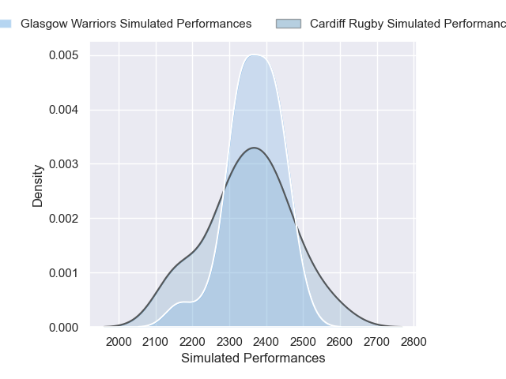
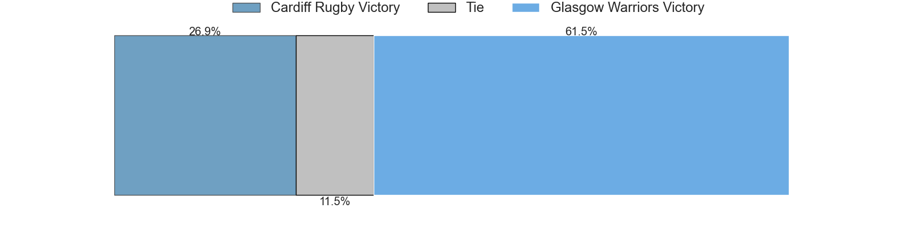
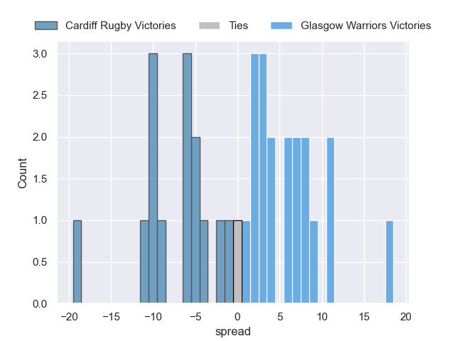

### Munster V Cardiff Rugby on 2026-06-05

Average Margin: Munster by 3.6

### Leinster V Stormers on 2026-06-05

Average Margin: Leinster by 3.8

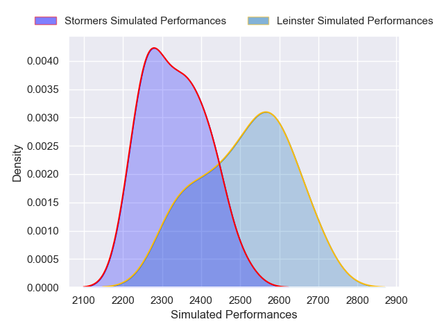

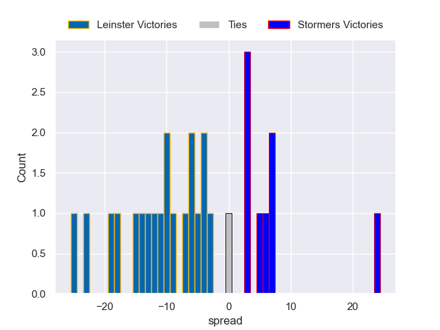

### Munster V Sharks on 2026-06-05

Average Margin: Munster by 6.9

### Benetton Treviso V Ulster on 2026-06-05

Average Margin: Ulster by 21.0

### Sharks V Ulster on 2026-06-05

Average Margin: Sharks by 3.8

### Ospreys V Ulster on 2026-06-05

Average Margin: Ospreys by 2.5

### Connacht V Ulster on 2026-06-05

Average Margin: Connacht by 3.8

### Lions V Ulster on 2026-06-05

Average Margin: Lions by 0.7

### Lions V Stormers on 2026-06-05

Average Margin: Lions by 1.9

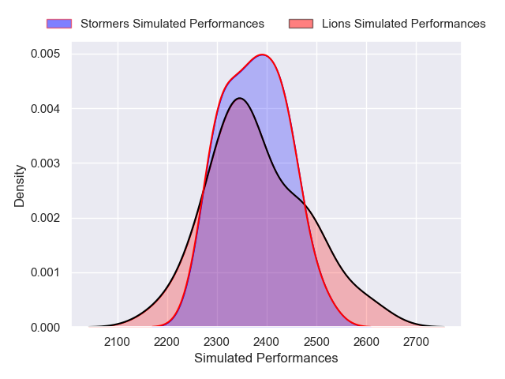
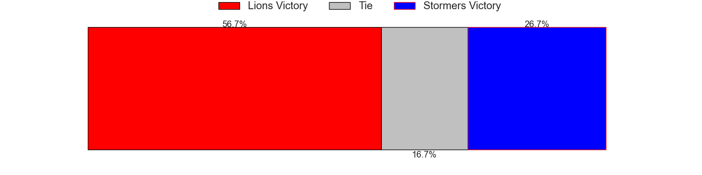
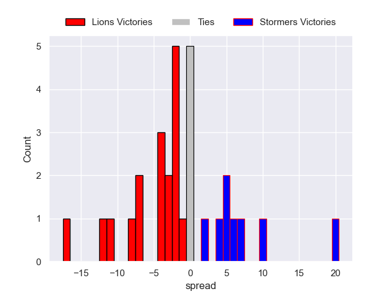

### Glasgow Warriors V Ulster on 2026-06-05

Average Margin: Glasgow Warriors by 3.6

### Bulls V Cardiff Rugby on 2026-06-05

Average Margin: Bulls by 6.4

### Glasgow Warriors V Bulls on 2026-06-05

Average Margin: Glasgow Warriors by 6.5

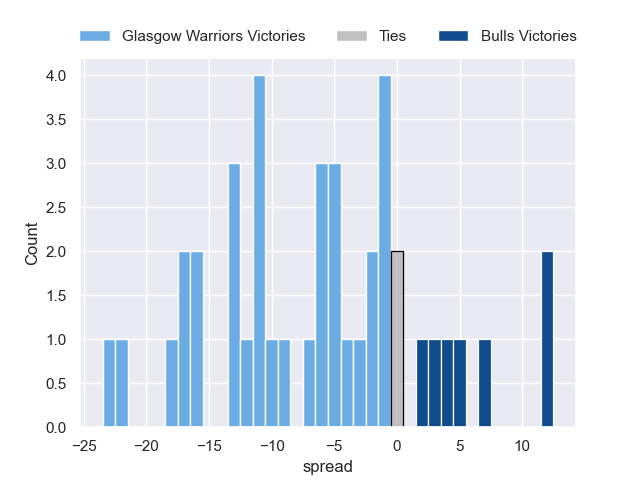

### Ospreys V Leinster on 2026-06-05

Average Margin: Ospreys by 3.2

### Lions V Connacht on 2026-06-05

Average Margin: Lions by 0.3

### Leinster V Ulster on 2026-06-05

Average Margin: Leinster by 3.8

### Bulls V Ulster on 2026-06-05

Average Margin: Bulls by 3.5

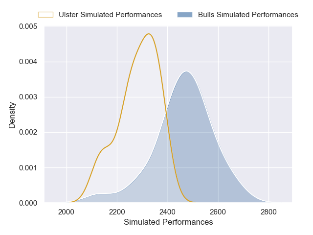

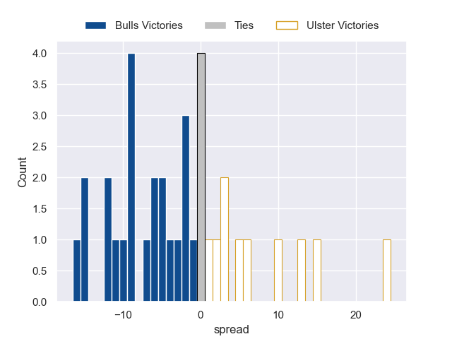

### Glasgow Warriors V Munster on 2026-06-05

Average Margin: Glasgow Warriors by 3.0

### Bulls V Leinster on 2026-06-05

Average Margin: Bulls by 2.8

### Ulster V Munster on 2026-06-05

Average Margin: Ulster by 3.7

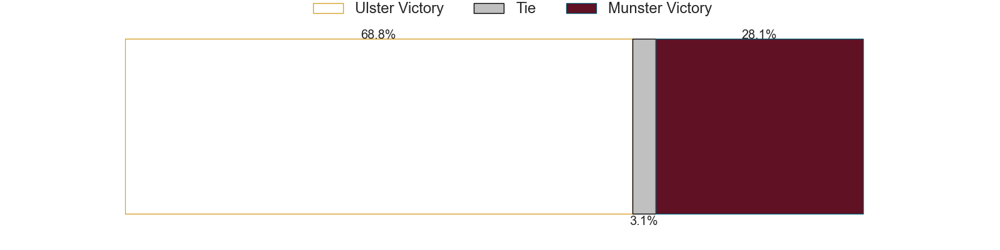

### Stormers V Leinster on 2026-06-05

Average Margin: Stormers by 1.5

### Stormers V Bulls on 2026-06-05

Average Margin: Stormers by 3.7

### Glasgow Warriors V Stormers on 2026-06-05

Average Margin: Glasgow Warriors by 5.0

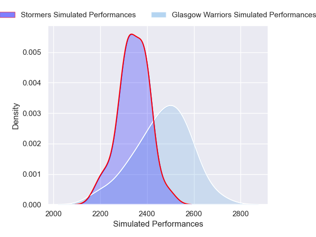

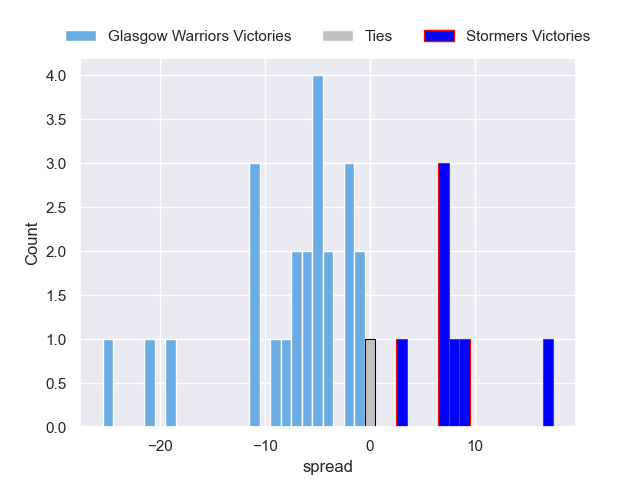

### Glasgow Warriors V Leinster on 2026-06-05

Average Margin: Glasgow Warriors by 2.6

### Sharks V Munster on 2026-06-05

Average Margin: Sharks by 0.4

### Sharks V Leinster on 2026-06-05

Average Margin: Sharks by 5.7

### Stormers V Ulster on 2026-06-05

Average Margin: Stormers by 3.0

### Glasgow Warriors V Lions on 2026-06-05

Average Margin: Glasgow Warriors by 5.0

### Lions V Munster on 2026-06-05

Average Margin: Lions by 5.0

### Munster V Bulls on 2026-06-05

Average Margin: Munster by 4.6

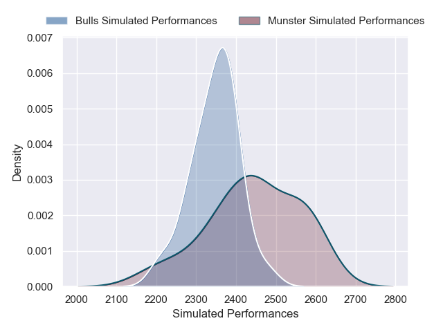

### Sharks V Stormers on 2026-06-05

Average Margin: Sharks by 1.1

### Glasgow Warriors V Ospreys on 2026-06-05

Average Margin: Glasgow Warriors by 10.2

### Stormers V Cardiff Rugby on 2026-06-05

Average Margin: Stormers by 2.3

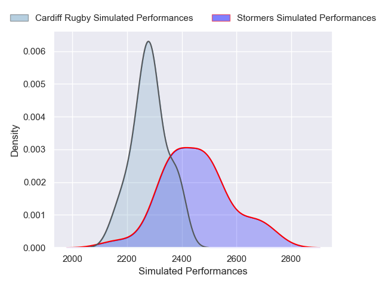

### Dragons V Ulster on 2026-06-05

Average Margin: Dragons by 9.0

### Cardiff Rugby V Munster on 2026-06-05

Average Margin: Munster by 4.0

### Connacht V Cardiff Rugby on 2026-06-05

Average Margin: Connacht by 6.7

### Lions V Sharks on 2026-06-05

Average Margin: Lions by 7.0

### Glasgow Warriors V Sharks on 2026-06-05

Average Margin: Glasgow Warriors by 2.8

### Cardiff Rugby V Ulster on 2026-06-05

Average Margin: Cardiff Rugby by 2.8

### Edinburgh V Ospreys on 2026-06-05

Average Margin: Edinburgh by 8.0

### Leinster V Munster on 2026-06-05

Average Margin: Leinster by 6.5

### Bulls V Connacht on 2026-06-05

Average Margin: Connacht by 6.5

### Ospreys V Stormers on 2026-06-05

Average Margin: Stormers by 2.0

### Cardiff Rugby V Leinster on 2026-06-05

Average Margin: Cardiff Rugby by 0.9

### Munster V Stormers on 2026-06-05

Average Margin: Munster by 4.0

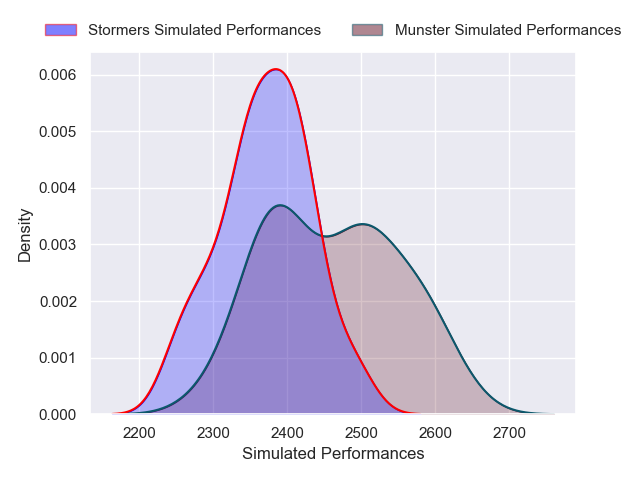

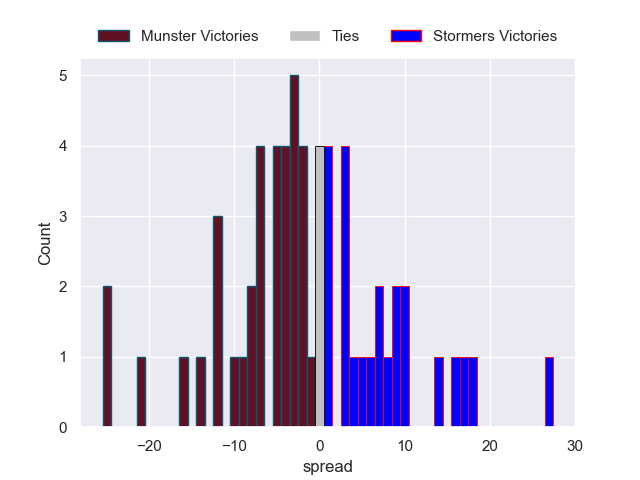

### Connacht V Leinster on 2026-06-05

Average Margin: Connacht by 6.3

### Lions V Bulls on 2026-06-05

Average Margin: Lions by 1.4

### Sharks V Cardiff Rugby on 2026-06-05

Average Margin: Sharks by 5.6

### Benetton Treviso V Munster on 2026-06-05

Average Margin: Benetton Treviso by 6.0

### Ospreys V Lions on 2026-06-05

Average Margin: Ospreys by 3.5

## Final

### Glasgow Warriors V Stormers on 2026-06-19

Average Margin: Glasgow Warriors by 4.6

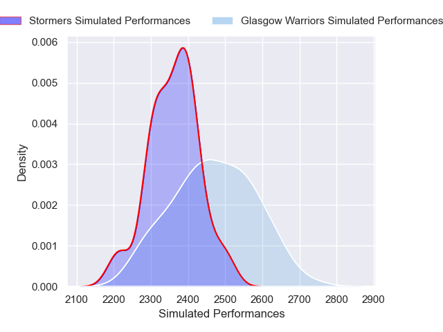

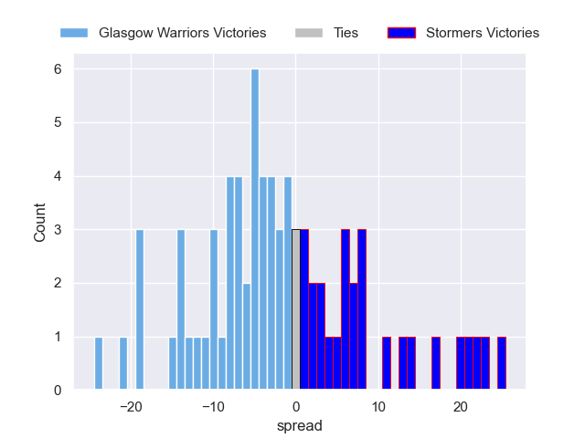

### Cardiff Rugby V Bulls on 2026-06-19

Average Margin: Bulls by 0.1

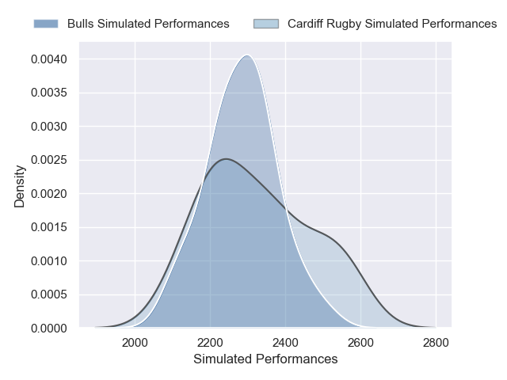

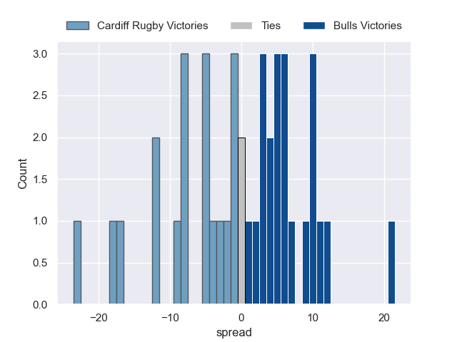

### Sharks V Bulls on 2026-06-19

Average Margin: Sharks by 3.3

### Ospreys V Stormers on 2026-06-19

Average Margin: Ospreys by 8.7

### Lions V Bulls on 2026-06-19

Average Margin: Bulls by 0.6

### Connacht V Glasgow Warriors on 2026-06-19

Average Margin: Connacht by 3.8

### Glasgow Warriors V Edinburgh on 2026-06-19

Average Margin: Glasgow Warriors by 2.7

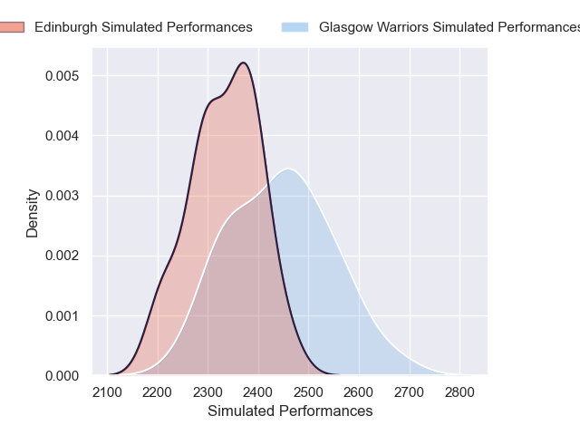

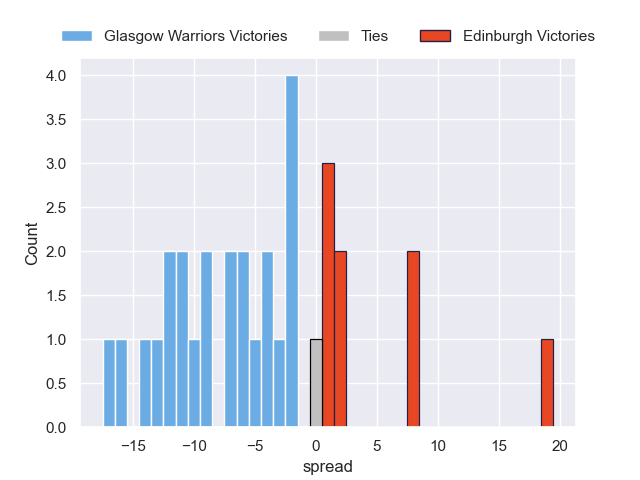

### Connacht V Leinster on 2026-06-19

Average Margin: Connacht by 5.1

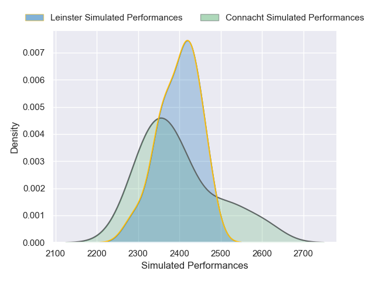

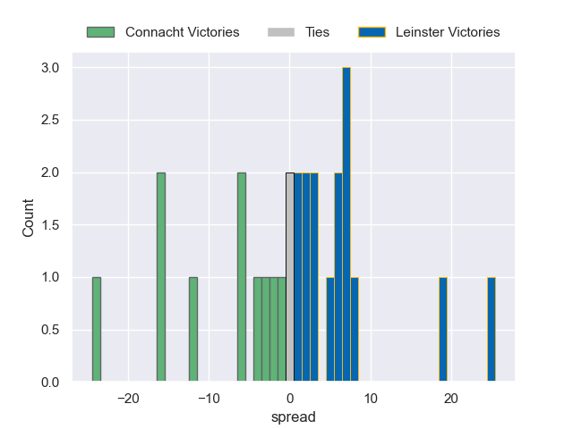

### Ospreys V Edinburgh on 2026-06-19

Average Margin: Ospreys by 5.0

### Ospreys V Ulster on 2026-06-19

Average Margin: Ulster by 4.5

### Ospreys V Munster on 2026-06-19

Average Margin: Ospreys by 3.8

### Cardiff Rugby V Ulster on 2026-06-19

Average Margin: Cardiff Rugby by 1.2

### Edinburgh V Bulls on 2026-06-19

Average Margin: Edinburgh by 21.0

### Lions V Cardiff Rugby on 2026-06-19

Average Margin: Lions by 6.3

### Glasgow Warriors V Dragons on 2026-06-19

Average Margin: Dragons by 22.0

### Edinburgh V Stormers on 2026-06-19

Average Margin: Stormers by 1.0

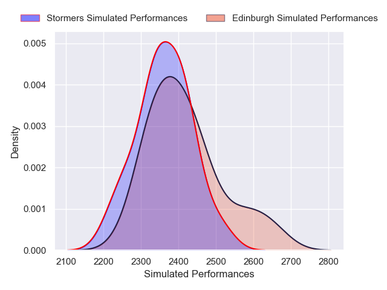

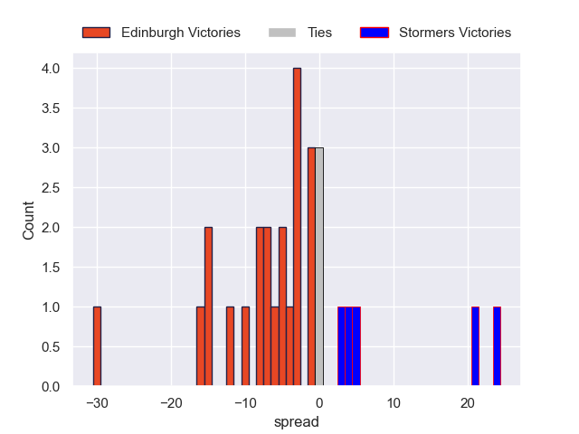

### Sharks V Munster on 2026-06-19

Average Margin: Munster by 0.6

### Ospreys V Lions on 2026-06-19

Average Margin: Ospreys by 21.5

### Lions V Sharks on 2026-06-19

Average Margin: Sharks by 3.5

### Ulster V Benetton Treviso on 2026-06-19

Average Margin: Ulster by 1.0

### Sharks V Cardiff Rugby on 2026-06-19

Average Margin: Sharks by 2.5

### Edinburgh V Munster on 2026-06-19

Average Margin: Edinburgh by 5.0

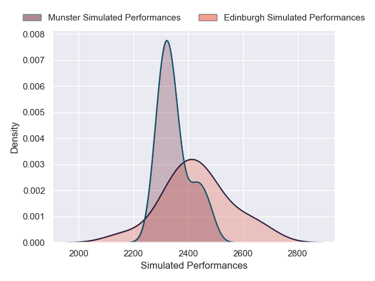

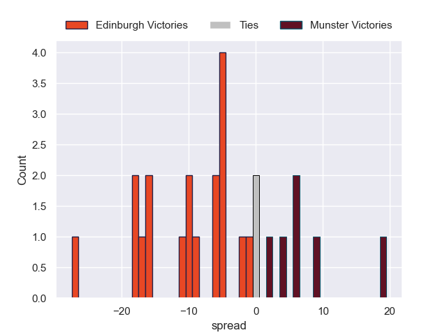

### Ospreys V Leinster on 2026-06-19

Average Margin: Leinster by 3.7

### Sharks V Ospreys on 2026-06-19

Average Margin: Sharks by 23.0

### Benetton Treviso V Glasgow Warriors on 2026-06-19

Average Margin: Benetton Treviso by 10.0

### Connacht V Stormers on 2026-06-19

Average Margin: Connacht by 14.0

### Munster V Connacht on 2026-06-19

Average Margin: Munster by 7.0

### Ospreys V Cardiff Rugby on 2026-06-19

Average Margin: Ospreys by 13.5

### Ospreys V Bulls on 2026-06-19

Average Margin: Bulls by 0.0

### Lions V Connacht on 2026-06-19

Average Margin: Connacht by 0.0

### Dragons V Cardiff Rugby on 2026-06-19

Average Margin: Dragons by 7.0

### Connacht V Ulster on 2026-06-19

Average Margin: Ulster by 0.0

### Cardiff Rugby V Munster on 2026-06-19

Average Margin: Cardiff Rugby by 6.9

### Connacht V Sharks on 2026-06-19

Average Margin: Connacht by 4.0

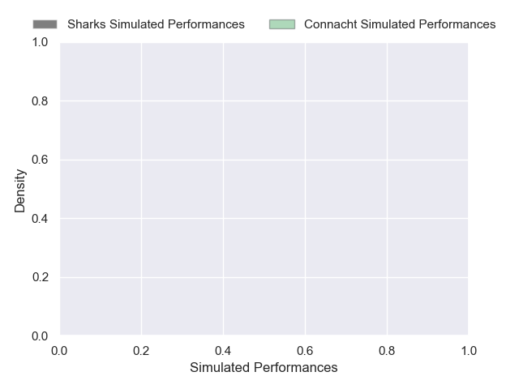

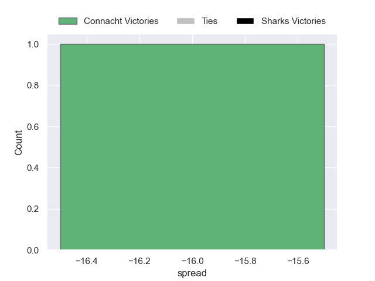

### Sharks V Stormers on 2026-06-19

Average Margin: Sharks by 4.9

### Stormers V Leinster on 2026-06-19

Average Margin: Stormers by 1.5

### Stormers V Munster on 2026-06-19

Average Margin: Stormers by 4.3

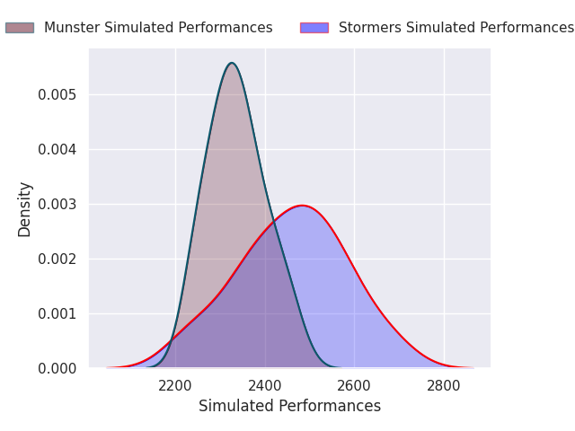

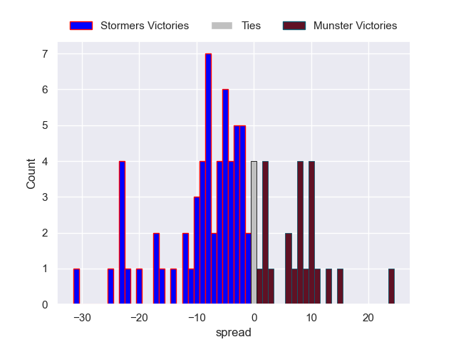

### Ulster V Glasgow Warriors on 2026-06-19

Average Margin: Ulster by 1.3

### Bulls V Ulster on 2026-06-19

Average Margin: Bulls by 4.9

### Leinster V Lions on 2026-06-19

Average Margin: Leinster by 5.4

### Munster V Lions on 2026-06-19

Average Margin: Lions by 2.0

### Sharks V Glasgow Warriors on 2026-06-19

Average Margin: Sharks by 0.3

### Ulster V Leinster on 2026-06-19

Average Margin: Ulster by 4.0

### Connacht V Cardiff Rugby on 2026-06-19

Average Margin: Connacht by 1.0

### Leinster V Bulls on 2026-06-19

Average Margin: Leinster by 5.4

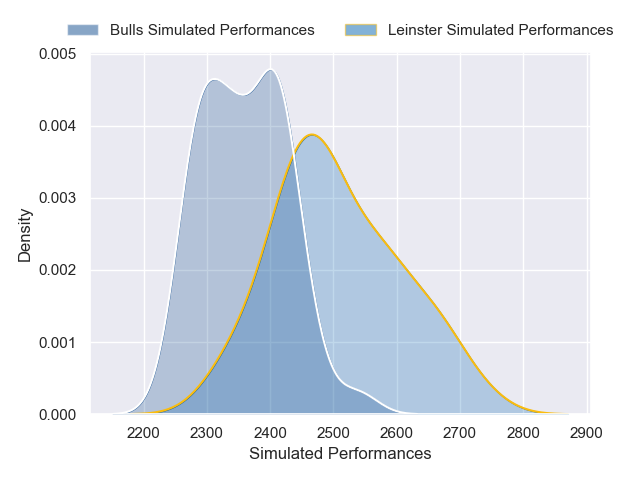

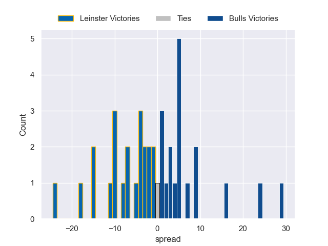

### Bulls V Stormers on 2026-06-19

Average Margin: Bulls by 4.2

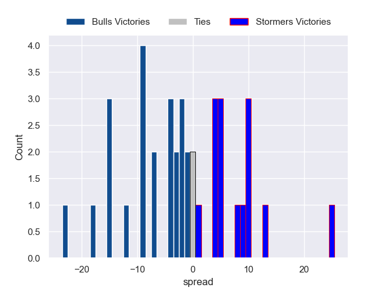

### Munster V Bulls on 2026-06-19

Average Margin: Munster by 3.3

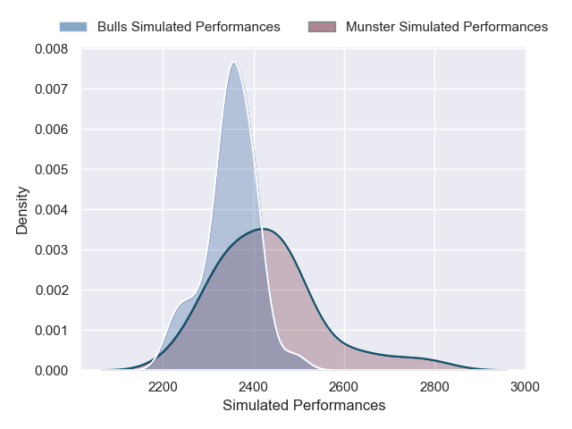

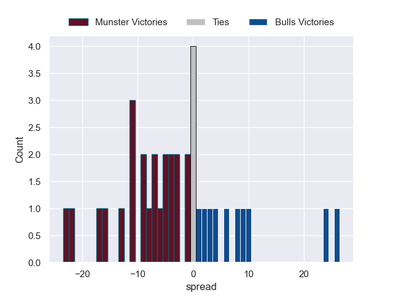

### Stormers V Cardiff Rugby on 2026-06-19

Average Margin: Stormers by 0.5

### Stormers V Benetton Treviso on 2026-06-19

Average Margin: Stormers by 8.0

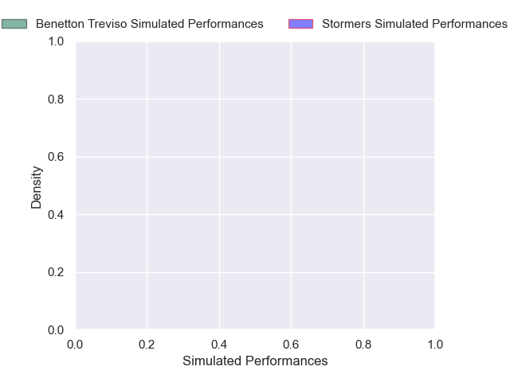

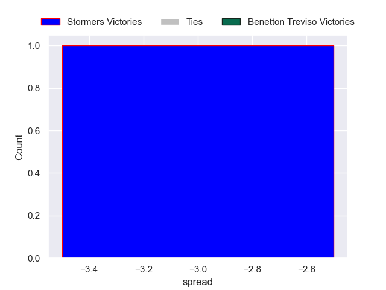

### Lions V Glasgow Warriors on 2026-06-19

Average Margin: Glasgow Warriors by 0.6

### Glasgow Warriors V Leinster on 2026-06-19

Average Margin: Glasgow Warriors by 3.0

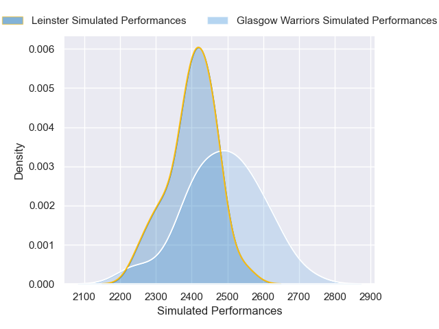

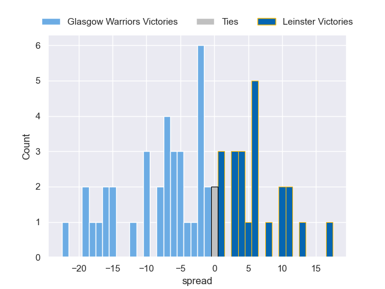

### Ulster V Munster on 2026-06-19

Average Margin: Ulster by 7.3

### Bulls V Glasgow Warriors on 2026-06-19

Average Margin: Bulls by 1.2

### Sharks V Ulster on 2026-06-19

Average Margin: Sharks by 3.8

### Leinster V Cardiff Rugby on 2026-06-19

Average Margin: Leinster by 2.9

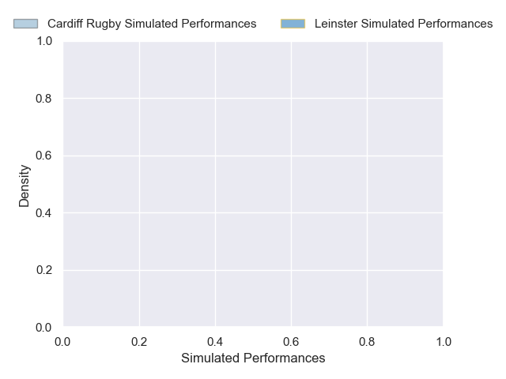

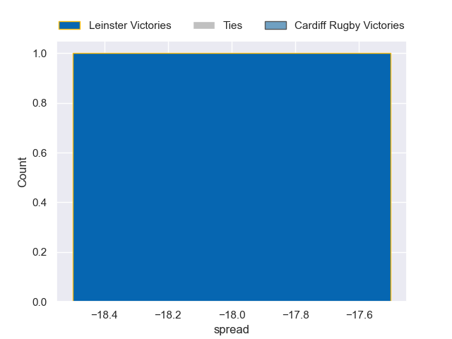

### Lions V Stormers on 2026-06-19

Average Margin: Lions by 1.1

### Munster V Leinster on 2026-06-19

Average Margin: Leinster by 1.2

### Sharks V Leinster on 2026-06-19

Average Margin: Sharks by 1.2

### Lions V Ulster on 2026-06-19

Average Margin: Ulster by 0.9

### Connacht V Bulls on 2026-06-19

Average Margin: Connacht by 14.3

### Ospreys V Glasgow Warriors on 2026-06-19

Average Margin: Ospreys by 4.4

### Munster V Glasgow Warriors on 2026-06-19

Average Margin: Munster by 1.2

### Edinburgh V Cardiff Rugby on 2026-06-19

Average Margin: Cardiff Rugby by 4.0

### Glasgow Warriors V Cardiff Rugby on 2026-06-19

Average Margin: Glasgow Warriors by 6.1

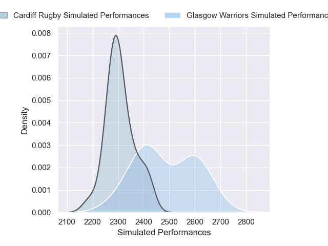

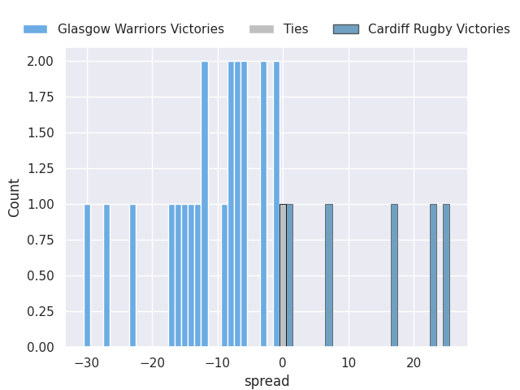

### Ulster V Stormers on 2026-06-19

Average Margin: Ulster by 5.6

### Benetton Treviso V Bulls on 2026-06-19

Average Margin: Bulls by 4.0

