# Team Rankings

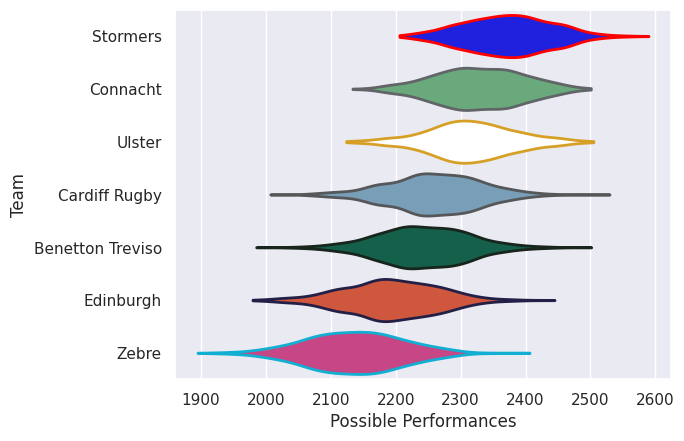
# Standings

## Projected Remaining Table

| Club             |   To Play |   Projected Wins |   Projected Differential |   Projected Losing Bonus Points | Projected Try Bonus Points   |   Projected Competition Points |
|:-----------------|----------:|-----------------:|-------------------------:|--------------------------------:|:-----------------------------|-------------------------------:|
| Connacht         |         2 |            1.287 |                    6.711 |                           0.441 |                              |                          5.757 |
| Stormers         |         2 |            0.931 |                   -0.596 |                           0.567 |                              |                          4.451 |
| Ulster           |         1 |            0.936 |                   12.195 |                           0.042 |                              |                          3.822 |
| Cardiff Rugby    |         1 |            0.908 |                   11.507 |                           0.069 |                              |                          3.739 |
| Benetton Treviso |         1 |            0.393 |                   -1.672 |                           0.322 |                              |                          1.982 |
| Edinburgh        |         2 |            0.311 |                  -16.638 |                           0.536 |                              |                          1.896 |
| Zebre            |         1 |            0.073 |                  -11.507 |                           0.235 |                              |                          0.565 |

## Projected Total Table

| Club             |   Played |   Wins |   Point Differential |   Losing Bonus Points | Try Bonus Points   |   Competition Points |
|:-----------------|---------:|-------:|---------------------:|----------------------:|:-------------------|---------------------:|
| Connacht         |        2 |  1.287 |                6.711 |                 0.441 |                    |                5.757 |
| Stormers         |        2 |  0.931 |               -0.596 |                 0.567 |                    |                4.451 |
| Ulster           |        1 |  0.936 |               12.195 |                 0.042 |                    |                3.822 |
| Cardiff Rugby    |        1 |  0.908 |               11.507 |                 0.069 |                    |                3.739 |
| Benetton Treviso |        1 |  0.393 |               -1.672 |                 0.322 |                    |                1.982 |
| Edinburgh        |        2 |  0.311 |              -16.638 |                 0.536 |                    |                1.896 |
| Zebre            |        1 |  0.073 |              -11.507 |                 0.235 |                    |                0.565 |

# Future Predictions

## Week 1

### Ulster V Edinburgh on 2026/09/25

Average Margin: Ulster by 12.2

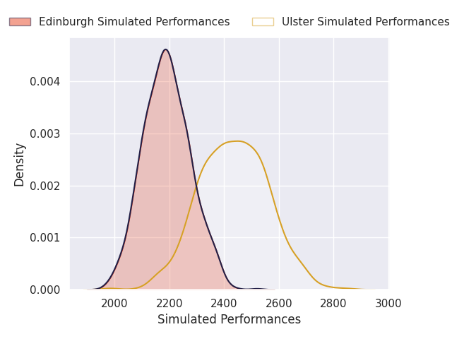
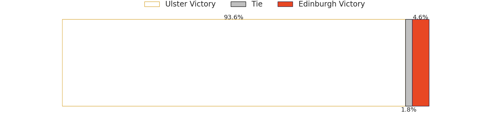
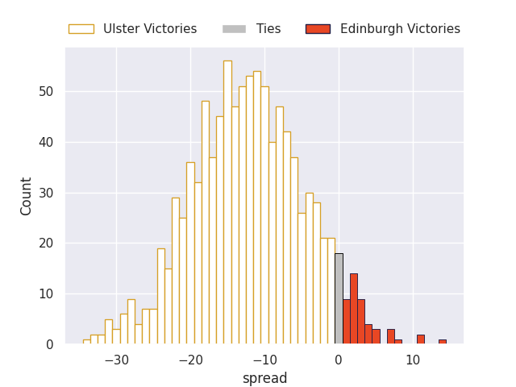

### Connacht V Stormers on 2026/09/25

Average Margin: Connacht by 5.0

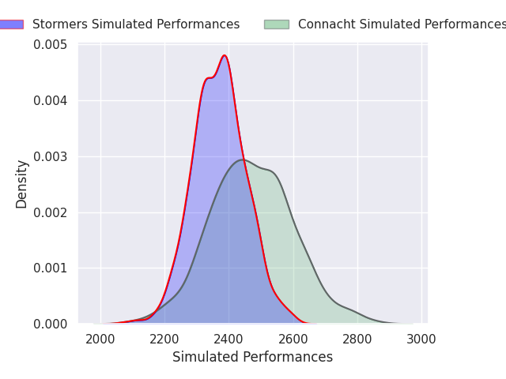

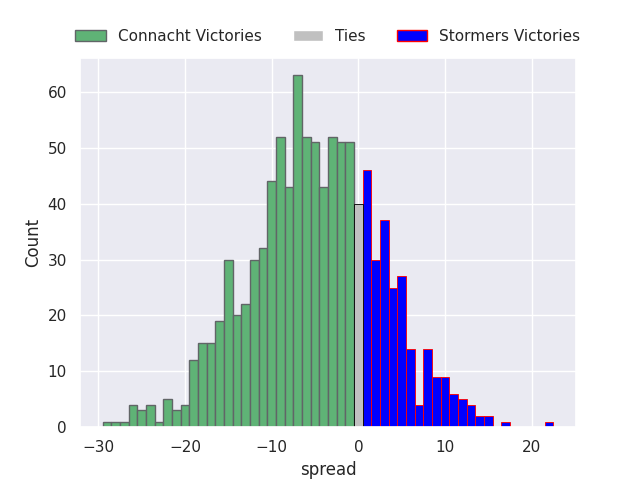

## Week 2

### Benetton Treviso V Connacht on 2026/10/02

Average Margin: Connacht by 1.7

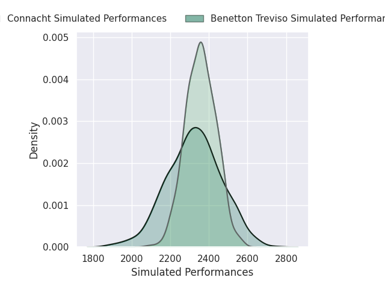

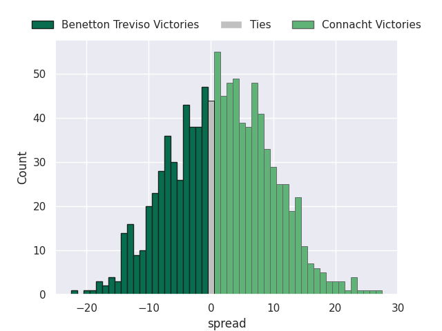

### Cardiff Rugby V Zebre on 2026/10/02

Average Margin: Cardiff Rugby by 11.5

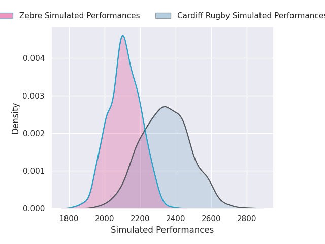
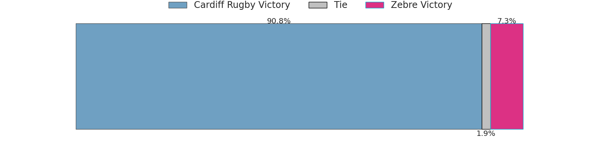
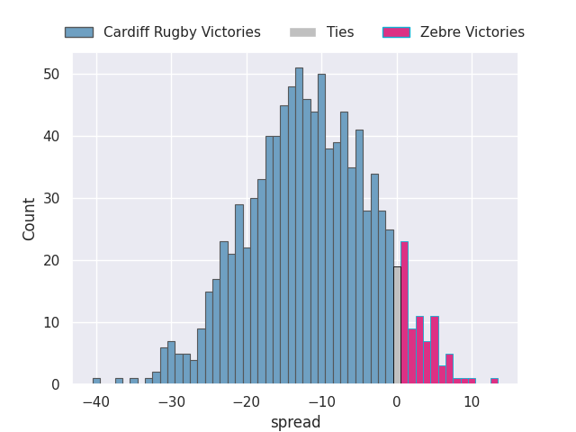

### Edinburgh V Stormers on 2026/10/02

Average Margin: Stormers by 4.4

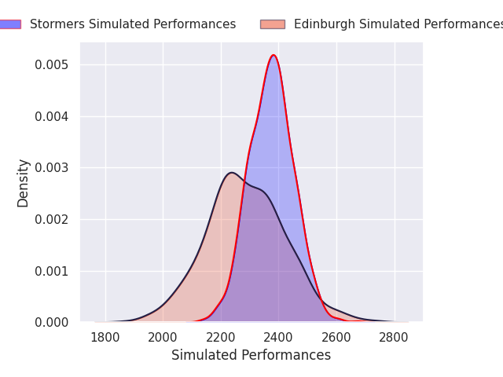

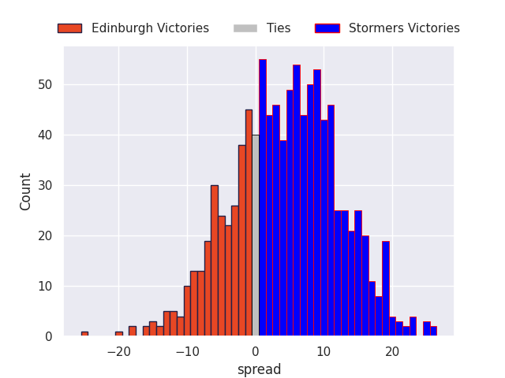

