# Team Rankings

# Standings

## Projected Remaining Table

| Club             |   To Play |   Projected Wins |   Projected Differential |   Projected Losing Bonus Points | Projected Try Bonus Points   |   Projected Competition Points |
|:-----------------|----------:|-----------------:|-------------------------:|--------------------------------:|:-----------------------------|-------------------------------:|
| Glasgow Warriors |         6 |            4.509 |                   39.409 |                           0.93  |                              |                         19.348 |
| Bulls            |         6 |            4.283 |                   36.703 |                           1.005 |                              |                         18.515 |
| Leinster         |         6 |            4.06  |                   30.744 |                           1.161 |                              |                         17.873 |
| Stormers         |         6 |            3.826 |                   24.268 |                           1.2   |                              |                         16.9   |
| Connacht         |         6 |            3.68  |                   23.831 |                           1.281 |                              |                         16.435 |
| Munster          |         6 |            2.862 |                   -2.747 |                           1.503 |                              |                         13.391 |
| Dragons          |         6 |            2.788 |                   -1.279 |                           1.469 |                              |                         13.037 |
| Sharks           |         6 |            2.668 |                   -3.868 |                           1.682 |                              |                         12.87  |
| Cardiff Rugby    |         6 |            2.674 |                   -6.327 |                           1.423 |                              |                         12.553 |
| Lions            |         6 |            2.558 |                   -7.532 |                           1.62  |                              |                         12.31  |
| Benetton Treviso |         6 |            2.562 |                   -8.953 |                           1.536 |                              |                         12.298 |
| Ospreys          |         6 |            2.414 |                  -10.721 |                           1.59  |                              |                         11.654 |
| Ulster           |         6 |            2.413 |                   -9.544 |                           1.517 |                              |                         11.551 |
| Edinburgh        |         6 |            2.127 |                  -19.363 |                           1.672 |                              |                         10.668 |
| Scarlets         |         6 |            1.771 |                  -33.114 |                           1.463 |                              |                          8.933 |
| Zebre            |         6 |            1.104 |                  -51.507 |                           1.448 |                              |                          6.164 |

## Projected Total Table

| Club             |   Played |   Wins |   Point Differential |   Losing Bonus Points | Try Bonus Points   |   Competition Points |
|:-----------------|---------:|-------:|---------------------:|----------------------:|:-------------------|---------------------:|
| Glasgow Warriors |        6 |  4.509 |               39.409 |                 0.93  |                    |               19.348 |
| Bulls            |        6 |  4.283 |               36.703 |                 1.005 |                    |               18.515 |
| Leinster         |        6 |  4.06  |               30.744 |                 1.161 |                    |               17.873 |
| Stormers         |        6 |  3.826 |               24.268 |                 1.2   |                    |               16.9   |
| Connacht         |        6 |  3.68  |               23.831 |                 1.281 |                    |               16.435 |
| Munster          |        6 |  2.862 |               -2.747 |                 1.503 |                    |               13.391 |
| Dragons          |        6 |  2.788 |               -1.279 |                 1.469 |                    |               13.037 |
| Sharks           |        6 |  2.668 |               -3.868 |                 1.682 |                    |               12.87  |
| Cardiff Rugby    |        6 |  2.674 |               -6.327 |                 1.423 |                    |               12.553 |
| Lions            |        6 |  2.558 |               -7.532 |                 1.62  |                    |               12.31  |
| Benetton Treviso |        6 |  2.562 |               -8.953 |                 1.536 |                    |               12.298 |
| Ospreys          |        6 |  2.414 |              -10.721 |                 1.59  |                    |               11.654 |
| Ulster           |        6 |  2.413 |               -9.544 |                 1.517 |                    |               11.551 |
| Edinburgh        |        6 |  2.127 |              -19.363 |                 1.672 |                    |               10.668 |
| Scarlets         |        6 |  1.771 |              -33.114 |                 1.463 |                    |                8.933 |
| Zebre            |        6 |  1.104 |              -51.507 |                 1.448 |                    |                6.164 |

# Future Predictions

## Week 1

### Ulster V Edinburgh on 2026/09/25

Average Margin: Ulster by 11.9

### Benetton Treviso V Dragons on 2026/09/25

Average Margin: Benetton Treviso by 6.4

### Connacht V Stormers on 2026/09/25

Average Margin: Connacht by 5.4

### Zebre V Bulls on 2026/09/26

Average Margin: Bulls by 8.4

### Sharks V Ospreys on 2026/09/26

Average Margin: Sharks by 7.9

### Munster V Glasgow Warriors on 2026/09/26

Average Margin: Munster by 1.8

### Lions V Leinster on 2026/09/26

Average Margin: Leinster by 1.3

### Scarlets V Cardiff Rugby on 2026/09/26

Average Margin: Scarlets by 1.3

## Week 2

### Benetton Treviso V Connacht on 2026/10/02

Average Margin: Connacht by 1.9

### Edinburgh V Stormers on 2026/10/02

Average Margin: Stormers by 3.9

### Cardiff Rugby V Zebre on 2026/10/02

Average Margin: Cardiff Rugby by 11.3

### Glasgow Warriors V Ulster on 2026/10/03

Average Margin: Glasgow Warriors by 8.8

### Sharks V Leinster on 2026/10/03

Average Margin: Leinster by 1.7

### Munster V Bulls on 2026/10/03

Average Margin: Munster by 1.9

### Lions V Ospreys on 2026/10/03

Average Margin: Lions by 8.2

### Dragons V Scarlets on 2026/10/03

Average Margin: Dragons by 5.7

## Week 3

### Dragons V Ospreys on 2026/10/09

Average Margin: Dragons by 3.0

### Glasgow Warriors V Connacht on 2026/10/09

Average Margin: Glasgow Warriors by 6.7

### Leinster V Cardiff Rugby on 2026/10/10

Average Margin: Leinster by 14.2

### Ulster V Munster on 2026/10/10

Average Margin: Ulster by 5.3

### Scarlets V Benetton Treviso on 2026/10/10

Average Margin: Scarlets by 3.0

### Bulls V Lions on 2026/10/10

Average Margin: Bulls by 8.7

### Zebre V Edinburgh on 2026/10/10

Average Margin: Zebre by 1.3

### Stormers V Sharks on 2026/10/10

Average Margin: Stormers by 6.7

## Week 4

### Cardiff Rugby V Sharks on 2026/10/23

Average Margin: Cardiff Rugby by 0.9

### Edinburgh V Lions on 2026/10/23

Average Margin: Lions by 1.3

### Connacht V Zebre on 2026/10/23

Average Margin: Connacht by 18.0

### Leinster V Munster on 2026/10/24

Average Margin: Leinster by 11.2

### Ospreys V Dragons on 2026/10/24

Average Margin: Ospreys by 8.0

### Benetton Treviso V Glasgow Warriors on 2026/10/24

Average Margin: Glasgow Warriors by 3.5

### Stormers V Scarlets on 2026/10/24

Average Margin: Stormers by 13.7

### Bulls V Ulster on 2026/10/24

Average Margin: Bulls by 8.9

## Week 5

### Glasgow Warriors V Lions on 2026/10/30

Average Margin: Glasgow Warriors by 9.0

### Connacht V Leinster on 2026/10/30

Average Margin: Connacht by 1.9

### Benetton Treviso V Edinburgh on 2026/10/31

Average Margin: Benetton Treviso by 6.2

### Stormers V Ulster on 2026/10/31

Average Margin: Stormers by 7.5

### Bulls V Scarlets on 2026/10/31

Average Margin: Bulls by 14.7

### Dragons V Zebre on 2026/10/31

Average Margin: Dragons by 9.6

### Munster V Sharks on 2026/10/31

Average Margin: Munster by 4.6

### Ospreys V Cardiff Rugby on 2026/10/31

Average Margin: Ospreys by 4.6

## Week 6

### Ospreys V Leinster on 2026/12/04

Average Margin: Leinster by 4.2

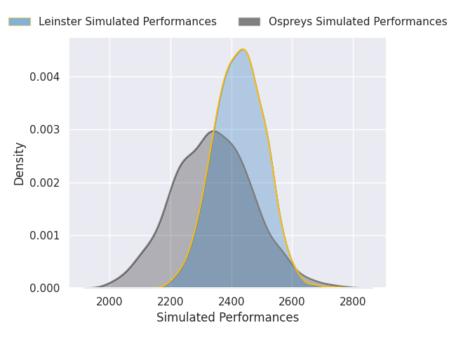

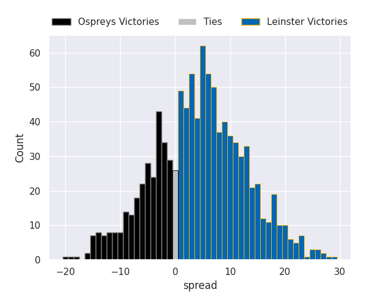

### Edinburgh V Dragons on 2026/12/04

Average Margin: Edinburgh by 5.2

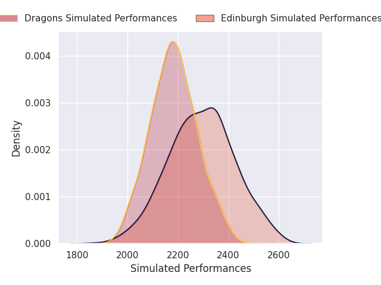

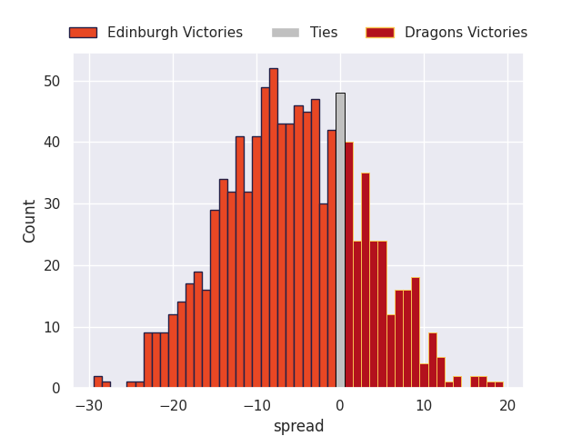

### Lions V Bulls on 2026/12/05

Average Margin: Lions by 2.1

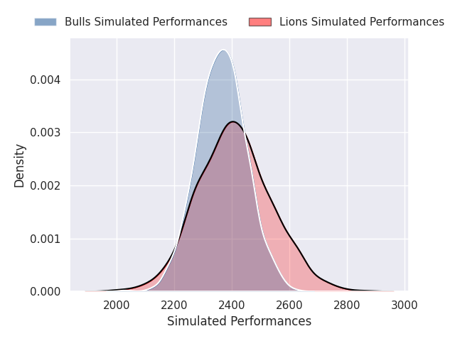

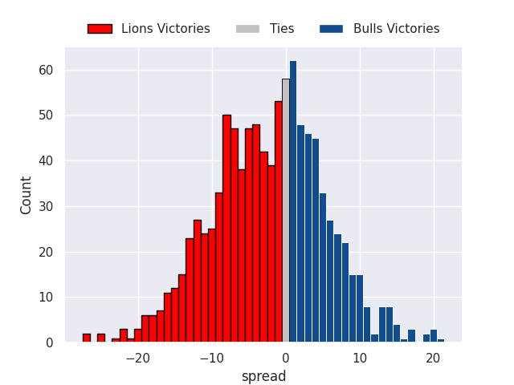

### Cardiff Rugby V Ulster on 2026/12/05

Average Margin: Cardiff Rugby by 1.6

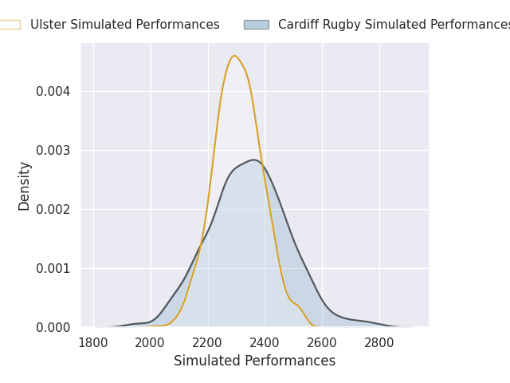

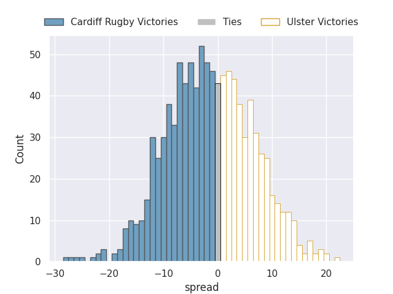

### Sharks V Stormers on 2026/12/05

Average Margin: Sharks by 2.1

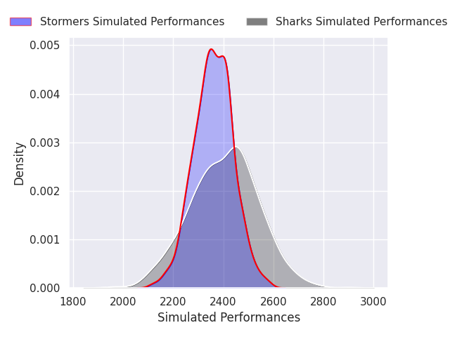

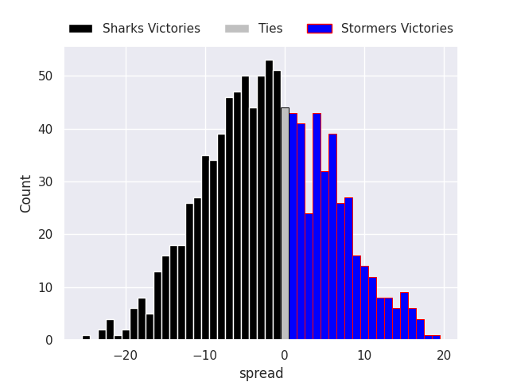

### Zebre V Munster on 2026/12/05

Average Margin: Munster by 5.5

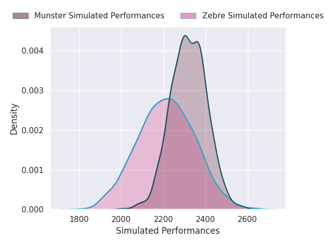

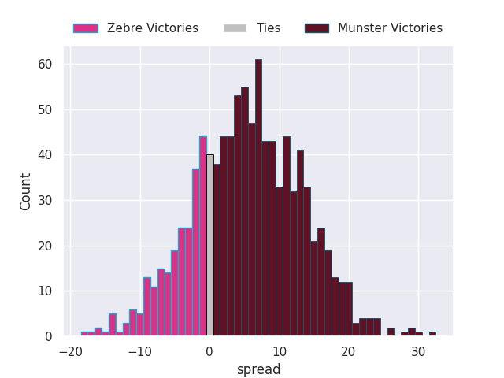

### Glasgow Warriors V Benetton Treviso on 2026/12/05

Average Margin: Glasgow Warriors by 13.1

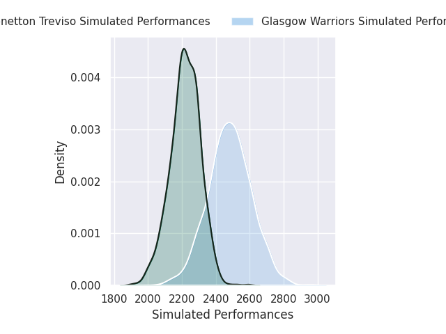
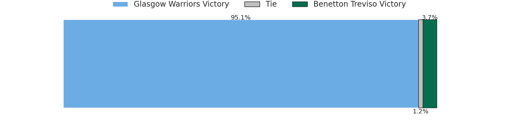
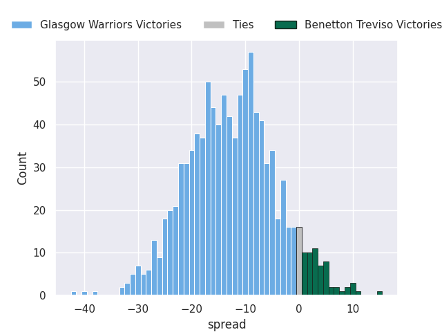

### Scarlets V Connacht on 2026/12/05

Average Margin: Connacht by 3.4

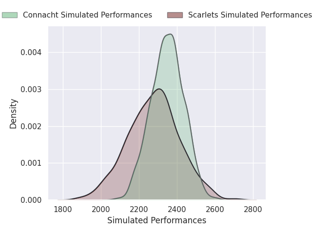

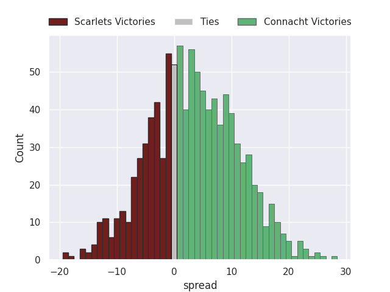

