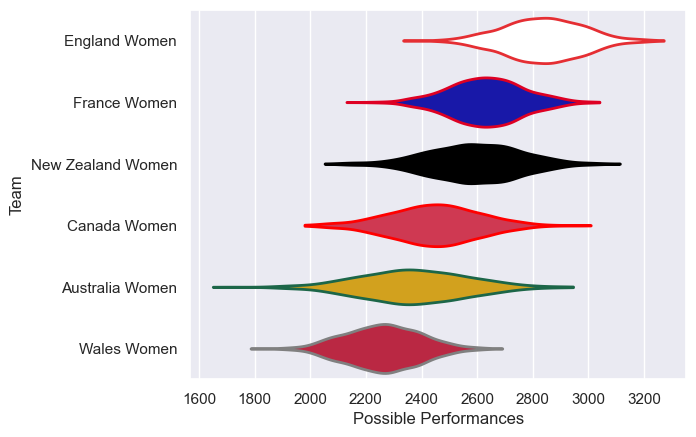

---  
title: "WXV 1 2023"  
date: 2025-07-29 6:00:00 -0500  
categories: model review projection  
layout: article  
aside:  
    toc: true  
---
# Current Team Rankings

# Standings

## Current Standings

| Club              |   Played |   Wins |   Point Differential |   Losing Bonus Points | Try Bonus Points   |   Competition Points |
|:------------------|---------:|-------:|---------------------:|----------------------:|:-------------------|---------------------:|
| England Women     |        3 |      3 |                   89 |                     0 |                    |                   12 |
| Canada Women      |        3 |      2 |                   -4 |                     0 |                    |                    8 |
| Australia Women   |        3 |      2 |                  -20 |                     0 |                    |                    8 |
| New Zealand Women |        3 |      1 |                   41 |                     1 |                    |                    5 |
| France Women      |        3 |      1 |                  -17 |                     0 |                    |                    4 |
| Wales Women       |        3 |      0 |                  -89 |                     1 |                    |                    1 |

# Completed Match Review

| Model | Percent Correct Predictions | Spread Error |
| ------ | ------ | ------ |
| Club Level | 66.7% | 15.6 |
| Player Level: Lineup | nan% | nan |
| Player Level: Minutes | nan% | nan |

