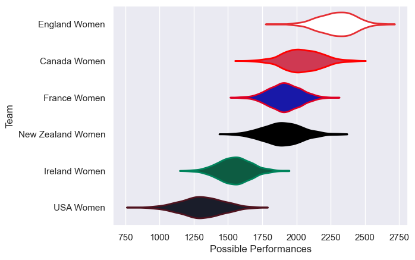
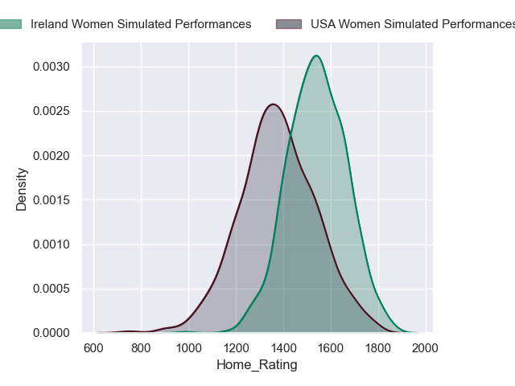
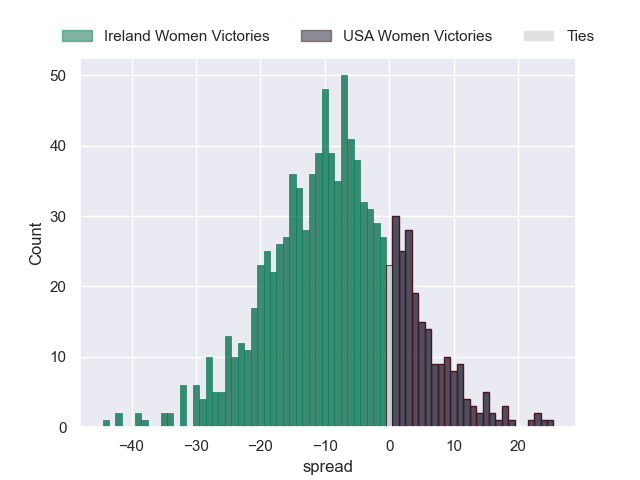
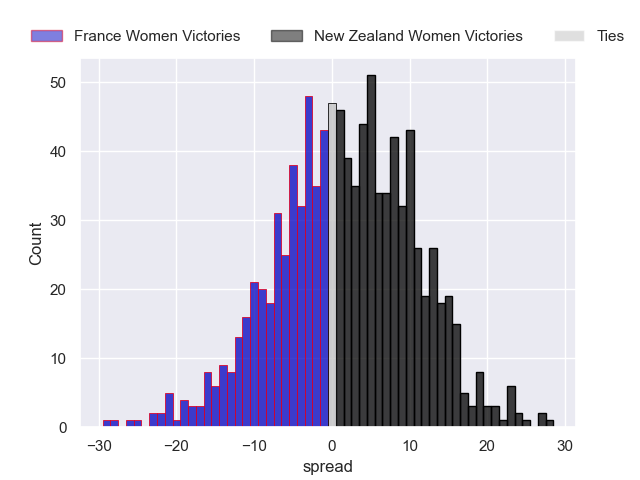
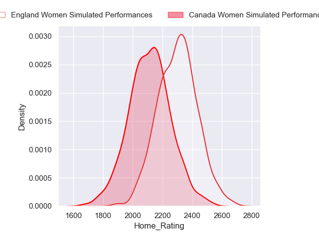
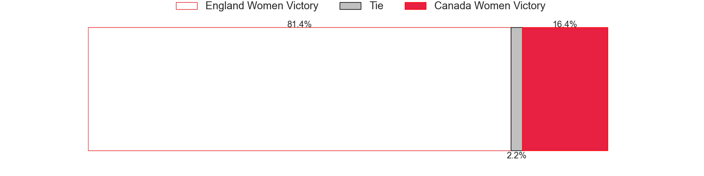
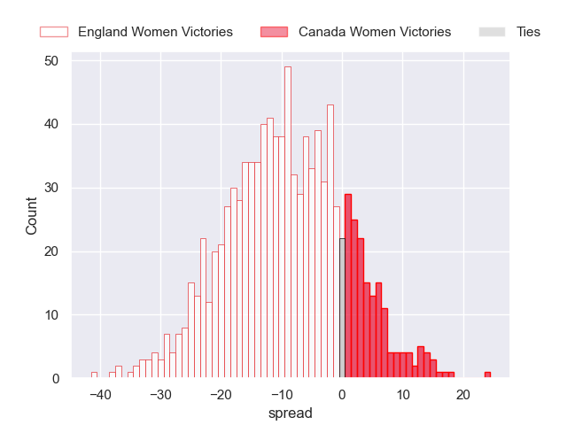

---  
title: "WXV 1 2024 Status"  
date: 2024-10-07 6:00:00 -0500  
categories: model review projection  
layout: article  
aside:  
    toc: true  
---
# Current Team Rankings

# Standings

## Current Standings

| Club              |   Played |   Wins |   Point Differential |   Losing Bonus Points |   Try Bonus Points |   Competition Points |
|:------------------|---------:|-------:|---------------------:|----------------------:|-------------------:|---------------------:|
| England Women     |        2 |      2 |                   58 |                     0 |                nan |                    8 |
| Canada Women      |        1 |      1 |                   22 |                     0 |                nan |                    4 |
| Ireland Women     |        1 |      1 |                    2 |                     0 |                nan |                    4 |
| New Zealand Women |        2 |      0 |                  -20 |                     1 |                nan |                    1 |
| France Women      |        1 |      0 |                  -22 |                     0 |                nan |                    0 |
| USA Women         |        1 |      0 |                  -40 |                     0 |                nan |                    0 |

## Projected Remaining Table

| Club              |   Matches Remaining |   Wins |   Point Differential |   Losing Bonus Points |   Try Bonus Points |   Competition Points |
|:------------------|--------------------:|-------:|---------------------:|----------------------:|-------------------:|---------------------:|
| Ireland Women     |                   1 |    0.8 |              8.29181 |                   0.1 |                0.5 |                  3.8 |
| England Women     |                   1 |    0.8 |              9.36153 |                   0.1 |                0.2 |                  3.6 |
| New Zealand Women |                   1 |    0.6 |              1.75818 |                   0.3 |                0.2 |                  2.8 |
| France Women      |                   1 |    0.4 |             -1.75818 |                   0.3 |                0.3 |                  2.2 |
| USA Women         |                   1 |    0.2 |             -8.29181 |                   0.2 |                0.2 |                  1.2 |
| Canada Women      |                   1 |    0.2 |             -9.36153 |                   0.2 |                0.2 |                  1.2 |

## Projected Total Table

| Club              |   Total Matches |   Wins |   Point Differential |   Losing Bonus Points |   Try Bonus Points |   Competition Points |
|:------------------|----------------:|-------:|---------------------:|----------------------:|-------------------:|---------------------:|
| England Women     |               3 |    2.8 |              67.3615 |                   0.1 |                0.2 |                 11.6 |
| Ireland Women     |               2 |    1.8 |              10.2918 |                   0.1 |                0.5 |                  7.8 |
| Canada Women      |               2 |    1.2 |              12.6385 |                   0.2 |                0.2 |                  5.2 |
| New Zealand Women |               3 |    0.6 |             -18.2418 |                   1.3 |                0.2 |                  3.8 |
| France Women      |               2 |    0.4 |             -23.7582 |                   0.3 |                0.3 |                  2.2 |
| USA Women         |               2 |    0.2 |             -48.2918 |                   0.2 |                0.2 |                  1.2 |

# Completed Match Review

| Model | Percent Correct Predictions | Spread Error |
| ------ | ------ | ------ |
| Club Level | 75.0% | 14.6 |
| Player Level: Lineup | nan% | nan |
| Player Level: Minutes | nan% | nan |

# Future Predictions

## Week 3

### USA Women V Ireland Women on 2024/10/11

Average Margin: Ireland Women by 8.3

Average Scoreline: 22-14

### New Zealand Women V France Women on 2024/10/12

Average Margin: New Zealand Women by 1.8

Average Scoreline: 14-12

### Canada Women V England Women on 2024/10/13

Average Margin: England Women by 9.4

Average Scoreline: 33-24

