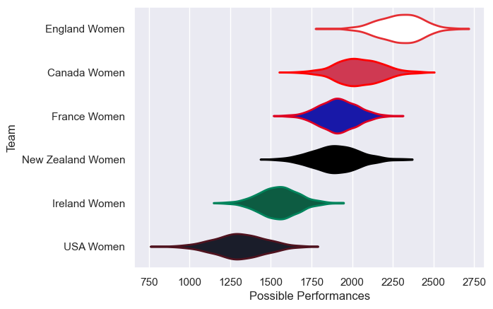
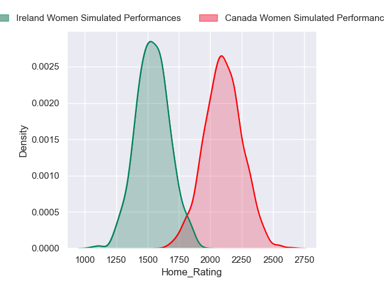
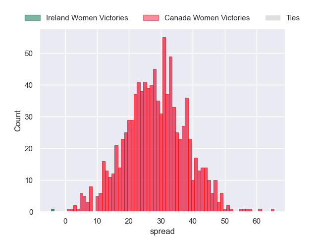
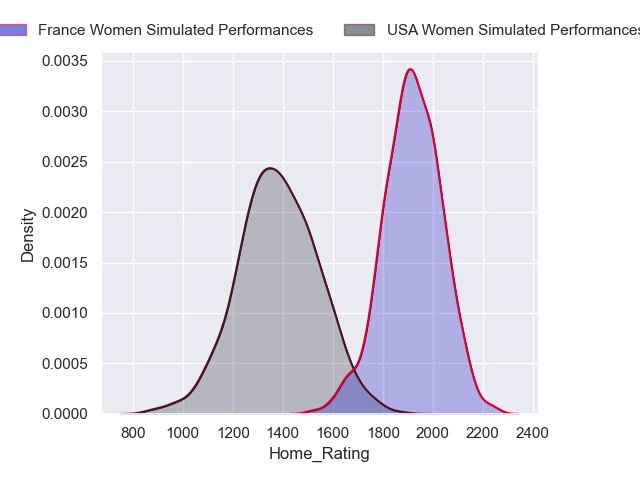
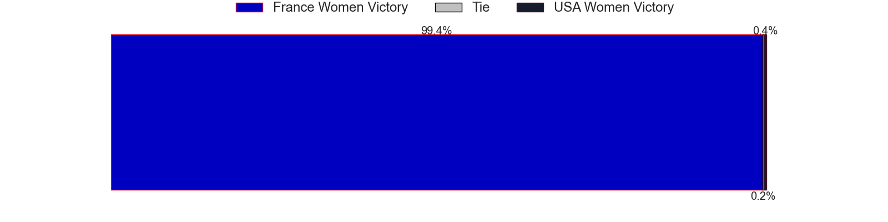
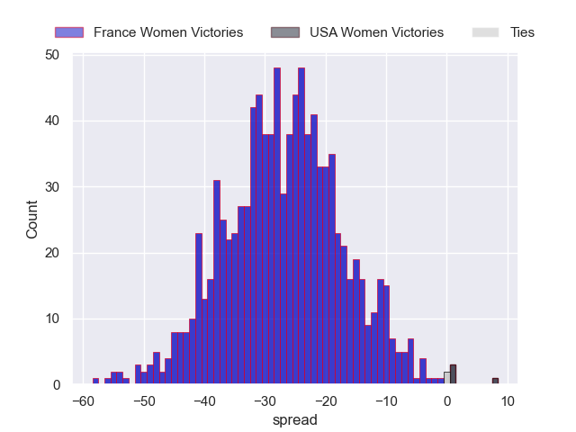
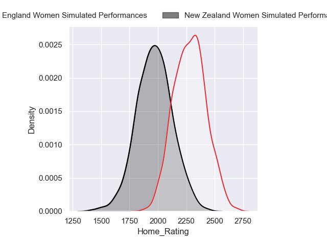
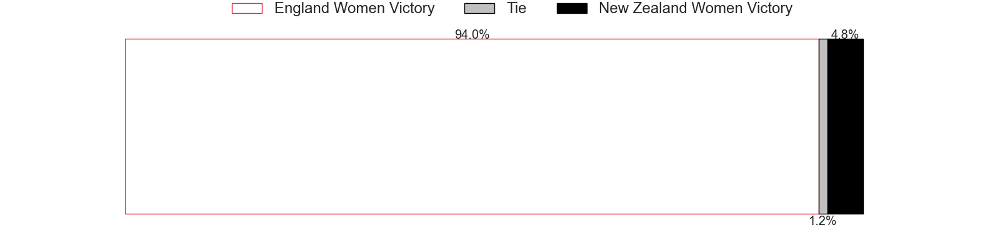
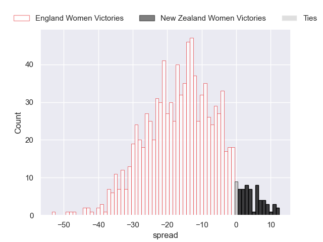

---  
title: "WXV 1 2024 Status"  
date: 2024-10-03 6:00:00 -0500  
categories: model review projection  
layout: article  
aside:  
    toc: true  
---
# Current Team Rankings

# Standings

## Current Standings

| Club              |   Played |   Wins |   Point Differential |   Losing Bonus Points |   Try Bonus Points |   Competition Points |
|:------------------|---------:|-------:|---------------------:|----------------------:|-------------------:|---------------------:|
| England Women     |        1 |      1 |                   40 |                     0 |                nan |                    4 |
| Canada Women      |        1 |      1 |                   22 |                     0 |                nan |                    4 |
| Ireland Women     |        1 |      1 |                    2 |                     0 |                nan |                    4 |
| New Zealand Women |        1 |      0 |                   -2 |                     1 |                nan |                    1 |
| France Women      |        1 |      0 |                  -22 |                     0 |                nan |                    0 |
| USA Women         |        1 |      0 |                  -40 |                     0 |                nan |                    0 |

## Projected Remaining Table

| Club              |   Matches Remaining |   Wins |   Point Differential |   Losing Bonus Points |   Try Bonus Points |   Competition Points |
|:------------------|--------------------:|-------:|---------------------:|----------------------:|-------------------:|---------------------:|
| France Women      |                   1 |    1   |              26.5459 |                   0   |                0.9 |                  4.9 |
| Canada Women      |                   1 |    1   |              28.0785 |                   0   |                0.8 |                  4.8 |
| England Women     |                   1 |    0.9 |              16.2304 |                   0   |                0.3 |                  4.1 |
| New Zealand Women |                   1 |    0.1 |             -16.2304 |                   0.1 |                0.4 |                  0.7 |
| USA Women         |                   1 |    0   |             -26.5459 |                   0   |                0.1 |                  0.1 |
| Ireland Women     |                   1 |    0   |             -28.0785 |                   0   |                0.1 |                  0.1 |

## Projected Total Table

| Club              |   Total Matches |   Wins |   Point Differential |   Losing Bonus Points |   Try Bonus Points |   Competition Points |
|:------------------|----------------:|-------:|---------------------:|----------------------:|-------------------:|---------------------:|
| Canada Women      |               2 |    2   |             50.0785  |                   0   |                0.8 |                  8.8 |
| England Women     |               2 |    1.9 |             56.2304  |                   0   |                0.3 |                  8.1 |
| France Women      |               2 |    1   |              4.54587 |                   0   |                0.9 |                  4.9 |
| Ireland Women     |               2 |    1   |            -26.0785  |                   0   |                0.1 |                  4.1 |
| New Zealand Women |               2 |    0.1 |            -18.2304  |                   1.1 |                0.4 |                  1.7 |
| USA Women         |               2 |    0   |            -66.5459  |                   0   |                0.1 |                  0.1 |

# Completed Match Review

| Model | Percent Correct Predictions | Spread Error |
| ------ | ------ | ------ |
| Club Level | 66.7% | 18.4 |
| Player Level: Lineup | nan% | nan |
| Player Level: Minutes | nan% | nan |

# Future Predictions

## Week 2

### Canada Women V Ireland Women on 2024/10/05

Average Margin: Canada Women by 28.1

Average Scoreline: 44-16

### USA Women V France Women on 2024/10/05

Average Margin: France Women by 26.5

Average Scoreline: 37-11

### New Zealand Women V England Women on 2024/10/06

Average Margin: England Women by 16.2

Average Scoreline: 32-16

