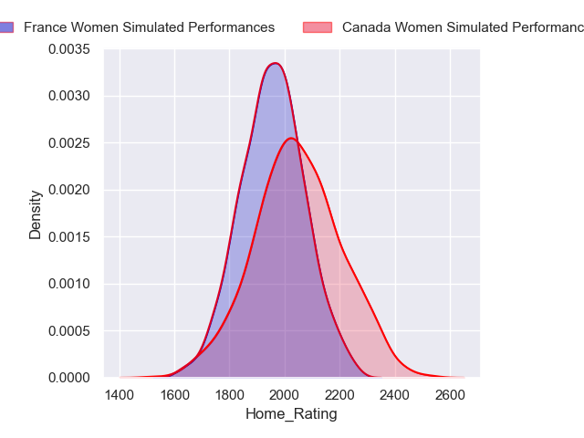
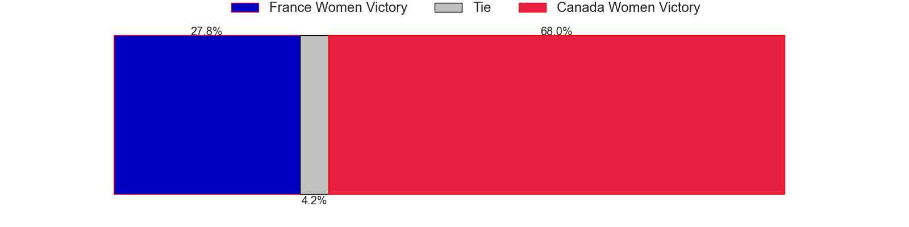
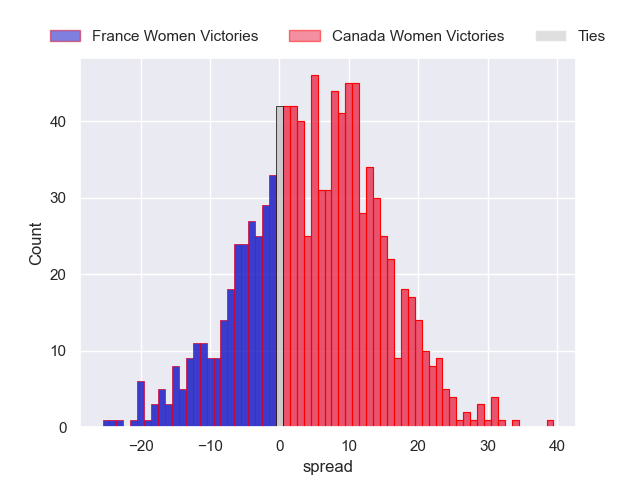

---  
title: "WXV 1 2024 Status"  
date: 2024-09-23 6:00:00 -0500  
categories: model review projection  
layout: article  
aside:  
    toc: true  
---
# Current Team Rankings

# Standings

## Projected Total Table

| Club          |   Total Matches |   Wins |   Point Differential |   Losing Bonus Points |   Try Bonus Points |   Competition Points |
|:--------------|----------------:|-------:|---------------------:|----------------------:|-------------------:|---------------------:|
| England Women |               1 |    1   |             45.6932  |                   0   |                0.9 |                  4.9 |
| Canada Women  |               1 |    0.7 |              4.55243 |                   0.2 |                0.2 |                  3.2 |
| France Women  |               1 |    0.3 |             -4.55243 |                   0.3 |                0.3 |                  1.8 |
| USA Women     |               1 |    0   |            -45.6932  |                   0   |                0.5 |                  0.5 |

# Future Predictions

## Week 1

### Canada Women V France Women on 2024/09/29

Average Margin: Canada Women by 4.6

Average Scoreline: 23-18

### USA Women V England Women on 2024/09/29

Average Margin: England Women by 45.7

Average Scoreline: 41--5

