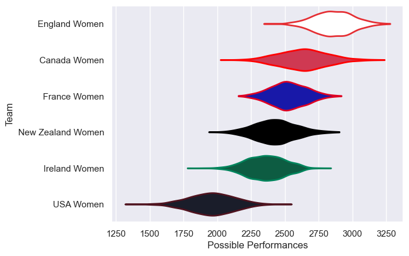

---  
title: "WXV 1 2024 Status"  
date: 2025-07-28 6:00:00 -0500  
categories: model review projection  
layout: article  
aside:  
    toc: true  
---
# Current Team Rankings

# Standings

## Current Standings

| Club              |   Played |   Wins |   Point Differential |   Losing Bonus Points |   Try Bonus Points |   Competition Points |
|:------------------|---------:|-------:|---------------------:|----------------------:|-------------------:|---------------------:|
| England Women     |        3 |      3 |                   67 |                     0 |                  2 |                   14 |
| Ireland Women     |        4 |      3 |                    3 |                     0 |                  2 |                   14 |
| Canada Women      |        3 |      2 |                   26 |                     0 |                  1 |                    9 |
| New Zealand Women |        4 |      1 |                    3 |                     2 |                  2 |                    8 |
| France Women      |        3 |      1 |                  -39 |                     0 |                  1 |                    5 |
| USA Women         |        3 |      0 |                  -60 |                     0 |                    |                    0 |

# Completed Match Review

| Model | Percent Correct Predictions | Spread Error |
| ------ | ------ | ------ |
| Club Level | 80.0% | 15.2 |
| Player Level: Lineup | nan% | nan |
| Player Level: Minutes | nan% | nan |

