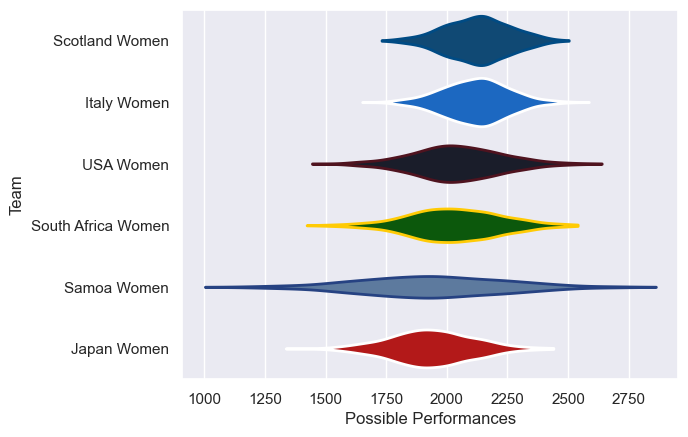

---  
title: "WXV 2 2023"  
date: 2025-07-29 6:00:00 -0500  
categories: model review projection  
layout: article  
aside:  
    toc: true  
---
# Current Team Rankings

# Standings

## Current Standings

| Club               |   Played |   Wins |   Point Differential |   Losing Bonus Points | Try Bonus Points   |   Competition Points |
|:-------------------|---------:|-------:|---------------------:|----------------------:|:-------------------|---------------------:|
| Scotland Women     |        3 |      3 |                   55 |                     0 |                    |                   12 |
| Italy Women        |        3 |      3 |                   53 |                     0 |                    |                   12 |
| South Africa Women |        3 |      1 |                   -6 |                     0 |                    |                    4 |
| Japan Women        |        3 |      1 |                  -22 |                     0 |                    |                    4 |
| USA Women          |        3 |      1 |                  -22 |                     0 |                    |                    4 |
| Samoa Women        |        3 |      0 |                  -58 |                     0 |                    |                    0 |

# Completed Match Review

| Model | Percent Correct Predictions | Spread Error |
| ------ | ------ | ------ |
| Club Level | 77.8% | 11.2 |
| Player Level: Lineup | nan% | nan |
| Player Level: Minutes | nan% | nan |

