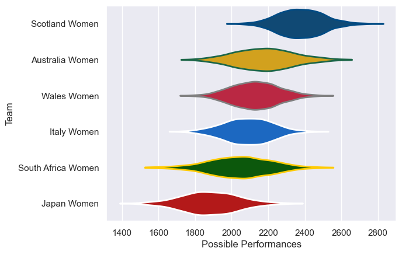

---  
title: "WXV 2 2024 Status"  
date: 2025-07-28 6:00:00 -0500  
categories: model review projection  
layout: article  
aside:  
    toc: true  
---
# Current Team Rankings

# Standings

## Current Standings

| Club               |   Played |   Wins |   Point Differential |   Losing Bonus Points |   Try Bonus Points |   Competition Points |
|:-------------------|---------:|-------:|---------------------:|----------------------:|-------------------:|---------------------:|
| Australia Women    |        3 |      3 |                   48 |                     0 |                  3 |                   15 |
| Scotland Women     |        3 |      2 |                   16 |                     0 |                  1 |                    9 |
| South Africa Women |        3 |      1 |                   -4 |                     2 |                  2 |                    8 |
| Italy Women        |        3 |      2 |                  -12 |                     0 |                    |                    8 |
| Wales Women        |        3 |      1 |                  -26 |                     1 |                    |                    5 |
| Japan Women        |        3 |      0 |                  -22 |                     2 |                  1 |                    3 |

# Completed Match Review

| Model | Percent Correct Predictions | Spread Error |
| ------ | ------ | ------ |
| Club Level | 44.4% | 13.0 |
| Player Level: Lineup | nan% | nan |
| Player Level: Minutes | nan% | nan |

