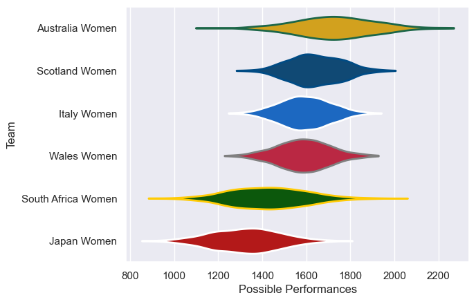
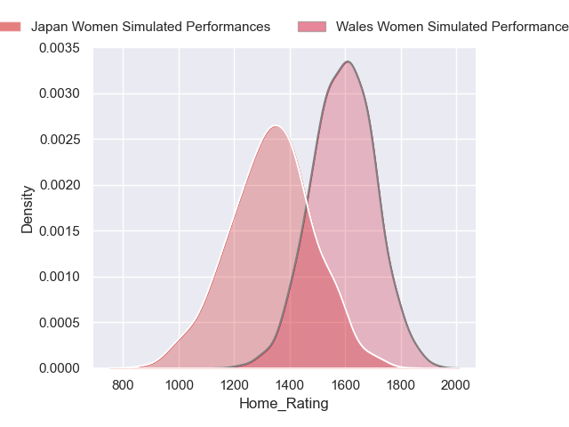
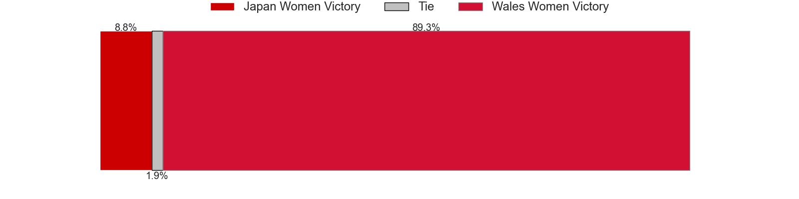
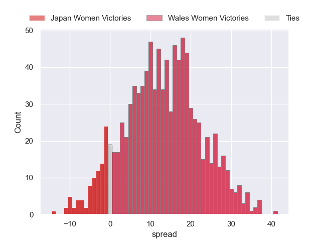
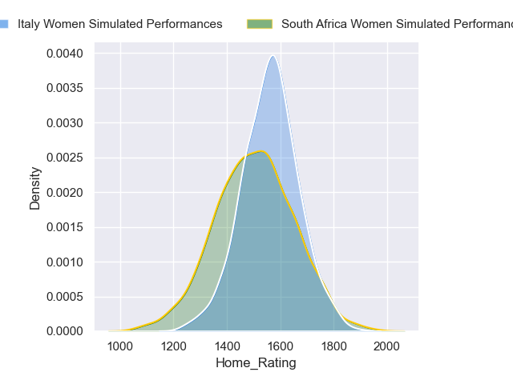
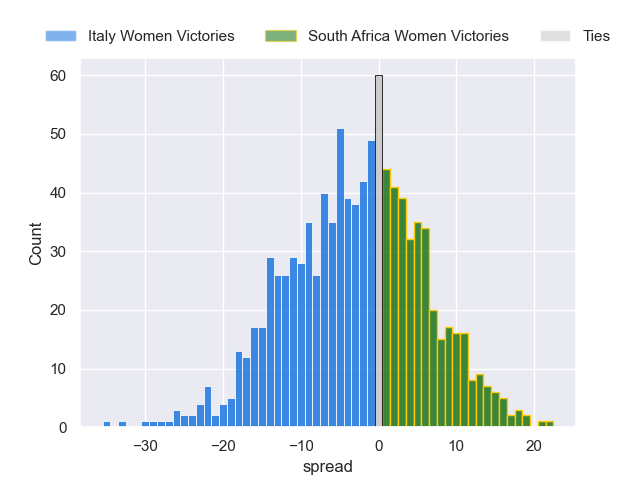
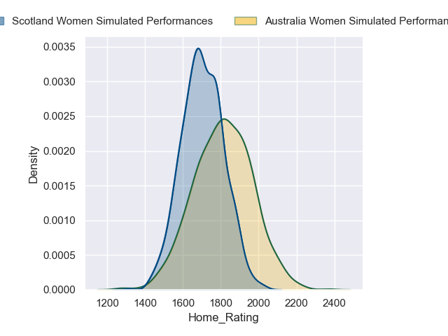
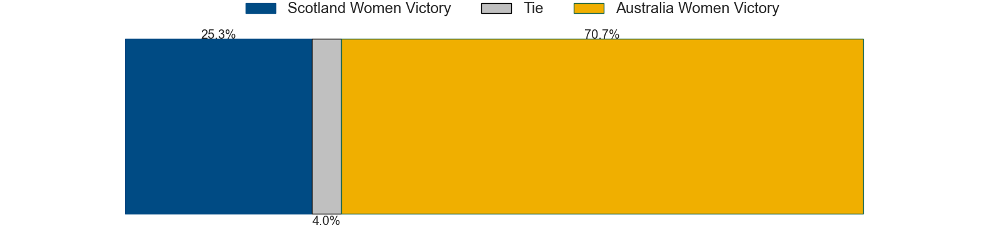
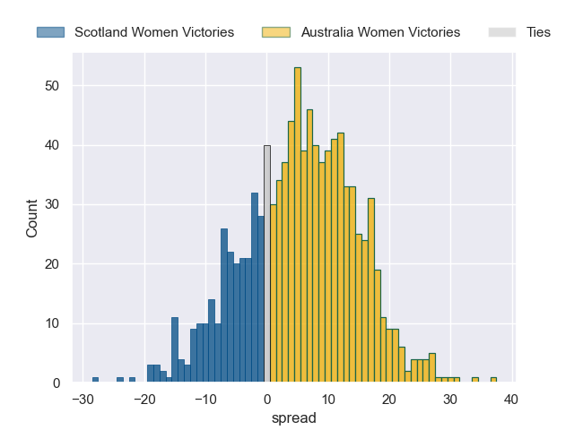

---  
title: "WXV 2 2024 Status"  
date: 2024-10-07 6:00:00 -0500  
categories: model review projection  
layout: article  
aside:  
    toc: true  
---
# Current Team Rankings

# Standings

## Current Standings

| Club               |   Played |   Wins |   Point Differential |   Losing Bonus Points |   Try Bonus Points |   Competition Points |
|:-------------------|---------:|-------:|---------------------:|----------------------:|-------------------:|---------------------:|
| Australia Women    |        1 |      1 |                   32 |                     0 |                nan |                    4 |
| Scotland Women     |        1 |      1 |                   19 |                     0 |                nan |                    4 |
| South Africa Women |        1 |      1 |                    7 |                     0 |                nan |                    4 |
| Italy Women        |        2 |      1 |                  -16 |                     0 |                nan |                    4 |
| Japan Women        |        1 |      0 |                   -7 |                     1 |                nan |                    1 |
| Wales Women        |        2 |      0 |                  -35 |                     1 |                nan |                    1 |

## Projected Remaining Table

| Club               |   Matches Remaining |   Wins |   Point Differential |   Losing Bonus Points |   Try Bonus Points |   Competition Points |
|:-------------------|--------------------:|-------:|---------------------:|----------------------:|-------------------:|---------------------:|
| Wales Women        |                   1 |    0.9 |             12.9237  |                   0.1 |                0.6 |                  4.3 |
| Australia Women    |                   1 |    0.7 |              5.43155 |                   0.2 |                0.2 |                  3.3 |
| Italy Women        |                   1 |    0.6 |              2.93935 |                   0.3 |                0.5 |                  3.2 |
| South Africa Women |                   1 |    0.4 |             -2.93935 |                   0.3 |                0.2 |                  2   |
| Scotland Women     |                   1 |    0.3 |             -5.43155 |                   0.3 |                0.2 |                  1.6 |
| Japan Women        |                   1 |    0.1 |            -12.9237  |                   0.2 |                0.1 |                  0.7 |

## Projected Total Table

| Club               |   Total Matches |   Wins |   Point Differential |   Losing Bonus Points |   Try Bonus Points |   Competition Points |
|:-------------------|----------------:|-------:|---------------------:|----------------------:|-------------------:|---------------------:|
| Australia Women    |               2 |    1.7 |             37.4316  |                   0.2 |                0.2 |                  7.3 |
| Italy Women        |               3 |    1.6 |            -13.0606  |                   0.3 |                0.5 |                  7.2 |
| South Africa Women |               2 |    1.4 |              4.06065 |                   0.3 |                0.2 |                  6   |
| Scotland Women     |               2 |    1.3 |             13.5684  |                   0.3 |                0.2 |                  5.6 |
| Wales Women        |               3 |    0.9 |            -22.0763  |                   1.1 |                0.6 |                  5.3 |
| Japan Women        |               2 |    0.1 |            -19.9237  |                   1.2 |                0.1 |                  1.7 |

# Completed Match Review

| Model | Percent Correct Predictions | Spread Error |
| ------ | ------ | ------ |
| Club Level | 50.0% | 13.0 |
| Player Level: Lineup | nan% | nan |
| Player Level: Minutes | nan% | nan |

# Future Predictions

## Week 3

### Wales Women V Japan Women on 2024/10/11

Average Margin: Wales Women by 12.9

Average Scoreline: 20-7

### South Africa Women V Italy Women on 2024/10/12

Average Margin: Italy Women by 2.9

Average Scoreline: 24-21

### Australia Women V Scotland Women on 2024/10/12

Average Margin: Australia Women by 5.4

Average Scoreline: 25-20

