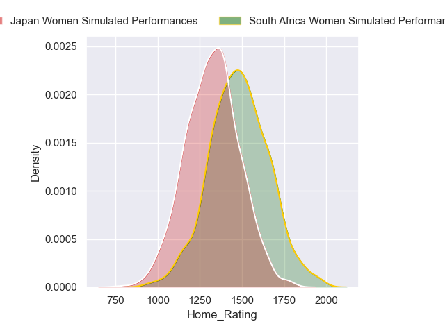
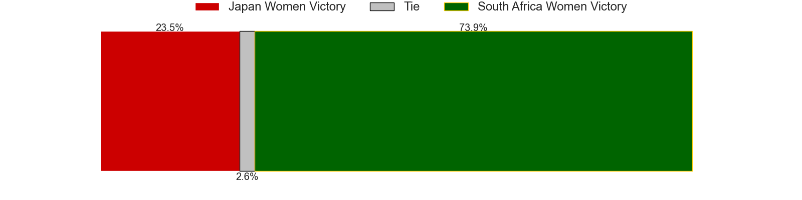
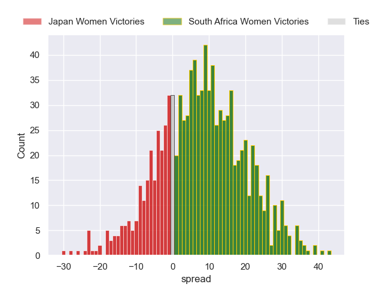
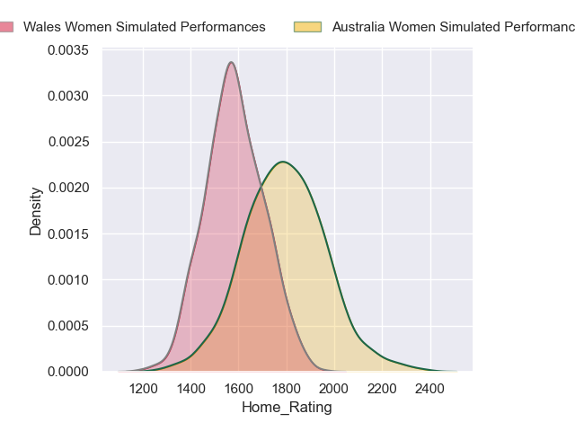
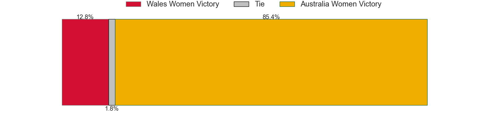
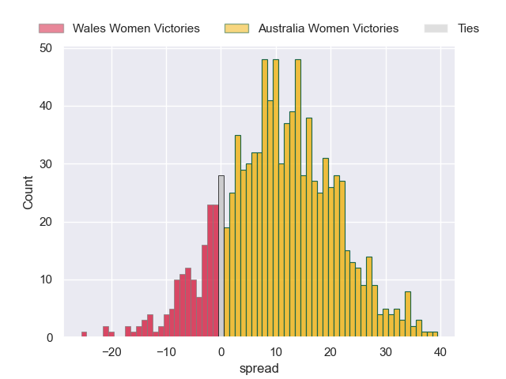
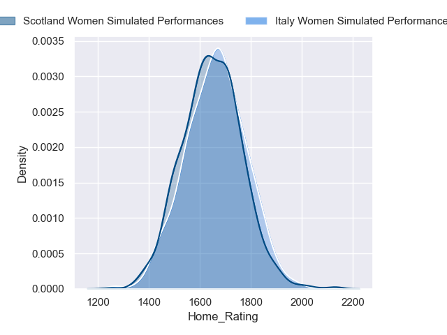
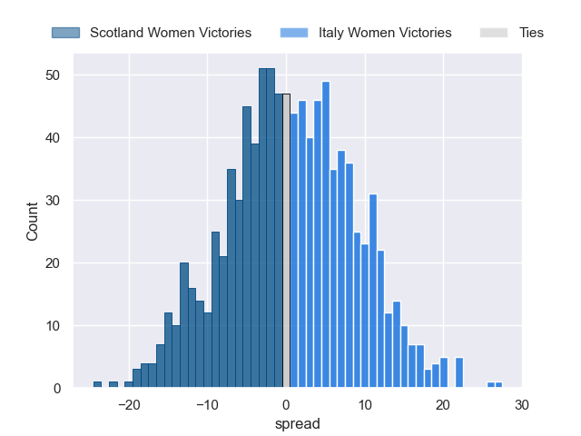

---  
title: "WXV 2 2024 Status"  
date: 2024-09-26 6:00:00 -0500  
categories: model review projection  
layout: article  
aside:  
    toc: true  
---
# Current Team Rankings

# Standings

## Projected Total Table

| Club               |   Total Matches |   Wins |   Point Differential |   Losing Bonus Points |   Try Bonus Points |   Competition Points |
|:-------------------|----------------:|-------:|---------------------:|----------------------:|-------------------:|---------------------:|
| Australia Women    |               1 |    0.9 |            10.8503   |                   0.1 |                0.4 |                  3.9 |
| South Africa Women |               1 |    0.7 |             7.22114  |                   0.2 |                0.4 |                  3.5 |
| Italy Women        |               1 |    0.5 |             0.712683 |                   0.3 |                0.4 |                  2.8 |
| Scotland Women     |               1 |    0.5 |            -0.712683 |                   0.3 |                0.3 |                  2.5 |
| Japan Women        |               1 |    0.3 |            -7.22114  |                   0.2 |                0.3 |                  1.6 |
| Wales Women        |               1 |    0.1 |           -10.8503   |                   0.2 |                0.3 |                  1   |

# Future Predictions

## Week 1

### South Africa Women V Japan Women on 2024/09/27

Average Margin: South Africa Women by 7.2

Average Scoreline: 22-15

### Australia Women V Wales Women on 2024/09/28

Average Margin: Australia Women by 10.9

Average Scoreline: 21-10

### Italy Women V Scotland Women on 2024/09/28

Average Margin: Italy Women by 0.7

Average Scoreline: 14-13

