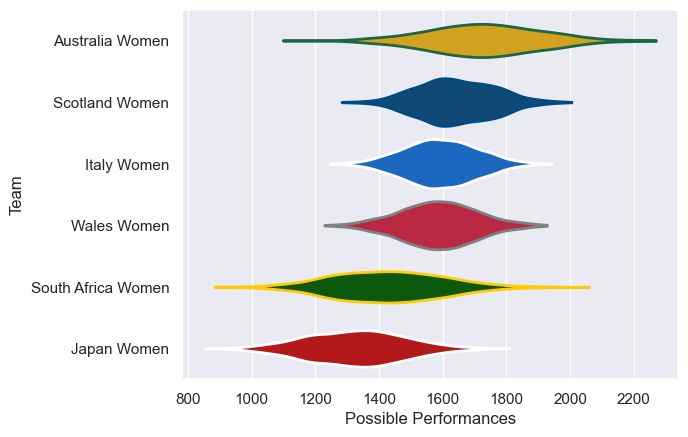
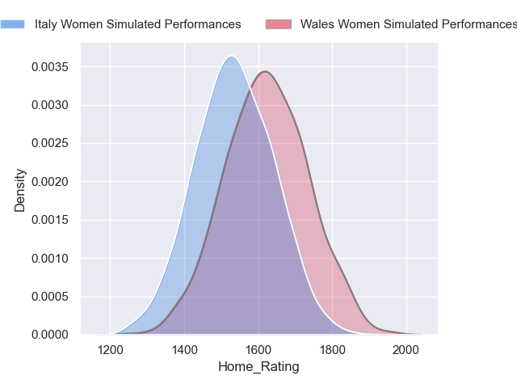
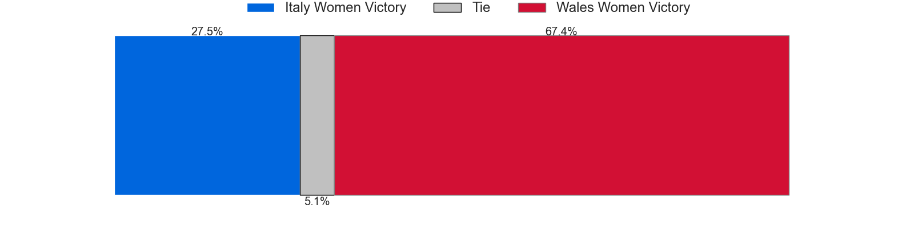
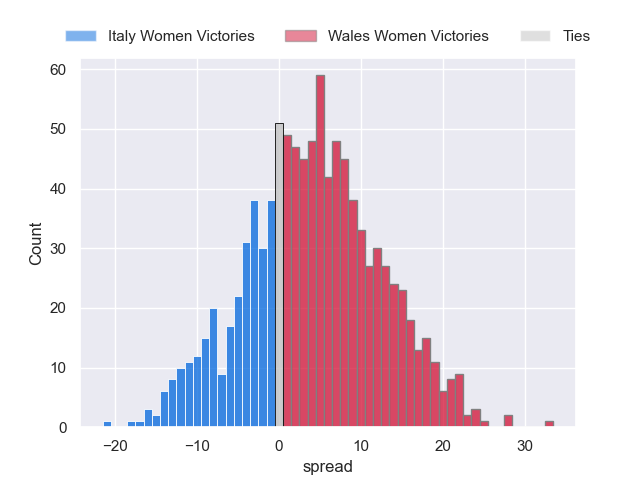
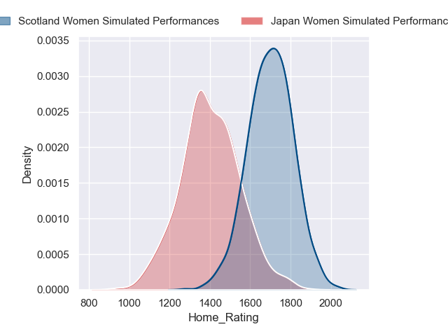
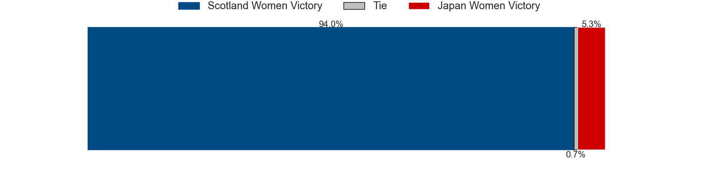
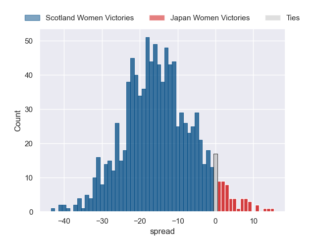

---  
title: "WXV 2 2024 Status"  
date: 2024-10-04 6:00:00 -0500  
categories: model review projection  
layout: article  
aside:  
    toc: true  
---
# Current Team Rankings

# Standings

## Current Standings

| Club               |   Played |   Wins |   Point Differential |   Losing Bonus Points |   Try Bonus Points |   Competition Points |
|:-------------------|---------:|-------:|---------------------:|----------------------:|-------------------:|---------------------:|
| Australia Women    |        1 |      1 |                   32 |                     0 |                nan |                    4 |
| Scotland Women     |        1 |      1 |                   19 |                     0 |                nan |                    4 |
| South Africa Women |        1 |      1 |                    7 |                     0 |                nan |                    4 |
| Japan Women        |        1 |      0 |                   -7 |                     1 |                nan |                    1 |
| Italy Women        |        1 |      0 |                  -19 |                     0 |                nan |                    0 |
| Wales Women        |        1 |      0 |                  -32 |                     0 |                nan |                    0 |

## Projected Remaining Table

| Club               |   Matches Remaining |   Wins |   Point Differential |   Losing Bonus Points |   Try Bonus Points |   Competition Points |
|:-------------------|--------------------:|-------:|---------------------:|----------------------:|-------------------:|---------------------:|
| Scotland Women     |                   1 |    0.9 |             15.2071  |                   0   |                0.7 |                  4.5 |
| Australia Women    |                   1 |    0.9 |             14.9698  |                   0.1 |                0.7 |                  4.3 |
| Wales Women        |                   1 |    0.7 |              4.18507 |                   0.2 |                0.3 |                  3.3 |
| Italy Women        |                   1 |    0.3 |             -4.18507 |                   0.3 |                0.3 |                  1.8 |
| South Africa Women |                   1 |    0.1 |            -14.9698  |                   0.1 |                0.2 |                  0.7 |
| Japan Women        |                   1 |    0.1 |            -15.2071  |                   0.1 |                0.1 |                  0.5 |

## Projected Total Table

| Club               |   Total Matches |   Wins |   Point Differential |   Losing Bonus Points |   Try Bonus Points |   Competition Points |
|:-------------------|----------------:|-------:|---------------------:|----------------------:|-------------------:|---------------------:|
| Scotland Women     |               2 |    1.9 |             34.2071  |                   0   |                0.7 |                  8.5 |
| Australia Women    |               2 |    1.9 |             46.9698  |                   0.1 |                0.7 |                  8.3 |
| South Africa Women |               2 |    1.1 |             -7.96977 |                   0.1 |                0.2 |                  4.7 |
| Wales Women        |               2 |    0.7 |            -27.8149  |                   0.2 |                0.3 |                  3.3 |
| Italy Women        |               2 |    0.3 |            -23.1851  |                   0.3 |                0.3 |                  1.8 |
| Japan Women        |               2 |    0.1 |            -22.2071  |                   1.1 |                0.1 |                  1.5 |

# Completed Match Review

| Model | Percent Correct Predictions | Spread Error |
| ------ | ------ | ------ |
| Club Level | 66.7% | 14.5 |
| Player Level: Lineup | nan% | nan |
| Player Level: Minutes | nan% | nan |

# Future Predictions

## Week 2

### Wales Women V Italy Women on 2024/10/04

Average Margin: Wales Women by 4.2

Average Scoreline: 22-18

### South Africa Women V Australia Women on 2024/10/05

Average Margin: Australia Women by 15.0

Average Scoreline: 32-17

### Japan Women V Scotland Women on 2024/10/05

Average Margin: Scotland Women by 15.2

Average Scoreline: 22-7

