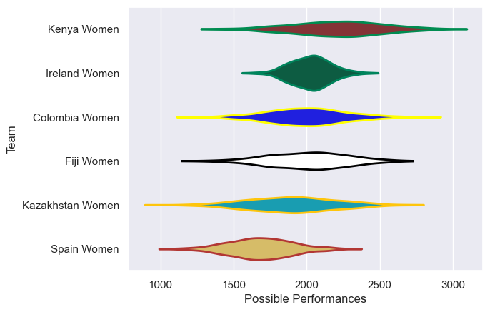

---  
title: "WXV 3 2023"  
date: 2025-07-29 6:00:00 -0500  
categories: model review projection  
layout: article  
aside:  
    toc: true  
---
# Current Team Rankings

# Standings

## Current Standings

| Club             |   Played |   Wins |   Point Differential |   Losing Bonus Points | Try Bonus Points   |   Competition Points |
|:-----------------|---------:|-------:|---------------------:|----------------------:|:-------------------|---------------------:|
| Ireland Women    |        3 |      3 |                  172 |                     0 |                    |                   12 |
| Fiji Women       |        3 |      2 |                  165 |                     1 |                    |                    9 |
| Spain Women      |        3 |      2 |                   37 |                     1 |                    |                    9 |
| Kenya Women      |        3 |      1 |                  -22 |                     1 |                    |                    5 |
| Kazakhstan Women |        3 |      1 |                 -221 |                     0 |                    |                    4 |
| Colombia Women   |        3 |      0 |                 -131 |                     0 |                    |                    0 |

# Completed Match Review

| Model | Percent Correct Predictions | Spread Error |
| ------ | ------ | ------ |
| Club Level | 55.6% | 46.9 |
| Player Level: Lineup | nan% | nan |
| Player Level: Minutes | nan% | nan |

