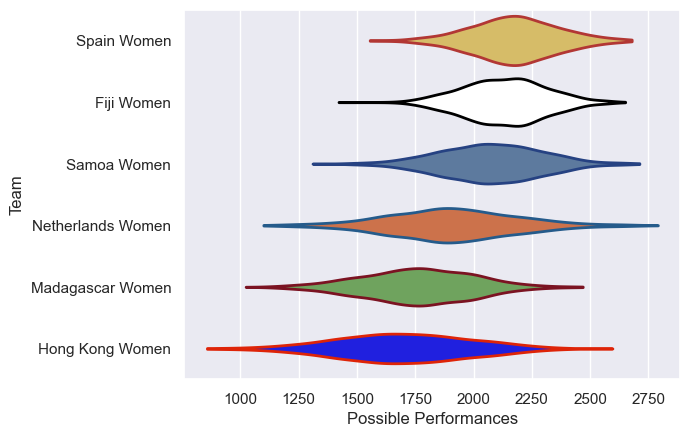

---  
title: "WXV 3 2024 Status"  
date: 2025-07-28 6:00:00 -0500  
categories: model review projection  
layout: article  
aside:  
    toc: true  
---
# Current Team Rankings

# Standings

## Current Standings

| Club              |   Played |   Wins |   Point Differential |   Losing Bonus Points |   Try Bonus Points |   Competition Points |
|:------------------|---------:|-------:|---------------------:|----------------------:|-------------------:|---------------------:|
| Spain Women       |        3 |      3 |                  105 |                     0 |                  1 |                   13 |
| Samoa Women       |        3 |      2 |                   59 |                     0 |                  2 |                   12 |
| Netherlands Women |        3 |      1 |                   10 |                     0 |                  1 |                    7 |
| Fiji Women        |        3 |      1 |                    5 |                     1 |                  1 |                    6 |
| Hong Kong Women   |        3 |      1 |                  -34 |                     0 |                  1 |                    5 |
| Madagascar Women  |        3 |      0 |                 -145 |                     0 |                    |                    0 |

# Completed Match Review

| Model | Percent Correct Predictions | Spread Error |
| ------ | ------ | ------ |
| Club Level | 55.6% | 24.0 |
| Player Level: Lineup | nan% | nan |
| Player Level: Minutes | nan% | nan |

