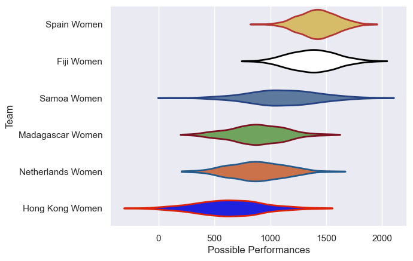
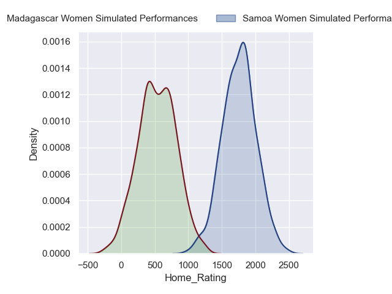
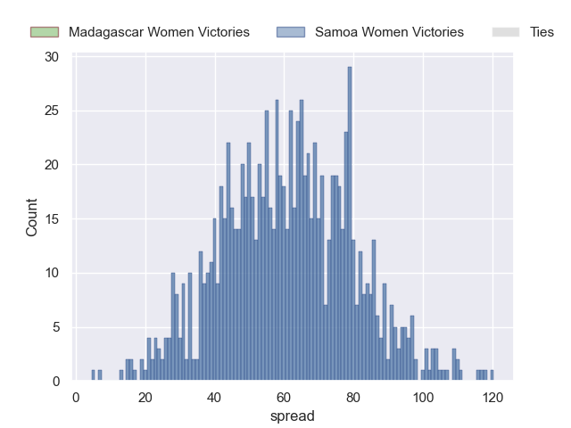
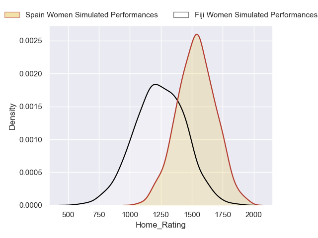
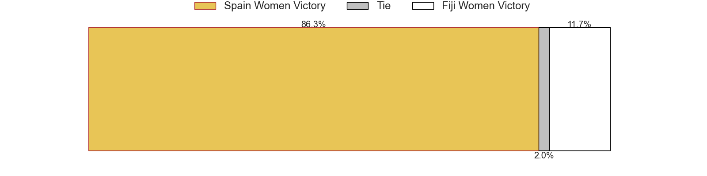
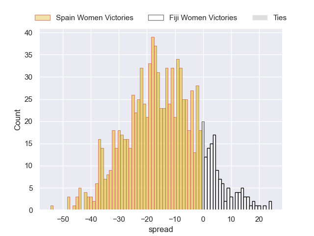
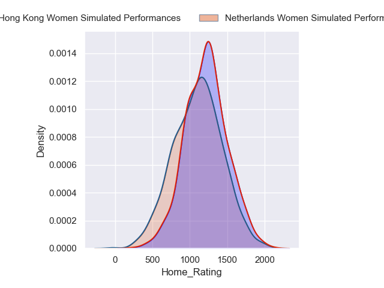
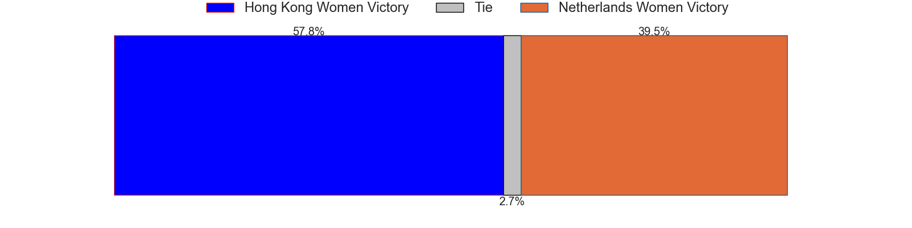
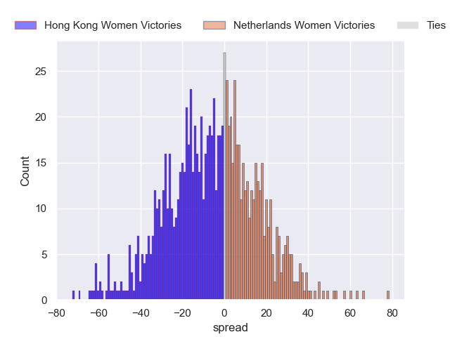

---  
title: "WXV 3 2024 Status"  
date: 2024-10-07 6:00:00 -0500  
categories: model review projection  
layout: article  
aside:  
    toc: true  
---
# Current Team Rankings

# Standings

## Current Standings

| Club              |   Played |   Wins |   Point Differential |   Losing Bonus Points |   Try Bonus Points |   Competition Points |
|:------------------|---------:|-------:|---------------------:|----------------------:|-------------------:|---------------------:|
| Spain Women       |        2 |      2 |                  103 |                     0 |                nan |                    8 |
| Samoa Women       |        2 |      1 |                   28 |                     0 |                nan |                    6 |
| Fiji Women        |        2 |      1 |                    7 |                     0 |                nan |                    4 |
| Hong Kong Women   |        2 |      1 |                   -4 |                     0 |                nan |                    4 |
| Netherlands Women |        2 |      0 |                  -20 |                     0 |                nan |                    2 |
| Madagascar Women  |        2 |      0 |                 -114 |                     0 |                nan |                    0 |

## Projected Remaining Table

| Club              |   Matches Remaining |   Wins |   Point Differential |   Losing Bonus Points |   Try Bonus Points |   Competition Points |
|:------------------|--------------------:|-------:|---------------------:|----------------------:|-------------------:|---------------------:|
| Samoa Women       |                   1 |    1   |             61.0533  |                   0   |                0.6 |                  4.6 |
| Spain Women       |                   1 |    0.9 |             14.6707  |                   0.1 |                0.7 |                  4.3 |
| Hong Kong Women   |                   1 |    0.6 |              5.55053 |                   0.1 |                0.4 |                  2.9 |
| Netherlands Women |                   1 |    0.4 |             -5.55053 |                   0.1 |                0.2 |                  1.9 |
| Fiji Women        |                   1 |    0.1 |            -14.6707  |                   0.2 |                0.2 |                  0.8 |
| Madagascar Women  |                   1 |    0   |            -61.0533  |                   0   |                0.1 |                  0.1 |

## Projected Total Table

| Club              |   Total Matches |   Wins |   Point Differential |   Losing Bonus Points |   Try Bonus Points |   Competition Points |
|:------------------|----------------:|-------:|---------------------:|----------------------:|-------------------:|---------------------:|
| Spain Women       |               3 |    2.9 |            117.671   |                   0.1 |                0.7 |                 12.3 |
| Samoa Women       |               3 |    2   |             89.0533  |                   0   |                0.6 |                 10.6 |
| Hong Kong Women   |               3 |    1.6 |              1.55053 |                   0.1 |                0.4 |                  6.9 |
| Fiji Women        |               3 |    1.1 |             -7.67067 |                   0.2 |                0.2 |                  4.8 |
| Netherlands Women |               3 |    0.4 |            -25.5505  |                   0.1 |                0.2 |                  3.9 |
| Madagascar Women  |               3 |    0   |           -175.053   |                   0   |                0.1 |                  0.1 |

# Completed Match Review

| Model | Percent Correct Predictions | Spread Error |
| ------ | ------ | ------ |
| Club Level | 50.0% | 34.8 |
| Player Level: Lineup | nan% | nan |
| Player Level: Minutes | nan% | nan |

# Future Predictions

## Week 3

### Samoa Women V Madagascar Women on 2024/10/11

Average Margin: Samoa Women by 61.1

Average Scoreline: 50--11

### Fiji Women V Spain Women on 2024/10/12

Average Margin: Spain Women by 14.7

Average Scoreline: 27-13

### Netherlands Women V Hong Kong Women on 2024/10/12

Average Margin: Hong Kong Women by 5.6

Average Scoreline: 31-25

