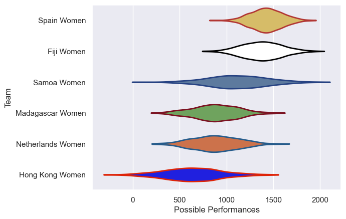
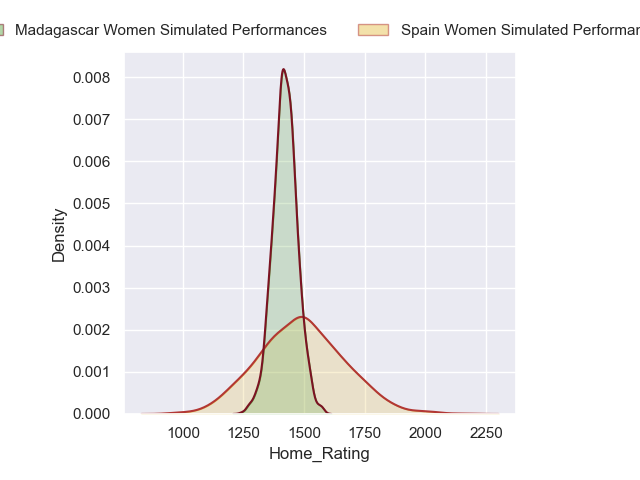
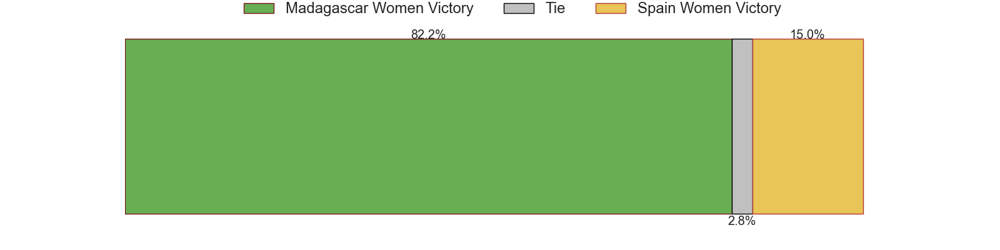
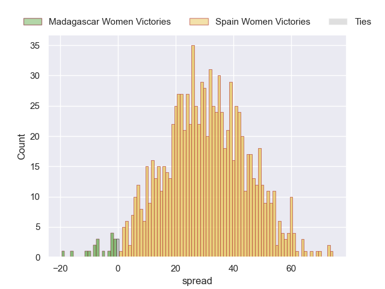
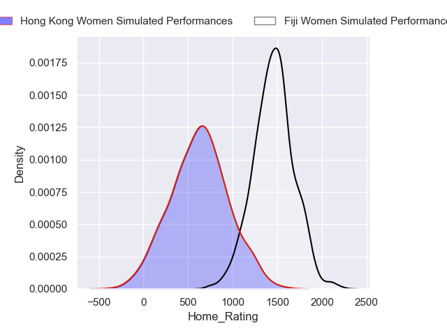
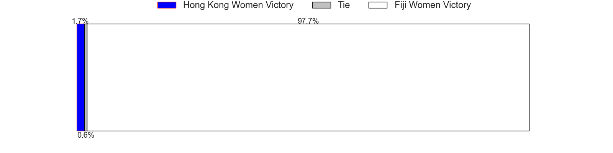
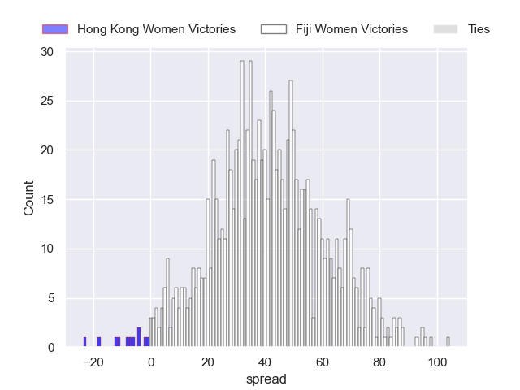
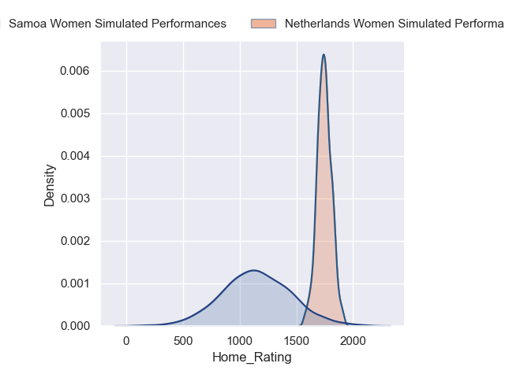
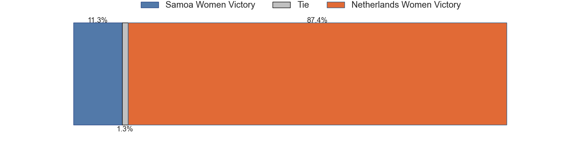
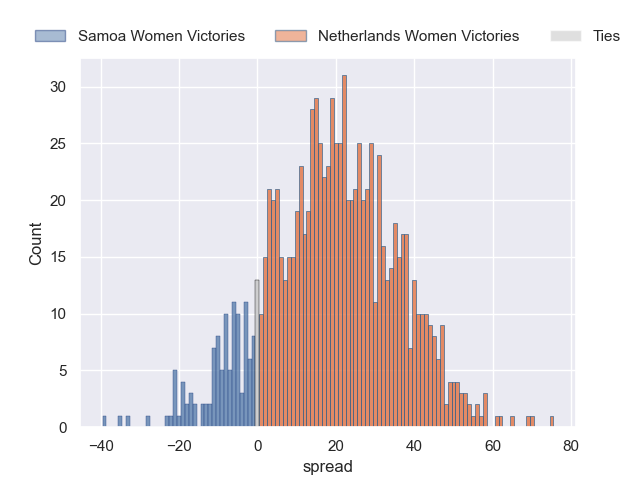

---  
title: "WXV 3 2024 Status"  
date: 2024-09-26 6:00:00 -0500  
categories: model review projection  
layout: article  
aside:  
    toc: true  
---
# Current Team Rankings

# Standings

## Projected Total Table

| Club              |   Total Matches |   Wins |   Point Differential |   Losing Bonus Points |   Try Bonus Points |   Competition Points |
|:------------------|----------------:|-------:|---------------------:|----------------------:|-------------------:|---------------------:|
| Fiji Women        |               1 |    1   |             41.4925  |                   0   |                0.8 |                  4.7 |
| Netherlands Women |               1 |    0.9 |             19.1426  |                   0.1 |                0.8 |                  4.4 |
| Spain Women       |               1 |    0.6 |              3.43396 |                   0.2 |                0.2 |                  3   |
| Madagascar Women  |               1 |    0.4 |             -3.43396 |                   0.3 |                0.4 |                  2.1 |
| Samoa Women       |               1 |    0.1 |            -19.1426  |                   0.1 |                0   |                  0.6 |
| Hong Kong Women   |               1 |    0   |            -41.4925  |                   0   |                0.2 |                  0.2 |

# Future Predictions

## Week 1

### Spain Women V Madagascar Women on 2024/09/27

Average Margin: Spain Women by 3.4

Average Scoreline: 18-14

### Fiji Women V Hong Kong Women on 2024/09/28

Average Margin: Fiji Women by 41.5

Average Scoreline: 37--5

### Netherlands Women V Samoa Women on 2024/09/28

Average Margin: Netherlands Women by 19.1

Average Scoreline: 27-8

