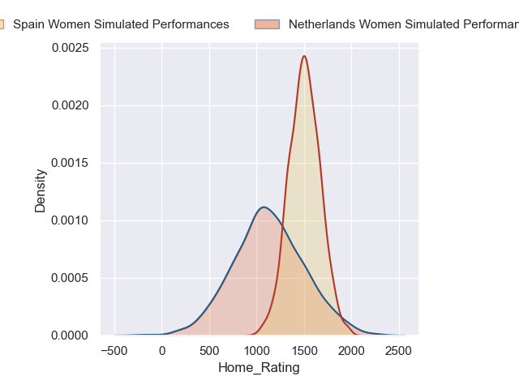
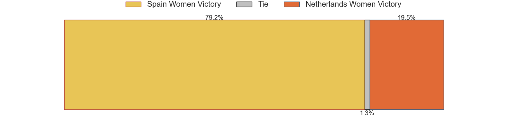
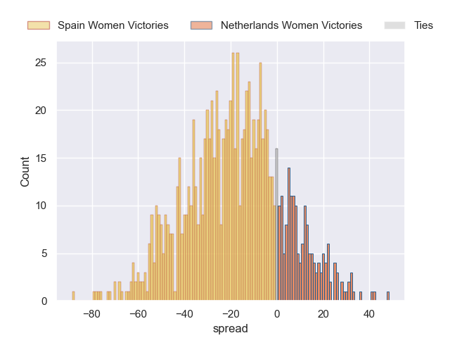
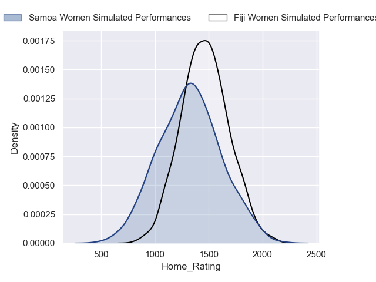
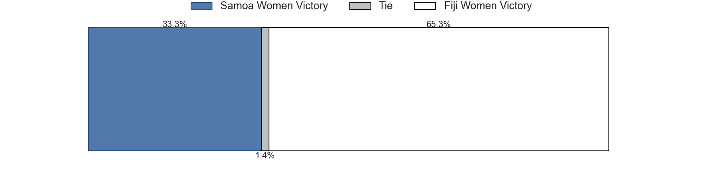
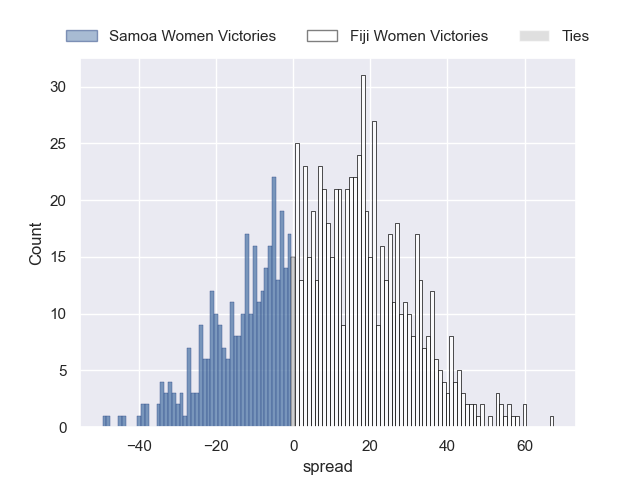

---  
title: "WXV 3 2024 Status"  
date: 2024-09-30 6:00:00 -0500  
categories: model review projection  
layout: article  
aside:  
    toc: true  
---
# Current Team Rankings

# Standings

## Current Standings

| Club              |   Played |   Wins |   Point Differential |   Losing Bonus Points |   Try Bonus Points |   Competition Points |
|:------------------|---------:|-------:|---------------------:|----------------------:|-------------------:|---------------------:|
| Spain Women       |        1 |      1 |                   83 |                     0 |                nan |                    4 |
| Fiji Women        |        1 |      1 |                   35 |                     0 |                nan |                    4 |
| Netherlands Women |        1 |      0 |                    0 |                     0 |                nan |                    2 |
| Samoa Women       |        1 |      0 |                    0 |                     0 |                nan |                    2 |
| Hong Kong Women   |        1 |      0 |                  -35 |                     0 |                nan |                    0 |
| Madagascar Women  |        1 |      0 |                  -83 |                     0 |                nan |                    0 |

## Projected Remaining Table

| Club              |   Matches Remaining |   Wins |   Point Differential |   Losing Bonus Points |   Try Bonus Points |   Competition Points |
|:------------------|--------------------:|-------:|---------------------:|----------------------:|-------------------:|---------------------:|
| Spain Women       |                   1 |    0.8 |             18.344   |                   0.1 |                0.9 |                  4.2 |
| Madagascar Women  |                   1 |    0.9 |             22.7607  |                   0.1 |                0.6 |                  4.1 |
| Fiji Women        |                   1 |    0.7 |              7.86946 |                   0.1 |                0.4 |                  3.2 |
| Samoa Women       |                   1 |    0.3 |             -7.86946 |                   0.2 |                0.1 |                  1.6 |
| Netherlands Women |                   1 |    0.2 |            -18.344   |                   0.1 |                0.1 |                  0.9 |
| Hong Kong Women   |                   1 |    0.1 |            -22.7607  |                   0.1 |                0.2 |                  0.8 |

## Projected Total Table

| Club              |   Total Matches |   Wins |   Point Differential |   Losing Bonus Points |   Try Bonus Points |   Competition Points |
|:------------------|----------------:|-------:|---------------------:|----------------------:|-------------------:|---------------------:|
| Spain Women       |               2 |    1.8 |            101.344   |                   0.1 |                0.9 |                  8.2 |
| Fiji Women        |               2 |    1.7 |             42.8695  |                   0.1 |                0.4 |                  7.2 |
| Madagascar Women  |               2 |    0.9 |            -60.2393  |                   0.1 |                0.6 |                  4.1 |
| Samoa Women       |               2 |    0.3 |             -7.86946 |                   0.2 |                0.1 |                  3.6 |
| Netherlands Women |               2 |    0.2 |            -18.344   |                   0.1 |                0.1 |                  2.9 |
| Hong Kong Women   |               2 |    0.1 |            -57.7607  |                   0.1 |                0.2 |                  0.8 |

# Completed Match Review

| Model | Percent Correct Predictions | Spread Error |
| ------ | ------ | ------ |
| Club Level | 66.7% | 37.4 |
| Player Level: Lineup | nan% | nan |
| Player Level: Minutes | nan% | nan |

# Future Predictions

## Week 2

### Madagascar Women V Hong Kong Women on 2024/10/04

Average Margin: Madagascar Women by 22.8

Average Scoreline: 32-9

### Netherlands Women V Spain Women on 2024/10/05

Average Margin: Spain Women by 18.3

Average Scoreline: 35-17

### Fiji Women V Samoa Women on 2024/10/05

Average Margin: Fiji Women by 7.9

Average Scoreline: 29-21

