# Team Rankings

# Standings

## Current Standings

| Club              |   Played |   Wins |   Point Differential |   Losing Bonus Points | Try Bonus Points   |   Competition Points |
|:------------------|---------:|-------:|---------------------:|----------------------:|:-------------------|---------------------:|
| Canada Women      |        1 |      1 |                   38 |                     0 |                    |                    4 |
| England Women     |        1 |      1 |                   33 |                     0 |                    |                    4 |
| New Zealand Women |        1 |      1 |                   14 |                     0 |                    |                    4 |
| France Women      |        1 |      0 |                  -14 |                     0 |                    |                    0 |
| Australia Women   |        1 |      0 |                  -33 |                     0 |                    |                    0 |
| Scotland Women    |        1 |      0 |                  -38 |                     0 |                    |                    0 |

## Projected Remaining Table

| Club               |   To Play |   Projected Wins |   Projected Differential |   Projected Losing Bonus Points | Projected Try Bonus Points   |   Projected Competition Points |
|:-------------------|----------:|-----------------:|-------------------------:|--------------------------------:|:-----------------------------|-------------------------------:|
| France Women       |         1 |            0.957 |                   22.826 |                           0.028 |                              |                          3.87  |
| New Zealand Women  |         1 |            0.952 |                   22.24  |                           0.032 |                              |                          3.852 |
| England Women      |         1 |            0.891 |                   19.108 |                           0.061 |                              |                          3.651 |
| Ireland Women      |         1 |            0.887 |                   17.42  |                           0.065 |                              |                          3.641 |
| Italy Women        |         1 |            0.823 |                   13.167 |                           0.098 |                              |                          3.444 |
| South Africa Women |         1 |            0.497 |                    0.466 |                           0.189 |                              |                          2.243 |
| Wales Women        |         1 |            0.47  |                   -0.466 |                           0.192 |                              |                          2.138 |
| Japan Women        |         1 |            0.15  |                  -13.167 |                           0.156 |                              |                          0.81  |
| USA Women          |         1 |            0.099 |                  -17.42  |                           0.105 |                              |                          0.529 |
| Canada Women       |         1 |            0.096 |                  -19.108 |                           0.108 |                              |                          0.518 |
| Scotland Women     |         1 |            0.042 |                  -22.24  |                           0.079 |                              |                          0.259 |
| Australia Women    |         1 |            0.036 |                  -22.826 |                           0.073 |                              |                          0.231 |

## Projected Total Table

| Club               |   Played |   Wins |   Point Differential |   Losing Bonus Points | Try Bonus Points   |   Competition Points |
|:-------------------|---------:|-------:|---------------------:|----------------------:|:-------------------|---------------------:|
| New Zealand Women  |        2 |  1.952 |               36.24  |                 0.032 |                    |                7.852 |
| England Women      |        2 |  1.891 |               52.108 |                 0.061 |                    |                7.651 |
| Canada Women       |        2 |  1.096 |               18.892 |                 0.108 |                    |                4.518 |
| France Women       |        2 |  0.957 |                8.826 |                 0.028 |                    |                3.87  |
| Ireland Women      |        1 |  0.887 |               17.42  |                 0.065 |                    |                3.641 |
| Italy Women        |        1 |  0.823 |               13.167 |                 0.098 |                    |                3.444 |
| South Africa Women |        1 |  0.497 |                0.466 |                 0.189 |                    |                2.243 |
| Wales Women        |        1 |  0.47  |               -0.466 |                 0.192 |                    |                2.138 |
| Japan Women        |        1 |  0.15  |              -13.167 |                 0.156 |                    |                0.81  |
| USA Women          |        1 |  0.099 |              -17.42  |                 0.105 |                    |                0.529 |
| Scotland Women     |        2 |  0.042 |              -60.24  |                 0.079 |                    |                0.259 |
| Australia Women    |        2 |  0.036 |              -55.826 |                 0.073 |                    |                0.231 |

# Completed Match Review

| Model | Percent Correct Predictions | Spread Error |
| ------ | ------ | ------ |
| Club Level | 77.8% | 8.8 |
| Player Level: Lineup | nan% | nan |
| Player Level: Minutes | nan% | nan |

# Future Predictions

## Week 2

### Wales Women V South Africa Women on 2026/09/18

Average Margin: South Africa Women by 0.5

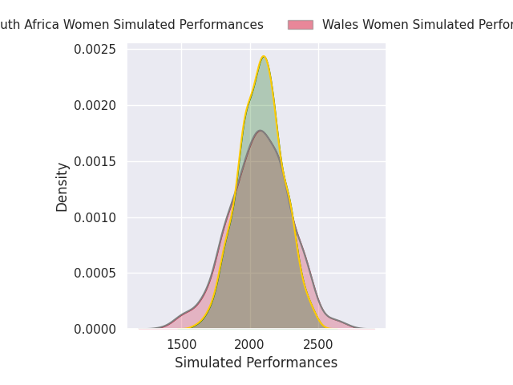

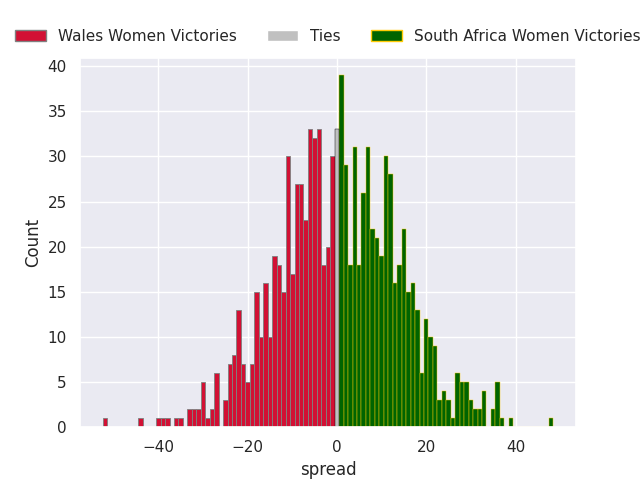

### France Women V Australia Women on 2026/09/19

Average Margin: France Women by 22.8

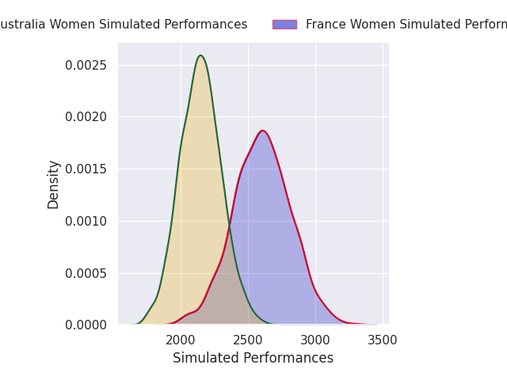
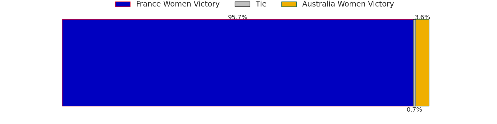
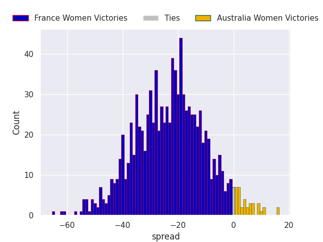

### Scotland Women V New Zealand Women on 2026/09/19

Average Margin: New Zealand Women by 22.2

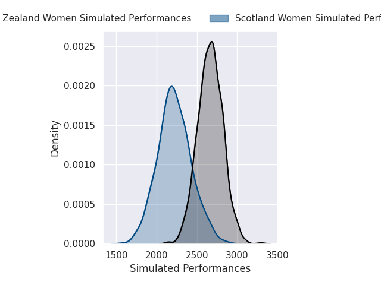
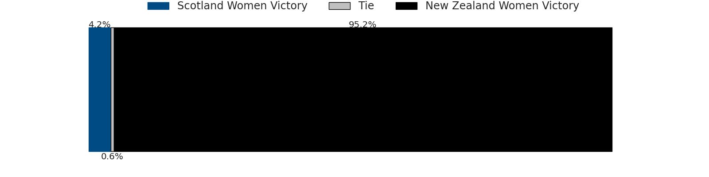
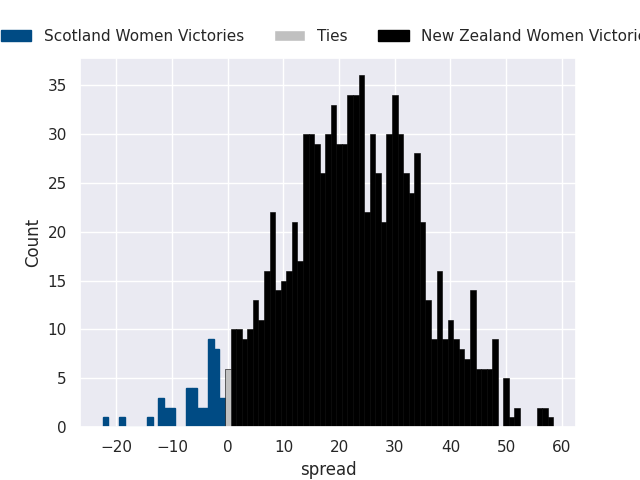

### Italy Women V Japan Women on 2026/09/19

Average Margin: Italy Women by 13.2

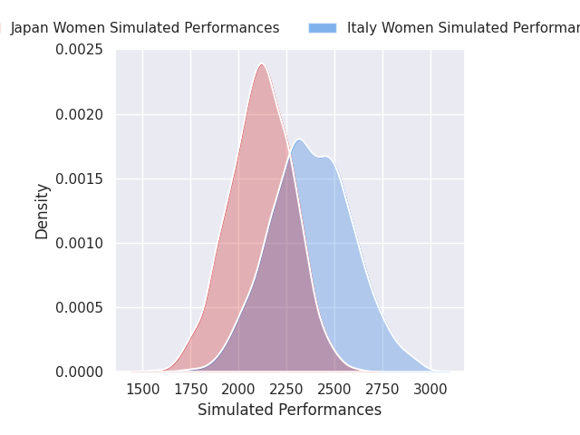

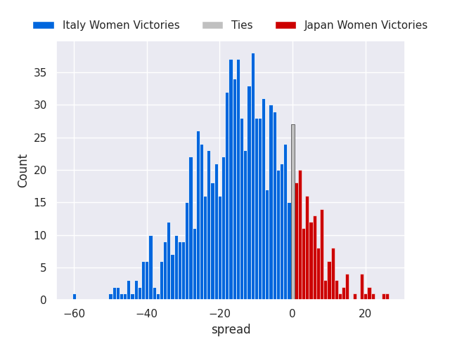

### England Women V Canada Women on 2026/09/19

Average Margin: England Women by 19.1

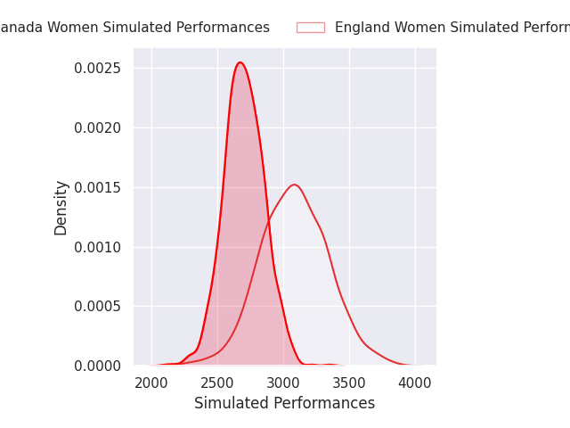
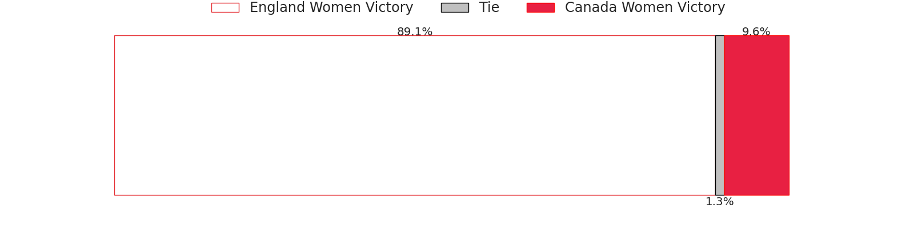
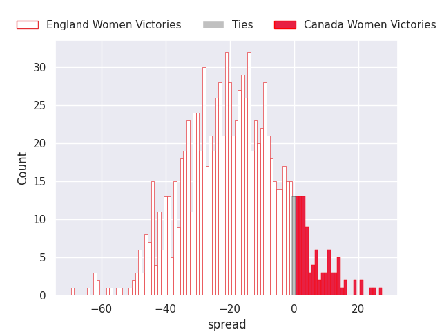

### Ireland Women V USA Women on 2026/09/20

Average Margin: Ireland Women by 17.4

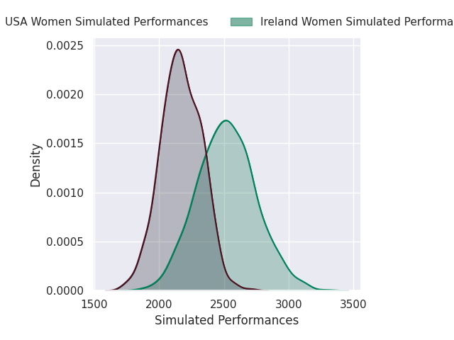
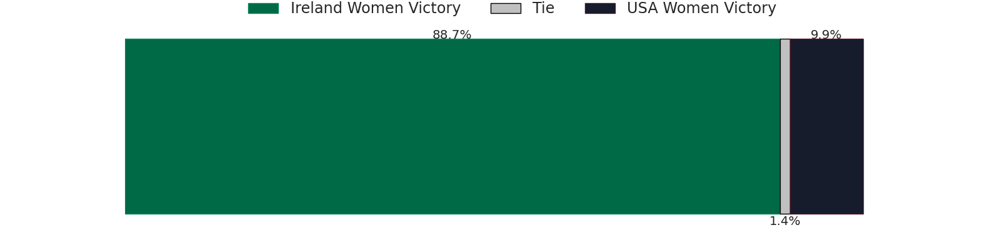
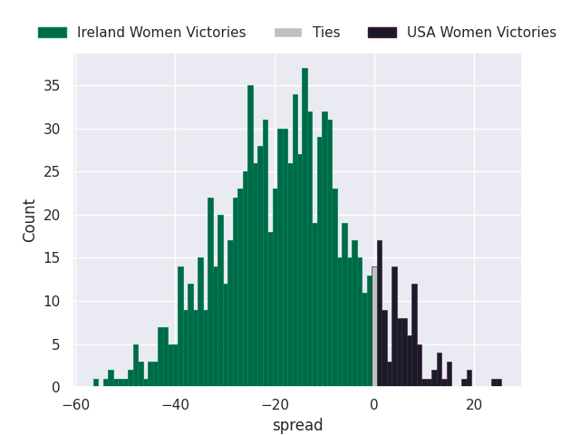

