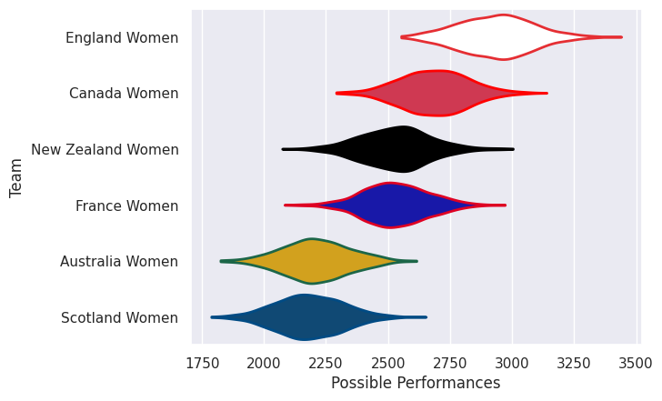
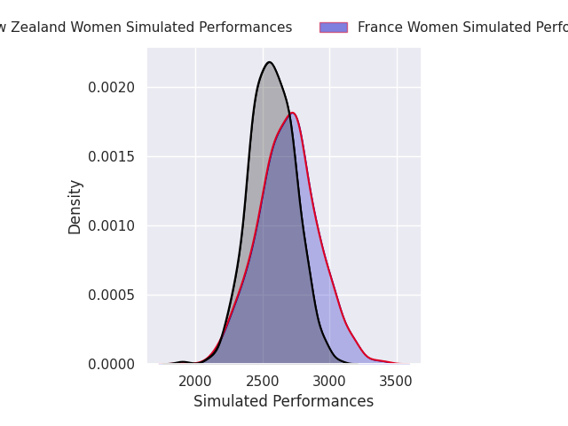
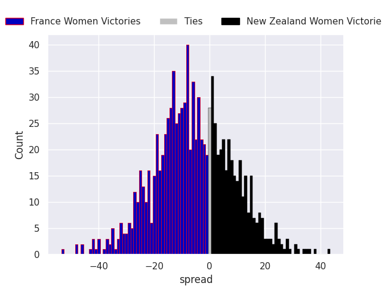

# Team Rankings

# Standings

## Projected Remaining Table

| Club              |   To Play |   Projected Wins |   Projected Differential |   Projected Losing Bonus Points | Projected Try Bonus Points   |   Projected Competition Points |
|:------------------|----------:|-----------------:|-------------------------:|--------------------------------:|:-----------------------------|-------------------------------:|
| England Women     |         1 |            1     |                   48.004 |                           0     |                              |                          4     |
| Canada Women      |         1 |            0.957 |                   22.581 |                           0.028 |                              |                          3.862 |
| France Women      |         1 |            0.637 |                    5.681 |                           0.158 |                              |                          2.762 |
| New Zealand Women |         1 |            0.335 |                   -5.681 |                           0.167 |                              |                          1.563 |
| Scotland Women    |         1 |            0.04  |                  -22.581 |                           0.085 |                              |                          0.251 |
| Australia Women   |         1 |            0     |                  -48.004 |                           0.003 |                              |                          0.003 |

## Projected Total Table

| Club              |   Played |   Wins |   Point Differential |   Losing Bonus Points | Try Bonus Points   |   Competition Points |
|:------------------|---------:|-------:|---------------------:|----------------------:|:-------------------|---------------------:|
| England Women     |        1 |  1     |               48.004 |                 0     |                    |                4     |
| Canada Women      |        1 |  0.957 |               22.581 |                 0.028 |                    |                3.862 |
| France Women      |        1 |  0.637 |                5.681 |                 0.158 |                    |                2.762 |
| New Zealand Women |        1 |  0.335 |               -5.681 |                 0.167 |                    |                1.563 |
| Scotland Women    |        1 |  0.04  |              -22.581 |                 0.085 |                    |                0.251 |
| Australia Women   |        1 |  0     |              -48.004 |                 0.003 |                    |                0.003 |

# Future Predictions

## Week 1

### France Women V New Zealand Women on 2026/09/12

Average Margin: France Women by 5.7

### Scotland Women V Canada Women on 2026/09/12

Average Margin: Canada Women by 22.6

### England Women V Australia Women on 2026/09/12

Average Margin: England Women by 48.0

