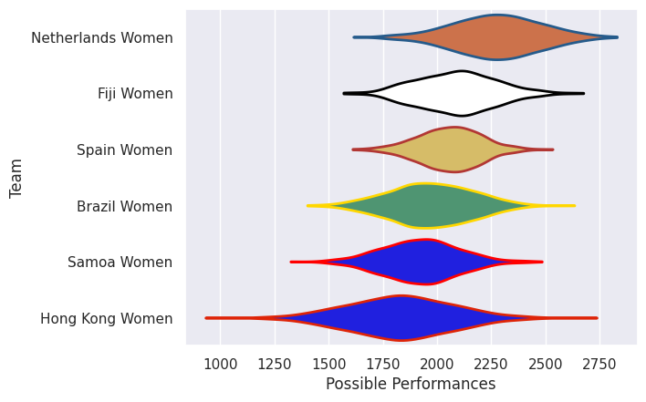
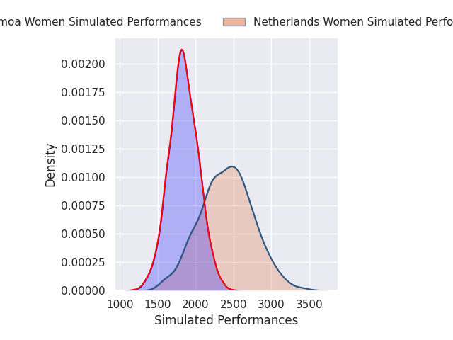
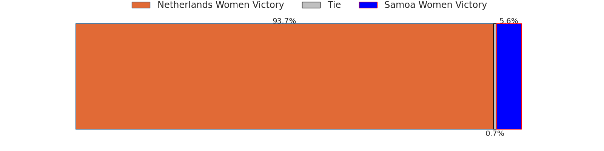
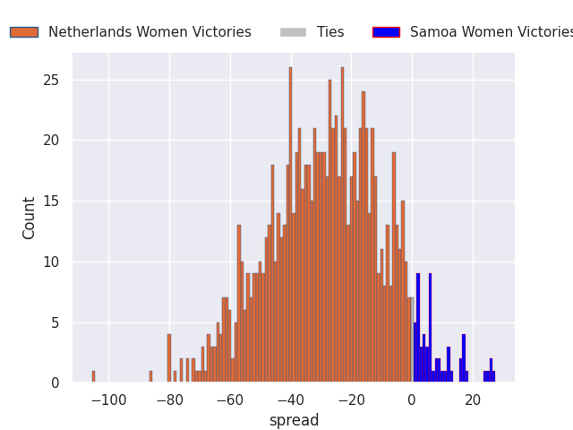
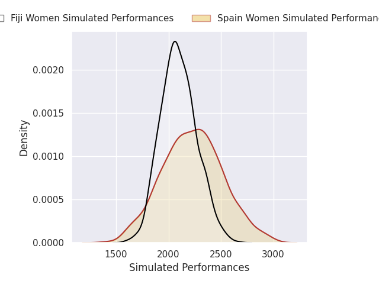
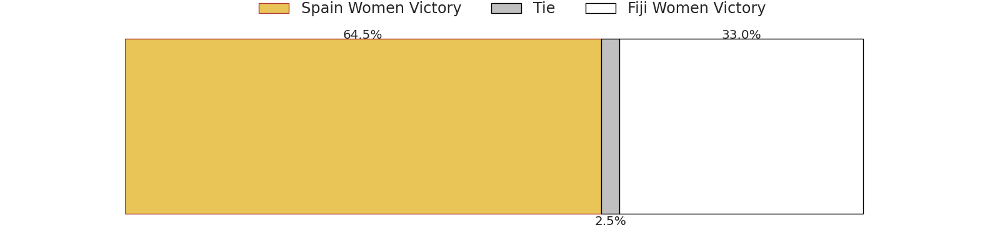
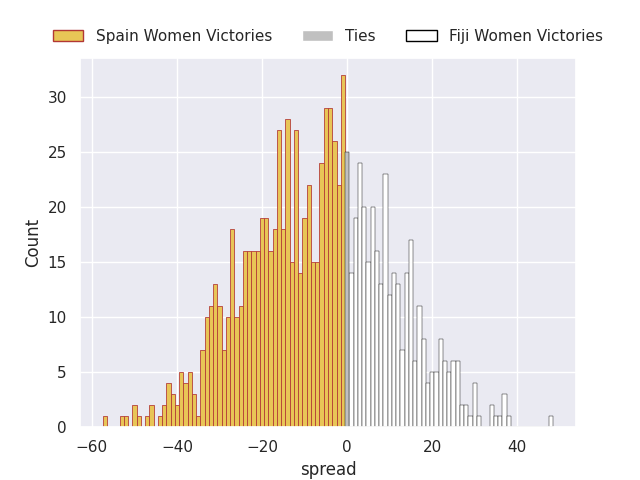
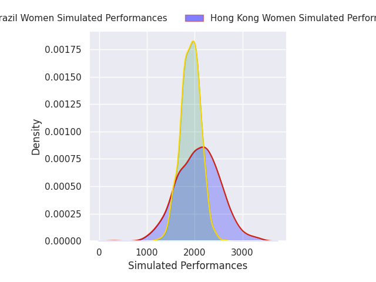
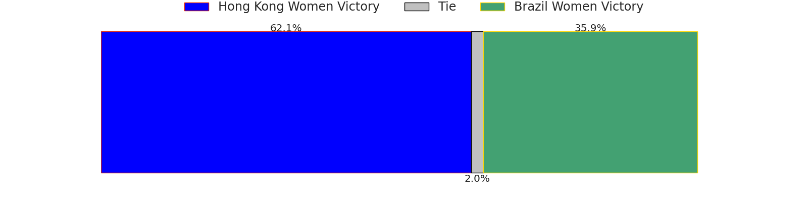
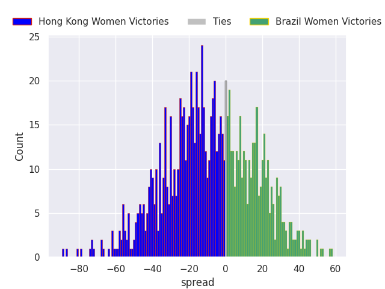

# Team Rankings

# Standings

## Projected Remaining Table

| Club              |   To Play |   Projected Wins |   Projected Differential |   Projected Losing Bonus Points | Projected Try Bonus Points   |   Projected Competition Points |
|:------------------|----------:|-----------------:|-------------------------:|--------------------------------:|:-----------------------------|-------------------------------:|
| Netherlands Women |         1 |            0.937 |                   28.278 |                           0.034 |                              |                          3.796 |
| Spain Women       |         1 |            0.645 |                    6.629 |                           0.128 |                              |                          2.758 |
| Hong Kong Women   |         1 |            0.621 |                    8.481 |                           0.09  |                              |                          2.614 |
| Brazil Women      |         1 |            0.359 |                   -8.481 |                           0.105 |                              |                          1.581 |
| Fiji Women        |         1 |            0.33  |                   -6.629 |                           0.177 |                              |                          1.547 |
| Samoa Women       |         1 |            0.056 |                  -28.278 |                           0.083 |                              |                          0.321 |

## Projected Total Table

| Club              |   Played |   Wins |   Point Differential |   Losing Bonus Points | Try Bonus Points   |   Competition Points |
|:------------------|---------:|-------:|---------------------:|----------------------:|:-------------------|---------------------:|
| Netherlands Women |        1 |  0.937 |               28.278 |                 0.034 |                    |                3.796 |
| Spain Women       |        1 |  0.645 |                6.629 |                 0.128 |                    |                2.758 |
| Hong Kong Women   |        1 |  0.621 |                8.481 |                 0.09  |                    |                2.614 |
| Brazil Women      |        1 |  0.359 |               -8.481 |                 0.105 |                    |                1.581 |
| Fiji Women        |        1 |  0.33  |               -6.629 |                 0.177 |                    |                1.547 |
| Samoa Women       |        1 |  0.056 |              -28.278 |                 0.083 |                    |                0.321 |

# Future Predictions

## Week 1

### Netherlands Women V Samoa Women on 2026/09/13

Average Margin: Netherlands Women by 28.3

### Spain Women V Fiji Women on 2026/09/13

Average Margin: Spain Women by 6.6

### Hong Kong Women V Brazil Women on 2026/09/13

Average Margin: Hong Kong Women by 8.5

