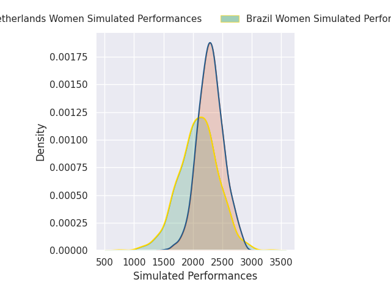
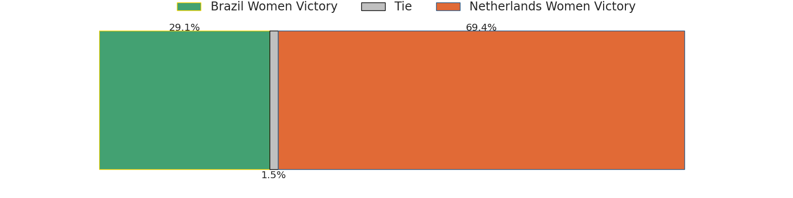
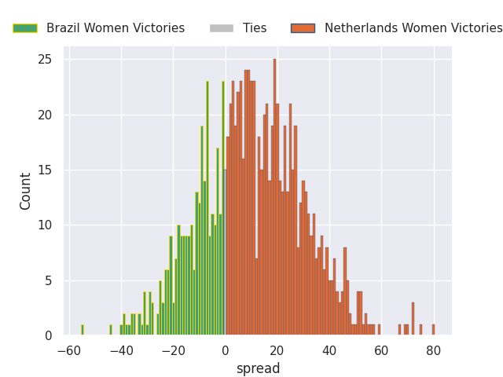
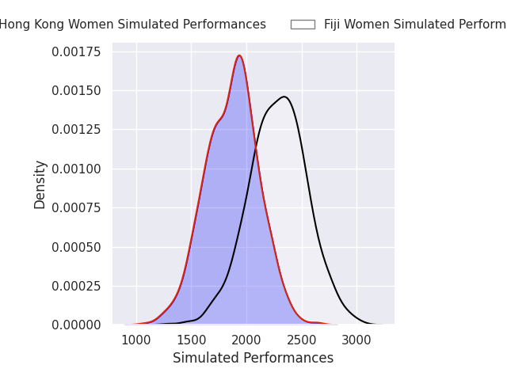
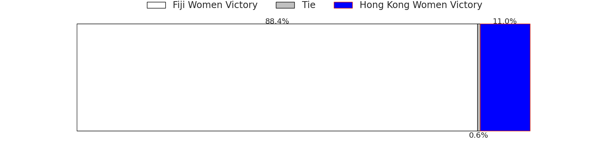
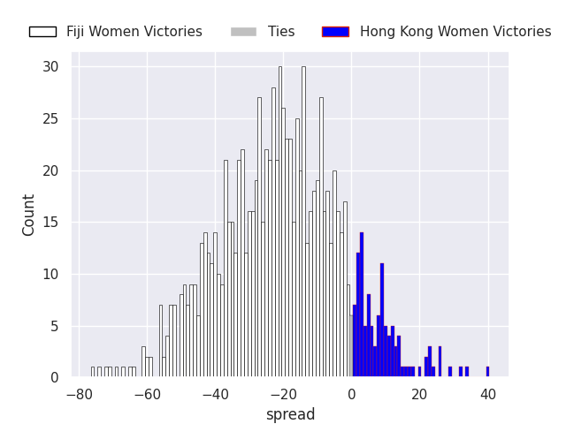
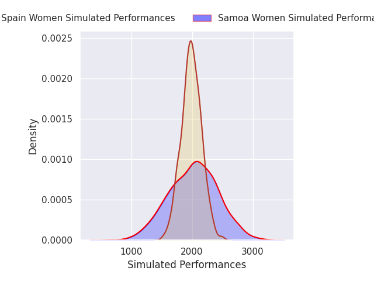
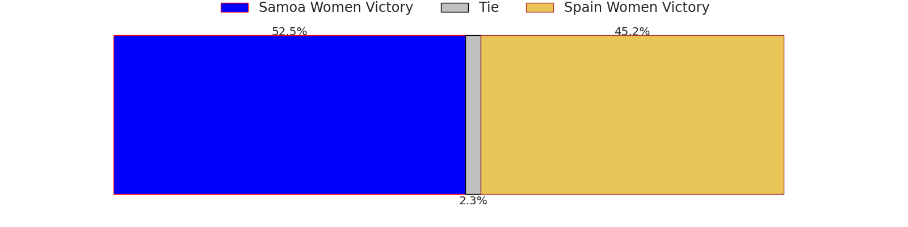
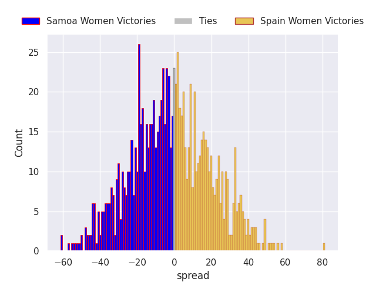

# Team Rankings

# Standings

## Current Standings

| Club              |   Played |   Wins |   Point Differential |   Losing Bonus Points | Try Bonus Points   |   Competition Points |
|:------------------|---------:|-------:|---------------------:|----------------------:|:-------------------|---------------------:|
| Netherlands Women |        1 |      1 |                   70 |                     0 |                    |                    4 |
| Fiji Women        |        1 |      1 |                    6 |                     0 |                    |                    4 |
| Hong Kong Women   |        1 |      1 |                    5 |                     0 |                    |                    4 |
| Brazil Women      |        1 |      0 |                   -5 |                     1 |                    |                    1 |
| Spain Women       |        1 |      0 |                   -6 |                     1 |                    |                    1 |
| Samoa Women       |        1 |      0 |                  -70 |                     0 |                    |                    0 |

## Projected Remaining Table

| Club              |   To Play |   Projected Wins |   Projected Differential |   Projected Losing Bonus Points | Projected Try Bonus Points   |   Projected Competition Points |
|:------------------|----------:|-----------------:|-------------------------:|--------------------------------:|:-----------------------------|-------------------------------:|
| Fiji Women        |         1 |            0.884 |                   20.844 |                           0.054 |                              |                          3.602 |
| Netherlands Women |         1 |            0.694 |                   10.355 |                           0.104 |                              |                          2.91  |
| Samoa Women       |         1 |            0.525 |                    1.642 |                           0.123 |                              |                          2.269 |
| Spain Women       |         1 |            0.452 |                   -1.642 |                           0.133 |                              |                          1.987 |
| Brazil Women      |         1 |            0.291 |                  -10.355 |                           0.142 |                              |                          1.336 |
| Hong Kong Women   |         1 |            0.11  |                  -20.844 |                           0.107 |                              |                          0.559 |

## Projected Total Table

| Club              |   Played |   Wins |   Point Differential |   Losing Bonus Points | Try Bonus Points   |   Competition Points |
|:------------------|---------:|-------:|---------------------:|----------------------:|:-------------------|---------------------:|
| Fiji Women        |        2 |  1.884 |               26.844 |                 0.054 |                    |                7.602 |
| Netherlands Women |        2 |  1.694 |               80.355 |                 0.104 |                    |                6.91  |
| Hong Kong Women   |        2 |  1.11  |              -15.844 |                 0.107 |                    |                4.559 |
| Spain Women       |        2 |  0.452 |               -7.642 |                 1.133 |                    |                2.987 |
| Brazil Women      |        2 |  0.291 |              -15.355 |                 1.142 |                    |                2.336 |
| Samoa Women       |        2 |  0.525 |              -68.358 |                 0.123 |                    |                2.269 |

# Completed Match Review

| Model | Percent Correct Predictions | Spread Error |
| ------ | ------ | ------ |
| Club Level | 83.3% | 17.0 |
| Player Level: Lineup | nan% | nan |
| Player Level: Minutes | nan% | nan |

# Future Predictions

## Week 2

### Brazil Women V Netherlands Women on 2026/09/19

Average Margin: Netherlands Women by 10.4

### Fiji Women V Hong Kong Women on 2026/09/19

Average Margin: Fiji Women by 20.8

### Samoa Women V Spain Women on 2026/09/19

Average Margin: Samoa Women by 1.6

