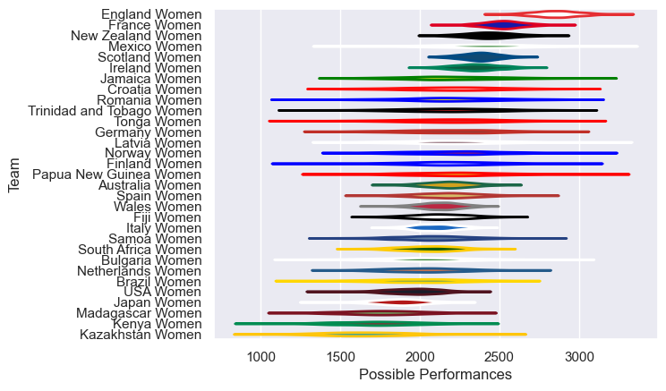

---  
title: "Women's International Test Match 2024 Status"  
date: 2025-07-28 6:00:00 -0500  
categories: model review projection  
layout: article  
aside:  
    toc: true  
---
# Current Team Rankings

# Standings

## Current Standings

| Club                      |   Played |   Wins |   Point Differential |   Losing Bonus Points |   Try Bonus Points |   Competition Points |
|:--------------------------|---------:|-------:|---------------------:|----------------------:|-------------------:|---------------------:|
| Netherlands Women         |        3 |      3 |                   12 |                     0 |                    |                   12 |
| England Women             |        2 |      2 |                   31 |                     0 |                  2 |                   10 |
| Scotland Women            |        2 |      2 |                   70 |                     0 |                    |                    8 |
| Mexico Women              |        2 |      2 |                   54 |                     0 |                    |                    8 |
| Japan Women               |        4 |      1 |                   45 |                     1 |                    |                    7 |
| USA Women                 |        2 |      1 |                    3 |                     0 |                    |                    6 |
| Australia Women           |        4 |      1 |                  -36 |                     1 |                  1 |                    6 |
| New Zealand Women         |        2 |      1 |                   50 |                     0 |                  1 |                    5 |
| Ireland Women             |        1 |      1 |                   26 |                     0 |                  1 |                    5 |
| Wales Women               |        2 |      1 |                  -19 |                     0 |                  1 |                    5 |
| Fiji Women                |        4 |      1 |                  -26 |                     1 |                    |                    5 |
| Romania Women             |        1 |      1 |                   54 |                     0 |                    |                    4 |
| Kenya Women               |        1 |      1 |                   44 |                     0 |                    |                    4 |
| Germany Women             |        1 |      1 |                   34 |                     0 |                    |                    4 |
| Finland Women             |        2 |      1 |                   29 |                     0 |                    |                    4 |
| Samoa Women               |        1 |      1 |                   22 |                     0 |                    |                    4 |
| South Africa Women        |        1 |      1 |                   17 |                     0 |                    |                    4 |
| Italy Women               |        1 |      1 |                   16 |                     0 |                    |                    4 |
| Croatia Women             |        1 |      1 |                    7 |                     0 |                    |                    4 |
| Latvia Women              |        2 |      1 |                  -13 |                     0 |                    |                    4 |
| Brazil Women              |        2 |      0 |                  -10 |                     1 |                    |                    1 |
| Bulgaria Women            |        2 |      0 |                  -61 |                     1 |                    |                    1 |
| Spain Women               |        1 |      0 |                  -17 |                     0 |                    |                    0 |
| France Women              |        1 |      0 |                  -19 |                     0 |                    |                    0 |
| Tonga Women               |        1 |      0 |                  -22 |                     0 |                    |                    0 |
| Jamaica Women             |        1 |      0 |                  -27 |                     0 |                    |                    0 |
| Trinidad and Tobago Women |        1 |      0 |                  -27 |                     0 |                    |                    0 |
| Madagascar Women          |        1 |      0 |                  -44 |                     0 |                    |                    0 |
| Norway Women              |        1 |      0 |                  -50 |                     0 |                    |                    0 |
| Kazakhstan Women          |        1 |      0 |                  -64 |                     0 |                    |                    0 |
| Papua New Guinea Women    |        1 |      0 |                  -79 |                     0 |                    |                    0 |

# Completed Match Review

| Model | Percent Correct Predictions | Spread Error |
| ------ | ------ | ------ |
| Club Level | 61.5% | 29.2 |
| Player Level: Lineup | nan% | nan |
| Player Level: Minutes | nan% | nan |

