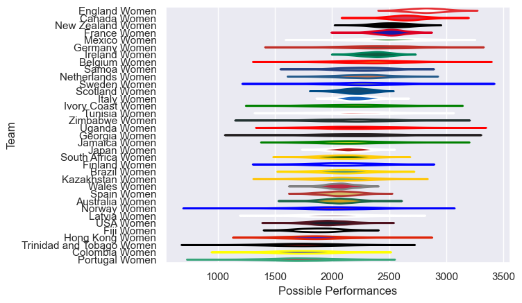

---  
title: "Women's International Test Match 2025 Status"  
date: 2025-07-28 6:00:00 -0500  
categories: model review projection  
layout: article  
aside:  
    toc: true  
---
# Current Team Rankings

# Standings

## Current Standings

| Club                      |   Played |   Wins |   Point Differential |   Losing Bonus Points |   Try Bonus Points |   Competition Points |
|:--------------------------|---------:|-------:|---------------------:|----------------------:|-------------------:|---------------------:|
| Japan Women               |        5 |      5 |                  178 |                     0 |                  2 |                   22 |
| Spain Women               |        7 |      4 |                   74 |                     0 |                    |                   16 |
| Uganda Women              |        3 |      3 |                  125 |                     0 |                    |                   12 |
| Netherlands Women         |        5 |      3 |                  118 |                     0 |                    |                   12 |
| Brazil Women              |        5 |      3 |                   23 |                     0 |                    |                   12 |
| Canada Women              |        2 |      2 |                   58 |                     0 |                    |                    8 |
| Belgium Women             |        2 |      2 |                   35 |                     0 |                    |                    8 |
| Tunisia Women             |        3 |      2 |                   20 |                     0 |                    |                    8 |
| Kazakhstan Women          |        4 |      2 |                  -33 |                     0 |                    |                    8 |
| New Zealand Women         |        1 |      1 |                   25 |                     0 |                  1 |                    5 |
| Mexico Women              |        2 |      1 |                   18 |                     1 |                    |                    5 |
| Australia Women           |        3 |      1 |                    2 |                     0 |                  1 |                    5 |
| USA Women                 |        2 |      1 |                    1 |                     1 |                    |                    5 |
| Portugal Women            |        4 |      1 |                  -19 |                     1 |                    |                    5 |
| Zimbabwe Women            |        3 |      1 |                  -21 |                     1 |                    |                    5 |
| Jamaica Women             |        2 |      1 |                   44 |                     0 |                    |                    4 |
| Latvia Women              |        1 |      1 |                   27 |                     0 |                    |                    4 |
| Wales Women               |        1 |      1 |                    9 |                     0 |                    |                    4 |
| Italy Women               |        1 |      1 |                    5 |                     0 |                    |                    4 |
| South Africa Women        |        3 |      1 |                  -36 |                     0 |                    |                    4 |
| Hong Kong Women           |        2 |      1 |                  -41 |                     0 |                    |                    4 |
| Trinidad and Tobago Women |        2 |      1 |                  -62 |                     0 |                    |                    4 |
| Germany Women             |        1 |      0 |                   -4 |                     1 |                    |                    1 |
| Scotland Women            |        1 |      0 |                   -5 |                     1 |                    |                    1 |
| Fiji Women                |        2 |      0 |                  -43 |                     1 |                    |                    1 |
| Norway Women              |        1 |      0 |                  -27 |                     0 |                    |                    0 |
| Finland Women             |        1 |      0 |                  -31 |                     0 |                    |                    0 |
| Colombia Women            |        1 |      0 |                  -51 |                     0 |                    |                    0 |
| Georgia Women             |        2 |      0 |                  -74 |                     0 |                    |                    0 |
| Ivory Coast Women         |        3 |      0 |                 -124 |                     0 |                    |                    0 |
| Sweden Women              |        3 |      0 |                 -191 |                     0 |                    |                    0 |

## Projected Remaining Table

| Club            |   To Play |   Projected Wins |   Projected Differential |   Projected Losing Bonus Points | Projected Try Bonus Points   |   Projected Competition Points |
|:----------------|----------:|-----------------:|-------------------------:|--------------------------------:|:-----------------------------|-------------------------------:|
| England Women   |         2 |            1.401 |                   29.546 |                           0.274 |                              |                          5.998 |
| Canada Women    |         2 |            1.401 |                   25.867 |                           0.262 |                              |                          5.996 |
| Ireland Women   |         2 |            1.038 |                    3.684 |                           0.393 |                              |                          4.699 |
| Samoa Women     |         1 |            0.624 |                    6.078 |                           0.154 |                              |                          2.71  |
| Italy Women     |         1 |            0.613 |                    4.027 |                           0.156 |                              |                          2.698 |
| Australia Women |         1 |            0.574 |                    2.776 |                           0.203 |                              |                          2.585 |
| Wales Women     |         1 |            0.383 |                   -2.776 |                           0.227 |                              |                          1.845 |
| France Women    |         1 |            0.355 |                   -3.981 |                           0.232 |                              |                          1.73  |
| Japan Women     |         1 |            0.342 |                   -4.027 |                           0.23  |                              |                          1.688 |
| Fiji Women      |         1 |            0.346 |                   -6.078 |                           0.197 |                              |                          1.641 |
| Scotland Women  |         1 |            0.267 |                   -7.987 |                           0.185 |                              |                          1.323 |
| USA Women       |         1 |            0.194 |                  -21.564 |                           0.138 |                              |                          0.96  |
| Spain Women     |         1 |            0.184 |                  -25.565 |                           0.133 |                              |                          0.911 |

## Projected Total Table

| Club                      |   Played |   Wins |   Point Differential |   Losing Bonus Points |   Try Bonus Points |   Competition Points |
|:--------------------------|---------:|-------:|---------------------:|----------------------:|-------------------:|---------------------:|
| Japan Women               |        6 |  5.342 |              173.973 |                 0.23  |                  2 |               23.688 |
| Spain Women               |        8 |  4.184 |               48.435 |                 0.133 |                    |               16.911 |
| Canada Women              |        4 |  3.401 |               83.867 |                 0.262 |                    |               13.996 |
| Uganda Women              |        3 |  3     |              125     |                 0     |                    |               12     |
| Netherlands Women         |        5 |  3     |              118     |                 0     |                    |               12     |
| Brazil Women              |        5 |  3     |               23     |                 0     |                    |               12     |
| Belgium Women             |        2 |  2     |               35     |                 0     |                    |                8     |
| Tunisia Women             |        3 |  2     |               20     |                 0     |                    |                8     |
| Kazakhstan Women          |        4 |  2     |              -33     |                 0     |                    |                8     |
| Australia Women           |        4 |  1.574 |                4.776 |                 0.203 |                  1 |                7.585 |
| Italy Women               |        2 |  1.613 |                9.027 |                 0.156 |                    |                6.698 |
| England Women             |        2 |  1.401 |               29.546 |                 0.274 |                    |                5.998 |
| USA Women                 |        3 |  1.194 |              -20.564 |                 1.138 |                    |                5.96  |
| Wales Women               |        2 |  1.383 |                6.224 |                 0.227 |                    |                5.845 |
| New Zealand Women         |        1 |  1     |               25     |                 0     |                  1 |                5     |
| Mexico Women              |        2 |  1     |               18     |                 1     |                    |                5     |
| Portugal Women            |        4 |  1     |              -19     |                 1     |                    |                5     |
| Zimbabwe Women            |        3 |  1     |              -21     |                 1     |                    |                5     |
| Ireland Women             |        2 |  1.038 |                3.684 |                 0.393 |                    |                4.699 |
| Jamaica Women             |        2 |  1     |               44     |                 0     |                    |                4     |
| Latvia Women              |        1 |  1     |               27     |                 0     |                    |                4     |
| South Africa Women        |        3 |  1     |              -36     |                 0     |                    |                4     |
| Hong Kong Women           |        2 |  1     |              -41     |                 0     |                    |                4     |
| Trinidad and Tobago Women |        2 |  1     |              -62     |                 0     |                    |                4     |
| Samoa Women               |        1 |  0.624 |                6.078 |                 0.154 |                    |                2.71  |
| Fiji Women                |        3 |  0.346 |              -49.078 |                 1.197 |                    |                2.641 |
| Scotland Women            |        2 |  0.267 |              -12.987 |                 1.185 |                    |                2.323 |
| France Women              |        1 |  0.355 |               -3.981 |                 0.232 |                    |                1.73  |
| Germany Women             |        1 |  0     |               -4     |                 1     |                    |                1     |
| Norway Women              |        1 |  0     |              -27     |                 0     |                    |                0     |
| Finland Women             |        1 |  0     |              -31     |                 0     |                    |                0     |
| Colombia Women            |        1 |  0     |              -51     |                 0     |                    |                0     |
| Georgia Women             |        2 |  0     |              -74     |                 0     |                    |                0     |
| Ivory Coast Women         |        3 |  0     |             -124     |                 0     |                    |                0     |
| Sweden Women              |        3 |  0     |             -191     |                 0     |                    |                0     |

# Completed Match Review

| Model | Percent Correct Predictions | Spread Error |
| ------ | ------ | ------ |
| Club Level | 66.0% | 27.8 |
| Player Level: Lineup | nan% | nan |
| Player Level: Minutes | nan% | nan |

# Future Predictions

## Week 8

### Canada Women V USA Women on 2025/08/01

Average Margin: Canada Women by 21.6

### Australia Women V Wales Women on 2025/08/01

Average Margin: Australia Women by 2.8

### England Women V Spain Women on 2025/08/02

Average Margin: England Women by 25.6

### Ireland Women V Scotland Women on 2025/08/02

Average Margin: Ireland Women by 8.0

## Week 9

### Fiji Women V Samoa Women on 2025/08/08

Average Margin: Samoa Women by 6.1

### Italy Women V Japan Women on 2025/08/09

Average Margin: Italy Women by 4.0

### France Women V England Women on 2025/08/09

Average Margin: England Women by 4.0

### Ireland Women V Canada Women on 2025/08/09

Average Margin: Canada Women by 4.3

