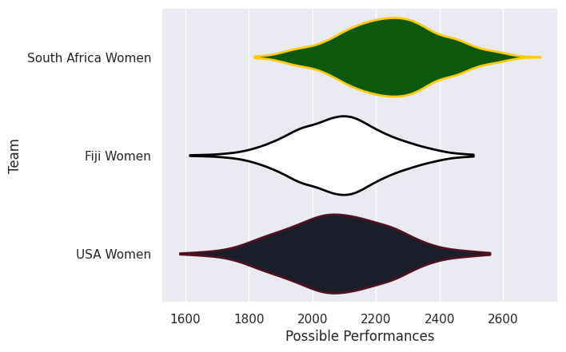
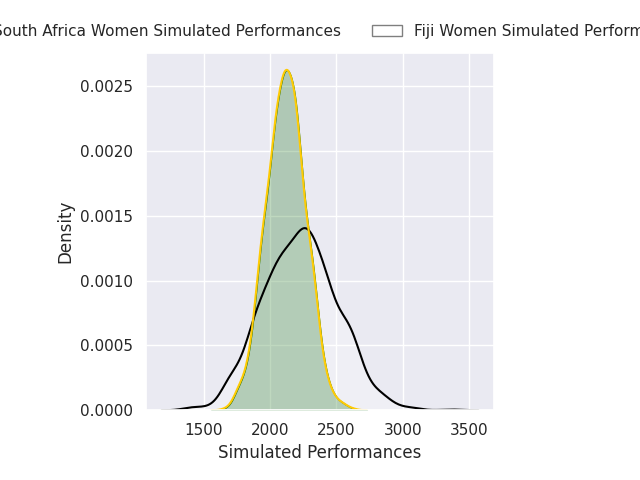
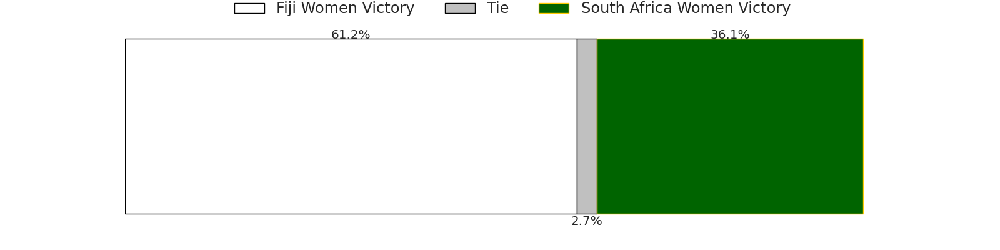
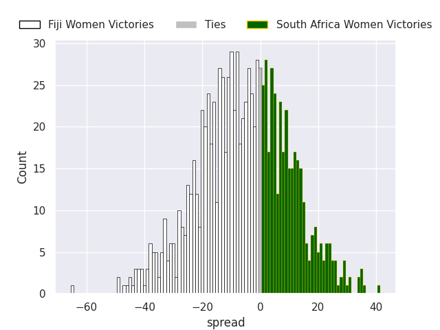

# Team Rankings

# Standings

## Current Standings

| Club               |   Played |   Wins |   Point Differential |   Losing Bonus Points | Try Bonus Points   |   Competition Points |
|:-------------------|---------:|-------:|---------------------:|----------------------:|:-------------------|---------------------:|
| South Africa Women |        2 |      1 |                    6 |                     1 |                    |                    5 |
| USA Women          |        2 |      1 |                   -6 |                     0 |                    |                    4 |

## Projected Remaining Table

| Club               |   To Play |   Projected Wins |   Projected Differential |   Projected Losing Bonus Points | Projected Try Bonus Points   |   Projected Competition Points |
|:-------------------|----------:|-----------------:|-------------------------:|--------------------------------:|:-----------------------------|-------------------------------:|
| Fiji Women         |         1 |            0.612 |                    5.518 |                           0.156 |                              |                          2.658 |
| South Africa Women |         1 |            0.361 |                   -5.518 |                           0.161 |                              |                          1.659 |

## Projected Total Table

| Club               |   Played |   Wins |   Point Differential |   Losing Bonus Points | Try Bonus Points   |   Competition Points |
|:-------------------|---------:|-------:|---------------------:|----------------------:|:-------------------|---------------------:|
| South Africa Women |        3 |  1.361 |                0.482 |                 1.161 |                    |                6.659 |
| USA Women          |        2 |  1     |               -6     |                 0     |                    |                4     |
| Fiji Women         |        1 |  0.612 |                5.518 |                 0.156 |                    |                2.658 |

# Completed Match Review

| Model | Percent Correct Predictions | Spread Error |
| ------ | ------ | ------ |
| Club Level | 66.7% | 9.9 |
| Player Level: Lineup | nan% | nan |
| Player Level: Minutes | nan% | nan |

# Future Predictions

## Week 3

### Fiji Women V South Africa Women on 2026/08/07

Average Margin: Fiji Women by 5.5

