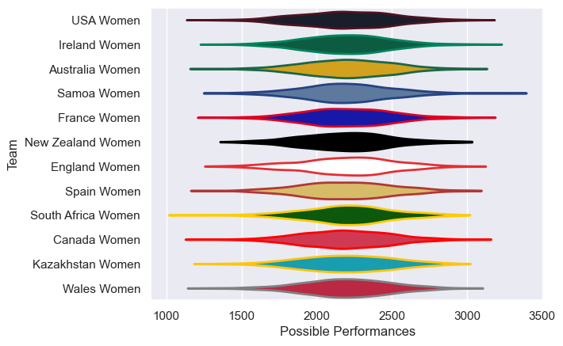

---  
title: "Women's Rugby World Cup 2014"  
date: 2025-07-29 6:00:00 -0500  
categories: model review projection  
layout: article  
aside:  
    toc: true  
---
# Current Team Rankings

# Standings

## Current Standings

| Club               |   Played |   Wins |   Point Differential |   Losing Bonus Points | Try Bonus Points   |   Competition Points |
|:-------------------|---------:|-------:|---------------------:|----------------------:|:-------------------|---------------------:|
| France Women       |        4 |      4 |                   99 |                     0 |                    |                   16 |
| England Women      |        4 |      3 |                  114 |                     0 |                    |                   14 |
| New Zealand Women  |        4 |      3 |                  158 |                     1 |                    |                   13 |
| Ireland Women      |        4 |      3 |                   37 |                     1 |                    |                   13 |
| Canada Women       |        4 |      2 |                   47 |                     0 |                    |                   10 |
| Australia Women    |        4 |      2 |                   28 |                     1 |                    |                    9 |
| USA Women          |        4 |      2 |                    6 |                     1 |                    |                    9 |
| Spain Women        |        4 |      2 |                  -15 |                     0 |                    |                    8 |
| Wales Women        |        4 |      1 |                  -72 |                     0 |                    |                    4 |
| South Africa Women |        4 |      1 |                 -106 |                     0 |                    |                    4 |
| Samoa Women        |        4 |      0 |                 -134 |                     1 |                    |                    1 |
| Kazakhstan Women   |        4 |      0 |                 -162 |                     0 |                    |                    0 |

# Completed Match Review

| Model | Percent Correct Predictions | Spread Error |
| ------ | ------ | ------ |
| Club Level | 75.0% | 23.9 |
| Player Level: Lineup | nan% | nan |
| Player Level: Minutes | nan% | nan |

