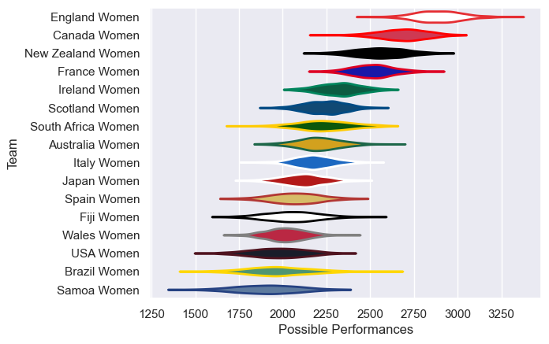

---  
title: "Women's Rugby World Cup 2025"  
date: 2025-09-12 6:00:00 -0500  
categories: model review projection  
layout: article  
aside:  
    toc: true  
---
# Team Rankings

# Standings

## Current Standings

### Pool A

| Club            |   Played |   Wins |   Point Differential |   Losing Bonus Points |   Try Bonus Points |   Competition Points |
|:----------------|---------:|-------:|---------------------:|----------------------:|-------------------:|---------------------:|
| England Women   |        3 |      3 |                  191 |                     0 |                  2 |                   14 |
| Australia Women |        3 |      1 |                   33 |                     0 |                  2 |                    8 |
| USA Women       |        3 |      1 |                   -2 |                     0 |                  1 |                    7 |
| Samoa Women     |        3 |      0 |                 -222 |                     0 |                    |                    0 |

### Pool B

| Club           |   Played |   Wins |   Point Differential |   Losing Bonus Points |   Try Bonus Points |   Competition Points |
|:---------------|---------:|-------:|---------------------:|----------------------:|-------------------:|---------------------:|
| Canada Women   |        3 |      3 |                  121 |                     0 |                  2 |                   14 |
| Scotland Women |        3 |      2 |                   23 |                     0 |                  2 |                   10 |
| Fiji Women     |        3 |      1 |                  -69 |                     0 |                    |                    4 |
| Wales Women    |        3 |      0 |                  -75 |                     1 |                    |                    1 |

### Pool C

| Club              |   Played |   Wins |   Point Differential |   Losing Bonus Points |   Try Bonus Points |   Competition Points |
|:------------------|---------:|-------:|---------------------:|----------------------:|-------------------:|---------------------:|
| New Zealand Women |        3 |      3 |                  129 |                     0 |                  2 |                   14 |
| Ireland Women     |        3 |      2 |                    4 |                     0 |                  2 |                   10 |
| Japan Women       |        3 |      1 |                  -63 |                     0 |                    |                    4 |
| Spain Women       |        3 |      0 |                  -70 |                     0 |                  1 |                    1 |

### Pool D

| Club               |   Played |   Wins |   Point Differential |   Losing Bonus Points |   Try Bonus Points |   Competition Points |
|:-------------------|---------:|-------:|---------------------:|----------------------:|-------------------:|---------------------:|
| France Women       |        3 |      3 |                  150 |                     0 |                  1 |                   13 |
| South Africa Women |        3 |      2 |                   18 |                     0 |                  2 |                   10 |
| Italy Women        |        3 |      1 |                   32 |                     1 |                  1 |                    6 |
| Brazil Women       |        3 |      0 |                 -200 |                     0 |                    |                    0 |

## Projected Remaining Table

### Pool A

| Club   | To Play   | Projected Wins   | Projected Differential   | Projected Losing Bonus Points   | Projected Try Bonus Points   | Projected Competition Points   |
|--------|-----------|------------------|--------------------------|---------------------------------|------------------------------|--------------------------------|

### Pool B

| Club   | To Play   | Projected Wins   | Projected Differential   | Projected Losing Bonus Points   | Projected Try Bonus Points   | Projected Competition Points   |
|--------|-----------|------------------|--------------------------|---------------------------------|------------------------------|--------------------------------|

### Pool C

| Club   | To Play   | Projected Wins   | Projected Differential   | Projected Losing Bonus Points   | Projected Try Bonus Points   | Projected Competition Points   |
|--------|-----------|------------------|--------------------------|---------------------------------|------------------------------|--------------------------------|

### Pool D

| Club   | To Play   | Projected Wins   | Projected Differential   | Projected Losing Bonus Points   | Projected Try Bonus Points   | Projected Competition Points   |
|--------|-----------|------------------|--------------------------|---------------------------------|------------------------------|--------------------------------|

## Projected Total Table

### Pool A

| Club            |   Played |   Wins |   Point Differential |   Losing Bonus Points |   Try Bonus Points |   Competition Points |
|:----------------|---------:|-------:|---------------------:|----------------------:|-------------------:|---------------------:|
| England Women   |        3 |      3 |                  191 |                     0 |                  2 |                   14 |
| Australia Women |        3 |      1 |                   33 |                     0 |                  2 |                    8 |
| USA Women       |        3 |      1 |                   -2 |                     0 |                  1 |                    7 |
| Samoa Women     |        3 |      0 |                 -222 |                     0 |                    |                    0 |

### Pool B

| Club           |   Played |   Wins |   Point Differential |   Losing Bonus Points |   Try Bonus Points |   Competition Points |
|:---------------|---------:|-------:|---------------------:|----------------------:|-------------------:|---------------------:|
| Canada Women   |        3 |      3 |                  121 |                     0 |                  2 |                   14 |
| Scotland Women |        3 |      2 |                   23 |                     0 |                  2 |                   10 |
| Fiji Women     |        3 |      1 |                  -69 |                     0 |                    |                    4 |
| Wales Women    |        3 |      0 |                  -75 |                     1 |                    |                    1 |

### Pool C

| Club              |   Played |   Wins |   Point Differential |   Losing Bonus Points |   Try Bonus Points |   Competition Points |
|:------------------|---------:|-------:|---------------------:|----------------------:|-------------------:|---------------------:|
| New Zealand Women |        3 |      3 |                  129 |                     0 |                  2 |                   14 |
| Ireland Women     |        3 |      2 |                    4 |                     0 |                  2 |                   10 |
| Japan Women       |        3 |      1 |                  -63 |                     0 |                    |                    4 |
| Spain Women       |        3 |      0 |                  -70 |                     0 |                  1 |                    1 |

### Pool D

| Club               |   Played |   Wins |   Point Differential |   Losing Bonus Points |   Try Bonus Points |   Competition Points |
|:-------------------|---------:|-------:|---------------------:|----------------------:|-------------------:|---------------------:|
| France Women       |        3 |      3 |                  150 |                     0 |                  1 |                   13 |
| South Africa Women |        3 |      2 |                   18 |                     0 |                  2 |                   10 |
| Italy Women        |        3 |      1 |                   32 |                     1 |                  1 |                    6 |
| Brazil Women       |        3 |      0 |                 -200 |                     0 |                    |                    0 |

## Projected Playoff Results

|                    | Reach Quarterfinal   | Win Quarterfinal   | Reach Semifinal   | Win Semifinal   | Reach Final   | Win Final   |
|:-------------------|:---------------------|:-------------------|:------------------|:----------------|:--------------|:------------|
| England Women      | 100.0 %              | 76.2 %             | 76.2 %            | 53.6 %          | 53.6 %        | 35.4 %      |
| New Zealand Women  | 100.0 %              | 78.3 %             | 78.3 %            | 47.4 %          | 47.4 %        | 23.3 %      |
| Canada Women       | 100.0 %              | 77.4 %             | 77.4 %            | 38.1 %          | 38.1 %        | 20.2 %      |
| France Women       | 100.0 %              | 72.1 %             | 72.1 %            | 31.3 %          | 31.3 %        | 13.0 %      |
| Ireland Women      | 100.0 %              | 27.9 %             | 27.9 %            | 9.5 %           | 9.5 %         | 2.4 %       |
| South Africa Women | 100.0 %              | 21.7 %             | 21.7 %            | 8.4 %           | 8.4 %         | 2.2 %       |
| Scotland Women     | 100.0 %              | 23.8 %             | 23.8 %            | 5.6 %           | 5.6 %         | 1.9 %       |
| Australia Women    | 100.0 %              | 22.6 %             | 22.6 %            | 6.1 %           | 6.1 %         | 1.6 %       |

# Completed Match Review

| Model | Percent Correct Predictions | Spread Error |
| ------ | ------ | ------ |
| Club Level | 76.9% | 16.5 |
| Player Level: Lineup | nan% | nan |
| Player Level: Minutes | nan% | nan |

# Future Predictions

## Week 4

### Canada Women V Australia Women on 2025/09/13

Average Margin: Canada Women by 16.2

### New Zealand Women V South Africa Women on 2025/09/13

Average Margin: New Zealand Women by 14.3

### France Women V Ireland Women on 2025/09/14

Average Margin: France Women by 9.3

### England Women V Scotland Women on 2025/09/14

Average Margin: England Women by 20.3

## Week 5

### South Africa Women V Australia Women on 2025-09-18

Average Margin: South Africa Women by 9.8

### South Africa Women V Canada Women on 2025-09-18

Average Margin: Canada Women by 7.4

### New Zealand Women V Canada Women on 2025-09-18

Average Margin: New Zealand Women by 2.5

### New Zealand Women V Australia Women on 2025-09-18

Average Margin: New Zealand Women by 14.3

### France Women V Scotland Women on 2025-09-18

Average Margin: France Women by 12.5

### Ireland Women V England Women on 2025-09-18

Average Margin: England Women by 10.8

### France Women V England Women on 2025-09-18

Average Margin: England Women by 6.1

### Ireland Women V Scotland Women on 2025-09-18

Average Margin: Ireland Women by 4.3

## Final

### Australia Women V Ireland Women on 2025-09-26

Average Margin: Australia Women by 2.1

### Australia Women V England Women on 2025-09-26

Average Margin: England Women by 14.4

### South Africa Women V Ireland Women on 2025-09-26

Average Margin: South Africa Women by 5.9

### New Zealand Women V Ireland Women on 2025-09-26

Average Margin: New Zealand Women by 14.0

### South Africa Women V Scotland Women on 2025-09-26

Average Margin: South Africa Women by 2.9

### South Africa Women V England Women on 2025-09-26

Average Margin: England Women by 19.5

### New Zealand Women V Scotland Women on 2025-09-26

Average Margin: New Zealand Women by 5.3

### New Zealand Women V England Women on 2025-09-26

Average Margin: England Women by 4.7

### South Africa Women V France Women on 2025-09-26

Average Margin: France Women by 4.0

### Canada Women V France Women on 2025-09-26

Average Margin: Canada Women by 7.4

### New Zealand Women V France Women on 2025-09-26

Average Margin: New Zealand Women by 5.3

### Canada Women V Ireland Women on 2025-09-26

Average Margin: Canada Women by 11.7

### Australia Women V France Women on 2025-09-26

Average Margin: France Women by 9.8

### Canada Women V England Women on 2025-09-26

Average Margin: England Women by 2.1

### Canada Women V Scotland Women on 2025-09-26

Average Margin: Canada Women by 14.2

### Australia Women V Scotland Women on 2025-09-26

Average Margin: Australia Women by 3.0

