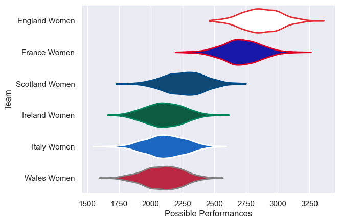

---  
title: "Women's Six Nations 2022"  
date: 2025-07-29 6:00:00 -0500  
categories: model review projection  
layout: article  
aside:  
    toc: true  
---
# Current Team Rankings

# Standings

## Current Standings

| Club           |   Played |   Wins |   Point Differential |   Losing Bonus Points | Try Bonus Points   |   Competition Points |
|:---------------|---------:|-------:|---------------------:|----------------------:|:-------------------|---------------------:|
| England Women  |        5 |      5 |                  260 |                     0 |                    |                   20 |
| France Women   |        5 |      4 |                  104 |                     0 |                    |                   16 |
| Wales Women    |        5 |      2 |                  -70 |                     1 |                    |                    9 |
| Ireland Women  |        5 |      2 |                  -90 |                     0 |                    |                    8 |
| Italy Women    |        5 |      2 |                 -119 |                     0 |                    |                    8 |
| Scotland Women |        5 |      0 |                  -85 |                     3 |                    |                    3 |

# Completed Match Review

| Model | Percent Correct Predictions | Spread Error |
| ------ | ------ | ------ |
| Club Level | 60.0% | 13.6 |
| Player Level: Lineup | nan% | nan |
| Player Level: Minutes | nan% | nan |

