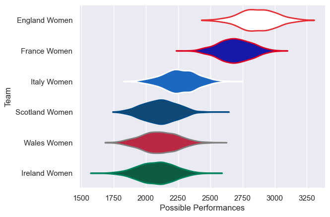

---  
title: "Women's Six Nations 2023 Status"  
date: 2025-07-28 6:00:00 -0500  
categories: model review projection  
layout: article  
aside:  
    toc: true  
---
# Current Team Rankings

# Standings

## Current Standings

| Club           |   Played |   Wins |   Point Differential |   Losing Bonus Points | Try Bonus Points   |   Competition Points |
|:---------------|---------:|-------:|---------------------:|----------------------:|:-------------------|---------------------:|
| England Women  |        5 |      5 |                  223 |                     0 |                    |                   20 |
| France Women   |        5 |      4 |                  135 |                     1 |                    |                   17 |
| Wales Women    |        5 |      3 |                  -17 |                     0 |                    |                   12 |
| Scotland Women |        5 |      2 |                  -84 |                     0 |                    |                    8 |
| Italy Women    |        5 |      1 |                  -90 |                     0 |                    |                    4 |
| Ireland Women  |        5 |      0 |                 -167 |                     0 |                    |                    0 |

# Completed Match Review

| Model | Percent Correct Predictions | Spread Error |
| ------ | ------ | ------ |
| Club Level | 80.0% | 17.0 |
| Player Level: Lineup | nan% | nan |
| Player Level: Minutes | nan% | nan |

