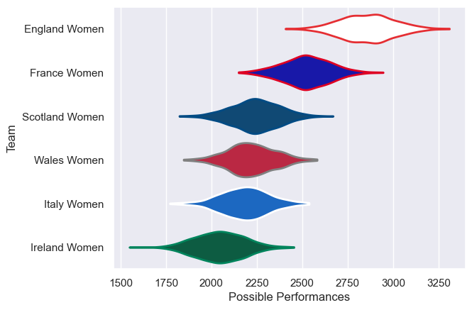

---  
title: "Women's Six Nations 2024 Status"  
date: 2025-07-28 6:00:00 -0500  
categories: model review projection  
layout: article  
aside:  
    toc: true  
---
# Current Team Rankings

# Standings

## Current Standings

| Club           |   Played |   Wins |   Point Differential |   Losing Bonus Points | Try Bonus Points   |   Competition Points |
|:---------------|---------:|-------:|---------------------:|----------------------:|:-------------------|---------------------:|
| England Women  |        4 |      4 |                  183 |                     0 |                    |                   16 |
| France Women   |        5 |      4 |                   73 |                     0 |                    |                   16 |
| Scotland Women |        4 |      2 |                   -4 |                     1 |                    |                    9 |
| Italy Women    |        5 |      1 |                  -74 |                     2 |                    |                    6 |
| Wales Women    |        4 |      1 |                  -76 |                     1 |                    |                    5 |
| Ireland Women  |        4 |      1 |                 -102 |                     1 |                    |                    5 |

# Completed Match Review

| Model | Percent Correct Predictions | Spread Error |
| ------ | ------ | ------ |
| Club Level | 76.9% | 11.8 |
| Player Level: Lineup | nan% | nan |
| Player Level: Minutes | nan% | nan |

