# Team Rankings

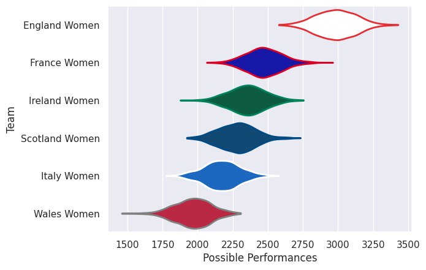
# Standings

## Current Standings

| Club           |   Played |   Wins |   Point Differential |   Losing Bonus Points | Try Bonus Points   |   Competition Points |
|:---------------|---------:|-------:|---------------------:|----------------------:|:-------------------|---------------------:|
| England Women  |        3 |      3 |                  136 |                     0 |                    |                   12 |
| France Women   |        3 |      3 |                   83 |                     0 |                    |                   12 |
| Ireland Women  |        3 |      1 |                   -3 |                     0 |                    |                    4 |
| Italy Women    |        3 |      1 |                  -43 |                     0 |                    |                    4 |
| Scotland Women |        3 |      1 |                  -99 |                     0 |                    |                    4 |
| Wales Women    |        3 |      0 |                  -74 |                     1 |                    |                    1 |

## Projected Remaining Table

| Club           |   To Play |   Projected Wins |   Projected Differential |   Projected Losing Bonus Points | Projected Try Bonus Points   |   Projected Competition Points |
|:---------------|----------:|-----------------:|-------------------------:|--------------------------------:|:-----------------------------|-------------------------------:|
| England Women  |         2 |            1.925 |                   49.477 |                           0.044 |                              |                          7.77  |
| Ireland Women  |         2 |            1.891 |                   41.885 |                           0.074 |                              |                          7.668 |
| France Women   |         2 |            0.87  |                   -6.315 |                           0.242 |                              |                          3.794 |
| Italy Women    |         2 |            0.629 |                  -28.205 |                           0.203 |                              |                          2.793 |
| Wales Women    |         2 |            0.348 |                  -30.777 |                           0.279 |                              |                          1.745 |
| Scotland Women |         2 |            0.249 |                  -26.065 |                           0.343 |                              |                          1.415 |

## Projected Total Table

| Club           |   Played |   Wins |   Point Differential |   Losing Bonus Points | Try Bonus Points   |   Competition Points |
|:---------------|---------:|-------:|---------------------:|----------------------:|:-------------------|---------------------:|
| England Women  |        5 |  4.925 |              185.477 |                 0.044 |                    |               19.77  |
| France Women   |        5 |  3.87  |               76.685 |                 0.242 |                    |               15.794 |
| Ireland Women  |        5 |  2.891 |               38.885 |                 0.074 |                    |               11.668 |
| Italy Women    |        5 |  1.629 |              -71.205 |                 0.203 |                    |                6.793 |
| Scotland Women |        5 |  1.249 |             -125.065 |                 0.343 |                    |                5.415 |
| Wales Women    |        5 |  0.348 |             -104.777 |                 1.279 |                    |                2.745 |

# Completed Match Review

| Model | Percent Correct Predictions | Spread Error |
| ------ | ------ | ------ |
| Club Level | 100.0% | 14.3 |
| Player Level: Lineup | nan% | nan |
| Player Level: Minutes | nan% | nan |

# Future Predictions

## Week 4

### Italy Women V England Women on 2026/05/09

Average Margin: England Women by 32.7

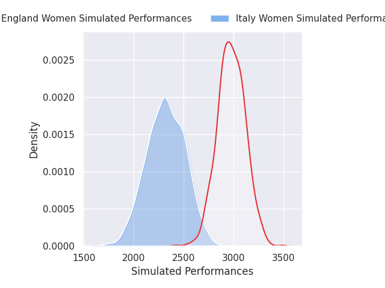
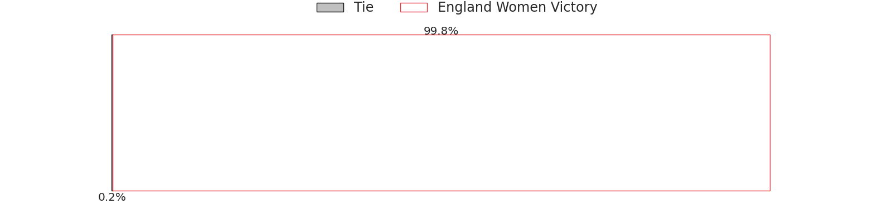
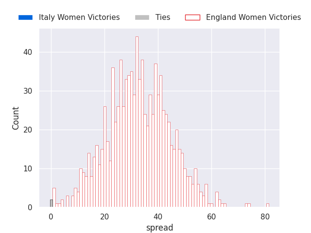

### Scotland Women V France Women on 2026/05/09

Average Margin: France Women by 10.4

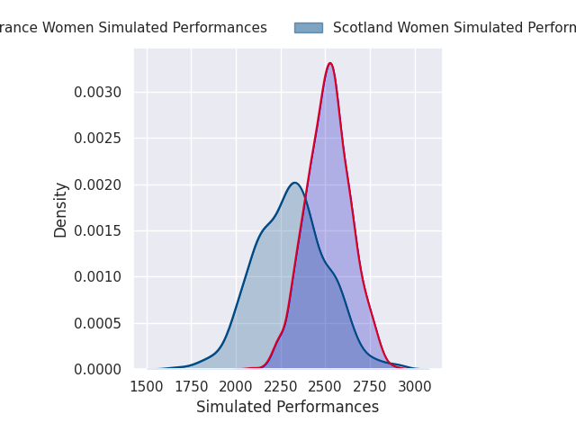
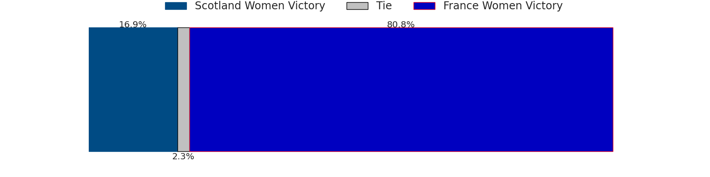
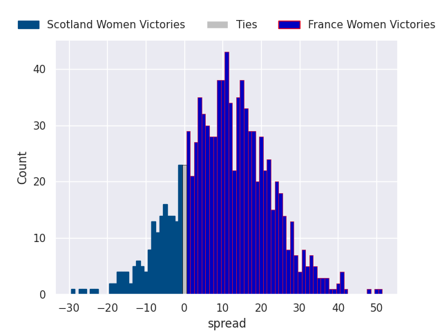

### Ireland Women V Wales Women on 2026/05/09

Average Margin: Ireland Women by 26.3

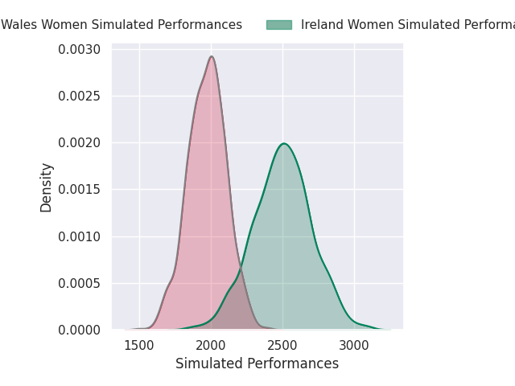
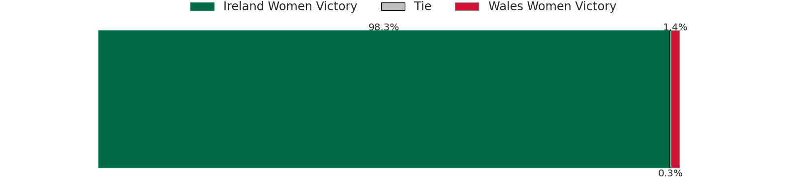
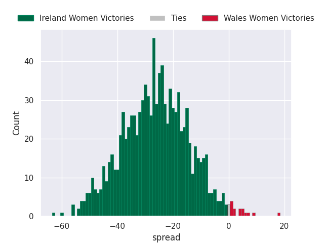

## Week 5

### Ireland Women V Scotland Women on 2026/05/17

Average Margin: Ireland Women by 15.6

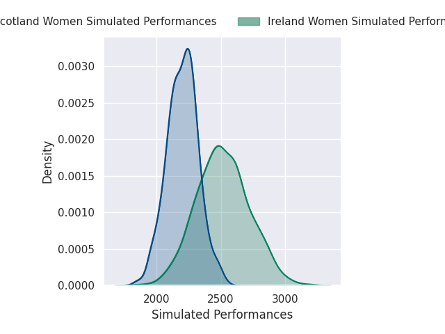
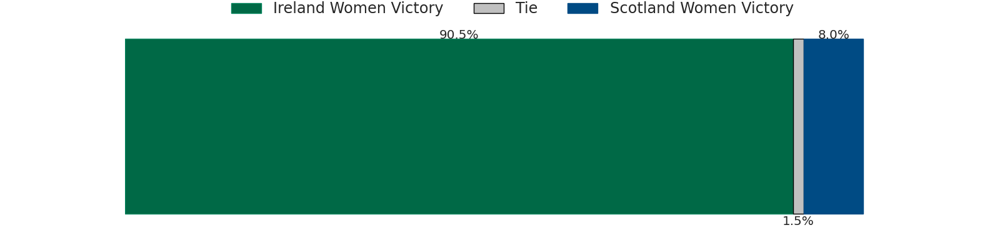
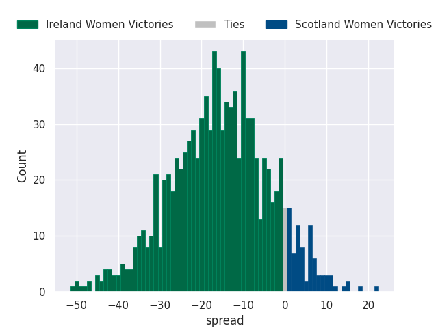

### France Women V England Women on 2026/05/17

Average Margin: England Women by 16.8

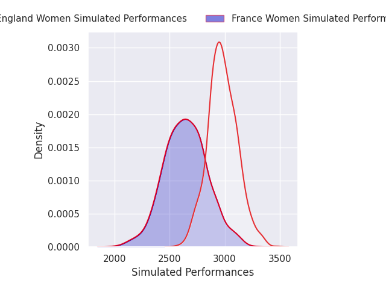
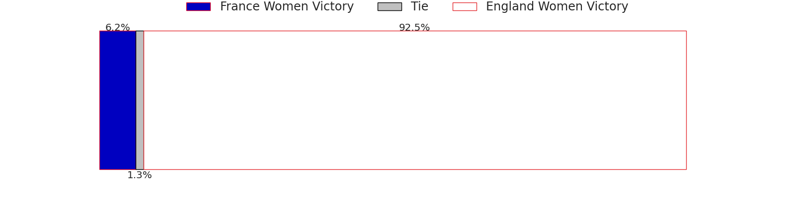
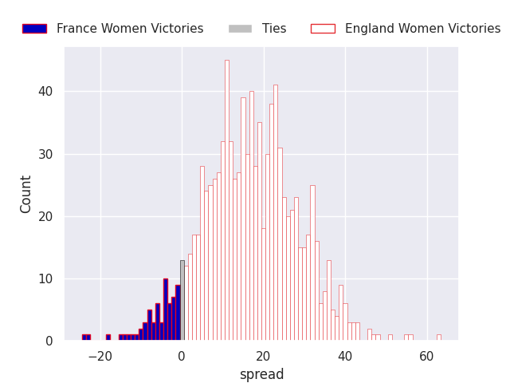

### Wales Women V Italy Women on 2026/05/17

Average Margin: Italy Women by 4.5

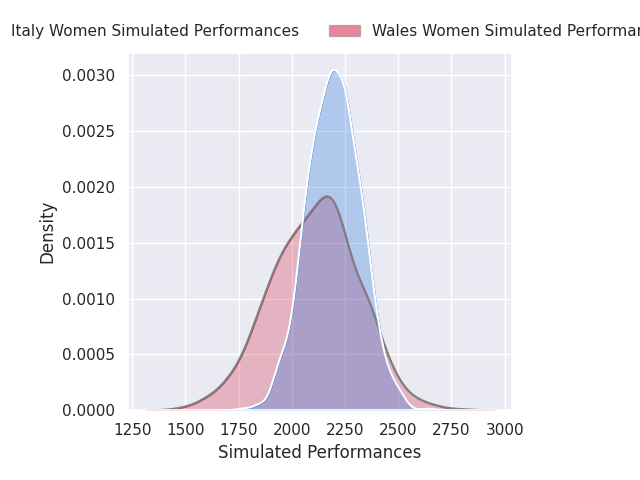
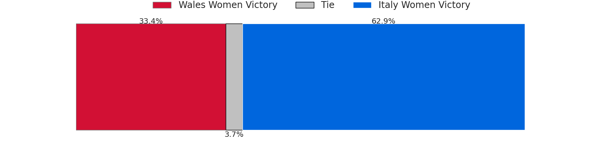
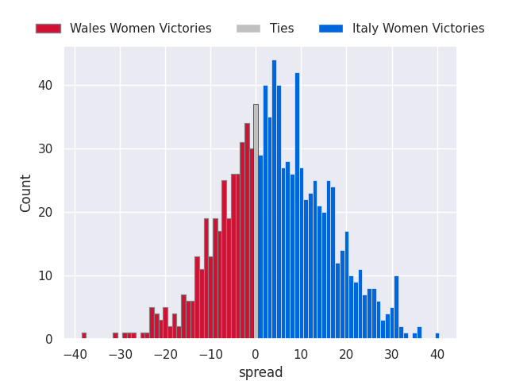

