# Team Rankings

# Standings

## Projected Remaining Table

| Club           |   To Play |   Projected Wins |   Projected Differential |   Projected Losing Bonus Points | Projected Try Bonus Points   |   Projected Competition Points |
|:---------------|----------:|-----------------:|-------------------------:|--------------------------------:|:-----------------------------|-------------------------------:|
| England Women  |         5 |            3.8   |                   90.415 |                           0.539 |                              |                         16.017 |
| France Women   |         5 |            2.86  |                   19.239 |                           0.857 |                              |                         12.625 |
| Ireland Women  |         5 |            2.454 |                   -6.584 |                           0.8   |                              |                         10.932 |
| Scotland Women |         5 |            2.05  |                  -18.835 |                           0.971 |                              |                          9.575 |
| Italy Women    |         5 |            1.829 |                  -27.305 |                           0.965 |                              |                          8.655 |
| Wales Women    |         5 |            1.495 |                  -56.93  |                           0.899 |                              |                          7.227 |

## Projected Total Table

| Club           |   Played |   Wins |   Point Differential |   Losing Bonus Points | Try Bonus Points   |   Competition Points |
|:---------------|---------:|-------:|---------------------:|----------------------:|:-------------------|---------------------:|
| England Women  |        5 |  3.8   |               90.415 |                 0.539 |                    |               16.017 |
| France Women   |        5 |  2.86  |               19.239 |                 0.857 |                    |               12.625 |
| Ireland Women  |        5 |  2.454 |               -6.584 |                 0.8   |                    |               10.932 |
| Scotland Women |        5 |  2.05  |              -18.835 |                 0.971 |                    |                9.575 |
| Italy Women    |        5 |  1.829 |              -27.305 |                 0.965 |                    |                8.655 |
| Wales Women    |        5 |  1.495 |              -56.93  |                 0.899 |                    |                7.227 |

# Future Predictions

## Week 1

### Wales Women V Scotland Women on 2026/04/11

Average Margin: Scotland Women by 3.9

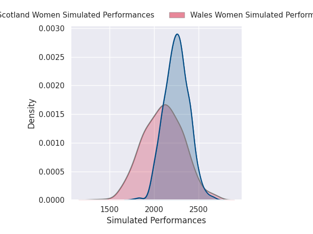
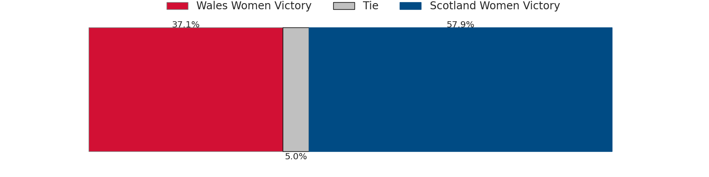
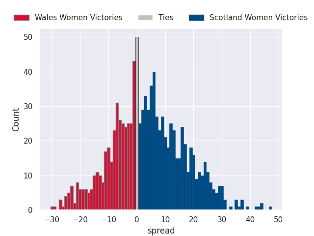

### England Women V Ireland Women on 2026/04/11

Average Margin: England Women by 21.1

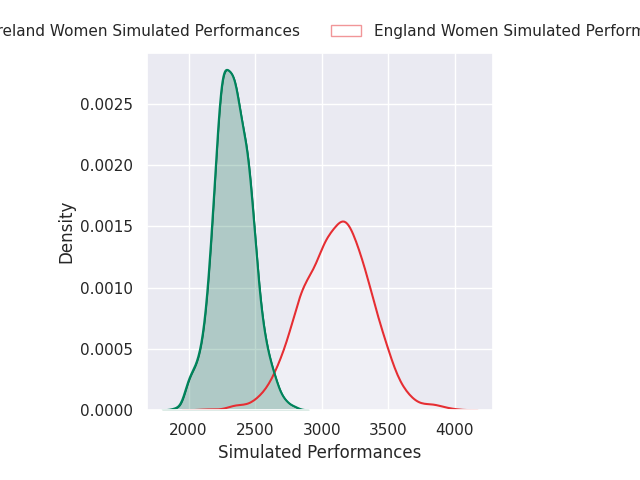
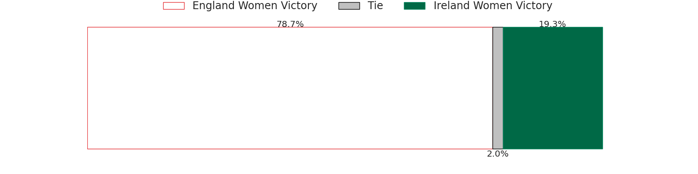
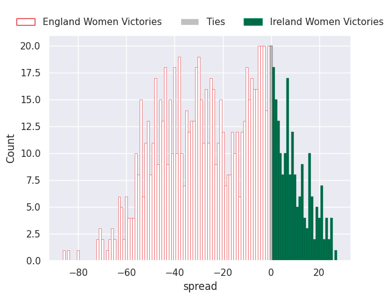

### France Women V Italy Women on 2026/04/11

Average Margin: France Women by 11.7

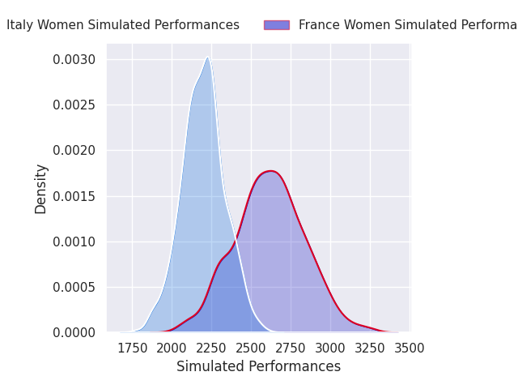
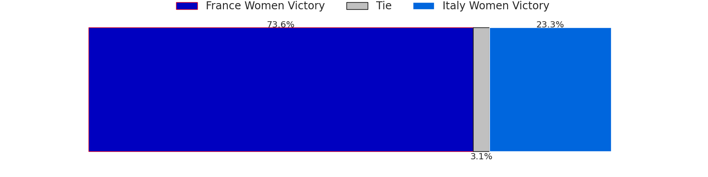
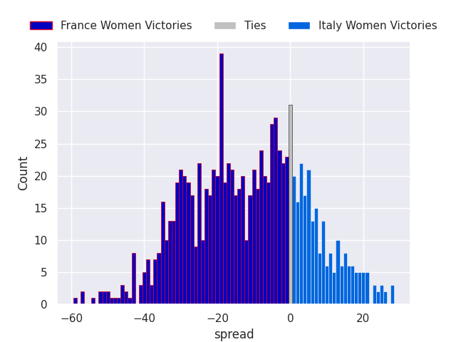

## Week 2

### Scotland Women V England Women on 2026/04/18

Average Margin: England Women by 16.5

### Wales Women V France Women on 2026/04/18

Average Margin: France Women by 9.3

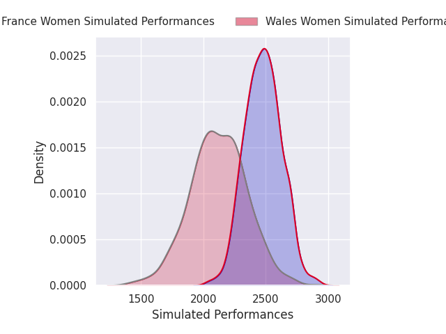
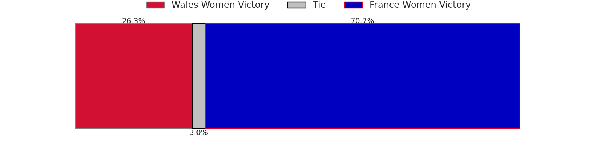
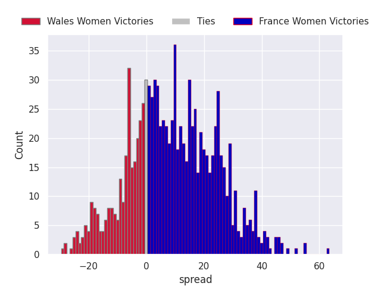

### Ireland Women V Italy Women on 2026/04/18

Average Margin: Ireland Women by 6.5

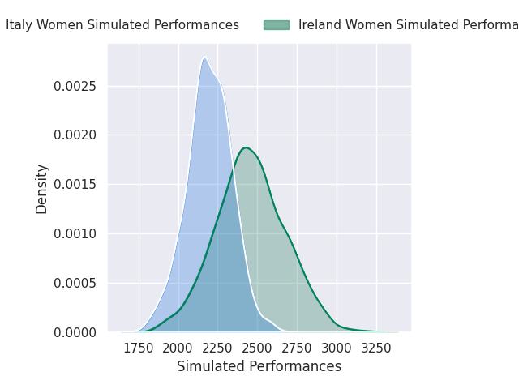

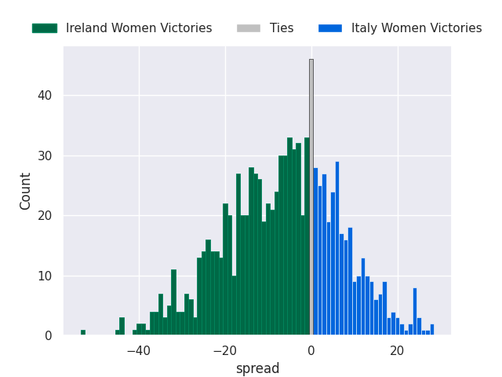

## Week 3

### France Women V Ireland Women on 2026/04/25

Average Margin: France Women by 7.4

### Italy Women V Scotland Women on 2026/04/25

Average Margin: Italy Women by 1.8

### England Women V Wales Women on 2026/04/25

Average Margin: England Women by 32.1

## Week 4

### Ireland Women V Wales Women on 2026/05/09

Average Margin: Ireland Women by 10.1

### Italy Women V England Women on 2026/05/09

Average Margin: England Women by 12.4

### Scotland Women V France Women on 2026/05/09

Average Margin: Scotland Women by 0.8

## Week 5

### France Women V England Women on 2026/05/17

Average Margin: England Women by 8.3

### Ireland Women V Scotland Women on 2026/05/17

Average Margin: Ireland Women by 5.3

### Wales Women V Italy Women on 2026/05/17

Average Margin: Italy Women by 1.5

