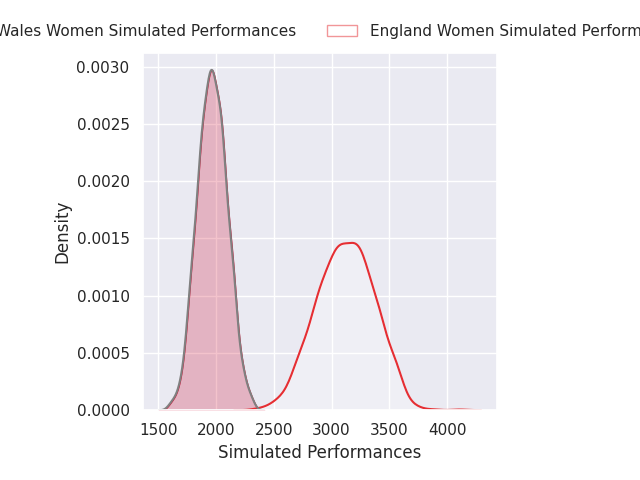
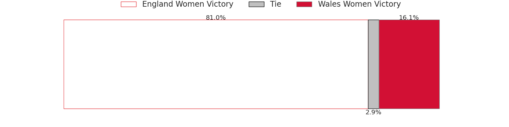
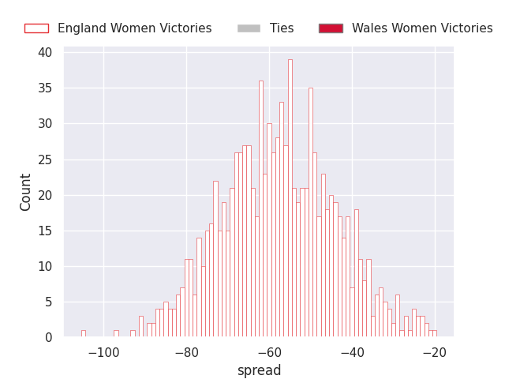
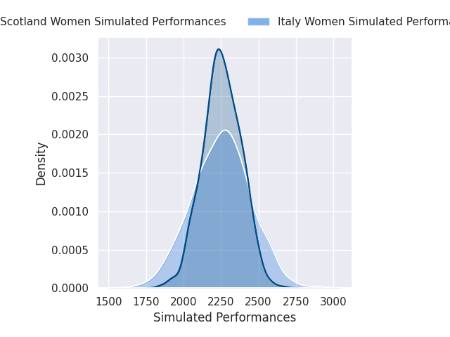
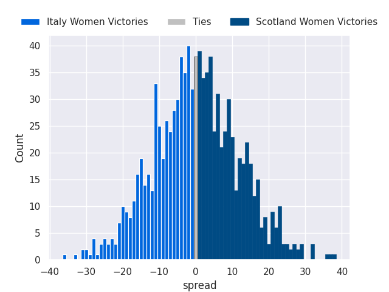

# Team Rankings

# Standings

## Current Standings

| Club           |   Played |   Wins |   Point Differential |   Losing Bonus Points | Try Bonus Points   |   Competition Points |
|:---------------|---------:|-------:|---------------------:|----------------------:|:-------------------|---------------------:|
| England Women  |        2 |      2 |                   98 |                     0 |                    |                    8 |
| France Women   |        2 |      2 |                   64 |                     0 |                    |                    8 |
| Ireland Women  |        2 |      1 |                   16 |                     0 |                    |                    4 |
| Scotland Women |        2 |      1 |                  -72 |                     0 |                    |                    4 |
| Wales Women    |        2 |      0 |                  -36 |                     1 |                    |                    1 |
| Italy Women    |        2 |      0 |                  -70 |                     0 |                    |                    0 |

## Projected Remaining Table

| Club           |   To Play |   Projected Wins |   Projected Differential |   Projected Losing Bonus Points | Projected Try Bonus Points   |   Projected Competition Points |
|:---------------|----------:|-----------------:|-------------------------:|--------------------------------:|:-----------------------------|-------------------------------:|
| England Women  |         3 |            2.933 |                  111.914 |                           0.04  |                              |                         11.788 |
| Ireland Women  |         3 |            1.982 |                   29.068 |                           0.302 |                              |                          8.312 |
| France Women   |         3 |            1.568 |                   -0.3   |                           0.362 |                              |                          6.74  |
| Italy Women    |         3 |            1.023 |                  -34.049 |                           0.459 |                              |                          4.701 |
| Scotland Women |         3 |            0.911 |                  -19.525 |                           0.57  |                              |                          4.388 |
| Wales Women    |         3 |            0.432 |                  -87.108 |                           0.254 |                              |                          2.058 |

## Projected Total Table

| Club           |   Played |   Wins |   Point Differential |   Losing Bonus Points | Try Bonus Points   |   Competition Points |
|:---------------|---------:|-------:|---------------------:|----------------------:|:-------------------|---------------------:|
| England Women  |        5 |  4.933 |              209.914 |                 0.04  |                    |               19.788 |
| France Women   |        5 |  3.568 |               63.7   |                 0.362 |                    |               14.74  |
| Ireland Women  |        5 |  2.982 |               45.068 |                 0.302 |                    |               12.312 |
| Scotland Women |        5 |  1.911 |              -91.525 |                 0.57  |                    |                8.388 |
| Italy Women    |        5 |  1.023 |             -104.049 |                 0.459 |                    |                4.701 |
| Wales Women    |        5 |  0.432 |             -123.108 |                 1.254 |                    |                3.058 |

# Completed Match Review

| Model | Percent Correct Predictions | Spread Error |
| ------ | ------ | ------ |
| Club Level | 73.3% | 13.7 |
| Player Level: Lineup | nan% | nan |
| Player Level: Minutes | nan% | nan |

# Future Predictions

## Week 3

### England Women V Wales Women on 2026/04/25

Average Margin: England Women by 57.7

### Italy Women V Scotland Women on 2026/04/25

Average Margin: Scotland Women by 0.1

### France Women V Ireland Women on 2026/04/25

Average Margin: France Women by 11.8

## Week 4

### Ireland Women V Wales Women on 2026/05/09

Average Margin: Ireland Women by 27.3

### Scotland Women V France Women on 2026/05/09

Average Margin: France Women by 6.0

### Italy Women V England Women on 2026/05/09

Average Margin: England Women by 36.1

## Week 5

### Wales Women V Italy Women on 2026/05/17

Average Margin: Italy Women by 2.1

### France Women V England Women on 2026/05/17

Average Margin: England Women by 18.2

### Ireland Women V Scotland Women on 2026/05/17

Average Margin: Ireland Women by 13.6

