---  
title: "World Rugby U20 Championship 2023 Status"  
date: 2024-07-01 6:00:00 -0500  
categories: model review projection  
layout: article  
aside:  
    toc: true  
---
# Current Team Rankings

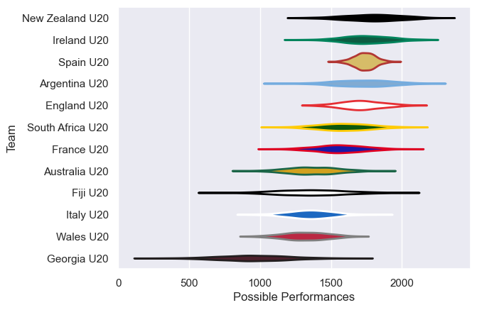
# Standings

## Current Standings

| Club             |   Played |   Wins |   Point Differential |   Losing Bonus Points |   Try Bonus Points |   Competition Points |
|:-----------------|---------:|-------:|---------------------:|----------------------:|-------------------:|---------------------:|
| South Africa U20 |        1 |      1 |                   50 |                     0 |                nan |                    4 |
| Australia U20    |        1 |      1 |                   24 |                     0 |                nan |                    4 |
| Georgia U20      |        1 |      0 |                  -24 |                     0 |                nan |                    0 |
| Fiji U20         |        1 |      0 |                  -50 |                     0 |                nan |                    0 |

## Projected Remaining Table

| Club             |   Matches Remaining |   Wins |   Point Differential |   Losing Bonus Points |   Try Bonus Points |   Competition Points |
|:-----------------|--------------------:|-------:|---------------------:|----------------------:|-------------------:|---------------------:|
| Ireland U20      |                   1 |    1   |             45.1008  |                   0   |                0.9 |                  4.9 |
| England U20      |                   1 |    1   |             26.9885  |                   0   |                0.8 |                  4.7 |
| Australia U20    |                   1 |    0.8 |              9.96307 |                   0.1 |                0.5 |                  3.9 |
| Wales U20        |                   1 |    0.7 |             11.2191  |                   0.1 |                0.7 |                  3.8 |
| South Africa U20 |                   1 |    0.7 |              7.16713 |                   0.2 |                0.3 |                  3.3 |
| New Zealand U20  |                   1 |    0.6 |              1.64479 |                   0.2 |                0.3 |                  2.7 |
| France U20       |                   1 |    0.4 |             -1.64479 |                   0.2 |                0.2 |                  2.2 |
| Argentina U20    |                   1 |    0.3 |             -7.16713 |                   0.2 |                0.1 |                  1.5 |
| Spain U20        |                   1 |    0.3 |            -11.2191  |                   0.1 |                0.2 |                  1.3 |
| Italy U20        |                   1 |    0.2 |             -9.96307 |                   0.2 |                0.2 |                  1.2 |
| Fiji U20         |                   1 |    0   |            -26.9885  |                   0   |                0.1 |                  0.3 |
| Georgia U20      |                   1 |    0   |            -45.1008  |                   0   |                0.1 |                  0.1 |

## Projected Total Table

| Club             |   Total Matches |   Wins |   Point Differential |   Losing Bonus Points |   Try Bonus Points |   Competition Points |
|:-----------------|----------------:|-------:|---------------------:|----------------------:|-------------------:|---------------------:|
| Australia U20    |               2 |    1.8 |             33.9631  |                   0.1 |                0.5 |                  7.9 |
| South Africa U20 |               2 |    1.7 |             57.1671  |                   0.2 |                0.3 |                  7.3 |
| Ireland U20      |               1 |    1   |             45.1008  |                   0   |                0.9 |                  4.9 |
| England U20      |               1 |    1   |             26.9885  |                   0   |                0.8 |                  4.7 |
| Wales U20        |               1 |    0.7 |             11.2191  |                   0.1 |                0.7 |                  3.8 |
| New Zealand U20  |               1 |    0.6 |              1.64479 |                   0.2 |                0.3 |                  2.7 |
| France U20       |               1 |    0.4 |             -1.64479 |                   0.2 |                0.2 |                  2.2 |
| Argentina U20    |               1 |    0.3 |             -7.16713 |                   0.2 |                0.1 |                  1.5 |
| Spain U20        |               1 |    0.3 |            -11.2191  |                   0.1 |                0.2 |                  1.3 |
| Italy U20        |               1 |    0.2 |             -9.96307 |                   0.2 |                0.2 |                  1.2 |
| Fiji U20         |               2 |    0   |            -76.9885  |                   0   |                0.1 |                  0.3 |
| Georgia U20      |               2 |    0   |            -69.1008  |                   0   |                0.1 |                  0.1 |

# Completed Match Review

| Model | Percent Correct Predictions | Spread Error |
| ------ | ------ | ------ |
| Club Level | 100.0% | 17.4 |
| Player Level: Lineup | nan% | nan |
| Player Level: Minutes | nan% | nan |

# Future Predictions

## Week 2

### France U20 V New Zealand U20 on 2024/07/04

Average Margin: New Zealand U20 by 1.6

Average Scoreline: 35-33

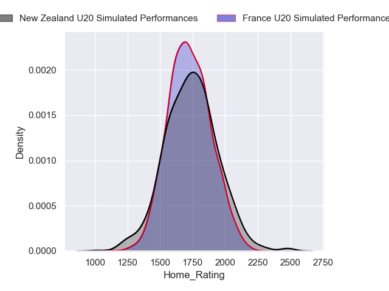

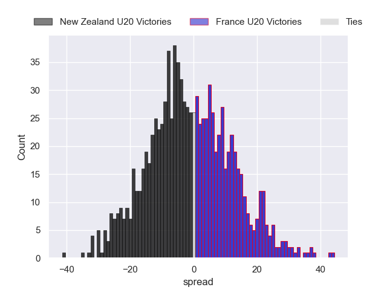

### Wales U20 V Spain U20 on 2024/07/04

Average Margin: Wales U20 by 11.2

Average Scoreline: 35-24

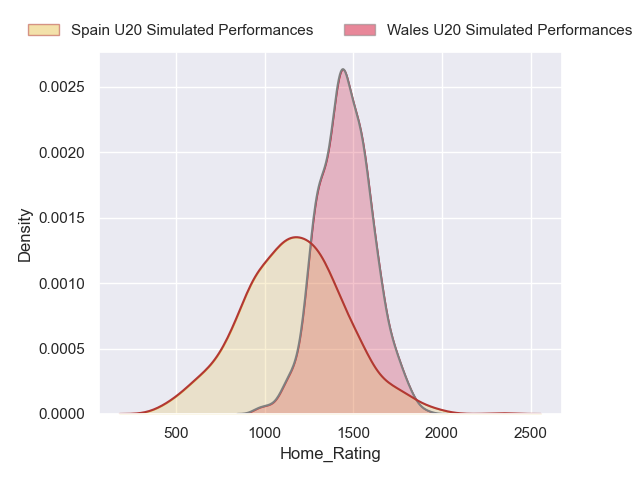
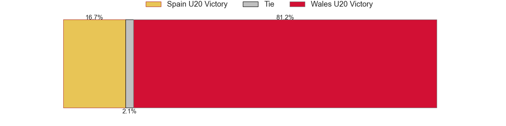
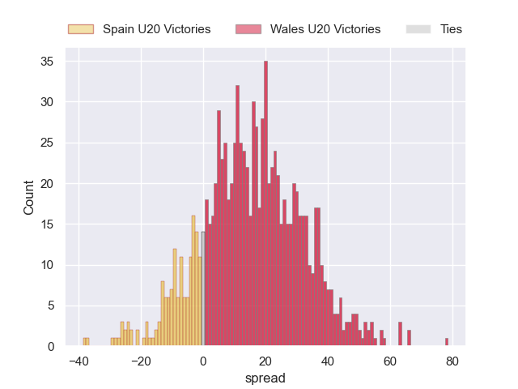

### England U20 V Fiji U20 on 2024/07/04

Average Margin: England U20 by 27.0

Average Scoreline: 42-15

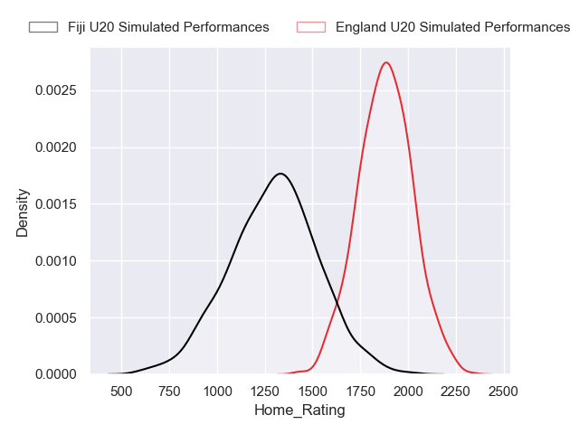
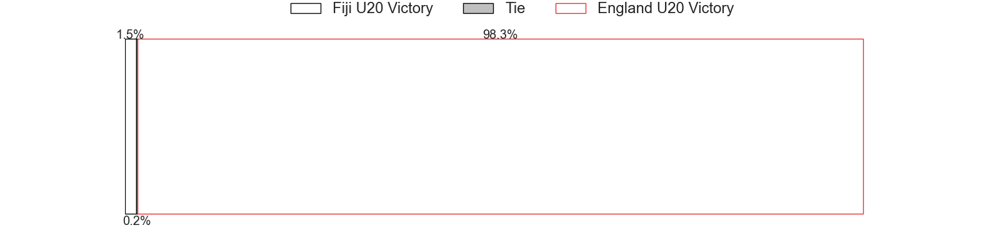

### South Africa U20 V Argentina U20 on 2024/07/04

Average Margin: South Africa U20 by 7.2

Average Scoreline: 33-26

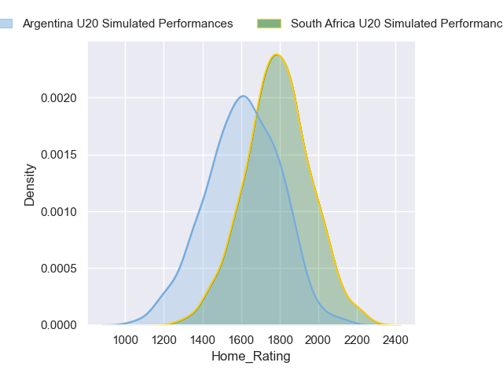
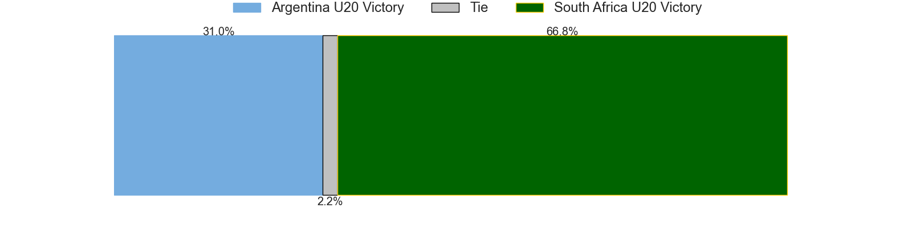
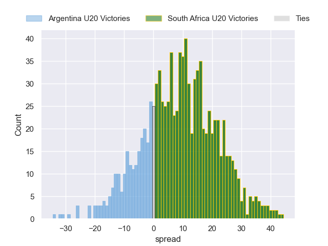

### Ireland U20 V Georgia U20 on 2024/07/04

Average Margin: Ireland U20 by 45.1

Average Scoreline: 54-9

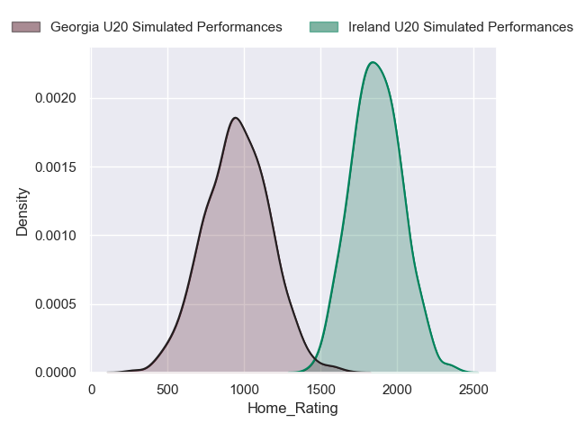

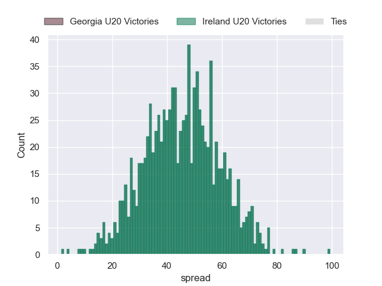

### Australia U20 V Italy U20 on 2024/07/04

Average Margin: Australia U20 by 10.0

Average Scoreline: 30-21

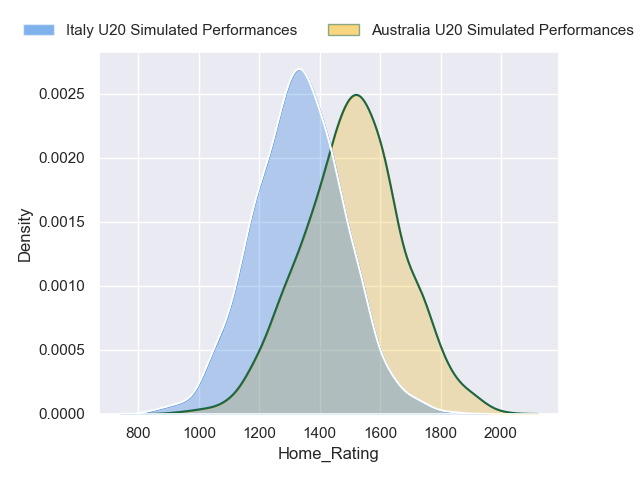
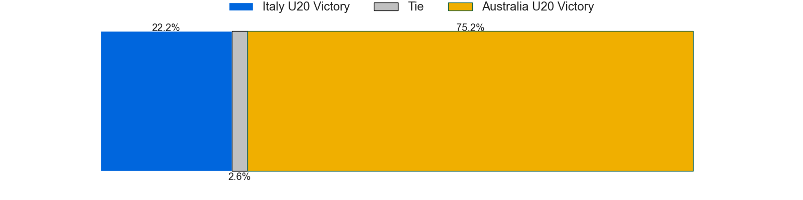
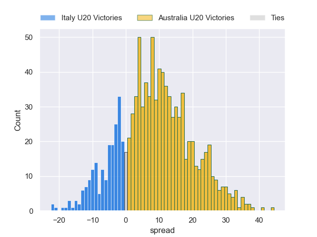

