---  
title: "World Rugby U20 Championship 2023 Status"  
date: 2024-06-24 6:00:00 -0500  
categories: model review projection  
layout: article  
aside:  
    toc: true  
---
# Current Team Rankings

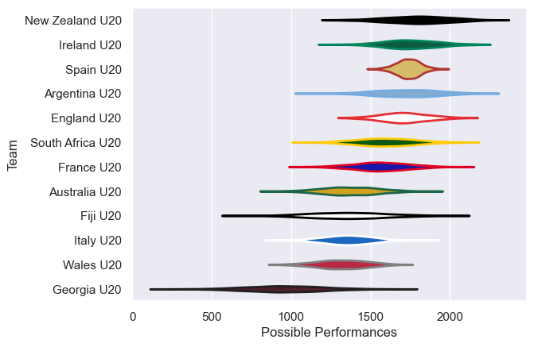
# Standings

## Projected Total Table

| Club             |   Total Matches |   Wins |   Point Differential |   Losing Bonus Points |   Try Bonus Points |   Competition Points |
|:-----------------|----------------:|-------:|---------------------:|----------------------:|-------------------:|---------------------:|
| Australia U20    |               1 |    1   |             24.683   |                   0   |                0.7 |                  4.5 |
| Ireland U20      |               1 |    1   |             23.7362  |                   0   |                0.5 |                  4.5 |
| New Zealand U20  |               1 |    0.9 |             20.2917  |                   0   |                0.4 |                  4.2 |
| South Africa U20 |               1 |    0.9 |             15.2142  |                   0.1 |                0.4 |                  3.9 |
| Spain U20        |               1 |    0.7 |              5.19664 |                   0.2 |                0.5 |                  3.5 |
| England U20      |               1 |    0.6 |              3.0061  |                   0.2 |                0.2 |                  2.8 |
| Argentina U20    |               1 |    0.4 |             -3.0061  |                   0.2 |                0.2 |                  2   |
| France U20       |               1 |    0.3 |             -5.19664 |                   0.3 |                0   |                  1.5 |
| Fiji U20         |               1 |    0.1 |            -15.2142  |                   0.1 |                0.1 |                  0.8 |
| Wales U20        |               1 |    0.1 |            -20.2917  |                   0.1 |                0.2 |                  0.5 |
| Georgia U20      |               1 |    0   |            -24.683   |                   0.1 |                0.2 |                  0.4 |
| Italy U20        |               1 |    0   |            -23.7362  |                   0   |                0.2 |                  0.3 |

# Future Predictions

## Week 1

### France U20 V Spain U20 on 2024/06/29

Average Margin: Spain U20 by 5.2

Average Scoreline: 28-22

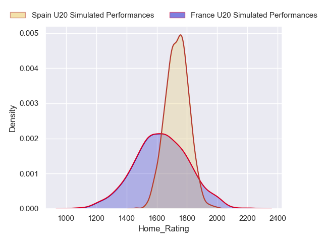
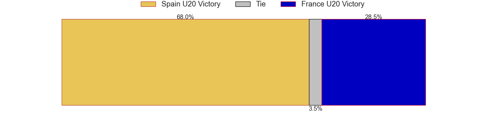
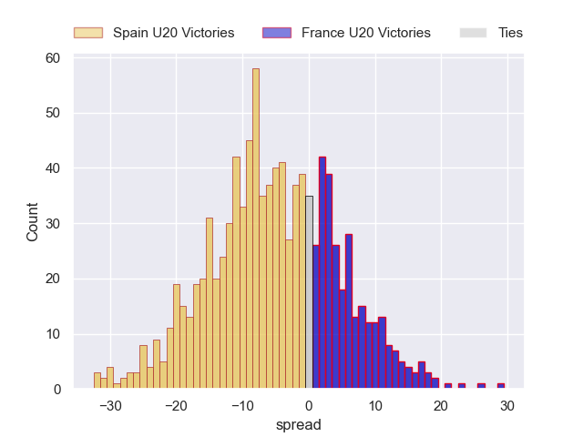

### England U20 V Argentina U20 on 2024/06/29

Average Margin: England U20 by 3.0

Average Scoreline: 28-25

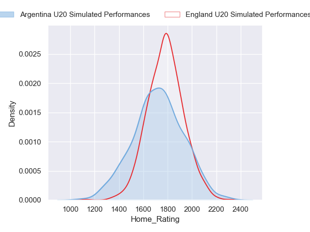

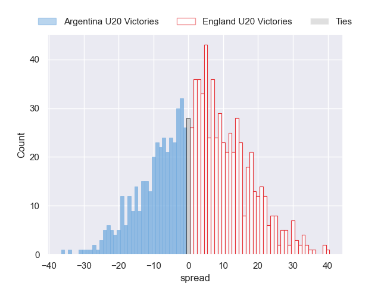

### Wales U20 V New Zealand U20 on 2024/06/29

Average Margin: New Zealand U20 by 20.3

Average Scoreline: 41-21

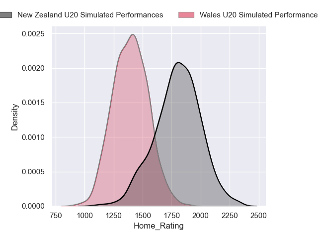
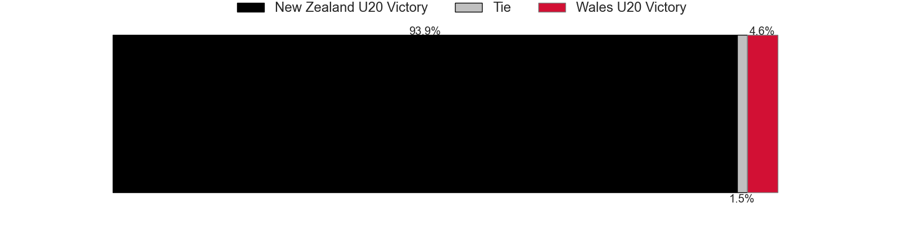
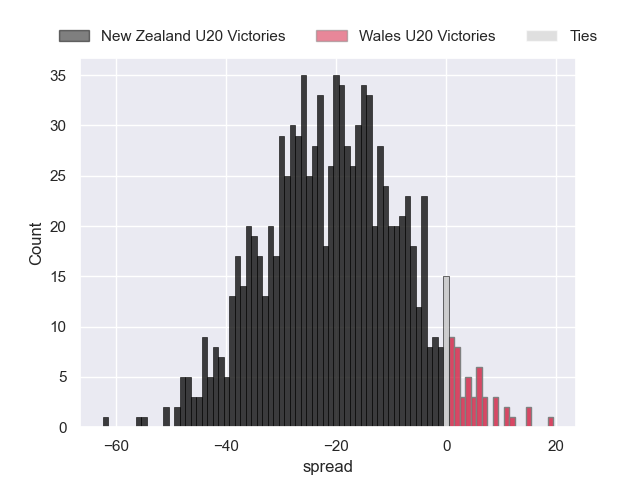

### South Africa U20 V Fiji U20 on 2024/06/29

Average Margin: South Africa U20 by 15.2

Average Scoreline: 31-16

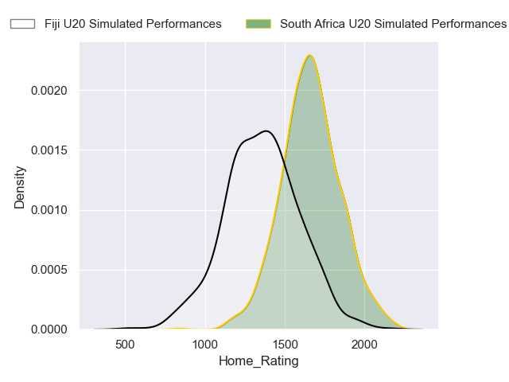
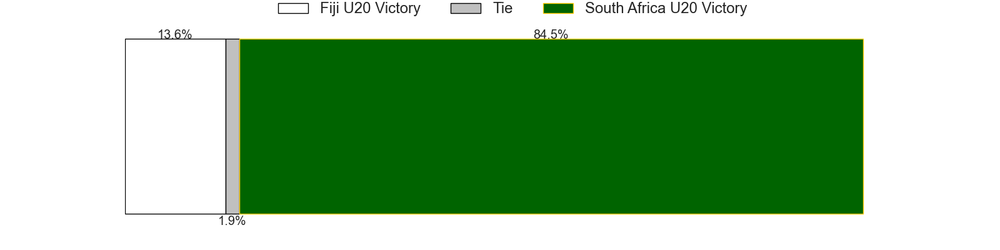
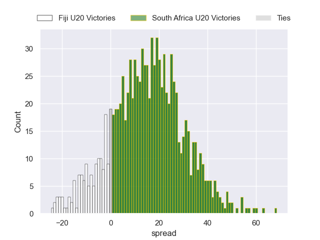

### Ireland U20 V Italy U20 on 2024/06/29

Average Margin: Ireland U20 by 23.7

Average Scoreline: 45-21

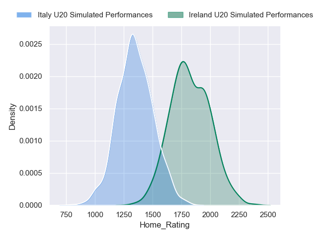
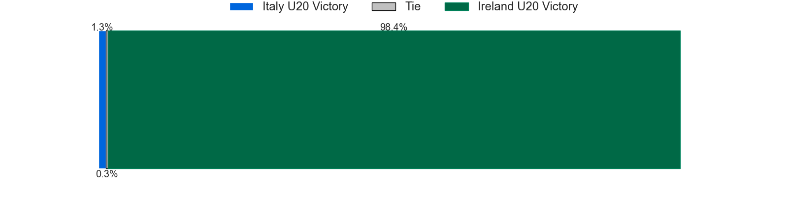
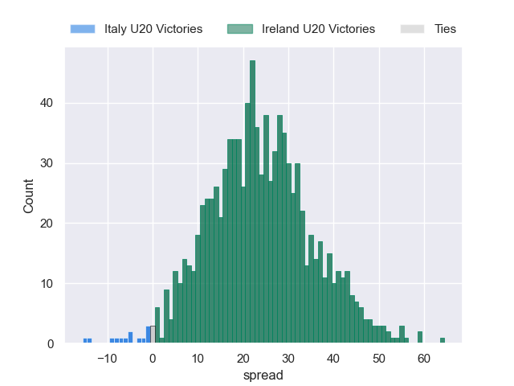

### Australia U20 V Georgia U20 on 2024/06/29

Average Margin: Australia U20 by 24.7

Average Scoreline: 31-6

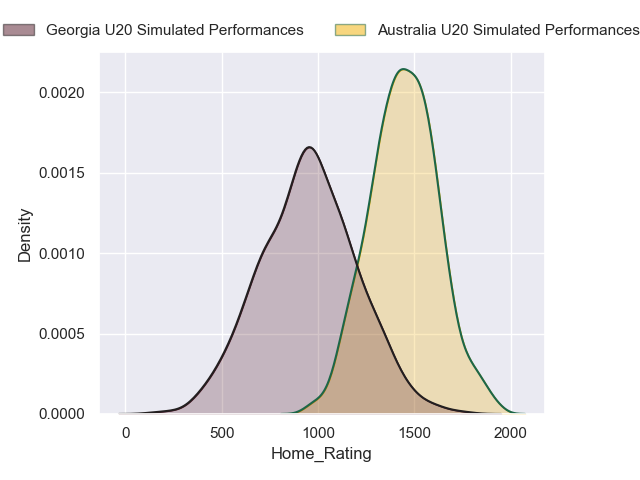
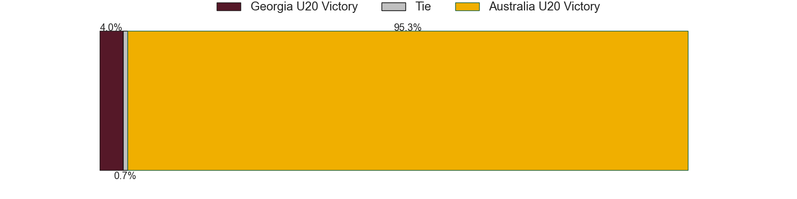
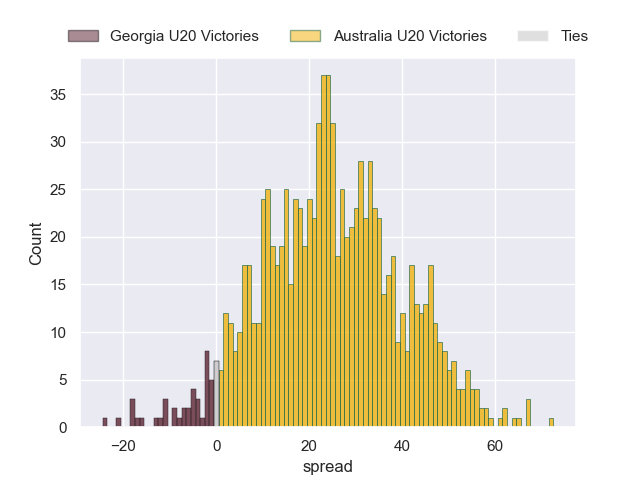

