---  
title: "World Rugby U20 Championship 2024 Status"  
date: 2024-07-19 6:00:00 -0500  
categories: model review projection  
layout: article  
aside:  
    toc: true  
---
# Current Team Rankings

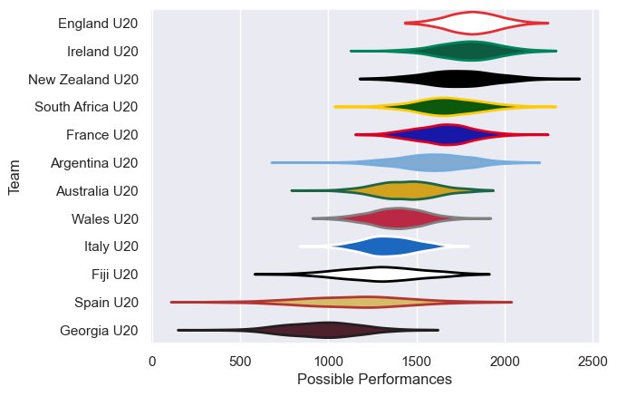
# Standings

## Current Standings

| Club             |   Played |   Wins |   Point Differential |   Losing Bonus Points |   Try Bonus Points |   Competition Points |
|:-----------------|---------:|-------:|---------------------:|----------------------:|-------------------:|---------------------:|
| France U20       |        5 |      4 |                  102 |                     1 |                nan |                   21 |
| Australia U20    |        7 |      4 |                   42 |                     1 |                nan |                   20 |
| Argentina U20    |        5 |      4 |                   58 |                     0 |                nan |                   19 |
| New Zealand U20  |        6 |      4 |                    6 |                     0 |                nan |                   19 |
| England U20      |        4 |      4 |                   72 |                     0 |                  2 |                   18 |
| South Africa U20 |        6 |      3 |                   82 |                     1 |                nan |                   15 |
| Georgia U20      |        6 |      3 |                  -28 |                     1 |                nan |                   15 |
| Ireland U20      |        6 |      3 |                   21 |                     0 |                nan |                   13 |
| Wales U20        |        5 |      1 |                  -27 |                     2 |                nan |                    8 |
| Italy U20        |        5 |      2 |                  -44 |                     0 |                nan |                    8 |
| Spain U20        |        5 |      1 |                  -98 |                     0 |                nan |                    4 |
| Fiji U20         |        6 |      0 |                 -186 |                     2 |                nan |                    3 |

## Projected Remaining Table

| Club             |   Matches Remaining |   Wins |   Point Differential |   Losing Bonus Points |   Try Bonus Points |   Competition Points |
|:-----------------|--------------------:|-------:|---------------------:|----------------------:|-------------------:|---------------------:|
| Georgia U20      |                   1 |    0.9 |             15.8305  |                   0.1 |                0.7 |                  4.4 |
| Argentina U20    |                   1 |    0.9 |             12.4017  |                   0.1 |                0.6 |                  4.3 |
| South Africa U20 |                   1 |    0.8 |              8.08185 |                   0.1 |                0.6 |                  4   |
| Spain U20        |                   1 |    0.7 |              7.75094 |                   0.2 |                0.4 |                  3.5 |
| England U20      |                   1 |    0.7 |              4.32817 |                   0.2 |                0.4 |                  3.4 |
| Ireland U20      |                   1 |    0.6 |              1.21915 |                   0.2 |                0.3 |                  2.7 |
| New Zealand U20  |                   1 |    0.4 |             -1.21915 |                   0.3 |                0.6 |                  2.6 |
| France U20       |                   1 |    0.3 |             -4.32817 |                   0.3 |                0.2 |                  1.7 |
| Fiji U20         |                   1 |    0.3 |             -7.75094 |                   0.2 |                0.3 |                  1.6 |
| Wales U20        |                   1 |    0.2 |             -8.08185 |                   0.3 |                0.2 |                  1.2 |
| Australia U20    |                   1 |    0.1 |            -12.4017  |                   0.2 |                0.1 |                  0.7 |
| Italy U20        |                   1 |    0.1 |            -15.8305  |                   0.1 |                0.2 |                  0.7 |

## Projected Total Table

| Club             |   Total Matches |   Wins |   Point Differential |   Losing Bonus Points |   Try Bonus Points |   Competition Points |
|:-----------------|----------------:|-------:|---------------------:|----------------------:|-------------------:|---------------------:|
| Argentina U20    |               6 |    4.9 |             70.4017  |                   0.1 |                0.6 |                 23.3 |
| France U20       |               6 |    4.3 |             97.6718  |                   1.3 |                0.2 |                 22.7 |
| New Zealand U20  |               7 |    4.4 |              4.78085 |                   0.3 |                0.6 |                 21.6 |
| England U20      |               5 |    4.7 |             76.3282  |                   0.2 |                2.4 |                 21.4 |
| Australia U20    |               8 |    4.1 |             29.5983  |                   1.2 |                0.1 |                 20.7 |
| Georgia U20      |               7 |    3.9 |            -12.1695  |                   1.1 |                0.7 |                 19.4 |
| South Africa U20 |               7 |    3.8 |             90.0819  |                   1.1 |                0.6 |                 19   |
| Ireland U20      |               7 |    3.6 |             22.2192  |                   0.2 |                0.3 |                 15.7 |
| Wales U20        |               6 |    1.2 |            -35.0819  |                   2.3 |                0.2 |                  9.2 |
| Italy U20        |               6 |    2.1 |            -59.8305  |                   0.1 |                0.2 |                  8.7 |
| Spain U20        |               6 |    1.7 |            -90.2491  |                   0.2 |                0.4 |                  7.5 |
| Fiji U20         |               7 |    0.3 |           -193.751   |                   2.2 |                0.3 |                  4.6 |

# Completed Match Review

| Model | Percent Correct Predictions | Spread Error |
| ------ | ------ | ------ |
| Club Level | 63.3% | 14.9 |
| Player Level: Lineup | 60.6% | 16.3 |
| Player Level: Minutes | 62.5% | 16.4 |

# Future Predictions

## Week 8

### Wales U20 V South Africa U20 on 2024/07/19

Average Margin: South Africa U20 by 8.1

Average Scoreline: 31-23

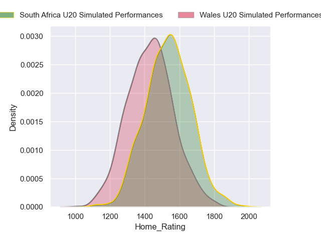
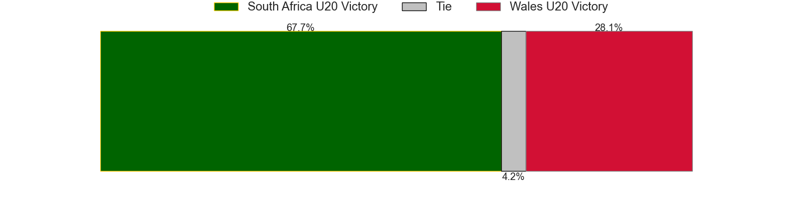
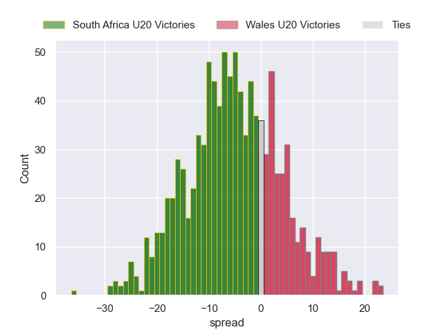

### Ireland U20 V New Zealand U20 on 2024/07/19

Average Margin: Ireland U20 by 1.2

Average Scoreline: 30-29

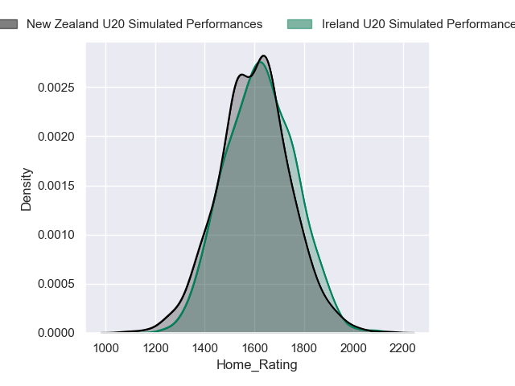
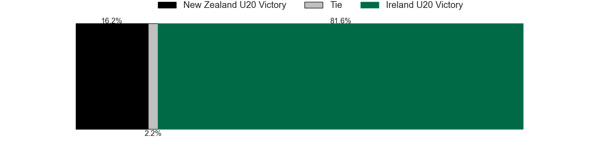
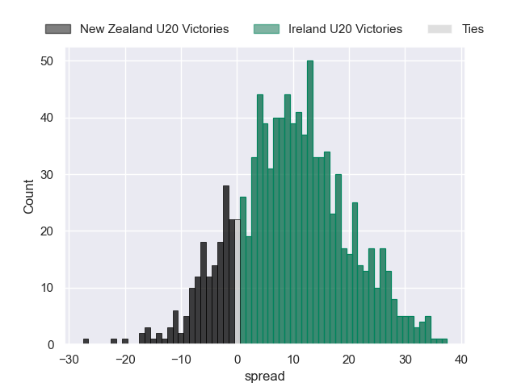

### Italy U20 V Georgia U20 on 2024/07/19

Average Margin: Georgia U20 by 15.8

Average Scoreline: 41-26

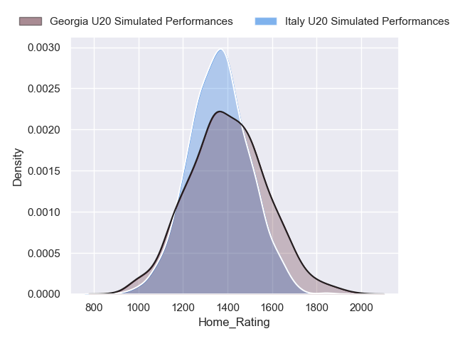
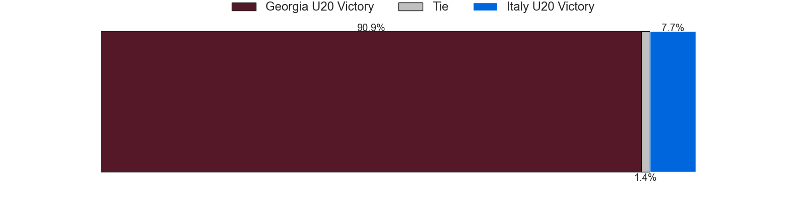
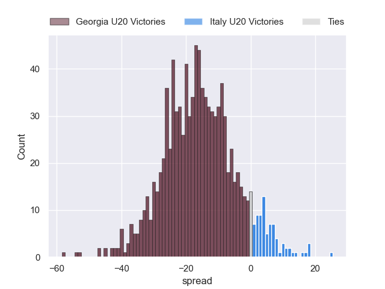

### Australia U20 V Argentina U20 on 2024/07/19

Average Margin: Argentina U20 by 12.4

Average Scoreline: 37-24

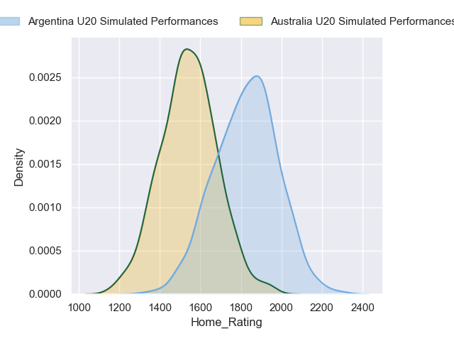
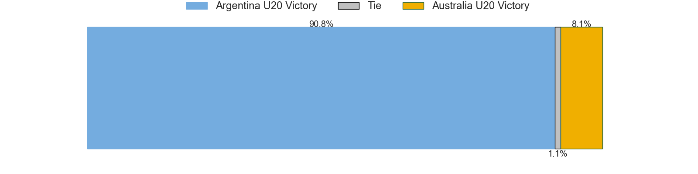
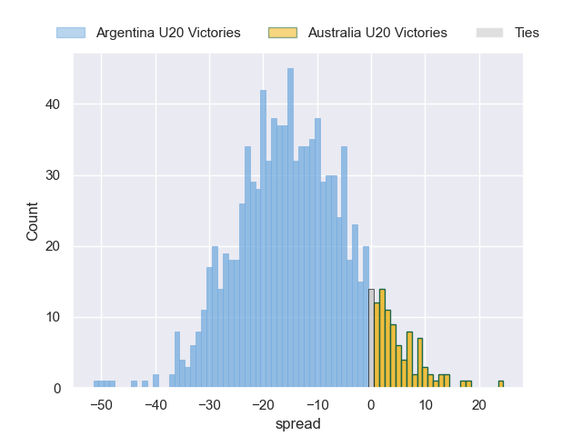

### England U20 V France U20 on 2024/07/19

Average Margin: England U20 by 4.3

Average Scoreline: 34-30

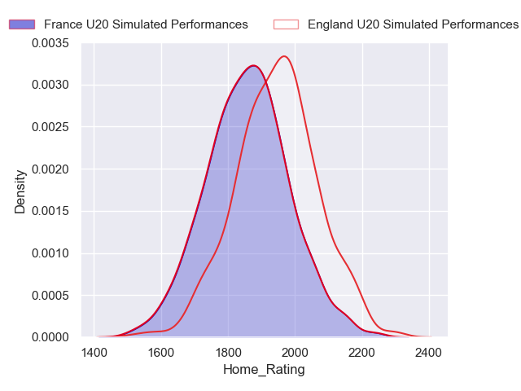
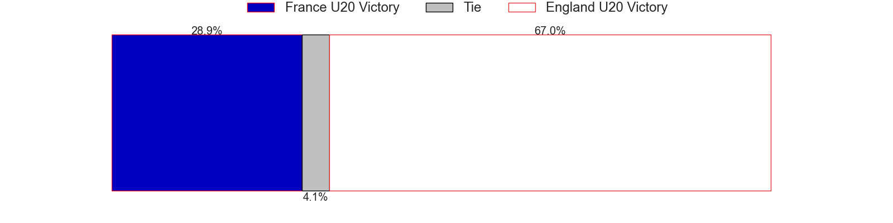
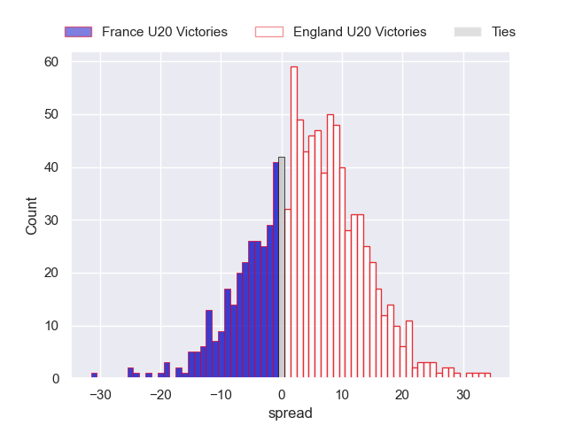

### Spain U20 V Fiji U20 on 2024/07/19

Average Margin: Spain U20 by 7.8

Average Scoreline: 29-22

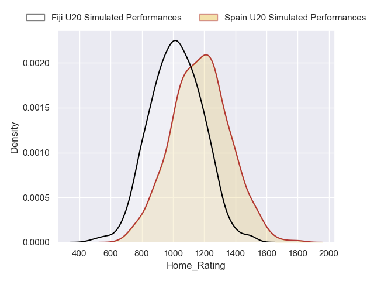
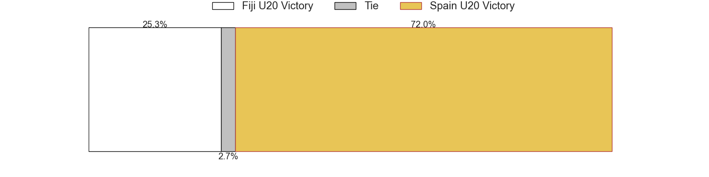
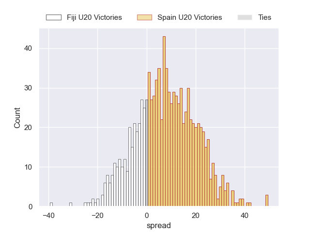

