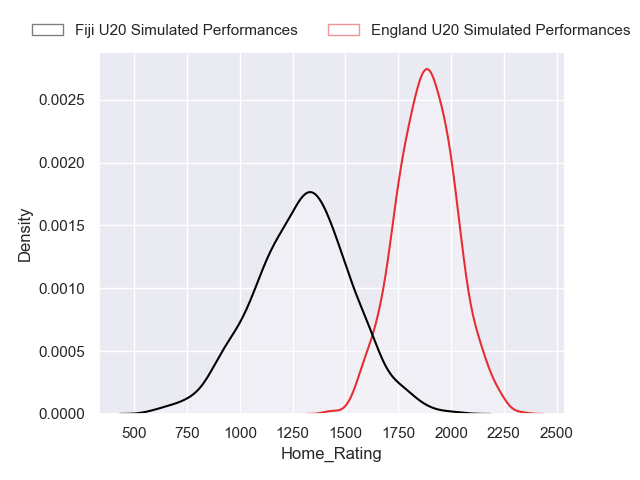
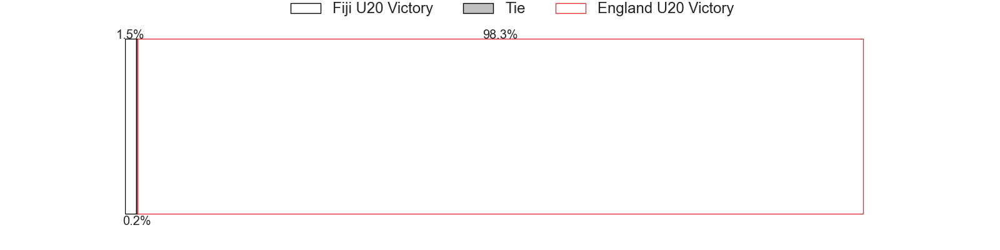
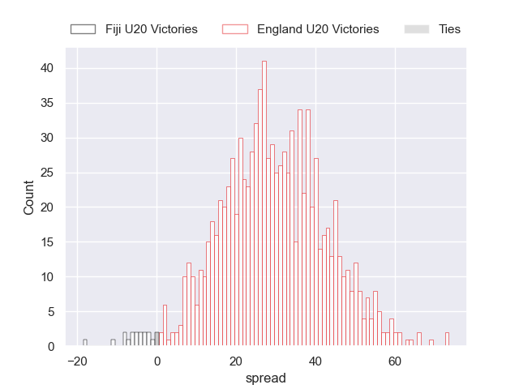
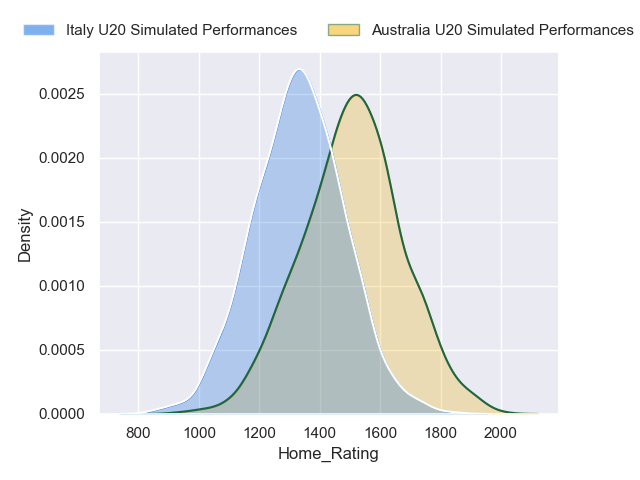
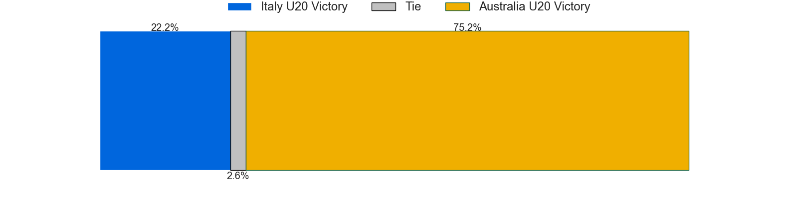
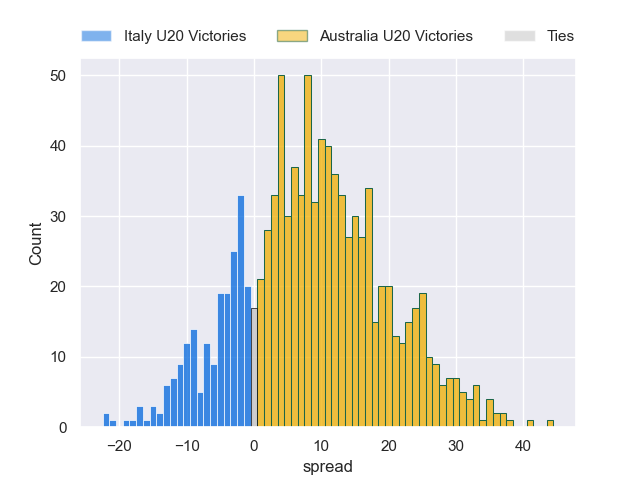

---  
title: "World Rugby U20 Championship 2024 Status"  
date: 2024-07-04 6:00:00 -0500  
categories: model review projection  
layout: article  
aside:  
    toc: true  
---
# Current Team Rankings

# Standings

## Current Standings

| Club             |   Played |   Wins |   Point Differential |   Losing Bonus Points |   Try Bonus Points |   Competition Points |
|:-----------------|---------:|-------:|---------------------:|----------------------:|-------------------:|---------------------:|
| Australia U20    |        2 |      2 |                   48 |                     0 |                nan |                    8 |
| South Africa U20 |        1 |      1 |                   50 |                     0 |                nan |                    4 |
| Ireland U20      |        1 |      1 |                   40 |                     0 |                nan |                    4 |
| France U20       |        1 |      1 |                   37 |                     0 |                nan |                    4 |
| England U20      |        1 |      1 |                   19 |                     0 |                nan |                    4 |
| New Zealand U20  |        1 |      1 |                    7 |                     0 |                nan |                    4 |
| Wales U20        |        1 |      0 |                   -7 |                     1 |                nan |                    1 |
| Argentina U20    |        1 |      0 |                  -19 |                     0 |                nan |                    0 |
| Spain U20        |        1 |      0 |                  -37 |                     0 |                nan |                    0 |
| Italy U20        |        1 |      0 |                  -40 |                     0 |                nan |                    0 |
| Georgia U20      |        2 |      0 |                  -48 |                     0 |                nan |                    0 |
| Fiji U20         |        1 |      0 |                  -50 |                     0 |                nan |                    0 |

## Projected Remaining Table

| Club             |   Matches Remaining |   Wins |   Point Differential |   Losing Bonus Points |   Try Bonus Points |   Competition Points |
|:-----------------|--------------------:|-------:|---------------------:|----------------------:|-------------------:|---------------------:|
| Ireland U20      |                   1 |    1   |            45.5618   |                   0   |                0.9 |                  4.9 |
| England U20      |                   1 |    1   |            29.2512   |                   0   |                0.8 |                  4.8 |
| Wales U20        |                   1 |    0.8 |            14.5276   |                   0.1 |                0.5 |                  3.9 |
| Australia U20    |                   1 |    0.8 |             8.73196  |                   0.1 |                0.4 |                  3.6 |
| South Africa U20 |                   1 |    0.7 |             6.8891   |                   0.2 |                0.3 |                  3.2 |
| New Zealand U20  |                   1 |    0.5 |             0.690339 |                   0.2 |                0.2 |                  2.5 |
| France U20       |                   1 |    0.5 |            -0.690339 |                   0.2 |                0.2 |                  2.3 |
| Argentina U20    |                   1 |    0.3 |            -6.8891   |                   0.2 |                0.2 |                  1.6 |
| Italy U20        |                   1 |    0.2 |            -8.73196  |                   0.2 |                0.2 |                  1.4 |
| Spain U20        |                   1 |    0.2 |           -14.5276   |                   0.1 |                0.1 |                  1   |
| Fiji U20         |                   1 |    0   |           -29.2512   |                   0   |                0.1 |                  0.2 |
| Georgia U20      |                   1 |    0   |           -45.5618   |                   0   |                0.1 |                  0.1 |

## Projected Total Table

| Club             |   Total Matches |   Wins |   Point Differential |   Losing Bonus Points |   Try Bonus Points |   Competition Points |
|:-----------------|----------------:|-------:|---------------------:|----------------------:|-------------------:|---------------------:|
| Australia U20    |               3 |    2.8 |             56.732   |                   0.1 |                0.4 |                 11.6 |
| Ireland U20      |               2 |    2   |             85.5618  |                   0   |                0.9 |                  8.9 |
| England U20      |               2 |    2   |             48.2512  |                   0   |                0.8 |                  8.8 |
| South Africa U20 |               2 |    1.7 |             56.8891  |                   0.2 |                0.3 |                  7.2 |
| New Zealand U20  |               2 |    1.5 |              7.69034 |                   0.2 |                0.2 |                  6.5 |
| France U20       |               2 |    1.5 |             36.3097  |                   0.2 |                0.2 |                  6.3 |
| Wales U20        |               2 |    0.8 |              7.52758 |                   1.1 |                0.5 |                  4.9 |
| Argentina U20    |               2 |    0.3 |            -25.8891  |                   0.2 |                0.2 |                  1.6 |
| Italy U20        |               2 |    0.2 |            -48.732   |                   0.2 |                0.2 |                  1.4 |
| Spain U20        |               2 |    0.2 |            -51.5276  |                   0.1 |                0.1 |                  1   |
| Fiji U20         |               2 |    0   |            -79.2512  |                   0   |                0.1 |                  0.2 |
| Georgia U20      |               3 |    0   |            -93.5618  |                   0   |                0.1 |                  0.1 |

# Completed Match Review

| Model | Percent Correct Predictions | Spread Error |
| ------ | ------ | ------ |
| Club Level | 83.3% | 21.5 |
| Player Level: Lineup | 54.5% | 29.4 |
| Player Level: Minutes | 100.0% | 26.9 |

# Future Predictions

## Week 3

### France U20 V New Zealand U20 on 2024/07/04

Average Margin: New Zealand U20 by 0.7

Average Scoreline: 27-26

### Wales U20 V Spain U20 on 2024/07/04

Average Margin: Wales U20 by 14.5

Average Scoreline: 32-17

### England U20 V Fiji U20 on 2024/07/04

Average Margin: England U20 by 29.3

Average Scoreline: 50-21

### Australia U20 V Italy U20 on 2024/07/04

Average Margin: Australia U20 by 8.7

Average Scoreline: 31-22

### Ireland U20 V Georgia U20 on 2024/07/04

Average Margin: Ireland U20 by 45.6

Average Scoreline: 52-7

### South Africa U20 V Argentina U20 on 2024/07/04

Average Margin: South Africa U20 by 6.9

Average Scoreline: 30-23

