---  
title: "World Rugby U20 Championship 2024 Status"  
date: 2024-07-10 6:00:00 -0500  
categories: model review projection  
layout: article  
aside:  
    toc: true  
---
# Current Team Rankings

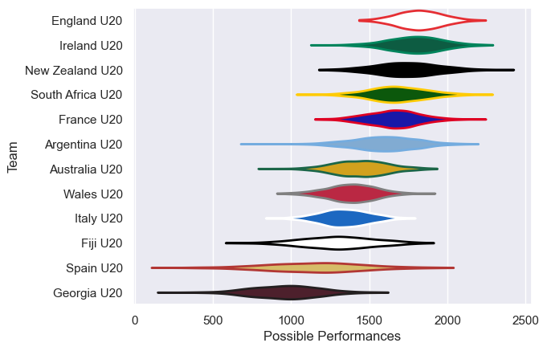
# Standings

## Current Standings

| Club             |   Played |   Wins |   Point Differential |   Losing Bonus Points |   Try Bonus Points |   Competition Points |
|:-----------------|---------:|-------:|---------------------:|----------------------:|-------------------:|---------------------:|
| England U20      |        3 |      3 |                   61 |                     0 |                  2 |                   14 |
| New Zealand U20  |        3 |      3 |                   40 |                     0 |                nan |                   13 |
| France U20       |        3 |      2 |                   54 |                     1 |                nan |                   11 |
| Argentina U20    |        3 |      2 |                   40 |                     0 |                  2 |                   10 |
| Ireland U20      |        2 |      2 |                   46 |                     0 |                  1 |                    9 |
| South Africa U20 |        3 |      1 |                   26 |                     1 |                  1 |                    6 |
| Australia U20    |        2 |      1 |                   19 |                     1 |                nan |                    6 |
| Wales U20        |        3 |      1 |                   -4 |                     1 |                nan |                    6 |
| Georgia U20      |        3 |      1 |                  -19 |                     1 |                  1 |                    6 |
| Italy U20        |        3 |      1 |                  -46 |                     0 |                nan |                    4 |
| Spain U20        |        3 |      0 |                  -90 |                     0 |                  0 |                    0 |
| Fiji U20         |        3 |      0 |                 -127 |                     0 |                  0 |                    0 |

## Projected Remaining Table

| Club             |   Matches Remaining |   Wins |   Point Differential |   Losing Bonus Points |   Try Bonus Points |   Competition Points |
|:-----------------|--------------------:|-------:|---------------------:|----------------------:|-------------------:|---------------------:|
| New Zealand U20  |                   8 |    4.2 |              6.1689  |                   1.7 |                1.7 |                 20.3 |
| France U20       |                   8 |    3.8 |             -6.1689  |                   1.7 |                1.7 |                 18.5 |
| Italy U20        |                   1 |    0.9 |             15.7588  |                   0.1 |                0.7 |                  4.3 |
| Argentina U20    |                   1 |    0.9 |             18.1972  |                   0   |                0.4 |                  4.2 |
| Georgia U20      |                   1 |    0.8 |             14.1379  |                   0.1 |                0.4 |                  3.8 |
| England U20      |                   1 |    0.8 |              8.84194 |                   0.1 |                0.4 |                  3.7 |
| Australia U20    |                   1 |    0.6 |              2.51369 |                   0.2 |                0.3 |                  2.9 |
| Wales U20        |                   1 |    0.4 |             -2.51369 |                   0.3 |                0.4 |                  2.2 |
| Ireland U20      |                   1 |    0.2 |             -8.84194 |                   0.2 |                0.1 |                  1.2 |
| Fiji U20         |                   1 |    0.2 |            -14.1379  |                   0.1 |                0.2 |                  1.1 |
| Spain U20        |                   1 |    0.1 |            -15.7588  |                   0.1 |                0.2 |                  0.8 |
| South Africa U20 |                   1 |    0.1 |            -18.1972  |                   0.1 |                0.1 |                  0.5 |

## Projected Total Table

| Club             |   Total Matches |   Wins |   Point Differential |   Losing Bonus Points |   Try Bonus Points |   Competition Points |
|:-----------------|----------------:|-------:|---------------------:|----------------------:|-------------------:|---------------------:|
| New Zealand U20  |              11 |    7.2 |             46.1689  |                   1.7 |                1.7 |                 33.3 |
| France U20       |              11 |    5.8 |             47.8311  |                   2.7 |                1.7 |                 29.5 |
| England U20      |               4 |    3.8 |             69.8419  |                   0.1 |                2.4 |                 17.7 |
| Argentina U20    |               4 |    2.9 |             58.1972  |                   0   |                2.4 |                 14.2 |
| Ireland U20      |               3 |    2.2 |             37.1581  |                   0.2 |                1.1 |                 10.2 |
| Georgia U20      |               4 |    1.8 |             -4.86208 |                   1.1 |                1.4 |                  9.8 |
| Australia U20    |               3 |    1.6 |             21.5137  |                   1.2 |                0.3 |                  8.9 |
| Italy U20        |               4 |    1.9 |            -30.2412  |                   0.1 |                0.7 |                  8.3 |
| Wales U20        |               4 |    1.4 |             -6.51369 |                   1.3 |                0.4 |                  8.2 |
| South Africa U20 |               4 |    1.1 |              7.80278 |                   1.1 |                1.1 |                  6.5 |
| Fiji U20         |               4 |    0.2 |           -141.138   |                   0.1 |                0.2 |                  1.1 |
| Spain U20        |               4 |    0.1 |           -105.759   |                   0.1 |                0.2 |                  0.8 |

# Completed Match Review

| Model | Percent Correct Predictions | Spread Error |
| ------ | ------ | ------ |
| Club Level | 70.6% | 17.4 |
| Player Level: Lineup | nan% | nan |
| Player Level: Minutes | nan% | nan |

# Future Predictions

## Week 4

### Italy U20 V Spain U20 on 2024/07/14

Average Margin: Italy U20 by 15.8

Average Scoreline: 35-19

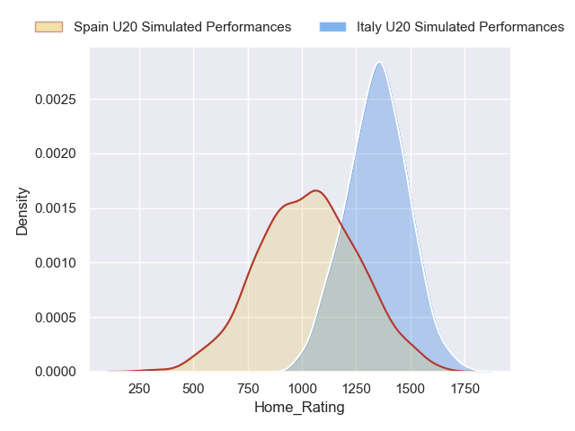
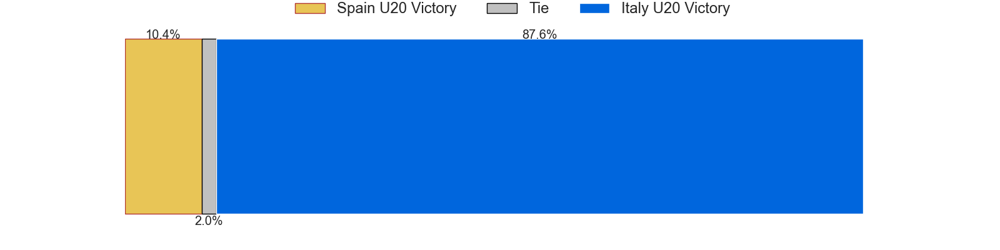
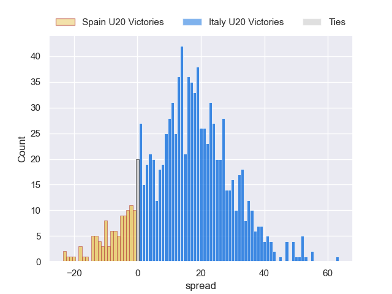

### New Zealand U20 V France U20 on 2024/07/14

Average Margin: New Zealand U20 by 5.0

Average Scoreline: 30-25

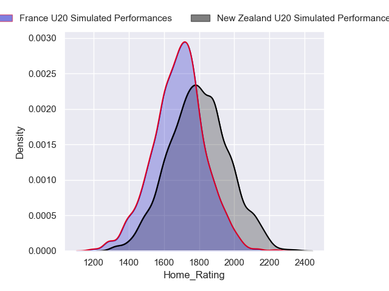
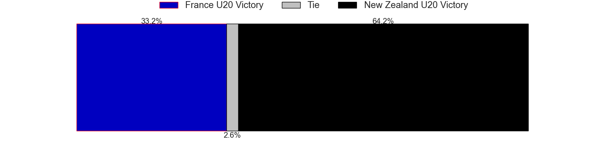
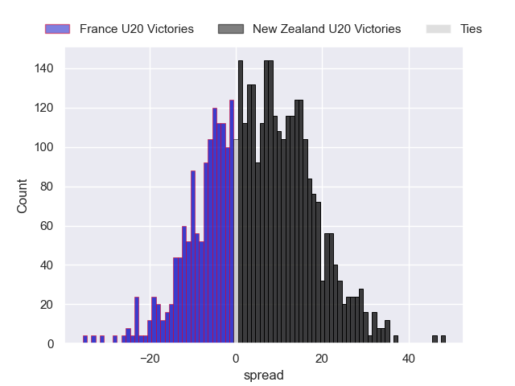

### New Zealand U20 V France U20 on 2024/07/14

Average Margin: New Zealand U20 by 5.0

Average Scoreline: 30-25

### New Zealand U20 V France U20 on 2024/07/14

Average Margin: New Zealand U20 by 5.0

Average Scoreline: 30-25

### New Zealand U20 V France U20 on 2024/07/14

Average Margin: New Zealand U20 by 5.0

Average Scoreline: 30-25

### Georgia U20 V Fiji U20 on 2024/07/14

Average Margin: Georgia U20 by 14.1

Average Scoreline: 31-17

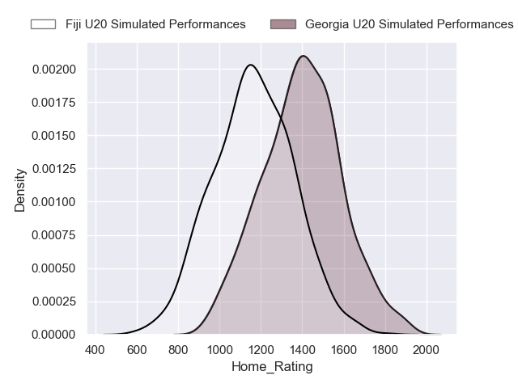
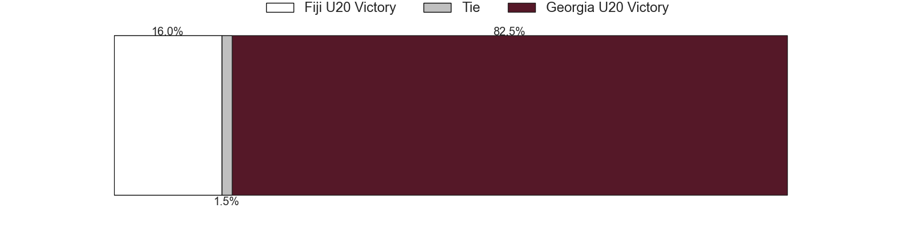
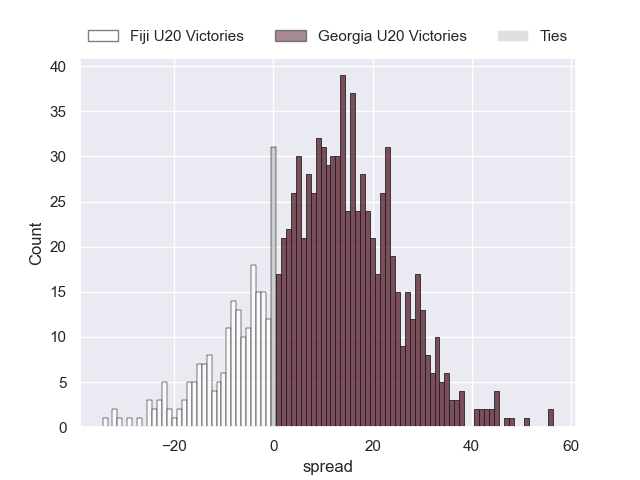

### Australia U20 V Wales U20 on 2024/07/14

Average Margin: Australia U20 by 2.5

Average Scoreline: 22-19

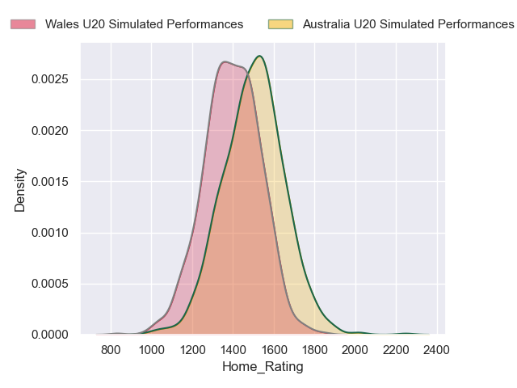

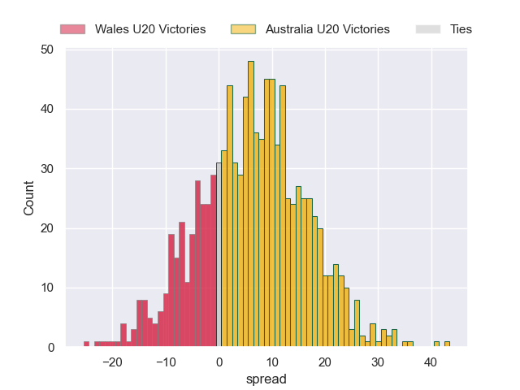

### Argentina U20 V South Africa U20 on 2024/07/14

Average Margin: Argentina U20 by 18.2

Average Scoreline: 39-20

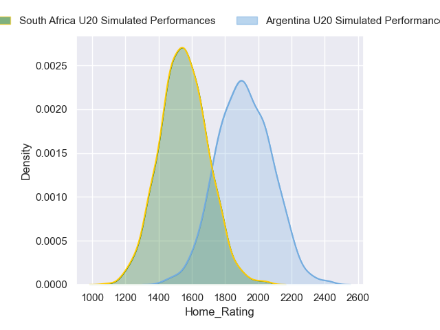
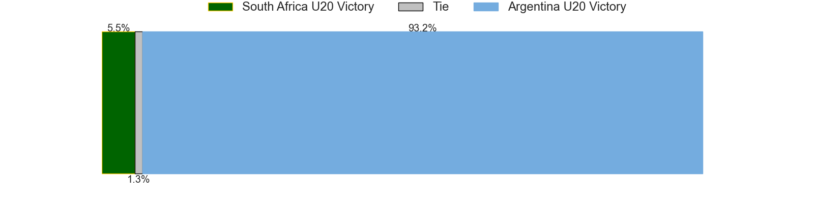
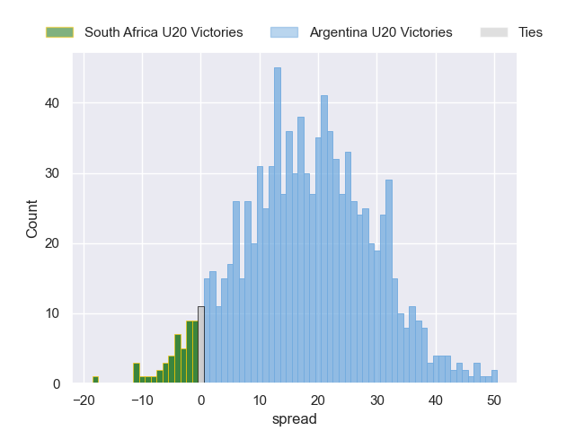

### France U20 V New Zealand U20 on 2024/07/14

Average Margin: France U20 by 3.5

Average Scoreline: 30-26

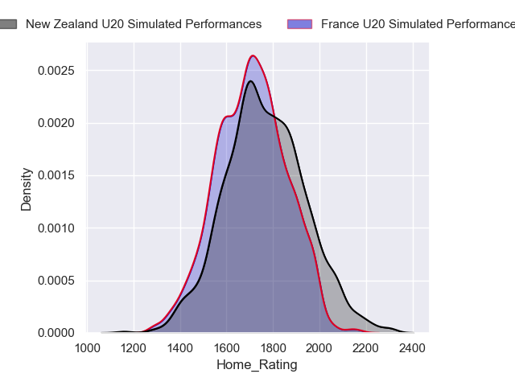

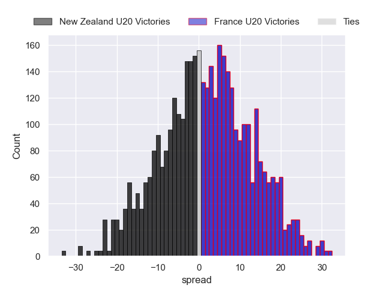

### France U20 V New Zealand U20 on 2024/07/14

Average Margin: France U20 by 3.5

Average Scoreline: 30-26

### France U20 V New Zealand U20 on 2024/07/14

Average Margin: France U20 by 3.5

Average Scoreline: 30-26

### France U20 V New Zealand U20 on 2024/07/14

Average Margin: France U20 by 3.5

Average Scoreline: 30-26

### England U20 V Ireland U20 on 2024/07/14

Average Margin: England U20 by 8.8

Average Scoreline: 34-25

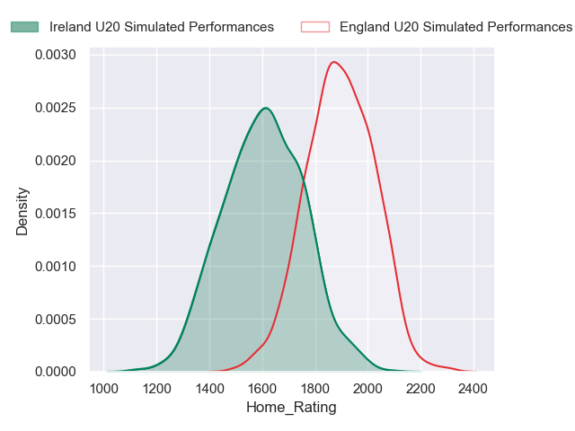
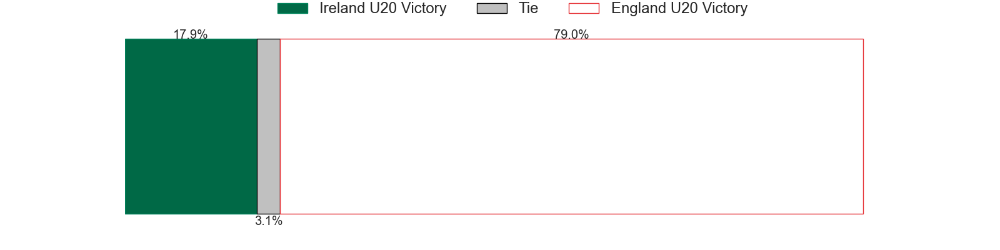
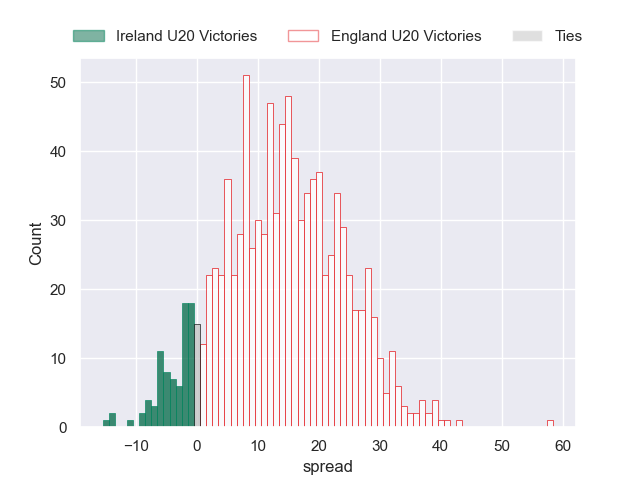

