---  
title: "World Rugby U20 Championship 2024 Status"  
date: 2024-07-15 6:00:00 -0500  
categories: model review projection  
layout: article  
aside:  
    toc: true  
---
# Current Team Rankings

# Standings

## Current Standings

| Club             |   Played |   Wins |   Point Differential |   Losing Bonus Points |   Try Bonus Points |   Competition Points |
|:-----------------|---------:|-------:|---------------------:|----------------------:|-------------------:|---------------------:|
| France U20       |        5 |      4 |                  102 |                     1 |                nan |                   21 |
| Australia U20    |        6 |      4 |                   50 |                     1 |                nan |                   20 |
| England U20      |        4 |      4 |                   72 |                     0 |                  2 |                   18 |
| Argentina U20    |        4 |      3 |                   50 |                     0 |                  3 |                   15 |
| New Zealand U20  |        5 |      3 |                   -8 |                     0 |                nan |                   15 |
| Ireland U20      |        5 |      3 |                   35 |                     0 |                nan |                   13 |
| South Africa U20 |        5 |      2 |                   66 |                     1 |                  2 |                   11 |
| Georgia U20      |        5 |      2 |                  -39 |                     1 |                  2 |                   11 |
| Wales U20        |        4 |      1 |                  -11 |                     2 |                nan |                    8 |
| Italy U20        |        4 |      2 |                  -33 |                     0 |                nan |                    8 |
| Fiji U20         |        5 |      0 |                 -181 |                     1 |                  1 |                    2 |
| Spain U20        |        4 |      0 |                 -103 |                     0 |                  0 |                    0 |

## Projected Remaining Table

| Club             |   Matches Remaining |   Wins |   Point Differential |   Losing Bonus Points |   Try Bonus Points |   Competition Points |
|:-----------------|--------------------:|-------:|---------------------:|----------------------:|-------------------:|---------------------:|
| Argentina U20    |                   1 |    0.9 |             13.8579  |                   0.1 |                0.7 |                  4.4 |
| Ireland U20      |                   1 |    0.8 |              9.58446 |                   0.1 |                0.4 |                  3.8 |
| South Africa U20 |                   1 |    0.7 |              5.10856 |                   0.2 |                0.4 |                  3.5 |
| England U20      |                   1 |    0.7 |              4.14159 |                   0.2 |                0.4 |                  3.4 |
| Georgia U20      |                   1 |    0.6 |              1.94734 |                   0.2 |                0.4 |                  3   |
| Spain U20        |                   1 |    0.6 |              2.03503 |                   0.2 |                0.3 |                  2.7 |
| Fiji U20         |                   1 |    0.4 |             -2.03503 |                   0.2 |                0.3 |                  2.3 |
| Italy U20        |                   1 |    0.4 |             -1.94734 |                   0.3 |                0.2 |                  2.2 |
| France U20       |                   1 |    0.3 |             -4.14159 |                   0.3 |                0.2 |                  1.7 |
| Wales U20        |                   1 |    0.3 |             -5.10856 |                   0.3 |                0.2 |                  1.7 |
| New Zealand U20  |                   1 |    0.2 |             -9.58446 |                   0.2 |                0.4 |                  1.3 |
| Australia U20    |                   1 |    0.1 |            -13.8579  |                   0.2 |                0.2 |                  0.7 |

## Projected Total Table

| Club             |   Total Matches |   Wins |   Point Differential |   Losing Bonus Points |   Try Bonus Points |   Competition Points |
|:-----------------|----------------:|-------:|---------------------:|----------------------:|-------------------:|---------------------:|
| France U20       |               6 |    4.3 |              97.8584 |                   1.3 |                0.2 |                 22.7 |
| England U20      |               5 |    4.7 |              76.1416 |                   0.2 |                2.4 |                 21.4 |
| Australia U20    |               7 |    4.1 |              36.1421 |                   1.2 |                0.2 |                 20.7 |
| Argentina U20    |               5 |    3.9 |              63.8579 |                   0.1 |                3.7 |                 19.4 |
| Ireland U20      |               6 |    3.8 |              44.5845 |                   0.1 |                0.4 |                 16.8 |
| New Zealand U20  |               6 |    3.2 |             -17.5845 |                   0.2 |                0.4 |                 16.3 |
| South Africa U20 |               6 |    2.7 |              71.1086 |                   1.2 |                2.4 |                 14.5 |
| Georgia U20      |               6 |    2.6 |             -37.0527 |                   1.2 |                2.4 |                 14   |
| Italy U20        |               5 |    2.4 |             -34.9473 |                   0.3 |                0.2 |                 10.2 |
| Wales U20        |               5 |    1.3 |             -16.1086 |                   2.3 |                0.2 |                  9.7 |
| Fiji U20         |               6 |    0.4 |            -183.035  |                   1.2 |                1.3 |                  4.3 |
| Spain U20        |               5 |    0.6 |            -100.965  |                   0.2 |                0.3 |                  2.7 |

# Completed Match Review

| Model | Percent Correct Predictions | Spread Error |
| ------ | ------ | ------ |
| Club Level | 68.0% | 15.3 |
| Player Level: Lineup | 66.7% | 17.3 |
| Player Level: Minutes | 66.7% | 17.3 |

# Future Predictions

## Week 7

### Ireland U20 V New Zealand U20 on 2024/07/19

Average Margin: Ireland U20 by 9.6

Average Scoreline: 34-25

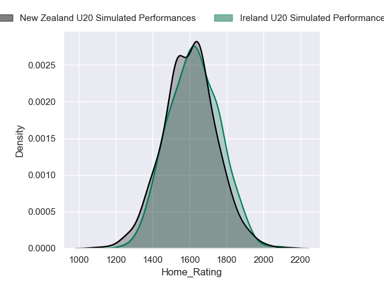
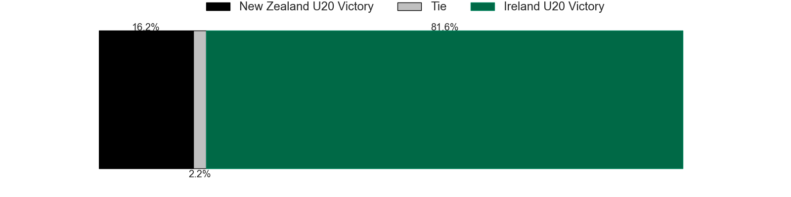
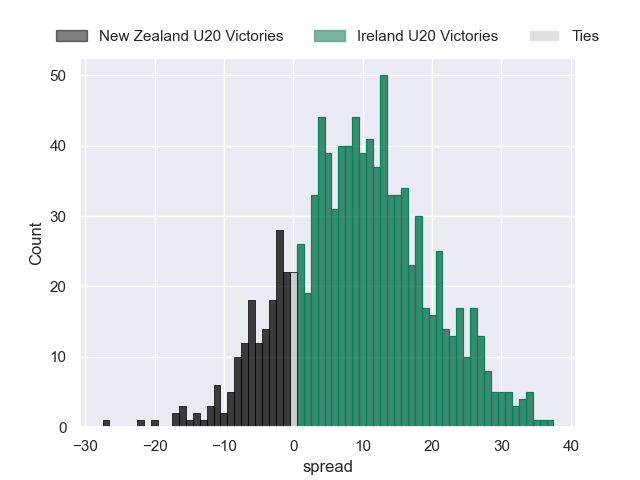

### Wales U20 V South Africa U20 on 2024/07/19

Average Margin: South Africa U20 by 5.1

Average Scoreline: 30-25

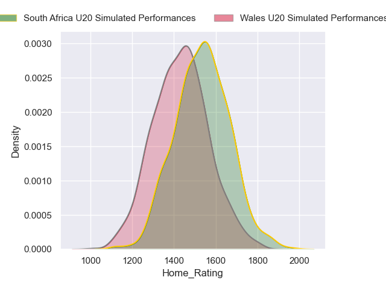
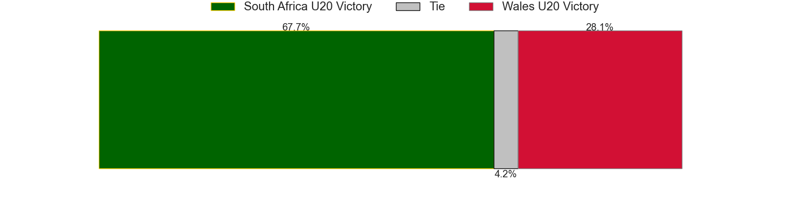
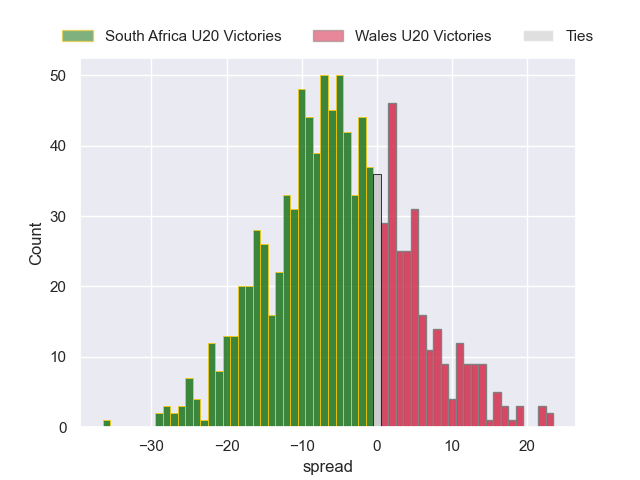

### Spain U20 V Fiji U20 on 2024/07/19

Average Margin: Spain U20 by 2.0

Average Scoreline: 27-25

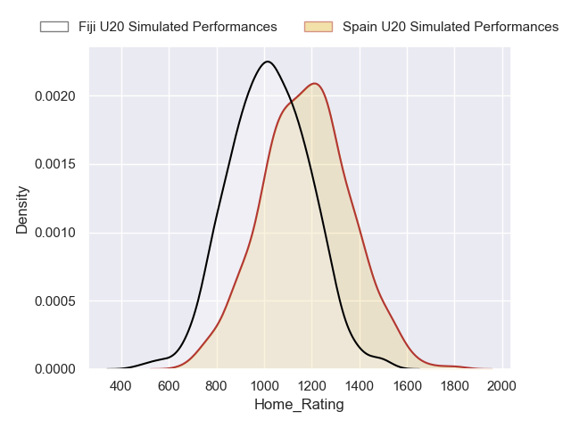
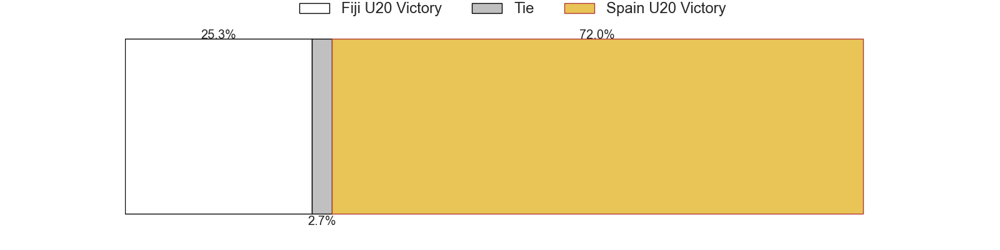
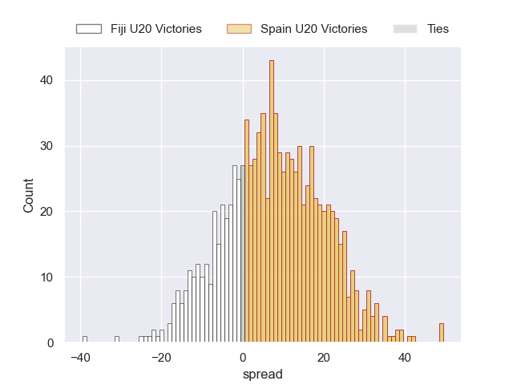

### England U20 V France U20 on 2024/07/19

Average Margin: England U20 by 4.1

Average Scoreline: 34-30

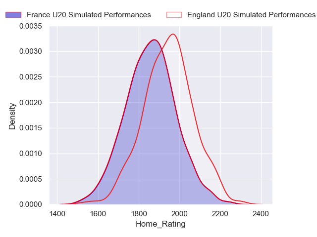
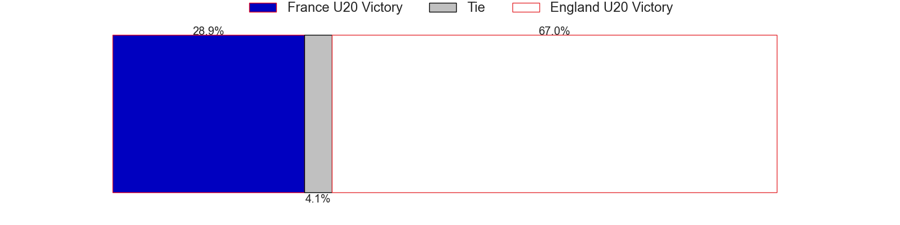
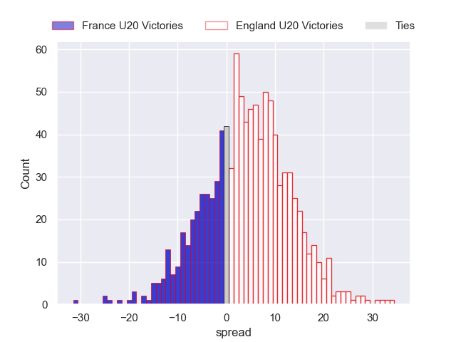

### Australia U20 V Argentina U20 on 2024/07/19

Average Margin: Argentina U20 by 13.9

Average Scoreline: 37-23

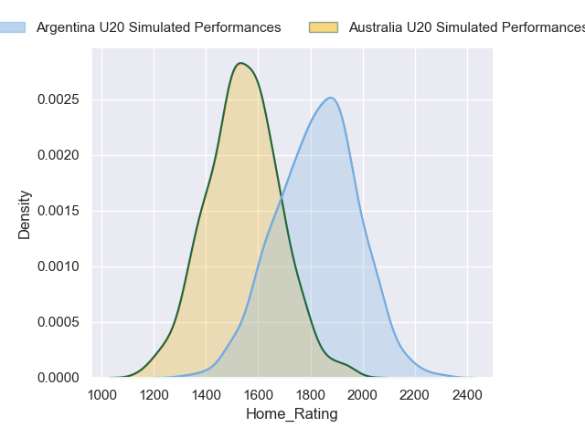
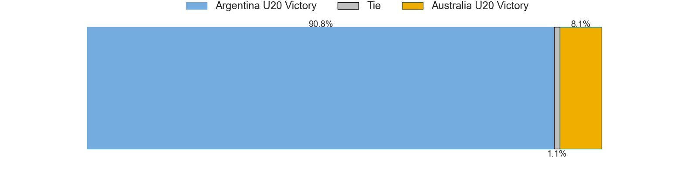
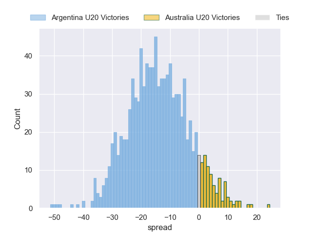

### Italy U20 V Georgia U20 on 2024/07/19

Average Margin: Georgia U20 by 1.9

Average Scoreline: 30-28

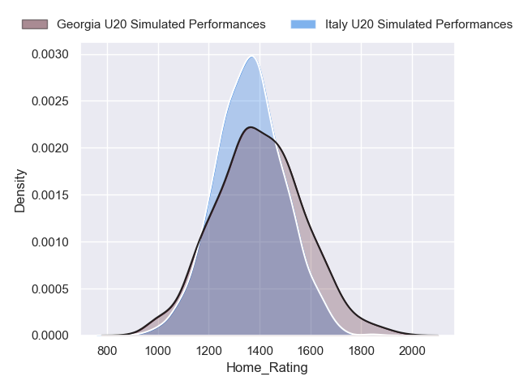
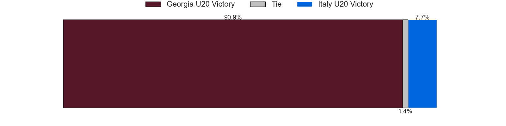
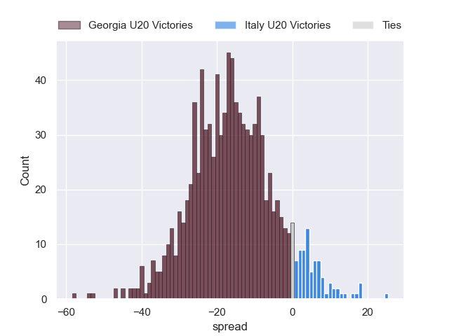

