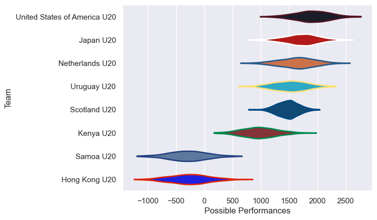
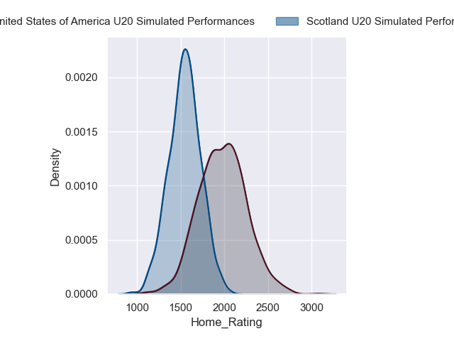
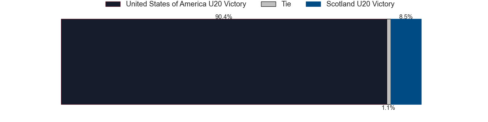
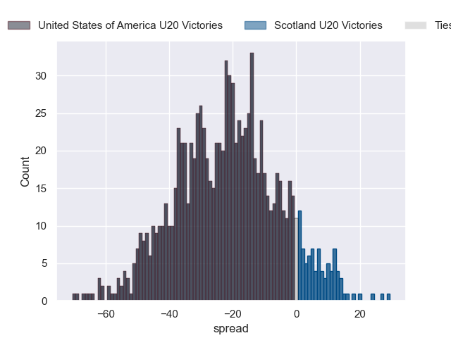
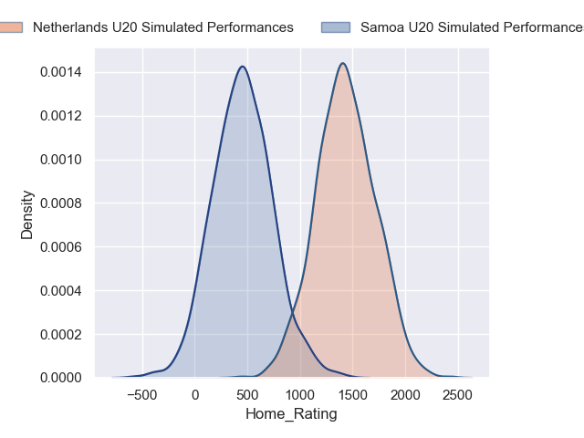
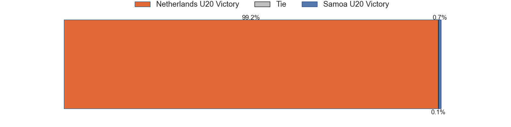
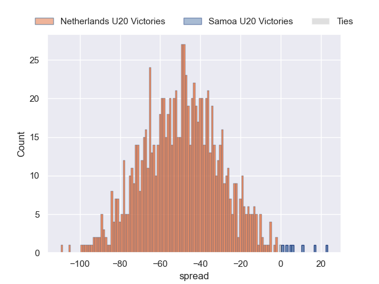

---  
title: "World Rugby U20 Trophy 2023 Status"  
date: 2024-07-15 6:00:00 -0500  
categories: model review projection  
layout: article  
aside:  
    toc: true  
---
# Current Team Rankings

# Standings

## Projected Total Table

| Club                         |   Total Matches |   Wins |   Point Differential |   Losing Bonus Points |   Try Bonus Points |   Competition Points |
|:-----------------------------|----------------:|-------:|---------------------:|----------------------:|-------------------:|---------------------:|
| Netherlands U20              |               1 |    1   |              48.9106 |                   0   |                0.5 |                  4.5 |
| Kenya U20                    |               1 |    1   |              45.6903 |                   0   |                0.4 |                  4.3 |
| United States of America U20 |               1 |    0.9 |              21.6683 |                   0.1 |                0.5 |                  4.2 |
| Scotland U20                 |               1 |    0.1 |             -21.6683 |                   0.1 |                0.1 |                  0.6 |
| Hong Kong U20                |               1 |    0   |             -45.6903 |                   0   |                0.1 |                  0.2 |
| Samoa U20                    |               1 |    0   |             -48.9106 |                   0   |                0.1 |                  0.1 |

# Future Predictions

## Week 1

### Scotland U20 V United States of America U20 on 2024/07/17

Average Margin: United States of America U20 by 21.7

Average Scoreline: 32-10

### Samoa U20 V Netherlands U20 on 2024/07/17

Average Margin: Netherlands U20 by 48.9

Average Scoreline: 52-3

### Hong Kong U20 V Kenya U20 on 2024/07/17

Average Margin: Kenya U20 by 45.7

Average Scoreline: 51-5

