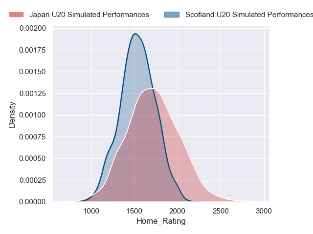
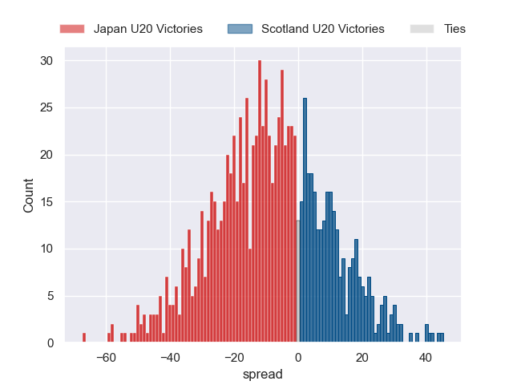
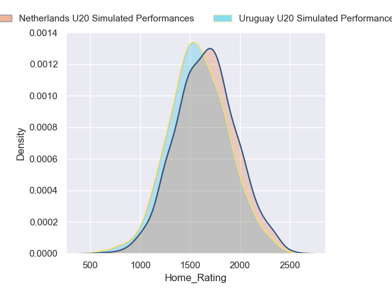
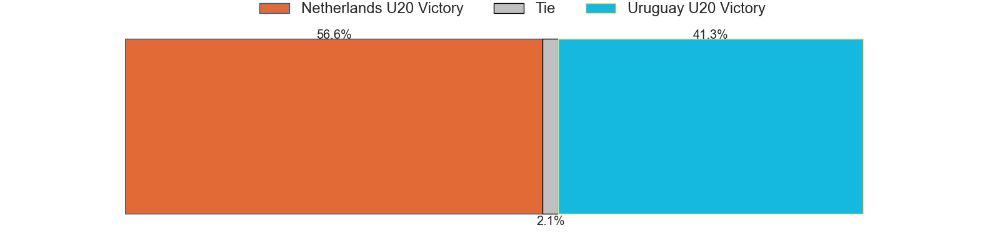
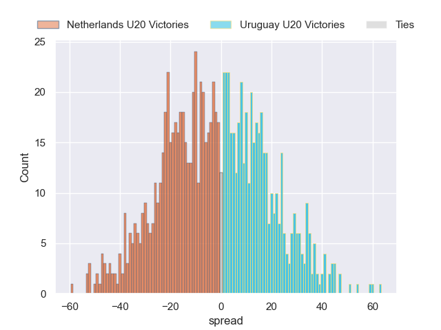
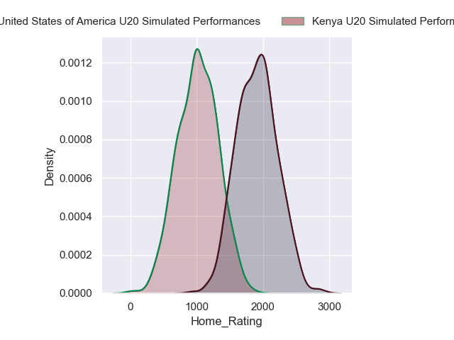
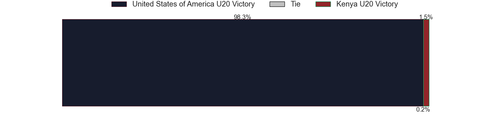
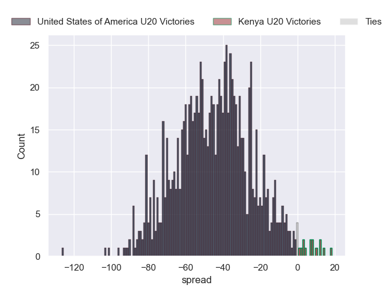

---  
title: "World Rugby U20 Trophy 2023 Status"  
date: 2024-07-11 6:00:00 -0500  
categories: model review projection  
layout: article  
aside:  
    toc: true  
---
# Current Team Rankings

# Standings

## Projected Total Table

| Club                         |   Total Matches |   Wins |   Point Differential |   Losing Bonus Points |   Try Bonus Points |   Competition Points |
|:-----------------------------|----------------:|-------:|---------------------:|----------------------:|-------------------:|---------------------:|
| United States of America U20 |               1 |    1   |             44.3575  |                   0   |                0.8 |                  4.8 |
| Japan U20                    |               1 |    0.7 |              9.27478 |                   0.1 |                0.2 |                  3.2 |
| Netherlands U20              |               1 |    0.6 |              4.52986 |                   0.1 |                0.5 |                  2.9 |
| Samoa U20                    |               1 |    0.6 |              3.55318 |                   0.1 |                0.2 |                  2.5 |
| Uruguay U20                  |               1 |    0.4 |             -4.52986 |                   0.1 |                0.2 |                  2.1 |
| Hong Kong U20                |               1 |    0.4 |             -3.55318 |                   0.1 |                0.2 |                  2   |
| Scotland U20                 |               1 |    0.3 |             -9.27478 |                   0.2 |                0.2 |                  1.5 |
| Kenya U20                    |               1 |    0   |            -44.3575  |                   0   |                0.2 |                  0.3 |

# Future Predictions

## Week 1

### Scotland U20 V Japan U20 on 2024/07/12

Average Margin: Japan U20 by 9.3

Average Scoreline: 42-33

### Samoa U20 V Hong Kong U20 on 2024/07/12

Average Margin: Samoa U20 by 3.6

Average Scoreline: 47-43

### Uruguay U20 V Netherlands U20 on 2024/07/12

Average Margin: Netherlands U20 by 4.5

Average Scoreline: 40-36

### Kenya U20 V United States of America U20 on 2024/07/12

Average Margin: United States of America U20 by 44.4

Average Scoreline: 61-17

